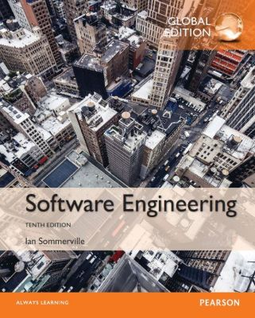
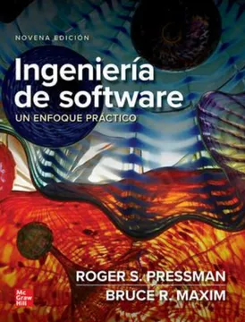

# Ingeniería de Software
## Presentación de la Materia
Created by <i class="fab fa-telegram"></i>
[edme88]("https://t.me/edme88")

---
## Profesor

### Ing. Agustina Edmé Aliciardi
edmealiciardi@gmail.com

### Ing. Franciso Ameri López Lozano
Franameri2016@gmail.com

---
## UNIDADES

**Módulo 1:** Introducción a la Ingeniería de Software

**Módulo 2:** Requisitos de Software

**Módulo 3:** Análisis y Diseño de Software

**Módulo 4:** Gestión de Proyectos de Software

**Módulo 5:** Aseguramiento de Calidad y Gestión de Configuración

----

### Resumen de Contenidos

**Módulo 1: Introducción a la Ingeniería de Software**
- Conceptos fundamentales de la ingeniería de software. 
- Modelos de Ciclo de Vida del Software: Enfoques tradicionales y ágiles.

----

### Resumen de Contenidos

**Módulo 2: Requisitos de Software**
- Tipos de requisitos. 
- Técnicas de elicitación y documentación. 
- Introducción al análisis de necesidades del cliente.

----

### Resumen de Contenidos

**Módulo 3: Análisis y Diseño de Software**
- Modelado con UML: Diagramas de clases, secuencia y actividades. 
- Herramientas y técnicas para estructurar y organizar soluciones de software.

----

### Resumen de Contenidos

**Módulo 4: Gestión de Proyectos de Software**
- Planificación, estimación y control de proyectos. 
- Introducción al aseguramiento de calidad del software.

----

### Resumen de Contenidos

**Módulo 5: Aseguramiento de Calidad y Gestión de Configuración**
- Pruebas y validación del software. 
- Gestión de la configuración y control de versiones.

---
## Libros:

“Ingeniería del Software” de Ian Sommerville

---
## Libros:

“Ingeniería del Software: Un enfoque práctico” de Roger Pressman & Bruce Maxim

---
## Calendario

<table border="1">
  <thead>
    <tr>
      <th>Semana</th>
      <th>Módulo</th>
      <th>Tema</th>
    </tr>
  </thead>
  <tbody>
    <tr>
      <td>1 y 2</td>
      <td>1</td>
      <td>Introducción a los modelos de ciclo de vida del software</td>
    </tr>
    <tr>
      <td>3</td>
      <td>1</td>
      <td>Análisis de enfoques tradicionales y ágiles</td>
    </tr>
    <tr>
      <td>4</td>
      <td>2</td>
      <td>Identificación de tipos de requisitos</td>
    </tr>
    <tr>
      <td>5</td>
      <td>2</td>
      <td>Documentación de requisitos mediante técnicas de elicitación</td>
    </tr>
    <tr>
      <td>6</td>
      <td>1 y 2</td>
      <td>Primer Parcial: Modelos de ciclo de vida y requisitos</td>
    </tr>
  </tbody>
</table>

----

## Calendario

<table border="1">
  <thead>
    <tr>
      <th>Semana</th>
      <th>Módulo</th>
      <th>Tema</th>
    </tr>
  </thead>
  <tbody>
    <tr>
      <td>7 y 8</td>
      <td>3</td>
      <td>Modelado UML: Diagramas de clases</td>
    </tr>
    <tr>
      <td>9</td>
      <td>3</td>
      <td>Modelado UML: Diagramas de secuencia y actividades</td>
    </tr>
    <tr>
      <td>10 y 11</td>
      <td>4</td>
      <td>Planificación y estimación de proyectos</td>
    </tr>
    <tr>
      <td>12</td>
      <td>3 y 4</td>
      <td>Segundo Parcial: Diseño UML y planificación de proyectos</td>
    </tr>
  </tbody>
</table>

----

## Calendario
<table border="1">
  <thead>
    <tr>
      <th>Semana</th>
      <th>Módulo</th>
      <th>Tema</th>
    </tr>
  </thead>
  <tbody>
    <tr>
      <td>13</td>
      <td>5</td>
      <td>Pruebas y validación del software</td>
    </tr>
    <tr>
      <td>14</td>
      <td>5</td>
      <td>Gestión de configuración y control de versiones</td>
    </tr>
    <tr>
      <td>15</td>
      <td>1-5</td>
      <td>Integración de conocimientos en un proyecto final</td>
    </tr>
  </tbody>
</table>

---
## Forma de Evaluación: Cursado
* 1er parcial teórico
* 2do parcial teórico
* Entrega de trabajo grupal

---
## Forma de Evaluación: FINAL
FINAL:
* Preguntas sobre el trabajo grupal
* Preguntas similares de la guía de trabajos prácticos

---
## Regularidad
* Asistencia del 75% en Clases Teórico-Prácticas
* Parciales y trabajo grupal aprobados (>=4) con promedio de calificación no inferior a 6.

---
## ¿Dudas, Preguntas, Comentarios?

