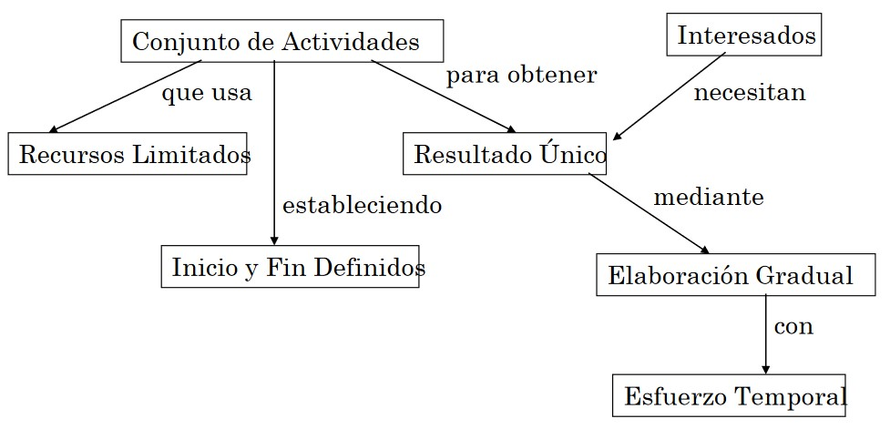
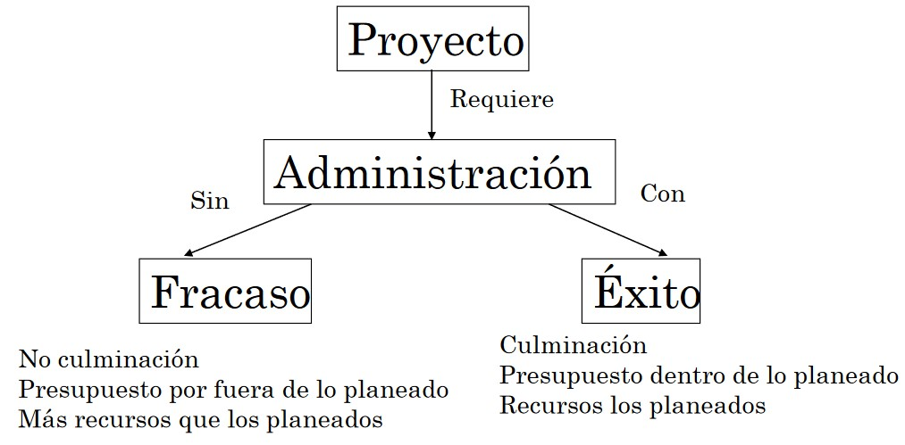
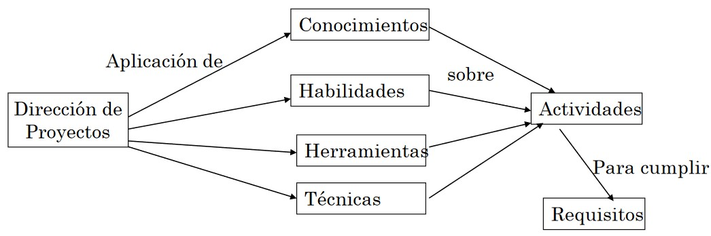
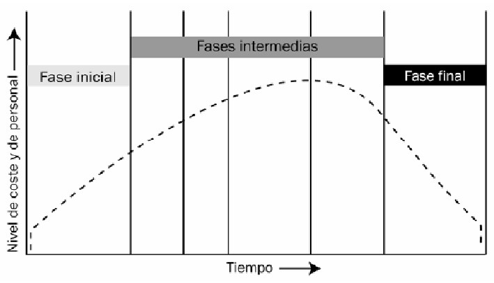
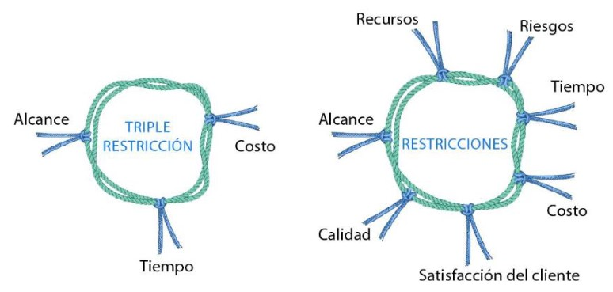
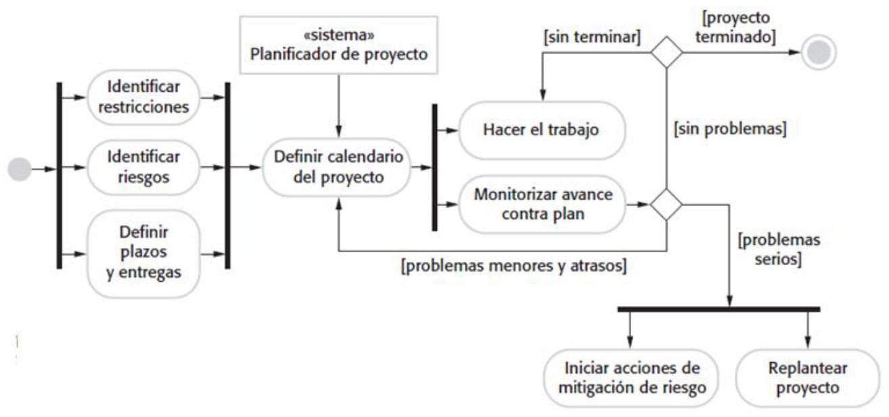
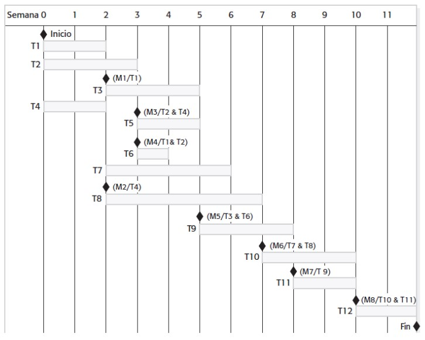

# Ingeniería de Software
## Gestión de Proyectos
Created by <i class="fab fa-telegram"></i>
[edme88]("https://t.me/edme88")

---
<!-- .slide: style="font-size: 0.60em" -->

## Temario

### Gestión de Proyectos
* Proyecto
* Definición
* Elementos que incluye
* Cómo se gestiona
* Criterios de Éxito
* Gestión de proyectos de Software
* Actividades de los administradores
* Gestión del Riesgo
* Identificación del Riesgo

* Planeación del Riesgo
* Monitoreo del Riesgo
* Indicadores de Riesgo
* Gestión de Personal
* Factores
* Motivación del Personal
* Jerarquía de Necesidades Humanas
* Trabajo en Equipo
* Calendarización de Proyectos

---
### PROYECTO
Un proyecto es un esfuerzo temporal que se lleva a cabo para crear un producto, servicio o resultado único.

---
### PROYECTO
<!-- .slide: style="font-size: 0.90em" -->
* La naturaleza temporal de los proyectos implica que un proyecto tiene un principio y un final definidos.
* El final se alcanza cuando se logran los objetivos del proyecto, cuando se termina el proyecto porque sus objetivos 
no se cumplirán o no pueden ser cumplidos, o cuando ya no existe la necesidad que dio origen al proyecto.
* Implica la ejecución de un conjunto de actividades coordinadas y controladas para lograr un objetivo conforme a 
requisitos específicos, contemplando limitaciones de tiempo, costos y recursos.

---

---
### GESTION DE PROYECTOS DE SOFTWARE
* Actividades que aseguran que el software sera entregado en el tiempo justo y estara de acuerdo
con los requerimientos del cliente.
* Es necesario porque el desarrollo estara siempre sujeto a las limitaciones de costos y tiempos de la empresa

---

---

---
### ¿QUÉ INCLUYE LA DIRECCIÓN DE PROYECTOS?
* Identificar los requisitos
* Establecer objetivos claros y posibles de realizar
* Equilibrar las demandas concurrentes de calidad, alcance, tiempo y costos
* Adaptar las especificaciones, los planes y el enfoque a las diversas inquietudes y
expectativas de los diferentes interesados

---
### CÓMO SE GESTIONA?
Siguiendo una metodología:
* Se proporciona una guía para conocer todo el camino a recorrer antes de iniciar.
* Se asegura la calidad del producto final
* Se asegura el cumplimiento de los tiempos establecidos
* Se asegura la utilización de los recursos limitados definidos

---

---
### CRITERIOS DE ÉXITO PARA LA GESTIÓN DEL PROYECTO
* Entregar el software al cliente en el tiempo acordado.
* Mantener costos dentro del presupuesto general.
* Entregar software que cumpla con las expectativas del cliente.
* Mantener un equipo de desarrollo óptimo y con buen funcionamiento

---
### CRITERIOS DE ÉXITO DEL PROYECTO
Lo importante es que las restricciones del proyecto esten en equilibrio.

---
### GESTION DE PROYECTOS DE SOFTWARE
* El producto es intangible.
  * Los administradores de proyectos de software no pueden constatar el progreso con sólo
observar el artefacto que se construye.
* Los grandes proyectos de software con frecuencia son proyectos excepcionales. 
  * Los grandes proyectos de software en general son diferentes de los proyectos anteriores. 
* Los procesos de software son variables y específicos de la organización

---
### ACTIVIDADES DE LOS ADMINISTRADORES
<!-- .slide: style="font-size: 0.90em" -->
* **Planeación del proyecto:** Son responsables de la planeación, estimación y
calendarización del desarrollo del proyecto, así como de la asignación de tareas a las personas
* **Informes:** Son responsables de informar del avance de un proyecto a los clientes y administradores de la
compañía que desarrolla el software.
* **Gestión del riesgo:** Tienen que valorar los riesgos que pueden afectar un proyecto, monitorizar dichos riesgos
y emprender acciones cuando surjan problemas.

---
### ACTIVIDADES DE LOS ADMINISTRADORES
* **Gestión de personal:** Son responsables de administrar el equipo de personas. Deben elegir a los integrantes y 
establecer formas de trabajo que conduzcan a un desempeño efectivo del equipo.
* **Redactar propuestas:** La propuesta describe los objetivos del proyecto y cómo se realizará. Por lo general,
incluye estimaciones de costo y calendarización, además de justificar por qué
el contrato del proyecto debería concederse a una organización o un equipo particular

---
### GESTION DE PROYECTOS

---
### GESTIÓN DEL RIESGO
Un riesgo es la posibilidad de que una circustancia adversa se pueda presentar.
* **Riesgos del proyecto:** alteran el calendario o los recursos del proyecto.
* **Riesgos del producto:** afectan la calidad o el rendimiento del software a desarrollar.
* **Riesgos empresariales:** afectan a la organización que desarrolla o adquiere el software.

---
### GESTIÓN DEL RIESGO
Gestion del riesgo implica identificar los riesgos y generar planes para
minimizar sus efectos sobre el proyecto.

---
### EJEMPLOS
<!--
| Riesgo                                    | Repercute en           | Descripción                                                                                       |
|:------------------------------------------|:-----------------------|:--------------------------------------------------------------------------------------------------|
| Rotación de personal                      | Proyecto               | Personal experimentado abandonará el proyecto antes de que éste termine.                          |
| Cambio administrativo                     | Proyecto               | Habrá un cambio de gestión en la organización con diferentes prioridades.                         |
| Indisponibilidad de hardware              | Proyecto               | Hardware, que es esencial para el proyecto, no se entregará a tiempo.                             |
| Cambio de requerimientos                  | Proyecto y producto    | Habrá mayor cantidad de cambios a los requerimientos que los anticipados.                         |
| Demoras en la especificación              | Proyecto y producto    | Especificaciones de interfaces esenciales no están disponibles a tiempo.                          |
| Subestimación del tamaño                  | Proyecto y producto    | Se subestimó el tamaño del sistema.                                                               |
| Bajo rendimiento de las herramientas CASE | Empresa                | La tecnología subyacente sobre la cual se construye el sistema se sustituye con nueva tecnología. |
| Competencia de productos                  | Empresa                | Un producto competitivo se comercializa antes de que el sistema está completo.                    |
-->
<table>
<thead>
<tr>
<th style="text-align:left">Riesgo</th>
<th style="text-align:left">Repercute en</th>
<th style="text-align:left">Descripción</th>
</tr>
</thead>
<tbody>
<tr>
<td style="text-align:left">Rotación de personal</td>
<td style="text-align:left">Proyecto</td>
<td style="text-align:left">Personal experimentado abandonará el proyecto antes de que éste termine.</td>
</tr>
<tr>
<td style="text-align:left">Cambio administrativo</td>
<td style="text-align:left">Proyecto</td>
<td style="text-align:left">Habrá un cambio de gestión en la organización con diferentes prioridades.</td>
</tr>
<tr>
<td style="text-align:left">Indisponibilidad de hardware</td>
<td style="text-align:left">Proyecto</td>
<td style="text-align:left">Hardware, que es esencial para el proyecto, no se entregará a tiempo.</td>
</tr>
<tr>
<td style="text-align:left">Cambio de requerimientos</td>
<td style="text-align:left">Proyecto y producto</td>
<td style="text-align:left">Habrá mayor cantidad de cambios a los requerimientos que los anticipados.</td>
</tr>
<tr>
<td style="text-align:left">Demoras en la especificación</td>
<td style="text-align:left">Proyecto y producto</td>
<td style="text-align:left">Especificaciones de interfaces esenciales no están disponibles a tiempo.</td>
</tr>
<tr>
<td style="text-align:left">Subestimación del tamaño</td>
<td style="text-align:left">Proyecto y producto</td>
<td style="text-align:left">Se subestimó el tamaño del sistema.</td>
</tr>
<tr>
<td style="text-align:left">Bajo rendimiento de las herramientas CASE</td>
<td style="text-align:left">Empresa</td>
<td style="text-align:left">La tecnología subyacente sobre la cual se construye el sistema se sustituye con nueva tecnología.</td>
</tr>
<tr>
<td style="text-align:left">Competencia de productos</td>
<td style="text-align:left">Empresa</td>
<td style="text-align:left">Un producto competitivo se comercializa antes de que el sistema está completo.</td>
</tr>
</tbody>
</table>

---
### GESTION DEL RIESGO
* **Identificación del riesgo:** identificar posibles riesgos para el proyecto, el producto y la empresa.
* **Análisis de riesgos:** valorar la probabilidad y las consecuencias de dichos riesgos.
* **Planeación del riesgo:** elaborar planes para enfrentar el riesgo, evitarlo o minimizar sus efectos en el proyecto.
* **Monitorización del riesgo:** valorar regularmente el riesgo y los planes para atenuarlo.

---
### GESTION DEL RIESGO – EL PROCESO

---
### IDENTIFICACION DEL RIESGO
<!-- .slide: style="font-size: 0.80em" -->
* **Riesgos tecnológicos:** Se derivan de las tecnologías de software o hardware usadas para desarrollar el sistema.
* **Riesgos personales:** Se asocian con las personas en el equipo de desarrollo.
* **Riesgos organizacionales:** Se derivan del entorno organizacional donde se desarrolla el software.
* **Riesgos de herramientas:** Resultan de las herramientas de software y otro software de soporte
que se usa para desarrollar el sistema.
* **Riesgos de requerimientos:** Proceden de cambios a los requerimientos del cliente y del proceso de gestionarlos.
* **Riesgos de estimación:** Surgen de las estimaciones administrativas de los recursos requeridos para construir el sistema.

---
### EJEMPLOS
<!--
| Tipo de riesgo  | Riesgos posibles                                                                                                                                                                                                                                |
|:----------------|:------------------------------------------------------------------------------------------------------------------------------------------------------------------------------------------------------------------------------------------------|
| Tecnología      | La base de datos que se usa en el sistema no puede procesar tantas transacciones por segundo como se esperaba. (1)   Los componentes de software de reutilización contienen defectos que haen que no puedan reutilizarse como se planeó. (2) |
| Personal        | Es imposible reclutar personal con las habilidades requeridas. (3)   El personal clave está enfermo e indispuesto en momentos críticos. (4)   No está disponible la capacitación requerida para el personal. (5)                          |
| De organización | La organización se reestructura de modo que diferentes adminsitraciones son responsables del proyecto. (6)   Problemas financieron de la organización fuerzan reducciones en el presupuesto del proyecto. (7)                                |
| Herramientas    | El código elaborado por las herramientas de generación de código de software es ineficiente. (8)   Las herramientas de software no pueden trabajar en una forma integrada. (9)                                                               |
| Requerimientos  | Se proponen cambios a los requerimientos que demandan mayor trabajo de rediseño. (10)   Los clientes no entienden las repercusiones de los cambios a los requerimientos. (11)                                                                |
| Estimación      | Se subestima el tiempo requerido para desarrollar el software. (12)   Se subestima la tasa de reparación de defectos. (13)   Se subestima el tamaño del software. (14)                                                                    |
-->
<table>
<thead>
<tr>
<th style="text-align:left">Tipo de riesgo</th>
<th style="text-align:left">Riesgos posibles</th>
</tr>
</thead>
<tbody>
<tr>
<td style="text-align:left">Tecnología</td>
<td style="text-align:left">La base de datos que se usa en el sistema no puede procesar tantas transacciones por segundo como se esperaba. (1)   Los componentes de software de reutilización contienen defectos que haen que no puedan reutilizarse como se planeó. (2)</td>
</tr>
<tr>
<td style="text-align:left">Personal</td>
<td style="text-align:left">Es imposible reclutar personal con las habilidades requeridas. (3)   El personal clave está enfermo e indispuesto en momentos críticos. (4)   No está disponible la capacitación requerida para el personal. (5)</td>
</tr>
<tr>
<td style="text-align:left">De organización</td>
<td style="text-align:left">La organización se reestructura de modo que diferentes adminsitraciones son responsables del proyecto. (6)   Problemas financieron de la organización fuerzan reducciones en el presupuesto del proyecto. (7)</td>
</tr>
<tr>
<td style="text-align:left">Herramientas</td>
<td style="text-align:left">El código elaborado por las herramientas de generación de código de software es ineficiente. (8)   Las herramientas de software no pueden trabajar en una forma integrada. (9)</td>
</tr>
<tr>
<td style="text-align:left">Requerimientos</td>
<td style="text-align:left">Se proponen cambios a los requerimientos que demandan mayor trabajo de rediseño. (10)   Los clientes no entienden las repercusiones de los cambios a los requerimientos. (11)</td>
</tr>
<tr>
<td style="text-align:left">Estimación</td>
<td style="text-align:left">Se subestima el tiempo requerido para desarrollar el software. (12)   Se subestima la tasa de reparación de defectos. (13)   Se subestima el tamaño del software. (14)</td>
</tr>
</tbody>
</table>

---
### ANALISIS DEL RIESGO
Para cada riesgo identificado estimar la probabilidad de ocurrencia y gravedad en caso de ocurrir.
* La probabilidad del riesgo puede valorarse como muy baja (< 10%), baja (del 10 al 25%), moderada
(del 25 al 50%), alta (del 50 al 75%) o muy alta (> 75%).
* Los efectos del riesgo pueden estimarse como catastróficos (amenazan la supervivencia del proyecto), graves (causarían 
grandes demoras), tolerables (demoras dentro de la contingencia permitida) o insignificantes.

---
### EJEMPLOS
<!--
| Riesgo                                                                                                                    | Probabilidad | Efectos        |
|:--------------------------------------------------------------------------------------------------------------------------|:-------------|:---------------|
| Problemas financieros de la organización fuerzan reducciones en el presupuesto del proyecto. (7)                          | Baja         | Catastrófico   |
| Es imposible reclutar personal con las habilidades requeridas. (3)                                                        | Alta         | Catastrófico   |
| El personal clave está enfermo e indispuesto en momentos críticos. (4)                                                    | Moderada     | Grave          |
| Los componentes de software de reutilización contienen defectos que hacen que no puedan reutilizarse como se planeó. (2)  | Moderada     | Grave          |
| Se proponen cambios a los requerimientos que demandan mayor trabajo de rediseño. (10)                                     | Moderada     | Grave          |
| La organización se reestructura de modo que diferentes administraciones son responsables del proyecto. (6)                | Alta         | Grave          |
| La base de datos que se usa en el sistema no puede procesar tantas transacciones por segundo como se esperaba. (1)        | Moderada     | Grave          | 
-->
<table>
<thead>
<tr>
<th style="text-align:left">Riesgo</th>
<th style="text-align:left">Probabilidad</th>
<th style="text-align:left">Efectos</th>
</tr>
</thead>
<tbody>
<tr>
<td style="text-align:left">Problemas financieros de la organización fuerzan reducciones en el presupuesto del proyecto. (7)</td>
<td style="text-align:left">Baja</td>
<td style="text-align:left">Catastrófico</td>
</tr>
<tr>
<td style="text-align:left">Es imposible reclutar personal con las habilidades requeridas. (3)</td>
<td style="text-align:left">Alta</td>
<td style="text-align:left">Catastrófico</td>
</tr>
<tr>
<td style="text-align:left">El personal clave está enfermo e indispuesto en momentos críticos. (4)</td>
<td style="text-align:left">Moderada</td>
<td style="text-align:left">Grave</td>
</tr>
<tr>
<td style="text-align:left">Los componentes de software de reutilización contienen defectos que hacen que no puedan reutilizarse como se planeó. (2)</td>
<td style="text-align:left">Moderada</td>
<td style="text-align:left">Grave</td>
</tr>
<tr>
<td style="text-align:left">Se proponen cambios a los requerimientos que demandan mayor trabajo de rediseño. (10)</td>
<td style="text-align:left">Moderada</td>
<td style="text-align:left">Grave</td>
</tr>
<tr>
<td style="text-align:left">La organización se reestructura de modo que diferentes administraciones son responsables del proyecto. (6)</td>
<td style="text-align:left">Alta</td>
<td style="text-align:left">Grave</td>
</tr>
<tr>
<td style="text-align:left">La base de datos que se usa en el sistema no puede procesar tantas transacciones por segundo como se esperaba. (1)</td>
<td style="text-align:left">Moderada</td>
<td style="text-align:left">Grave</td>
</tr>
</tbody>
</table>

----

### EJEMPLOS
<!--
| Riesgo                                                                                           | Probabilidad | Efectos        |
|:-------------------------------------------------------------------------------------------------|:-------------|:---------------|
| Se subestima el tiempo requerido para desarrollar el software. (12)                              | Altab        | Grave          |
| Las herramientas de software no pueden trabajar en una forma integrada. (9)                      | Alta         | Tolerable      |
| Los clientes no entienden las repercusiones de los cambios a los requerimientos. (11)            | Moderada     | Tolerable      |
| No está disponible la capacitación requerida para el personal. (5)                               | Moderada     | Tolerable      |
| Se subestima la tasa de reparación de defecto. (13)                                              | Moderada     | Tolerable      |
| Se subestima el tamaño del software. (14)                                                        | Alta         | Tolerable      |
| El código elaborado por las herramientas de generación de código de software es ineficiente. (8) | Moderada     | Insignificante |
-->
<table>
<thead>
<tr>
<th style="text-align:left">Riesgo</th>
<th style="text-align:left">Probabilidad</th>
<th style="text-align:left">Efectos</th>
</tr>
</thead>
<tbody>
<tr>
<td style="text-align:left">Se subestima el tiempo requerido para desarrollar el software. (12)</td>
<td style="text-align:left">Altab</td>
<td style="text-align:left">Grave</td>
</tr>
<tr>
<td style="text-align:left">Las herramientas de software no pueden trabajar en una forma integrada. (9)</td>
<td style="text-align:left">Alta</td>
<td style="text-align:left">Tolerable</td>
</tr>
<tr>
<td style="text-align:left">Los clientes no entienden las repercusiones de los cambios a los requerimientos. (11)</td>
<td style="text-align:left">Moderada</td>
<td style="text-align:left">Tolerable</td>
</tr>
<tr>
<td style="text-align:left">No está disponible la capacitación requerida para el personal. (5)</td>
<td style="text-align:left">Moderada</td>
<td style="text-align:left">Tolerable</td>
</tr>
<tr>
<td style="text-align:left">Se subestima la tasa de reparación de defecto. (13)</td>
<td style="text-align:left">Moderada</td>
<td style="text-align:left">Tolerable</td>
</tr>
<tr>
<td style="text-align:left">Se subestima el tamaño del software. (14)</td>
<td style="text-align:left">Alta</td>
<td style="text-align:left">Tolerable</td>
</tr>
<tr>
<td style="text-align:left">El código elaborado por las herramientas de generación de código de software es ineficiente. (8)</td>
<td style="text-align:left">Moderada</td>
<td style="text-align:left">Insignificante</td>
</tr>
</tbody>
</table>

---
### PLANEACION DEL RIESGO
Considerar cada riesgo y generar estrategias para gestionarlo.

* **Estrategias de evitación:** reducir la probabilidad de que surja el riesgo.
* **Estrategias de minimización:** reducir el efecto del riesgo.
* **Planes de contingencia:** hacer frente y tener una estrategia para a ello.

---
### ESTRATEGIAS PARA GESTION DEL RIESGO
<!--
| Riesgo                                   | Estrategia                                                                                                                                                                                                                                                      |
|:-----------------------------------------|:----------------------------------------------------------------------------------------------------------------------------------------------------------------------------------------------------------------------------------------------------------------|
| Problemas financieros de la organización | Prepare un documento informativo para altos ejecutivos en el que muestre cómo el proyecto realiza una aportación muy importante a las metas de la empresa y presente razones por las que los recortes al presupuesto del proyecto no serían efectivos en costo. |
| Problemas de reclutamiento               | Alerte al cliente de dificultades potenciales y de la posibilidad de demoras; investigue la compra de componentes.                                                                                                                                              |
| Enfermedad del personal                  | Reorganice los equipos de manera que haya más traslape de trabajo y, así, las personas comprendan las labores de los demás.                                                                                                                                     |
| Componentes defectuosos                  | Sustituya los componentes potencialmente defectuosos con la compra de componentes de conocida fiabilidad.                                                                                                                                                       |
| Cambios de requerimientos                | Obtenga información de seguimiento para valorar el efecto de cambiar los requerimientos; maximice la información que se oculta en el diseño.                                                                                                                    |
| Reestructuración de la organización      | Prepare un documento informativo para altos ejecutivos en el que muestre cómo el proyecto realiza una aportación muy importante a las metas de la empresa.                                                                                                      |
| Rendimiento de la base de datos          | Investigue la posibilidad de comprar una base de datos de mayor rendimiento.                                                                                                                                                                                    |
| Subestimación del tiempo de desarrollo   | Investigue los componentes comprados; indague el uso de un generador de programa.                                                                                                                                                                               |
-->
<table>
<thead>
<tr>
<th style="text-align:left">Riesgo</th>
<th style="text-align:left">Estrategia</th>
</tr>
</thead>
<tbody>
<tr>
<td style="text-align:left">Problemas financieros de la organización</td>
<td style="text-align:left">Prepare un documento informativo para altos ejecutivos en el que muestre cómo el proyecto realiza una aportación muy importante a las metas de la empresa y presente razones por las que los recortes al presupuesto del proyecto no serían efectivos en costo.</td>
</tr>
<tr>
<td style="text-align:left">Problemas de reclutamiento</td>
<td style="text-align:left">Alerte al cliente de dificultades potenciales y de la posibilidad de demoras; investigue la compra de componentes.</td>
</tr>
<tr>
<td style="text-align:left">Enfermedad del personal</td>
<td style="text-align:left">Reorganice los equipos de manera que haya más traslape de trabajo y, así, las personas comprendan las labores de los demás.</td>
</tr>
<tr>
<td style="text-align:left">Componentes defectuosos</td>
<td style="text-align:left">Sustituya los componentes potencialmente defectuosos con la compra de componentes de conocida fiabilidad.</td>
</tr>
<tr>
<td style="text-align:left">Cambios de requerimientos</td>
<td style="text-align:left">Obtenga información de seguimiento para valorar el efecto de cambiar los requerimientos; maximice la información que se oculta en el diseño.</td>
</tr>
<tr>
<td style="text-align:left">Reestructuración de la organización</td>
<td style="text-align:left">Prepare un documento informativo para altos ejecutivos en el que muestre cómo el proyecto realiza una aportación muy importante a las metas de la empresa.</td>
</tr>
<tr>
<td style="text-align:left">Rendimiento de la base de datos</td>
<td style="text-align:left">Investigue la posibilidad de comprar una base de datos de mayor rendimiento.</td>
</tr>
<tr>
<td style="text-align:left">Subestimación del tiempo de desarrollo</td>
<td style="text-align:left">Investigue los componentes comprados; indague el uso de un generador de programa.</td>
</tr>
</tbody>
</table>

---
### MONITOREO DEL RIESGO
Hay que valorar regularmente cada uno de los riesgos identificados para
decidir si este riesgo se vuelve más o menos probable.

---
### INDICADORES DE RIESGO
<!--
| Tipo de riesgo  | Indicadores potenciales                                                                                                                                  |
|:----------------|:---------------------------------------------------------------------------------------------------------------------------------------------------------|
| Tecnológico     | Entrega tardía de hardware o software de soporte; muchos problemas tecnológicos reportados.                                                              |
| Personal        | Baja moral de personal; malas relaciones entre miembros del equipo; alta rotación de personal.                                                           |
| De organización | Chismes en la organización; falta de acción de los altos ejecutivos.                                                                                     |
| Herramientas    | Renuencia de los miembros del equipo para usar herramientas; quejas acerca de las herramientas CASE; demandas por estaciones de trabajo mejor equipadas. |
| Requerimientos  | Muchas peticiones de cambio de requerimientos; quejas de los clientes.                                                                                   |
| Estimación      | Falla para cumplir con el calendario acordado; falla para corregir los defectos reportados.                                                              |
-->
<table>
<thead>
<tr>
<th style="text-align:left">Tipo de riesgo</th>
<th style="text-align:left">Indicadores potenciales</th>
</tr>
</thead>
<tbody>
<tr>
<td style="text-align:left">Tecnológico</td>
<td style="text-align:left">Entrega tardía de hardware o software de soporte; muchos problemas tecnológicos reportados.</td>
</tr>
<tr>
<td style="text-align:left">Personal</td>
<td style="text-align:left">Baja moral de personal; malas relaciones entre miembros del equipo; alta rotación de personal.</td>
</tr>
<tr>
<td style="text-align:left">De organización</td>
<td style="text-align:left">Chismes en la organización; falta de acción de los altos ejecutivos.</td>
</tr>
<tr>
<td style="text-align:left">Herramientas</td>
<td style="text-align:left">Renuencia de los miembros del equipo para usar herramientas; quejas acerca de las herramientas CASE; demandas por estaciones de trabajo mejor equipadas.</td>
</tr>
<tr>
<td style="text-align:left">Requerimientos</td>
<td style="text-align:left">Muchas peticiones de cambio de requerimientos; quejas de los clientes.</td>
</tr>
<tr>
<td style="text-align:left">Estimación</td>
<td style="text-align:left">Falla para cumplir con el calendario acordado; falla para corregir los defectos reportados.</td>
</tr>
</tbody>
</table>

---
### GESTION DE PERSONAL
* Las personas son el principal capital de la empresa.
* Una incorrecta gestion del personal garantiza la falla del proyecto.
* Se debe signar a las personas responsabilidades acordes a sus habilidades.

---
### FACTORES
* **Consistencia:** Todas las personas en un equipo de proyecto deben recibir un trato similar.
* **Respeto:** Las personas tienen distintas habilidades y los administradores deben respetar esas diferencias.
* **Inclusión:** Las personas contribuyen mejor si sienten que las toman en cuenta.
* **Honestidad:** El administrador, debe ser honesto sobre lo que está bien o mal en el equipo.

---
### MOTIVACION DEL PERSONAL
* Un rol importante del administrador es motivar al personal.
* Organizar el trabajo y el entorno laboral para alentar a las personas a trabajar mejor. 
  * Si las personas no estan motivadas, no desarrollaran su trabajo apropiadamente. 
  * Hay diferentes tipos de motivacion basada en 
    * Necesidades basicas (comer, dormir, etc.); 
    * Necesidades Personales (respeto)
    * Necesidades Sociales (aceptacion por parte del grupo).

---
### JERARQUIA DE NECESIADADES HUMANAS

---
### SATISFACCION DE NECESIDADES
* En desarrollo de software las necesidades fisiologicas y de seguridad estan cubiertas. 
* Satisfaccion de necesidades sociales 
  * Generar facilidades de comunicacion;
  * Favorecer la comunicacion informal 
* Satisfaccion de necesidades Estima 
  * Reconocimiento de logros. 
  * Justa recompensa economica. 
* Satisfaccion de necesidades Autorrealización 
  * Favorecer la capacitacion.

---
### TRABAJO EN EQUIPO
* El desarrollo de software implica trabajo en equipo.
* En un grupo cohesivo, los miembros piensan que el equipo es más importante que los individuos.
* Los miembros de un grupo cohesivo bien liderado son leales al equipo.
* Se identifican con las metas del grupo y con los demás miembros.

---
### GRUPO COHESIVO
* **El grupo puede establecer sus propios estándares de calidad**, puesto que dichos estándares se establecen por
consenso, éstos tienen más probabilidad de respetarse que los estándares externos impuestos sobre el grupo.
* **Los individuos aprenden de los demás y se apoyan mutuamente**. Las personas en el grupo aprenden de los
demás. Las inhibiciones causadas por la ignorancia se minimizan mientras se promueve el aprendizaje mutuo.

----

### GRUPO COHESIVO
* **El conocimiento se comparte**. Puede mantenerse la continuidad si sale un miembro del grupo. Otros en el
grupo pueden tomar el control de las tareas críticas para asegurar que el proyecto no se altere en forma considerable.
* **Se alientan la refactorización y el mejoramiento continuo**. Los miembros del grupo trabajan de manera colectiva 
para entregar resultados de alta calidad y corregir problemas, sin importar quiénes crearon originalmente el diseño o
programa

---
### LA EFICIENCIA DEL GRUPO
<!-- .slide: style="font-size: 0.90em" -->
* Se necesita una combinación de personas en un grupo de proyecto, puesto que el desarrollo de
software implica diversas actividades, como negociación con clientes, programación, pruebas y documentación.
* El grupo debe organizarse de forma que los individuos puedan contribuir con sus mejores
habilidades y completar las tareas como se esperaba.
* Es esencial la óptima comunicación entre los miembros del grupo, y entre el equipo de
ingeniería de software y otras partes interesadas en el proyecto.

---
### RESPONSABILIDAD DEL ADMINISTRADOR DEL PROYECTO
* Un administrador de proyecto debe crear un grupo que logre trabajar de manera eficiente.
* El grupo debe estar formado por diferentes perfiles, tanto desde el punto de vista tecnico como en cuanto a la personalidad .

---
### CALENDARIZACIÓN DE PROYECTOS
Proceso de decidir cómo se organizará el trabajo en un proyecto.

Se definen:
* Las tareas.
* Cuándo y cómo se ejecutan.
* Tiempo calendario para cada tarea,
* Recursos necesarios para cada tarea

---

---
<!--
| Tarea | Esfuerzo (días-hombre) | Duración (días) | Dependencias  |
|:------|:-----------------------|:----------------|:--------------|
| T1    | 15                     | 10              |               |
| T2    | 8                      | 15              |               |
| T3    | 20                     | 15              | T1 (M1)       | 
| T4    | 5                      | 10              |               | 
| T5    | 5                      | 10              | T2, T4 (M3)   | 
| T6    | 10                     | 5               | T1, T2 (M4)   | 
| T7    | 25                     | 20              | T1 (M1)       | 
| T8    | 75                     | 25              | T4 (M2)       | 
| T9    | 10                     | 15              | T3, T6 (M5)   | 
| T10   | 20                     | 15              | T7, T8 (M6)   | 
| T11   | 10                     | 10              | T9 (M7)       | 
| T12   | 20                     | 10              | T10, T11 (M8) | 
-->
<table>
<thead>
<tr>
<th style="text-align:left">Tarea</th>
<th style="text-align:left">Esfuerzo (días-hombre)</th>
<th style="text-align:left">Duración (días)</th>
<th style="text-align:left">Dependencias</th>
</tr>
</thead>
<tbody>
<tr>
<td style="text-align:left">T1</td>
<td style="text-align:left">15</td>
<td style="text-align:left">10</td>
<td style="text-align:left"></td>
</tr>
<tr>
<td style="text-align:left">T2</td>
<td style="text-align:left">8</td>
<td style="text-align:left">15</td>
<td style="text-align:left"></td>
</tr>
<tr>
<td style="text-align:left">T3</td>
<td style="text-align:left">20</td>
<td style="text-align:left">15</td>
<td style="text-align:left">T1 (M1)</td>
</tr>
<tr>
<td style="text-align:left">T4</td>
<td style="text-align:left">5</td>
<td style="text-align:left">10</td>
<td style="text-align:left"></td>
</tr>
<tr>
<td style="text-align:left">T5</td>
<td style="text-align:left">5</td>
<td style="text-align:left">10</td>
<td style="text-align:left">T2, T4 (M3)</td>
</tr>
<tr>
<td style="text-align:left">T6</td>
<td style="text-align:left">10</td>
<td style="text-align:left">5</td>
<td style="text-align:left">T1, T2 (M4)</td>
</tr>
<tr>
<td style="text-align:left">T7</td>
<td style="text-align:left">25</td>
<td style="text-align:left">20</td>
<td style="text-align:left">T1 (M1)</td>
</tr>
<tr>
<td style="text-align:left">T8</td>
<td style="text-align:left">75</td>
<td style="text-align:left">25</td>
<td style="text-align:left">T4 (M2)</td>
</tr>
<tr>
<td style="text-align:left">T9</td>
<td style="text-align:left">10</td>
<td style="text-align:left">15</td>
<td style="text-align:left">T3, T6 (M5)</td>
</tr>
<tr>
<td style="text-align:left">T10</td>
<td style="text-align:left">20</td>
<td style="text-align:left">15</td>
<td style="text-align:left">T7, T8 (M6)</td>
</tr>
<tr>
<td style="text-align:left">T11</td>
<td style="text-align:left">10</td>
<td style="text-align:left">10</td>
<td style="text-align:left">T9 (M7)</td>
</tr>
<tr>
<td style="text-align:left">T12</td>
<td style="text-align:left">20</td>
<td style="text-align:left">10</td>
<td style="text-align:left">T10, T11 (M8)</td>
</tr>
</tbody>
</table>

---

---
## ¿Dudas, Preguntas, Comentarios?
