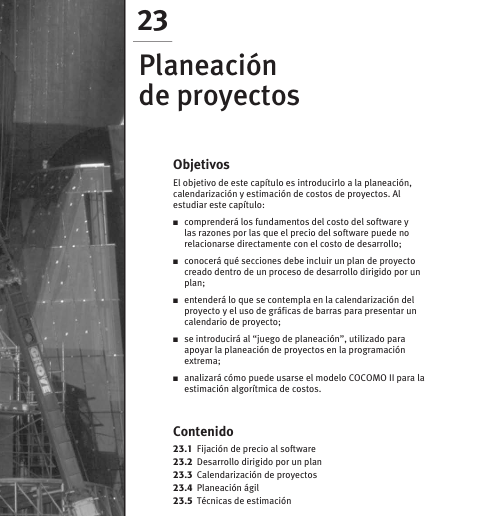
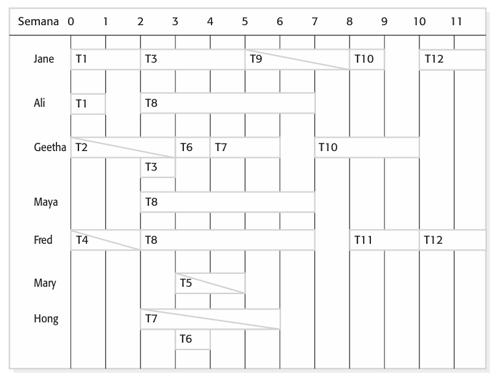
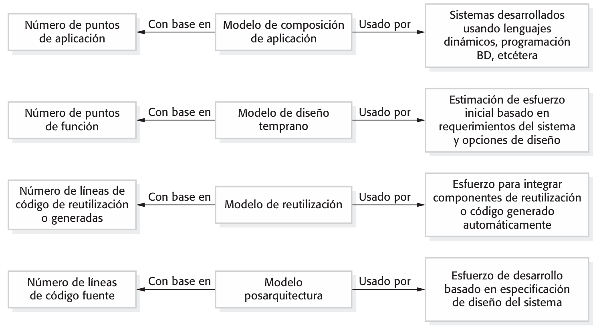
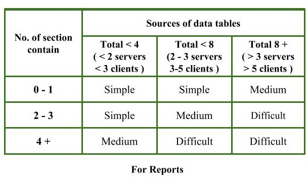
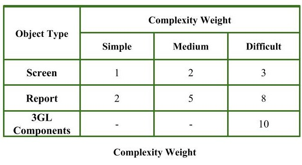
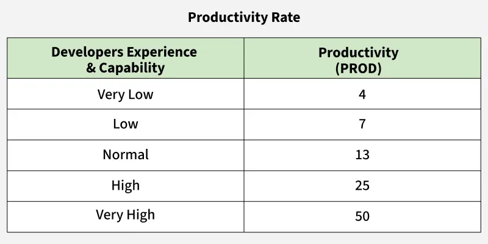

#### Ingeniería de Software
# Planeación de Proyectos
Created by <i class="fab fa-telegram"></i>
[edme88]("https://t.me/edme88")

---
<!-- .slide: style="font-size: 0.60em" -->
<style>
.grid-container2 {
    display: grid;
    grid-template-columns: auto auto;
    font-size: 0.8em;
    text-align: left !important;
}

.grid-item {
    border: 3px solid rgba(121, 177, 217, 0.8);
    padding: 20px;
    text-align: left !important;
}
</style>

# Ingeniería de Software
## Ian Sommerville



---

## Temario
<div class="grid-container2">
<div class="grid-item">

### Planeación de Proyectos

- Tareas del administrador de proyectos
- Etapas de Planeación
- Parámetros para el cálculo del costo
- Fijación de Precio
- Revisión y Ajusted del Plan
- Hitos y Entregables


</div>
<div class="grid-item">

- Calendarización
- Reutilización de Estimaciones
- Métodos de Estimación
- Errores de estimación
- Modelo COCOMO II

</div>
</div>

---

### Tareas del administrador de proyectos
- Dividir el trabajo en partes
- Asignar tareas a los miembros del equipo
- Anticipar los problemas que pudieran surgir 
- Preparar posibles soluciones a inconvenientes
- Fijación de Precio

---

### Planeación: Etapas
<!-- .slide: style="font-size: 0.90em" -->
La planeación se presenta durante tres momentos en un ciclo de vida del proyecto:
1. En la etapa de **propuestas**, cuando se presenta una licitación para obtener un 
contrato. Ayuda a decidir si cuenta con los recursos para completar el trabajo y a calcular el precio.
2. Durante la fase de **inicio**, para determinar quién trabajará en el proyecto, 
cómo se dividirá en incrementos, cómo se asignarán los recursos. Afinar estimaciones iniciales.
3. A lo **largo del proyecto**, cuando el plan se modifica si surgen desviaciones durante el monitoreo del avance del trabajo.

---

### Etapa 1 – Especulación
- Descripción a alto nivel del proyecto
- Revisión del plan si se obtiene el contrato
- Cálculo preliminar del precio según esfuerzo estimado
- Considerar factores externos que influyen en la fijación de precios

---

### Parámetros para el cálculo del costo

- **Esfuerzo**: meses/hombre + contingencia
- **Infraestructura**: hardware, software y mantenimiento
- **Operativos**: viajes y capacitación

---

### Una vez asignado el contrato...
- Refinar el plan recabando más requerimientos y refinándolos.
- Asignar recursos o decidir contratación de nuevo personal.
- Definir mecanimos de monitoreo del proyecto (avances y costos)
- Se re-analizan el calendario, estimación de costos y riesgos.

---

### Fijación de precio: Realidad
En la práctica influyen:  

- Consideraciones **organizacionales**
- Factores **económicos y políticos**
- Estrategia **empresarial**
- Riesgos y tipo de **contrato firmado**

---

<!-- .slide: style="font-size: 0.85em" -->
- **Oportunidad de mercado:** Cotizar bajo para ganar un cliente o adquirir experiencia en nuevos productos.  
- **Incertidumbre en la estimación:** Incrementar el precio para cubrir contingencias derivadas de falta de conocimiento o experiencia.  
- **Términos contractuales:** Si el cliente conserva la propiedad del código y puede reutilizarlo, la ganancia a largo plazo será menor.  
- **Volatilidad de requerimientos:** Reducir el precio inicial para obtener el contrato, compensando luego con cargos por cambios de alcance.  
- **Salud financiera:** Ajustar precios para obtener liquidez, incluso con márgenes bajos o nulos.  

---

### De la propuesta al acuerdo
Un costo de proyecto se negocia a partir de un borrador de propuesta.  

Luego cliente y proveedor acuerdan la **especificación detallada** antes de la ejecución.

---

### Desarrollo dirigido por un plan
Incluye una planificación detallada con:  
1. **Introducción:** Objetivos y restricciones del proyecto.  
2. **Organización:** Estructura del equipo, roles y responsabilidades.  
3. **Análisis de riesgos:** Riesgos potenciales, probabilidad y estrategias de mitigación.  
4. **Recursos tecnológicos:** Hardware y software requeridos. 

----

### Desarrollo dirigido por un plan

5. **División del trabajo:** Listado de actividades con sus plazos y entregas asociadas.
6. **Calendario del proyecto:** Indica las dependencias entre las actividades, el tiempo 
estimado requerido para alcanzar cada plazo y la asignación de personal.
7. **Mecanismos de monitorización y reporte:** Lista los informes que deben producirse, cuándo tienen que elaborarse y los mecanismos de monitorización que se usarán.

----

### Complementos del plan
<!-- .slide: style="font-size: 0.95em" -->
8. **Plan de calidad:** Describe los procedimientos de calidad y estándares que se usarán.
9. **Plan de validación:**  Describe el enfoque, los recursos y el calendario utilizados para la 
validación del sistema.
10. **Configuración del plan de gestión:** Describe la configuración de los procedimientos y las estructuras para la gestión.
11. **Plan de mantenimiento:** Predice los requerimientos, los costos y el esfuerzo de mantenimiento.
12. **Plan de desarrollo de personal:** Describe cómo se desarrollarán las habilidades y la experiencia de los miembros del equipo de proyecto.

---

### Revisión y ajustes del plan
Los cambios son inevitables: deben revisarse regularmente ante variaciones en requerimientos, calendario o riesgos.  

Factores a considerar: **fecha de entrega, personal disponible, presupuesto y herramientas**.  

---

### Hitos y Entregables

- **Hitos:** Puntos en el calendario contra los que puede valorar el avance.
- **Entregables:** Productos de trabajo que se proporcionan al cliente.

---

### Realismo en la planificación
Se debe ser realista a la hora de preparar un plan. Por eso, las suposiciones deben ser **prudentes y conservadoras**.

Tiene que incluir suficiente **contingencia** para evitar renegociaciones frecuentes.

---

### Mitigación de problemas graves

- Tomar acciones de **mitigación de riesgos**.  
- Renegociar calendario y realizar **revisión técnica formal** para validar alineación con los objetivos del cliente.  
- Decidir si se debe **continuar o cancelar** el proyecto. 

---
### CALENDARIZACIÓN DE PROYECTOS
Proceso de definir cómo se organizará el trabajo:  
- Identificación de tareas.  
- Orden y secuencia de ejecución.  
- Duración estimada de cada tarea.  
- Recursos necesarios para su realización. 

---

### Proceso de Calendarización del Proyecto


---

### Reutilización de estimaciones
- Si el proyecto es similar a uno anterior, pueden **reutilizarse estimaciones previas**.  
- Si cambian los **métodos de diseño o lenguajes de implementación**, las estimaciones anteriores pueden no ser aplicables.  

---

### Regla empírica para estimar
1. **Estimar en condiciones ideales** (asumiendo que nada saldrá mal).  
2. **Ampliar la estimación** para cubrir problemas anticipados.  
3. Añadir un **factor de contingencia** (30% a 50%) para imprevistos no anticipados. 

---

### Representación del calendario
1. **Gráficos de Gantt:** Gráficas de barras basadas en el calendario, las cuales señalan al responsable de cada actividad, el tiempo transcurrido previsto y la fecha en que se programó el inicio y el fin de la actividad. 
2. **Redes de actividad**, son diagramas de red que muestran las dependencias entre las 
diferentes actividades que constituyen un proyecto.

---

### Elementos de cada actividad
Cada actividad debe incluir:  
1. **Duración** en días o meses calendario.  
2. **Esfuerzo** requerido en días-hombre.  
3. **Plazo límite** para su finalización.  
4. **Resultado esperado** al completarla.  

---

### Definición de hitos
- Los **hitos** marcan puntos clave en el calendario.  
- Cada hito debe documentarse con un **reporte breve** que resuma el avance y el trabajo realizado.  

---
<!-- .slide: style="font-size: 0.60em" -->
<!--
| Tarea | Esfuerzo (días-hombre) | Duración (días) | Dependencias  |
|:------|:-----------------------|:----------------|:--------------|
| T1    | 15                     | 10              |               |
| T2    | 8                      | 15              |               |
| T3    | 20                     | 15              | T1 (M1)       | 
| T4    | 5                      | 10              |               | 
| T5    | 5                      | 10              | T2, T4 (M3)   | 
| T6    | 10                     | 5               | T1, T2 (M4)   | 
| T7    | 25                     | 20              | T1 (M1)       | 
| T8    | 75                     | 25              | T4 (M2)       | 
| T9    | 10                     | 15              | T3, T6 (M5)   | 
| T10   | 20                     | 15              | T7, T8 (M6)   | 
| T11   | 10                     | 10              | T9 (M7)       | 
| T12   | 20                     | 10              | T10, T11 (M8) | 
-->
<table>
<thead>
<tr>
<th style="text-align:left">Tarea</th>
<th style="text-align:left">Esfuerzo (días-hombre)</th>
<th style="text-align:left">Duración (días)</th>
<th style="text-align:left">Dependencias</th>
</tr>
</thead>
<tbody>
<tr>
<td style="text-align:left">T1</td>
<td style="text-align:left">15</td>
<td style="text-align:left">10</td>
<td style="text-align:left"></td>
</tr>
<tr>
<td style="text-align:left">T2</td>
<td style="text-align:left">8</td>
<td style="text-align:left">15</td>
<td style="text-align:left"></td>
</tr>
<tr>
<td style="text-align:left">T3</td>
<td style="text-align:left">20</td>
<td style="text-align:left">15</td>
<td style="text-align:left">T1 (M1)</td>
</tr>
<tr>
<td style="text-align:left">T4</td>
<td style="text-align:left">5</td>
<td style="text-align:left">10</td>
<td style="text-align:left"></td>
</tr>
<tr>
<td style="text-align:left">T5</td>
<td style="text-align:left">5</td>
<td style="text-align:left">10</td>
<td style="text-align:left">T2, T4 (M3)</td>
</tr>
<tr>
<td style="text-align:left">T6</td>
<td style="text-align:left">10</td>
<td style="text-align:left">5</td>
<td style="text-align:left">T1, T2 (M4)</td>
</tr>
<tr>
<td style="text-align:left">T7</td>
<td style="text-align:left">25</td>
<td style="text-align:left">20</td>
<td style="text-align:left">T1 (M1)</td>
</tr>
<tr>
<td style="text-align:left">T8</td>
<td style="text-align:left">75</td>
<td style="text-align:left">25</td>
<td style="text-align:left">T4 (M2)</td>
</tr>
<tr>
<td style="text-align:left">T9</td>
<td style="text-align:left">10</td>
<td style="text-align:left">15</td>
<td style="text-align:left">T3, T6 (M5)</td>
</tr>
<tr>
<td style="text-align:left">T10</td>
<td style="text-align:left">20</td>
<td style="text-align:left">15</td>
<td style="text-align:left">T7, T8 (M6)</td>
</tr>
<tr>
<td style="text-align:left">T11</td>
<td style="text-align:left">10</td>
<td style="text-align:left">10</td>
<td style="text-align:left">T9 (M7)</td>
</tr>
<tr>
<td style="text-align:left">T12</td>
<td style="text-align:left">20</td>
<td style="text-align:left">10</td>
<td style="text-align:left">T10, T11 (M8)</td>
</tr>
</tbody>
</table>

<small>Donde **M** son los **Hitos** o **Milestone**</small>

---

### Interpretación esfuerzo vs. duración
- Si el **esfuerzo < duración** → el personal no trabaja tiempo completo en la tarea.  
- Si el **esfuerzo > duración** → varios miembros del equipo trabajan en paralelo en la tarea.  

---

### Gráfica de barras de actividad


---

### Tareas independientes
- Las tareas **independientes** pueden realizarse en paralelo.  

---

### Gráfica de asignación de personal



---

### Reglas de asignación de personal
- Una persona puede trabajar en **más de una tarea** al mismo tiempo.  
- Puede haber períodos sin asignación (vacaciones, otro proyecto, capacitación, etc.).  
- Las **asignaciones parciales** se indican con una línea diagonal sobre la barra.  

---

### Diagrama de Gantt: Ejemplo


---

### Diagrama de Actividad (PERT)


---

### Planeación ágil
El desarrollo de software sigue un enfoque **iterativo**:  
- El sistema se construye en **incrementos** que se entregan al cliente.  
- Cada incremento se define según el **progreso** y las **prioridades del cliente**.

---

###  Planeación ágil
1. Planeación de la entrega (release), que prevé con muchos meses de antelación y 
decide sobre las características que deben incluirse en una entrega de un sistema.
2. Planeación de la iteración, tiene un panorama a corto plazo y se enfoca en 
la planeación del siguiente incremento de un sistema. En general representa de 2 a 4 semanas de trabajo.

---

### Planeación en XP


----

### Planeación en XP
1. **Identificar** un conjunto de **historias** que comprendan toda la funcionalidad que se incluirá en el sistema final.
2. Para poder **estimar**, el equipo lee y discute las historias y las clasifica de acuerdo con la cantidad de tiempo que consideran que se tardará en implementarla. Se asigna puntos de esfuerzo hipotéticos.
3. Seleccionar y afinar las historias que reflejarán las características a aplicar en una **entrega** de un sistema y el orden en el que deben implementar. El cliente participa de este proceso.

----

### Planeación en XP
4. Se eligen las historias a implementar en dicha **iteración**; el número de historias depende del tiempo del sprint y la velocidad del equipo. Se suman los puntos de las historias terminadas
y se calcula nuevamente la velocidad.
5. Planeación más detallada en donde las historias se dividen en **tareas**.

---

### Ajustes en mitad de la iteración
- A la mitad del sprint (iteración) se revisa el alcance. Si no se completaron la mitad de 
puntos de esfuerzo, se consulta al cliente y se quitan algunas historias de la iteración.
- Se reduce el alcance en lugar de mover el calendario.

---

### Beneficios del enfoque de planeación ágil
1. Todo el equipo conoce las tareas a completar en una iteración.
2. Los desarrolladores eligen las tareas a implementar, por lo que tienen 
un sentido de propiedad y esi motiva más a completar la tarea.

---

### Métodos de estimación de costo de software
Se pueden agrupar en tres grandes enfoques:
1. Basado en la experiencia
2. Algorítmicos o Paramétricos
3. Híbridos o modernos

---

### 1. Basados en la experiencia

Se apoyan en el conocimiento de expertos o en datos históricos de proyectos similares:
- **Juicio de expertos:** el costo se estima con base en la experiencia de ingenieros, gerentes o especialistas.
- **Analogía:** se comparan proyectos anteriores con características semejantes y se ajusta la estimación.
- **Delphi:** varios expertos dan estimaciones de manera independiente y luego se consolidan en un consenso.

---

### 2. Métodos algorítmicos o paramétricos
<!-- .slide: style="font-size: 0.95em" -->
Usan fórmulas matemáticas y modelos estadísticos a partir de métricas:
- **Modelos de puntos de función:** Miden la funcionalidad entregada al usuario y la convierten en esfuerzo/costo.
- **COCOMO (Constructive Cost Model)** Utiliza el tamaño del software (en KLOC o puntos de función) y factores de ajuste para calcular esfuerzo, tiempo y costo.
- **Modelos de regresión:** se crean a partir de bases de datos de proyectos pasados, ajustando fórmulas para predecir costos.

---

### 3. Métodos híbridos o modernos

Combinan experiencia, métricas y modelos, o incorporan nuevas técnicas:
- **Estimación ágil:** Planning Poker, Wideband Delphi. Usada en entornos ágiles, basada en consenso rápido del equipo.
- **Modelos de simulación:** aplican técnicas como Monte Carlo para calcular rangos de costo.
- **Machine Learning:** entrenar modelos predictivos con grandes volúmenes de datos históricos de proyectos.

---

### Errores en las estimaciones
<!-- .slide: style="font-size: 0.50em" -->
- Una estimación inicial de **x meses de esfuerzo** puede variar entre **0.25x y 4x** en la realidad.  
- La precisión mejora a medida que avanza el proyecto.


---

### Modelado algorítmico de costos
Usa fórmulas matemáticas para predecir costos según:  
- **Tamaño del proyecto**  
- **Tipo de software**  
- **Factores del equipo, proceso y producto**  

Se pueden calibrar los modelos con proyectos ya completados para mejorar la precisión.  

----

### Modelado algorítmico de costos


- **A:** factor constante (depende de prácticas de la organización y tipo de software).  
- **Tamaño:** líneas de código o puntos de función.  
- **B:** exponente entre 1 y 1.5 (según complejidad).  
- **M:** multiplicador de atributos (procesos, confiabilidad, experiencia del equipo, etc.).  

---

### Limitaciones del modelo algorítmico
- Difícil estimar el **tamaño** en etapas tempranas.  
- Factores de **B** y **M** son subjetivos (dependen de experiencia).  
- Necesita **calibración** con datos históricos para ser útil.  

---

### Modelo COCOMO II
**COCOMO (Constructive Cost Model)** evoluciona de los primeros modelos de estimación de costos.  
Incluye 4 submodelos:  
1. **Composición de aplicación**  
2. **Diseño temprano**  
3. **Reutilización**  
4. **Posarquitectónico**  

---

 

---

### 1. Modelo de composición de aplicación

- Permite estimar el costo y el esfuerzo en la etapa 1 del  Modelo COCOMO II 
- El tamaño se estima mediante Puntos de Objeto
- Los **Puntos de Objeto** definen pantallas, informes y módulos de tercera generación (3GL)

----

### 1. Modelo de composición de aplicación

Para estimar el esfuerzo para desarrollar un proyecto se siguen los siguientes pasos:
1. Acceso a recuentos de objetos
2. Clasifique los niveles de complejidad de cada objeto
3. Asignar pesos de complejidad a cada objeto
4. Determinar los puntos del objeto
5. Calcular nuevos puntos de objeto (NOP)
6. Calcular la tasa de productividad (PROD)
7. Calcular el esfuerzo estimado

----

### 1. Modelo de composición de aplicación
#### 1. Acceso a recuentos de objetos

Calcule el número de pantallas, informes y componentes 3GL que conformarán esta aplicación.

----

### 1. Modelo de composición de aplicación
#### 2. Clasifique los niveles de complejidad de cada objeto

Se clasifica cada instancia de objeto en niveles de complejidad simple, media y difícil.


----

### 1. Modelo de composición de aplicación
#### 2. Clasifique los niveles de complejidad de cada objeto



----

### 1. Modelo de composición de aplicación
#### 3. Asignar pesos de complejidad a cada objeto

Los pesos se utilizan para tres tipos de objetos: pantallas, informes y componentes 3GL.



----

### 1. Modelo de composición de aplicación
#### 4. Determinar los puntos del objeto

Sumar todas las instancias de objetos ponderados para obtener un número; esto se conoce como recuento de puntos de objeto.

**Punto de objeto = Sigma (número de instancias de objeto) * (peso de complejidad de cada instancia de objeto)**

----

### 1. Modelo de composición de aplicación
#### 5. Calcular nuevos puntos de objeto (NOP)
Estimar el porcentaje de reutilización que se debe lograr en un proyecto.

**NOP = [(puntos de objeto) * (100 - % reutilización)] / 100**

Los NOP son los puntos de objeto que se deben desarrollar y se diferencian del recuento de puntos de objeto porque puede haber reutilización de alguna instancia de objeto en el proyecto.

----

### 1. Modelo de composición de aplicación
#### 6. Calcular la tasa de productividad (PROD)
<!-- .slide: style="font-size: 0.90em" -->
La tasa de productividad se calcula a partir de la información sobre la experiencia y la capacidad del desarrollador.



----

### 1. Modelo de composición de aplicación
#### 7. Calcule el esfuerzo estimado
El esfuerzo para desarrollar un proyecto se puede calcular como:

```
Esfuerzo = NOP / PROD
```

El esfuerzo se mide en personas-mes.

----

### EJEMPLO

Considere un proyecto de aplicación de base de datos con
1. La aplicación tiene 4 pantallas con 4 vistas cada una y 7 tablas de datos para 3 servidores y 4 clientes.
2. La aplicación puede generar 2 informes de 6 secciones cada uno a partir de 7 tablas de datos para 2 servidores y 3 clientes.
3. 10% de reutilización de puntos de objeto.
4. La experiencia y capacidad del desarrollador en entornos similares es baja.

----

#### Paso 1: 

Número de pantallas = 4

Número de registros = 2

----

#### Paso 2: Para las pantallas,
Número de vistas = 4

Número de tablas de datos = 7

Número de servidores = 3

Número de clientes = 4

De la tabla obtenermos que el **nivel de complejidad** para cada pantalla es **medio**.

----

#### Paso 2: Para informes

Número de secciones = 6

Número de tablas de datos = 7

Número de servidores = 2

Número de clientes = 3

De la tabla obtenermos que el **nivel de complejidad** para cada informo es **difícil**.

----

#### Paso 3: Peso de Complejidad

De la tabla de peso de complejidad obtenemos:

Peso de complejidad para cada pantalla = 2

Peso de complejidad para cada informe = 8

----

#### Paso 4: Puntos Objeto

Recuento de puntos del objeto = sigma (número de instancias del objeto) * (su peso de complejidad)

Puntos Objeto = 4 * 2 + 2 * 8 = 24

----

#### Paso 5: % de reutilización 

El porcentaje de reutilización de puntos de objeto = 10% (dado)

**NOP = [puntos de objeto * (100 - %reutilización)] / 100**

NOP = [24 * (100 -10)]/100 = 21,6


----

#### Paso 6:

La experiencia y capacidad del desarrollador son **bajas**.
Utilizando la tabla de tasa de productividad:

Tasa de productividad (PROD) del proyecto dado = 7


----

#### Paso 7:

**Esfuerzo = NOP / PROD**

Esfuerzo = 21,6/7

Esfuerzo = 3.086 personas-mes

<!--
### 1. Modelo de composición de aplicación
Modela el esfuerzo en proyectos con **componentes reutilizados**, código generado o programación de bases de datos.  

- Tamaño medido en **puntos de aplicación**.  
- Esfuerzo = **Tamaño / Productividad**.  
- Se pondera: nº de pantallas, informes, módulos y líneas de código. 

### 1. Modelo de composición de aplicación
Enfocado en **prototipos y proyectos con reutilización**.  
- La **productividad** depende de la experiencia, habilidades y herramientas.  


### Fórmula de estimación en composición


- **PM:** esfuerzo en meses-hombre.  
- **NAP:** número de puntos de aplicación.  
- **%Reutilización:** proporción de código reutilizado.  
- **PROD:** productividad del equipo.  
-->

---

### 2. Modelo de diseño temprano
Simplifica la fórmula general:  

**Esfuerzo = A × Tamaño^B × M**  

- Tamaño expresado en **puntos de función**, convertidos a **KSLOC** (miles de líneas de código).  
- Factores: entradas/salidas externas, interacciones, interfaces y tablas.  

----

### Parámetros del diseño temprano
<!-- .slide: style="font-size: 0.70em" -->


- **A = 2.94** (propuesto por Boehm)
- **B = 1.1 a 1.24**, según innovación, riesgos, cohesión y madurez.  
- **M:** multiplicador basado en 7 atributos:  
  - PERS (habilidad personal)  
  - RCPX (fiabilidad y complejidad)  
  - RUSE (reutilización)  
  - PDIF (dificultad de plataforma)  
  - PREX (experiencia personal)  
  - FCIL (facilidades de soporte)  
  - SCED (ajuste de calendario)  

----

Los valores de **M** se pueden tomar de la siguiente tabla:

<table>
  <thead>
    <tr>
      <th>Factor</th>
      <th>Muy Bajo</th>
      <th>Bajo</th>
      <th>Nominal</th>
      <th>Alto</th>
      <th>Muy Alto</th>
      <th>Extra Alto</th>
    </tr>
  </thead>
  <tbody>
    <tr>
      <th>PERS (Habilidad personal)</th>
      <td>1.62</td>
      <td>1.26</td>
      <td>1.00</td>
      <td>0.83</td>
      <td>0.63</td>
      <td>–</td>
    </tr>
    <tr>
      <th>RCPX (Fiabilidad y complejidad)</th>
      <td>0.49</td>
      <td>0.60</td>
      <td>1.00</td>
      <td>1.33</td>
      <td>1.91</td>
      <td>–</td>
    </tr>
    <tr>
      <th>RUSE (Reutilización requerida)</th>
      <td>–</td>
      <td>–</td>
      <td>1.00</td>
      <td>1.07</td>
      <td>1.15</td>
      <td>1.24</td>
    </tr>
    <tr>
      <th>PDIF (Dificultad de la plataforma)</th>
      <td>–</td>
      <td>–</td>
      <td>1.00</td>
      <td>1.29</td>
      <td>1.81</td>
      <td>–</td>
    </tr>
    <tr>
      <th>PREX (Experiencia personal)</th>
      <td>1.59</td>
      <td>1.33</td>
      <td>1.00</td>
      <td>0.87</td>
      <td>0.71</td>
      <td>–</td>
    </tr>
    <tr>
      <th>FCIL (Facilidades de soporte)</th>
      <td>1.43</td>
      <td>1.14</td>
      <td>1.00</td>
      <td>0.87</td>
      <td>0.73</td>
      <td>–</td>
    </tr>
    <tr>
      <th>SCED (Compresión del calendario)</th>
      <td>1.43 (75%)</td>
      <td>1.14 (85%)</td>
      <td>1.00 (100%)</td>
      <td>1.00 (130%)</td>
      <td>–</td>
      <td>–</td>
    </tr>
  </tbody>
</table>

----

### Ejercicio:

Supongamos:
<!-- .slide: style="font-size: 0.80em" -->
- Tamaño = 100 Puntos de Aplicación (AP).
- Exponente B = 1.12 (un caso intermedio, ni muy riesgoso ni muy maduro).
- Atributos: 
  - PERS: Alto
  - RCPX: Nominal
  - RUSE: Alta
  - PDIF: Nominal
  - PREX: Baja
  - FCIL: Alta
  - SCED: Nominal
- ¿Cuánto demoraría un equipo de 10 dev o 25 devs?

----

#### Paso 1: Calcular M
𝑀 = 0.83 × 1.00 × 1.07 × 1.00 × 1.33 × 0.87 × 1.00 = **1.03**
  
#### Paso 2: Calcular esfuerzo (PM)
PM = 2.94 × (100) 1.12 × 1.03 = **526 meses-persona**

#### Paso 3: Equipos
526/10 = 52.6 meses ≈ **4.4 años**

526/25 = 21 meses ≈ **1.7 años**

---

###  3. Modelo de reutilización
Calcula esfuerzo al integrar **código existente o generado automáticamente**.  

Tipos:  
- **Caja negra:** código reutilizado sin cambios (esfuerzo 0).  
- **Caja blanca:** requiere adaptación e integración.  

----

### Fórmula de reutilización

<!-- .slide: style="font-size: 0.90em" -->
**ASLOC** son las siglas de "Adapted Source Lines of Code".

Representa el número de líneas de código existentes que se van a adaptar/reutilizar en el nuevo proyecto.

No todo ese código cuenta como “nuevo”, porque adaptarlo no cuesta lo mismo que desarrollarlo desde cero.


- **ASLOC:** líneas de código reutilizado.  
- **AT:** % de código generado automáticamente.  
- **ATPROD:** productividad al integrarlo. 

----

### Conversión a ESLOC
**ESLOC** son las siglas de "Equivalent Source Lines of Code".

Es una medida ajustada que convierte el esfuerzo de reutilización/adaptación en un equivalente a "líneas nuevas".

**ESLOC = ASLOC × AAM**  

- **ESLOC:** líneas equivalentes de nuevo código.  
- **AAM:** multiplicador de ajuste de adaptación.  

----

#### AAM: Adaptation Adjustment Multiplier


- **AAF:** Factor de Ajuste de Adaptación, que representa el costo de hacer un cambio.  
- **SU:** Penalización por Comprensión del Software. Refleja cuánto cuesta entender el software antes de adaptarlo. 10 (muy simple) a 50 (muy complejo).
- **UNFM:** Evaluación y Asimilación. Representa el esfuerzo para evaluar, seleccionar e integrar software reutilizado. Rango: 0 a 8.

----

### AAF: Factor de Ajuste de Adaptación

Se calcula como:
**AAF = 0.4 × DM + 0.3 × CM + 0.3 × IM**

- **DM** = % de diseño modificado.
- **CM** = % de código modificado.
- **IM** = % de integración modificada.

----

### Ejercicio:

Supongamos:
- ASLOC = 8,000
- DM = 25%, CM = 10%, IM = 20%
- SU = 30 (dificultad media para entender el software)
- UNFM = 4 (esfuerzo intermedio de evaluación)

----

#### 1. Calcular AAF:

AAF = (0.4 × 25) + (0.3 × 10) + (0.3 × 20)

#### 2. Calcular AAM:

AAM = (19/100) ​+ (30/100) ​+ (4/100)​

AAM = 0.19 + 0.30 + 0.04 = 0.53

#### 3. Calcular ESLOC:

ESLOC = 8,000 × 0.53 = 4,240

Reutilizar 8,000 líneas de código en esas condiciones equivale a 4,240 líneas nuevas en esfuerzo de desarrollo.

---

### 4. Modelo posarquitectónico
Se aplica cuando ya existe un diseño arquitectónico inicial.  

- Permite estimaciones más precisas del **tamaño**.  
- Incluye multiplicadores adicionales sobre **personas, producto y proyecto**.  

----

### Fórmula posaquitectonica


- A = 2.94 (constante calibrada).
- Tamaño = LOC, Puntos de Función o ESLOC (si hay reutilización).
- B = Exponente que refleja la escala
- EMi = Multiplicadores de esfuerzo (17 en total en este modelo).

----

### Factores posarquitectónicos
1. **Precedencia:** experiencia previa en proyectos similares.  
2. **Flexibilidad de desarrollo:** libertad para definir procesos. 
3. **Resolución de riesgos:** nivel de análisis de riesgos realizado.  
4. **Cohesión de equipo:** calidad de la comunicación y trabajo conjunto.  
5. **Madurez del proceso:** nivel CMM (Modelo de Madurez de Capacidades) de la organización.  

----

### Multiplicadores de Esfuerzo
- Producto
- Plataforma
- Personal

----

### Multiplicadores de Esfuerzo: Producto
<!-- .slide: style="font-size: 0.90em" -->
1. **RELY:** Reliability / Fiabilidad requerida. Qué tan crítico es que el software funcione sin fallas.
2. **DATA:** Database Size / Tamaño de base de datos. Relación entre la base de datos y el código fuente.
3. **CPLX:** Complexity / Complejidad del producto. Número de operaciones, interfaces, algoritmos, interacción con usuarios, etc
4. **RUSE:** Required Reusability / Reutilización requerida. Nivel de calidad y documentación exigida para que el software pueda ser reutilizado en otros proyectos
5. **DOCU:** Documentation. Cantidad y calidad de documentación requerida (manuales, guías, especificaciones).

----

### Multiplicadores de Esfuerzo: Plataforma
6. **TIME:** Execution Time Constraint / Restricciones de tiempo de ejecución. Qué porcentaje del tiempo de CPU puede usar la aplicación.
7. **STOR:** Main Storage Constraint / Restricciones de memoria. Aplicaciones que deben correr con muy poca RAM son más difíciles de desarrollar.
8. **PVOL:** Platform Volatility / Volatilidad de la plataforma. Qué tan seguido cambia el hardware, el SO o el middleware en el que corre el sistema.


----

### Multiplicadores de Esfuerzo: Personal
<!-- .slide: style="font-size: 0.80em" -->
9. **ACAP:** Analyst Capability. Habilidad de analistas en requerimientos y diseño.
10. **PCAP:** Programmer Capability. Habilidad técnica del equipo de codificación.
11. **PCON:** Personnel Continuity. Mide la rotación del equipo (turnover). Mucha rotación = más esfuerzo.
12. **APEX:** Applications Experience. Familiaridad del equipo con el dominio específico del sistema (ej. banca, salud, telecom).
13. **PLEX:** Platform Experience. Experiencia en el hardware/SO/middleware donde se implementará el sistema.
14. **LTEX:** Language and Tool Experience. Qué tanto conoce el equipo los lenguajes de programación, librerías y herramientas de desarrollo que usará.

----

### Multiplicadores de Esfuerzo: Proyecto
15. **TOOL:** Use of Software Tools. Nivel de soporte de CASE, entornos integrados, repositorios de versiones, herramientas de prueba, etc.
16. **SITE:** Multisite Development. Equipos distribuidos en varios husos horarios → más esfuerzo.
17. **SCED:** Schedule Compression. Ajuste del calendario respecto al nominal (ej. terminar en 75% del tiempo normal implica más esfuerzo).

---


---

730 meses-hombre significa:
- Si una sola persona trabajara sola → tardaría 730 meses (~60 años).
- Si trabajaran 10 personas → serían 73 meses (~6 años).
- Si trabajaran 50 personas → serían 15 meses (~1 año y 3 meses).

El calendario final depende de la cantidad de personas asignadas y de la productividad (no es siempre lineal, porque más gente también trae coordinación extra).

---

### Ejemplo de COCOMO
¿Qué ocurre al variar los controladores de costo?  
- Valores **altos** → esfuerzo estimado puede triplicarse.  
- Valores **bajos** → esfuerzo se reduce a 1/3 del original.  

---

### COCOMO II: lo bueno y lo limitado
<!-- .slide: style="font-size: 0.90em" -->
- Ventajas:
  - Ofrece un marco formal y probado.
  - Permite distintos niveles de detalle (temprano, posarquitectónico, reutilización).
  - Es útil en organizaciones con historial de proyectos y datos calibrados.
- Limitaciones:
  - Depende de medir bien el tamaño (KLOC o puntos de función).
  - Los parámetros (B, M, AAM, etc.) son subjetivos y difíciles de estimar temprano.
  - No siempre refleja entornos ágiles o de alta incertidumbre.

----

### ¿COCOMO 2 se sigue usando?
- Algunos contratos lo requieren como método oficial de estimación (ej. proyectos de la NASA).
- En un marco académico, para entender estimación paramétrica y cómo distintos factores influyen en costo.
- En empresas grandes con proyectos críticos, como parte de un paquete de estimación híbrido, junto con métricas ágiles, velocity, function points, etc.

---
## ¿Dudas, Preguntas, Comentarios?
