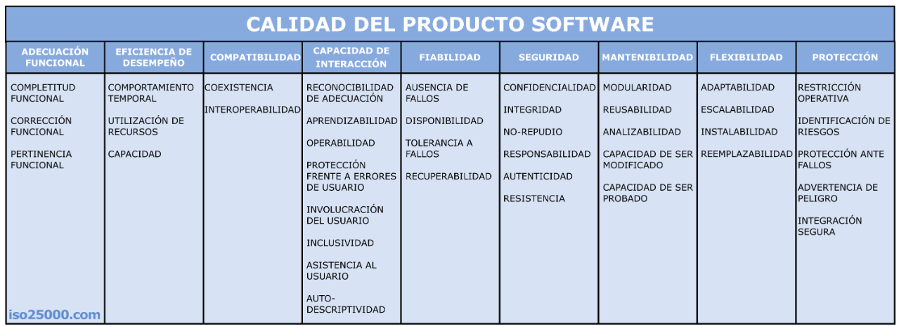
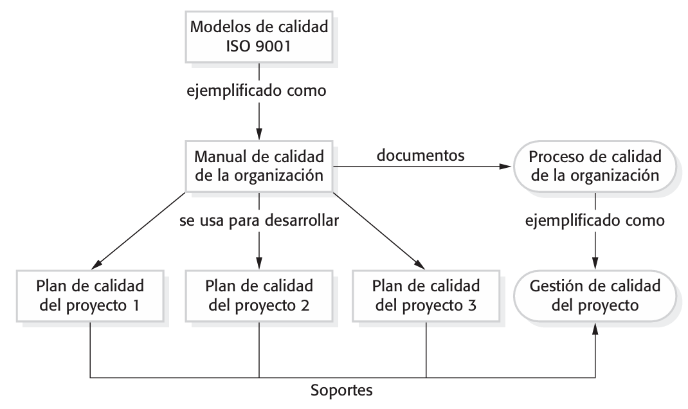
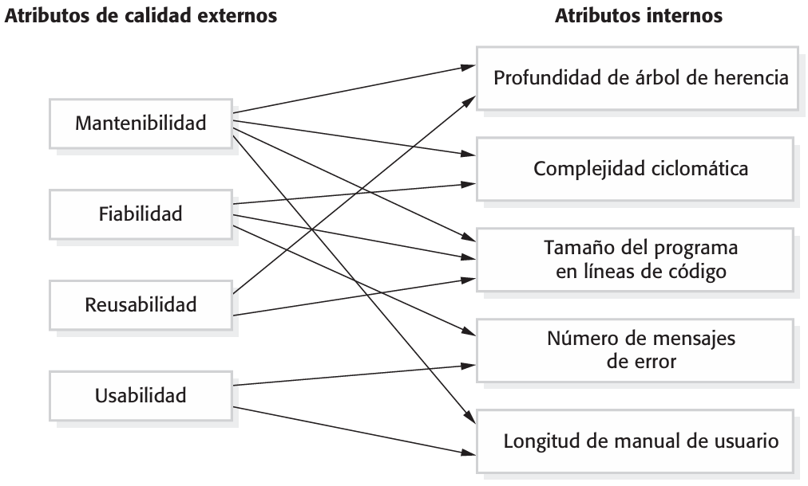
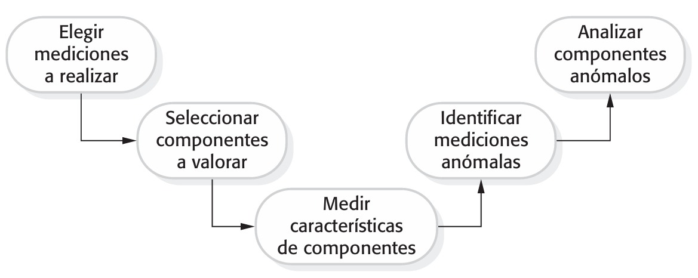
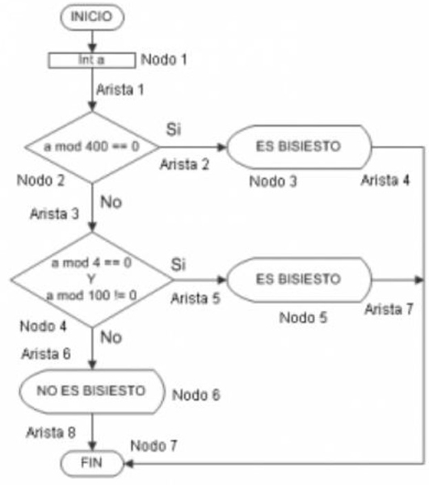

#### Ingeniería de Software
# Calidad del Software
Created by <i class="fab fa-telegram"></i>
[edme88]("https://t.me/edme88")

---
<!-- .slide: style="font-size: 0.60em" -->

## Temario

### Calidad del Software
* Definición
* Manejo de la calidad
* Qué es calidad?
* Compromiso de Calidad
* Actividades de manejo de calidad
* Atributos de la calidad del software
* Calidad basada en procesos
* Estándares de Software
* Importancia de los estándares
* Problemas con estándares

* ISO 9000-9001
* Certificación ISO
* Revisión
* Procedimientos de Revisión
* Revisiones de Calidad
* Tipos de Revisiones
* Inspecciones del programa
* Métricas de calidad del producto
* Suposición de métricas
* Métricas estáticas de productos de software
* Métricas Orientadas a Objetos
* Métricas de acoplamiento
* Madures de las métricas

---

#### Ingeniería de Software
#### Ian Sommerville

---
### CALIDAD
* **Asegurar la calidad:** definición de procesos y estándares que deben conducir
a la obtención de productos de alta calidad
* **Control de calidad:** aplicación de procesos para eliminar productos que no
cuentan con el nivel de calidad requerido

---
### MANEJO DE LA CALIDAD DEL SOFTWARE
* Se refiere a lograr un nivel de calidad requerido en el producto de software
* Involucra a la definición de estándares de calidad apropiados y procedimientos que
permitan asegurar que estos se cumplan.
* Debe llevar a desarrollar una cultura de calidad en donde la calidad es responsabilidad de todos

---
### ¿QUÉ ES CALIDAD?
**Calidad significa que un producto debe cumplir con sus especificaciones.**

Para sistemas de software
* Algunos requerimientos de calidad son difíciles de especificar (eficiencia, mantenibilidad,
reusabilidad, etc.)
* Las especificaciones del Software son usualmente incompletos y a menudo inconsistentes

---
### EL COMPROMISO DE CALIDAD
* No podemos esperar a que las especificaciones mejoren para poner atención al manejo de la calidad
* Debe haber procedimientos que permitan mejorar la calidad aunque la especificaciones no sean perfectas
* El manejo de la calidad no solo se refiere a reducir defectos sino también a mejorar otras cualidades del producto

---
### ACTIVIDADES DE MANEJO DE CALIDAD
* **Asegurar la calidad:** Establecer procedimientos organizacionales y estándares para la calidad
* **Planear la calidad:** Seleccionar procedimientos aplicables y estándares para un proyecto en particular y
modificar estos como sean requeridos
* **Controlar la calidad:** Garantizar que procedimientos y estándares son seguidos por el equipo de desarrollo de
software

---
### ACTIVIDADES DE MANEJO DE CALIDAD
El manejo de calidad debe ser separado del manejo del proyecto
para asegurar independencia

---

### Plan de Calidad
<!-- .slide: style="font-size: 0.80em" -->
Un plan de calidad (Humphrey) suele incluir:
1. **Introducción del producto:** Descripción del producto, su mercado y expectativas de calidad. 
2. **Planes del Producto:** Indican las fechas de entrega críticas y las responsabilidades para el producto, planes para distribución y servicio al producto.
3. **Descripciones de procesos:** Describen los procesos y estándares de desarrollo y 
servicio que deben usarse para diseño y gestión del producto.
4. **Metas de calidad:** Identificación y justificación de los atributos esenciales de calidad del 
producto.
5. **Riesgos y gestión del riesgo:** Los riesgos pueden afectar la calidad del 
producto y las acciones a tomar para enfrentar dichos riesgos

---
### ATRIBUTOS DE LA CALIDAD DEL SOFTWARE
<!-- .slide: style="font-size: 0.60em" -->
<!--
|              |                  |                                                    |
|:-------------|:-----------------|:---------------------------------------------------|
| Protección   | Comprensibilidad | Portabilidad                                       |
| Seguridad    | Comprobabilidad  | Usabilidad                                         |
| Fiabilidad   | Adaptabilidad    | Reusabilidad                                       |
| Flexibilidad | Modularidad      | Eficiencia                                         |
| Robustez     | Complejidad      | Facilidad para que el usuario aprenda a utilizarlo |
-->
<table>
<thead>
<tr>
<th style="text-align:left"></th>
<th style="text-align:left"></th>
<th style="text-align:left"></th>
</tr>
</thead>
<tbody>
<tr>
<td style="text-align:left">Protección</td>
<td style="text-align:left">Comprensibilidad</td>
<td style="text-align:left">Portabilidad</td>
</tr>
<tr>
<td style="text-align:left">Seguridad</td>
<td style="text-align:left">Comprobabilidad</td>
<td style="text-align:left">Usabilidad</td>
</tr>
<tr>
<td style="text-align:left">Fiabilidad</td>
<td style="text-align:left">Adaptabilidad</td>
<td style="text-align:left">Reusabilidad</td>
</tr>
<tr>
<td style="text-align:left">Flexibilidad</td>
<td style="text-align:left">Modularidad</td>
<td style="text-align:left">Eficiencia</td>
</tr>
<tr>
<td style="text-align:left">Robustez</td>
<td style="text-align:left">Complejidad</td>
<td style="text-align:left">Facilidad para que el usuario aprenda a utilizarlo</td>
</tr>
</tbody>
</table>

----

### ATRIBUTOS DE LA CALIDAD DEL SOFTWARE

1. **Protección:** Capacidad del sistema para evitar accesos no autorizados o acciones maliciosas. Incluye control de acceso, manejo de roles, autenticación y autorización.

2. **Seguridad:** Abarca confidencialidad, integridad y disponibilidad de la información.

3. **Robustez:** Capacidad del software de mantenerse operativo ante fallas o entradas inválidas.

----

### ATRIBUTOS DE LA CALIDAD DEL SOFTWARE

4. **Comprensibilidad:** Qué tan fácil es entender el código o la lógica del sistema.

5. **Complejidad:** Grado de dificultad en la estructura o lógica del software. Cuanto mayor la complejidad, más difícil de mantener.

6. **Modularidad:** Grado en que el sistema está dividido en módulos independientes y cohesivos.

7. **Comprobabilidad:** Facilidad con la que se puede verificar y probar el sistema para confirmar que cumple requisitos.

----

### ATRIBUTOS DE LA CALIDAD DEL SOFTWARE

8. **Eficiencia:** Uso óptimo de recursos (CPU, memoria, red, tiempo de respuesta).

9. **Fiabilidad:** Capacidad del software para funcionar correctamente durante un tiempo determinado sin fallar.

10. **Flexibilidad:** Facilidad con la que el software puede adaptarse a nuevos requerimientos sin grandes cambios estructurales.

----

### ATRIBUTOS DE LA CALIDAD DEL SOFTWARE

11. **Portabilidad:** Capacidad del sistema para ejecutarse en diferentes entornos o plataformas.

12. **Adaptabilidad:** Facilidad de ajustar el software a distintos contextos o necesidades.

13. **Reusabilidad:** Grado en que los componentes pueden ser reutilizados en otros proyectos o módulos.

----

### ATRIBUTOS DE LA CALIDAD DEL SOFTWARE

14. **Usabilidad:** Facilidad con la que el usuario puede utilizar el sistema de forma efectiva, eficiente y satisfactoria.

15. **Facilidad de uso:** Relacionado con la usabilidad, pero enfocado en el tiempo y esfuerzo necesarios para aprender.

---

### Ejercicio: Atributos de Calidad
<!-- .slide: style="font-size: 0.80em" -->
Para cada uno de los siguientes ejemplos determine el atributo de calidad principal:

3. Robustez

- Una API que responde con un error controlado (HTTP 400) en lugar de colapsar ante un input inesperado.

9. Fiabilidad

- Un sistema de monitoreo que no pierde datos durante una semana de ejecución continua.

2. Seguridad

- Cifrar contraseñas y asegurar conexiones con HTTPS.

----

### Ejercicio: Atributos de Calidad
<!-- .slide: style="font-size: 0.80em" -->

14. Usabilidad

- Una interfaz clara con botones y mensajes comprensibles.

10. Flexibilidad

- Agregar nuevos métodos de pago sin reescribir toda la lógica de facturación.

12. Adaptabilidad

- Cambiar el idioma o la moneda sin reescribir el código fuente.

----

### Ejercicio: Atributos de Calidad
<!-- .slide: style="font-size: 0.80em" -->

13. Reusabilidad

- Una librería de autenticación usada en varios microservicios.

5. Complejidad

- Una función con 200 líneas y múltiples condicionales tiene alta complejidad ciclomática.

1. Protección

- Un sistema que solo permite que los administradores borren datos críticos.

----

### Ejercicio: Atributos de Calidad
<!-- .slide: style="font-size: 0.80em" -->

4. Comprensibilidad

- Un código bien comentado, con nombres descriptivos y arquitectura clara.

11. Portabilidad

- Una aplicación que corre tanto en Linux como en Windows sin modificaciones.

8. Eficiencia

- Una consulta SQL optimizada que evita cargar toda la tabla en memoria.

----

### Ejercicio: Atributos de Calidad
<!-- .slide: style="font-size: 0.80em" -->

7. Comprobabilidad

- Tener tests automatizados, logs y trazas claras que faciliten la validación de comportamientos.

15. Facilidad de Uso

- Una app intuitiva que un usuario nuevo puede dominar sin leer un manual.

6. Modularidad

- Un backend dividido en servicios (auth, usuarios, pagos) que pueden desarrollarse y probarse por separado.

---

### [ISO 25010](https://iso25000.com/index.php/normas-iso-25000/iso-25010)
<!-- .slide: style="font-size: 0.80em" -->
La calidad del producto software se puede interpretar como el grado en que dicho producto satisface los requisitos de sus usuarios aportando de esta manera un valor.

El modelo de calidad del producto definido por la ISO/IEC 25010 se encuentra compuesto por las nueve características de calidad:

---
### CALIDAD BASADA EN PROCESOS
* Relación directa entre procesos y productos
* Más complejo para software debido a:
  * Se requiere la aplicación de habilidades individuales y experiencia, lo cual es importante para el desarrollo de software 
  * Factores externos en las que una aplicación es novedosa o la necesidad para acelerar el
    calendario de desarrollo puede empeorar la calidad del producto
* Debe tenerse especial cuidado de no imponer estándares inapropiados

---
### CALIDAD DE PROCESOS PRACTICA
* Definir procesos de estándares que indiquen como llevar a cabo las
  revisiones, la administración de la configuración, etc.
* Monitoriear el proceso de desarrollo para asegurar que se están siguiendo los estándares.
* Reportar estos procesos a la administración del proyecto.

---
### CALIDAD BASADA EN PROCESOS

---
### ESTÁNDARES DE SOFTWARE
* Son clave para un efectivo manejo de calidad
* Puede ser un proyecto internacional, nacional, o organizacional
* Los estándares de producto definen características que todos los componentes deberán tener

---
### IMPORTANCIA DE LOS ESTÁNDARES
* Reúne las mejores practicas
* Evita la repetición de errores pasados 
* Proporciona un marco para el análisis de calidad - involucra verificar la conformidad con estándares
* Proporcionar continuidad. El personal nuevo puede entender a la organización entendiendo a los estándares aplicados

---
### ESTÁNDARES DE PRODUCTOS Y PROCESOS
<!-- .slide: style="font-size: 0.80em" -->
<!--
| Estándares de producto                    | Estándares de proceso                             |
|:------------------------------------------|:--------------------------------------------------|
| Formato de revisión de diseño             | Realizar revisión del diseño                      |
| Estructura de documento de requerimientos | Enviar nuevo código para construcción del sistema |
| Formato de encabezado por método          | Proceso de liberación de versión                  |
| Estilo de programación Java               | Proceso de aprobación del plan del proyecto       |
| Formato de plan de proyecto               | Proceso de control de cambio                      |
| Formato de solicitud de cambio            | Proceso de registro de prueba                     |
-->
<table>
<thead>
<tr>
<th style="text-align:left">Estándares de producto</th>
<th style="text-align:left">Estándares de proceso</th>
</tr>
</thead>
<tbody>
<tr>
<td style="text-align:left">Formato de revisión de diseño</td>
<td style="text-align:left">Realizar revisión del diseño</td>
</tr>
<tr>
<td style="text-align:left">Estructura de documento de requerimientos</td>
<td style="text-align:left">Enviar nuevo código para construcción del sistema</td>
</tr>
<tr>
<td style="text-align:left">Formato de encabezado por método</td>
<td style="text-align:left">Proceso de liberación de versión</td>
</tr>
<tr>
<td style="text-align:left">Estilo de programación Java</td>
<td style="text-align:left">Proceso de aprobación del plan del proyecto</td>
</tr>
<tr>
<td style="text-align:left">Formato de plan de proyecto</td>
<td style="text-align:left">Proceso de control de cambio</td>
</tr>
<tr>
<td style="text-align:left">Formato de solicitud de cambio</td>
<td style="text-align:left">Proceso de registro de prueba</td>
</tr>
</tbody>
</table>

---
### PROBLEMAS CON ESTÁNDARES
* No son vistos como relevantes ni se encuentran actualizados por los ingenieros de software
* Involucra actividades burocráticas
* No soportado por herramientas de software por lo que se requieren actividades manuales para mantener los estándares

----

### PROBLEMAS CON ESTÁNDARES
* Involucrar a los desarrolladores. Los Ingenieros deberán entender la racionalidad bajo un estándar.
* Revisión de estándares y su uso regularmente. Los estándares pueden rápidamente estar desactualizados lo cual reduce su credibilidad entre sus usuarios
* Los estándares detallados deberán tener asociado una herramienta de soporte

---
### PROBLEMAS CON ESTÁNDARES
**Excesivo trabajo manual es el más significante reclamo en contra de los estándares**

---

### Estándares Hoy

Muchos aspectos de los estándares están automatizados o integrados en herramientas de desarrollo.
Eso redujo la burocracia, ya que se vigilan o aplican automáticamente.

----

### Estándares Hoy
<!-- .slide: style="font-size: 0.80em" -->
Algunos ejemplos concretos:
- **Estándares de codificación y estilo:**	ESLint, Prettier, SonarLint, Pylint, Checkstyle
- **Control de calidad estática:** SonarQube, Code Climate, Codacy
- **Gestión de pruebas y trazabilidad:** Xray, Zephyr, TestRail, GitHub Actions con reportes de test
- **Integración continua y revisión:** Jenkins, GitHub Actions, GitLab CI/CD
- **Seguridad y cumplimiento:** Snyk, OWASP Dependency-Check, GitHub Dependabot
- **Mantenibilidad y métricas:** SonarQube, CodeScene, K6, Lighthouse

---
### ISO 9000 - ISO 9001
* Conjunto de estándares internacionales para el manejo de calidad
* Aplicable a un rango de organizaciones desde industrias de servicio a industrias de manufactura
* La ISO 9001 es aplicable a organizaciones que diseñan, desarrollan y mantienen productos
* ISO 9001 es un modelo genérico del proceso de calidad. Está instanciado para cada organización

---
### CERTIFICACIÓN ISO
* Los Estándares de calidad y procedimientos deberán ser documentados en un manual organizacional de calidad
* Personal externo puede certificar que una organización conforma con los estándares ISO 9000/9001
* Los clientes demandan cada vez mas que los productos tengan la certificación ISO 9000/9001

---
### ISO 9001

---
### ISO 9001 Y MANEJO DE CALIDAD

---
### REVISIÓN
<!-- .slide: style="font-size: 0.90em" -->
* Es el principal método de validación de la calidad de un proceso o de un producto
* Un grupo debe examinar parte o toda su documentación para buscar problemas potenciales
* Hay diferentes tipos de revisiones con diferentes objetivos
  * Inspecciones para remover defectos (producto)
  * Revisiones para estimación de progresos (procesos y producto)
  * Revisiones de calidad (estándares y producto)

---
### PROCEDIMIENTOS DE REVISIÓN
* Función de calidad - Es parte del proceso general de administración de calidad
* Función de administración del proyecto - proveen información para los administradores del proyecto
* Funciones de comunicación. Paso de conocimientos entre miembros del equipo

---
### REVISIONES DE CALIDAD
* Un grupo de personas cuidadosamente examinará cada parte o todo un sistema de software y su documentación asociada
* Código, diseños, especificaciones, planes de prueba, estándares, etc. todo puede ser revisado
* Documentos o Software puede ser “firmados” en cada revisión lo cual significa que la administración ha
aprobado el progreso de la siguiente etapa del desarrollo

---
### REVISIONES DE CALIDAD
* El objetivo es descubrir defectos en el sistema e inconsistencias
* Cualquier documento producido en el proceso puede ser revisado
* El equipo de revisión deberá ser relativamente pequeño y las revisiones deberán ser relativamente cortas
* La revisión deberá ser grabada y almacenada

---
### TIPOS DE REVISIONES
<!-- .slide: style="font-size: 0.60em" -->
<!--
| Tipo de Revisión                  | Propósito Principal                                                                                                                                                                                                                                                                                                     |
|:----------------------------------|:------------------------------------------------------------------------------------------------------------------------------------------------------------------------------------------------------------------------------------------------------------------------------------------------------------------------|
| Inspecciones de diseño o programa | Detectar errores detallados en el diseño o código y comprobar si se han seguido las normas. La revisión debe basarse en una lista de verificación de posibles errores.                                                                                                                                                  |
| Revisiones de progreso            | Proporcionar información a la dirección sobre el progreso general del proyecto. Se trata de un proceso y una revisión del producto y se ocupa de costos, planes y cronogramas.                                                                                                                                          |
| Revisiones de calidad             | Realizar un análisis técnico de los componentes o la documentación del producto para encontrar fallas o desajustes entre la especificación y el diseño, código o documentación. También puede estar relacionado con cuestiones de calidad más amplias, como el cumplimiento de estándares y otros atributos de calidad. |
-->
<table>
<thead>
<tr>
<th style="text-align:left">Tipo de Revisión</th>
<th style="text-align:left">Propósito Principal</th>
</tr>
</thead>
<tbody>
<tr>
<td style="text-align:left">Inspecciones de diseño o programa</td>
<td style="text-align:left">Detectar errores detallados en el diseño o código y comprobar si se han seguido las normas. La revisión debe basarse en una lista de verificación de posibles errores.</td>
</tr>
<tr>
<td style="text-align:left">Revisiones de progreso</td>
<td style="text-align:left">Proporcionar información a la dirección sobre el progreso general del proyecto. Se trata de un proceso y una revisión del producto y se ocupa de costos, planes y cronogramas.</td>
</tr>
<tr>
<td style="text-align:left">Revisiones de calidad</td>
<td style="text-align:left">Realizar un análisis técnico de los componentes o la documentación del producto para encontrar fallas o desajustes entre la especificación y el diseño, código o documentación. También puede estar relacionado con cuestiones de calidad más amplias, como el cumplimiento de estándares y otros atributos de calidad.</td>
</tr>
</tbody>
</table>

---
### INSPECCIONES DEL PROGRAMA
<!-- .slide: style="font-size: 0.60em" -->
<!--
| Clase de falla    | Comprobación de inspección                                                               |
|:------------------|:-----------------------------------------------------------------------------------------|
| Fallas de datos   | * ¿Todas las variables del programa se inician antes de usar sus valores?                |
|                   | * ¿Todas las constantes tienen nombre?                                                   |
|                   | * ¿La cota superior de los arreglos es igual al tamaño del arreglo o Valor - 1?          |
|                   | * Si se usan cadenas de caracteres, ¿se asigna explicitamente un delimitador?            |
|                   | * ¿Existe alguna posibilidad de desbordamiento de buffer?                                |
| Fallas de control | * Para cada enunciado condicional, ¿la condición es correcta?                            |
|                   | * ¿Hay certeza de que termine cada ciclo?                                                |
|                   | * ¿Los enunciados compuestos están correctamente colocados entre paréntesis?             |
|                   | * En caso de enunciados, ¿se justifican todos los casos posibles?                        |
|                   | * Si después de cada caso en los enunciados se requiere un paréntesis, ¿éste se incluyó? |
-->
<table>
<thead>
<tr>
<th style="text-align:left">Clase de falla</th>
<th style="text-align:left">Comprobación de inspección</th>
</tr>
</thead>
<tbody>
<tr>
<td style="text-align:left">Fallas de datos</td>
<td style="text-align:left">* ¿Todas las variables del programa se inician antes de usar sus valores?</td>
</tr>
<tr>
<td style="text-align:left"></td>
<td style="text-align:left">* ¿Todas las constantes tienen nombre?</td>
</tr>
<tr>
<td style="text-align:left"></td>
<td style="text-align:left">* ¿La cota superior de los arreglos es igual al tamaño del arreglo o Valor - 1?</td>
</tr>
<tr>
<td style="text-align:left"></td>
<td style="text-align:left">* Si se usan cadenas de caracteres, ¿se asigna explicitamente un delimitador?</td>
</tr>
<tr>
<td style="text-align:left"></td>
<td style="text-align:left">* ¿Existe alguna posibilidad de desbordamiento de buffer?</td>
</tr>
<tr>
<td style="text-align:left">Fallas de control</td>
<td style="text-align:left">* Para cada enunciado condicional, ¿la condición es correcta?</td>
</tr>
<tr>
<td style="text-align:left"></td>
<td style="text-align:left">* ¿Hay certeza de que termine cada ciclo?</td>
</tr>
<tr>
<td style="text-align:left"></td>
<td style="text-align:left">* ¿Los enunciados compuestos están correctamente colocados entre paréntesis?</td>
</tr>
<tr>
<td style="text-align:left"></td>
<td style="text-align:left">* En caso de enunciados, ¿se justifican todos los casos posibles?</td>
</tr>
<tr>
<td style="text-align:left"></td>
<td style="text-align:left">* Si después de cada caso en los enunciados se requiere un paréntesis, ¿éste se incluyó?</td>
</tr>
</tbody>
</table>

----

### INSPECCIONES DEL PROGRAMA
<!-- .slide: style="font-size: 0.50em" -->
<!--
| Clase de falla                      | Comprobación de inspección                                                                                      |
|:------------------------------------|:----------------------------------------------------------------------------------------------------------------|
| Fallas de entrada/salida            | * ¿Se usan todas las variables de entrada?                                                                      |
|                                     | * ¿A todas las variables de salida se les asigna un valor antes de que se produzcan?                            |
|                                     | * ¿Entradas inesperadas pueden causar corrupción?                                                               |
| Fallas de interfaz                  | * ¿Todas las llamadas a función y método tienen el número correcto de parámetros?                               |
|                                     | * ¿Los tipos de parámetro formal y real coinciden?                                                              |
|                                     | * ¿Los parámetros están en el orden correcto?                                                                   |
|                                     | * Si los componentes acceden a memoria compartida, ¿tienen el mismo modelo de estructura de memoria compartida? |
| Fallas de gestión de almacenamiento | * Si se modifica una estructura vinculada, ¿todos los vinculos se reasignan correctamente?                      |
|                                     | * Si se usa almacenamiento dinámico, ¿el espacio se asignó correctamente.                                       |
|                                     | * ¿El espacio se cancela explícitamente después de que ya no se requiere?                                       |
| Fallas de gestión de excepción      | * ¿Se tomaron en cuenta todas las posibles condiciones de error?                                                |
-->
<table>
<thead>
<tr>
<th style="text-align:left">Clase de falla</th>
<th style="text-align:left">Comprobación de inspección</th>
</tr>
</thead>
<tbody>
<tr>
<td style="text-align:left">Fallas de entrada/salida</td>
<td style="text-align:left">* ¿Se usan todas las variables de entrada?</td>
</tr>
<tr>
<td style="text-align:left"></td>
<td style="text-align:left">* ¿A todas las variables de salida se les asigna un valor antes de que se produzcan?</td>
</tr>
<tr>
<td style="text-align:left"></td>
<td style="text-align:left">* ¿Entradas inesperadas pueden causar corrupción?</td>
</tr>
<tr>
<td style="text-align:left">Fallas de interfaz</td>
<td style="text-align:left">* ¿Todas las llamadas a función y método tienen el número correcto de parámetros?</td>
</tr>
<tr>
<td style="text-align:left"></td>
<td style="text-align:left">* ¿Los tipos de parámetro formal y real coinciden?</td>
</tr>
<tr>
<td style="text-align:left"></td>
<td style="text-align:left">* ¿Los parámetros están en el orden correcto?</td>
</tr>
<tr>
<td style="text-align:left"></td>
<td style="text-align:left">* Si los componentes acceden a memoria compartida, ¿tienen el mismo modelo de estructura de memoria compartida?</td>
</tr>
<tr>
<td style="text-align:left">Fallas de gestión de almacenamiento</td>
<td style="text-align:left">* Si se modifica una estructura vinculada, ¿todos los vinculos se reasignan correctamente?</td>
</tr>
<tr>
<td style="text-align:left"></td>
<td style="text-align:left">* Si se usa almacenamiento dinámico, ¿el espacio se asignó correctamente.</td>
</tr>
<tr>
<td style="text-align:left"></td>
<td style="text-align:left">* ¿El espacio se cancela explícitamente después de que ya no se requiere?</td>
</tr>
<tr>
<td style="text-align:left">Fallas de gestión de excepción</td>
<td style="text-align:left">* ¿Se tomaron en cuenta todas las posibles condiciones de error?</td>
</tr>
</tbody>
</table>

---

### Proceso de Revisión de Software

---
### MÉTRICAS DE LA CALIDAD DEL PRODUCTO
* Una métrica de calidad deberá ser una forma de predicción de la calidad del producto
* La mayoría de las métricas de calidad existentes son las métricas de la calidad
  del diseño las cuales se relacionan con la medición del acoplamiento o la complejidad del diseño

---
### MÉTRICAS DE CONTROL Y PREDICCIÓN

---
### SUPOSICIÓN DE MÉTRICAS
* Una propiedad del software puede ser medida
* Existe una relación entre lo que se puede medir y que se quiere conocer
* Esta relación ha sido formalizada y validada
* Puede ser difícil relacionar que puede ser medido en cuanto a atributos deseables de calidad

---
### ATRIBUTOS INTERNOS Y EXTERNOS

---
### MÉTRICAS ESTÁTICAS DE PRODUCTOS DE SOFTWARE
* Fan-in/Fan-Out
* Longitud de código
* Complejidad Ciclomática
* Longitud de identificadores
* Profundidad de anidado condicional
* Índice Fog

----

### MÉTRICAS ESTÁTICAS DE PRODUCTOS DE SOFTWARE
<!-- .slide: style="font-size: 0.70em" -->
* **Fan-in/Fan-Out:** Fan-in (abanico de entrada) es una medida del número de funciones o métodos que llaman a otra 
función o método (por ejemplo, X). Fan-out (abanico de salida) es el número de funciones a las que llama la función X. 
Un valor alto para fan-in significa que X está estrechamente acoplado con el resto del diseño y que los cambios a X 
tendrán extensos efectos dominó. Un valor alto de fan-out sugiere que la complejidad global de X puede ser alta debido 
a la complejidad de la lógica de control necesaria para coordinar los componentes llamados.
* **Longitud de código:** Ésta es una medida del tamaño de un programa. Por lo general, cuanto más grande sea el tamaño 
del código de un componente, más probable será que el componente sea complejo y proclive a errores. Se ha demostrado que 
la longitud del código es una de las métricas más fiables para predecir la proclividad al error en los componentes.

----

### MÉTRICAS ESTÁTICAS DE PRODUCTOS DE SOFTWARE
* **Complejidad Ciclomática:** Ésta es una medida de la complejidad del control de un programa. Tal complejidad del 
control puede relacionarse con la comprensibilidad del programa.
* **Longitud de identificadores:** Ésta es una medida de la longitud promedio de los identificadores (nombres para 
variables, clases, métodos, etc) en un programa. Cuanto más largos sean los identificadores, es más probable que 
sean significativos y, por ende, más comprensible será el programa.

----

### MÉTRICAS ESTÁTICAS DE PRODUCTOS DE SOFTWARE
* **Profundidad de anidado condicional:** Ésta es una medida de la profundidad de anidado de los enunciados if en un 
programa. Los enunciados if profundamente anidados son difíciles de entender y proclives potencialmente a errores.
* **Índice Fog:** Ésta es una medida de la longitud promedio de las palabras y oraciones en los documentos. Cuanto más 
alto sea el valor del índice Fog de un documento, más difícil será entender el documento.

---
### MÉTRICAS ORIENTADAS a OBJETOS
* Métodos ponderados por clase
* Profundidad de árbol de herencia
* Número de hijos
* Acoplamiento entre clases de objetos
* Respuesta por clase
* Falta de cohesión en métodos

----

### MÉTRICAS ORIENTADAS a OBJETOS
<!-- .slide: style="font-size: 0.75em" -->
* **Métodos ponderados por clase:** Éste es el número de métodos en cada clase, ponderado por la complejidad de cada 
método. Por lo tanto, un método simple puede tener una complejidad de 1, y un método grande y complejo tendrá un valor 
mucho mayor. Cuanto más grande sea el valor para esta métrica, más compleja será la case de objeto. Es más probable que 
los objetos complejos sean más dificiles de entender. Tal vez no sean lógicamente cohesivos, por lo que no pueden 
reutilizarse de manera efectiva como supercases en un árbol de herencia.
* **Profundidad de árbol de herencia:** Esto representa el número de niveles discretos en el árbol de herencia en que 
las subcases heredan atributos y operaciones (métodos) de las superclases. Cuanto más profundo sea el árbol de herencia, 
más complejo será el diseño. Es posible que tengan que comprenderse muchas clases de objetos para entender las clases de 
objetos en las hojas del árbol.

----

### MÉTRICAS ORIENTADAS a OBJETOS
<!-- .slide: style="font-size: 0.75em" -->
* **Número de hijos:** Ésta es una medida del número de subclases inmediatas en una clase. Mide la amplitud de una 
jerarquia de clase, mientras que DIT mide su profundidad. Un valor alto de NOC puede indicar mayor reutilización. Podria 
significar que debe realizarse más esfuerzo para validar las clases base, debido al número de subclases que dependen 
de ellas.
* **Acoplamiento entre clases de objetos:** Las clases están acopladas cuando los métodos en una clase usan los métodos o 
variables de instancia definidos en una clase diferente. CBO es una medida de cuánto acoplamiento existe. Un valor alto 
para CBO significa que las clases son estrechamente dependientes y, por lo tanto, es más probable que el hecho de cambiar 
una clase afecte a otras clases en el programa.

----

### MÉTRICAS ORIENTADAS a OBJETOS
<!-- .slide: style="font-size: 0.75em" -->
* **Respuesta por clase:** RFC es una medida del número de métodos que potencialmente podrían ejecutarse en respuesta a 
un mensaje recibido por un objeto de dicha clase. Nuevamente, RFC se relaciona con la complejidad. Cuanto más alto sea 
el valor para RFC, más compleja será una case y, por ende, es más probable que incluya errores.
* **Falta de cohesión en métodos:** LCOM se calcula al considerar pares de métodos en una clase. LCOM es la diferencia 
entre el número de pares de método sin compartir atributos y el número de pares de método con atributos compartidos. El 
valor de esta métrica se debate ampliamente y existe en muchas variaciones. No es claro si realmente agrega alguna 
información útil además de la proporcionada por otras métricas.

---
### PROCESO DE MEDICIÓN DEL PRODUCTO

---
### MANTENIBILIDAD DEL DISEÑO
* **Cohesión:** Cuanto están relacionadas las partes forman un componente.
* **Acoplamiento:** Que tan independiente es un componente.
* **Entendibilidad:** Que tan fácil es entender las funciones de un componente.
* **Adaptabilidad:** Que tan fácil es cambiar un componente.

---
### MÉTRICAS DE ACOPLAMIENTO
* Asociado con la medida ‘fan-in y fan-out’.
* Alta entrada (fan-in)- implica un alto acoplamiento debido a las dependencias de los módulos.
* Alta salida (fan-out)- implica un alto acoplamiento debido a la complejidad del control

---
### MÉTRICAS DE CALIDAD EN UN PROGRAMA
<!-- .slide: style="font-size: 0.85em" -->
* Las métricas de diseño son también aplicables a programas.
* Otras métricas incluyen:
  * Longitud. El tamaño del código fuente del programa.
  * Complejidad ciclomatica. La complejidad de control de un programa.
  * Longitud de identificadores 
  * Profundidad de condicionales anidados
* Los valores anómalos de las métricas sugieren que un componente presenta defectos o es difícil de entender

---
### CONSIDERACIONES PARA LAS MÉTRICAS
* La longitud del código es simple pero la experimentación ha sugerido que
representa un buen predictor de problemas
* La complejidad ciclomatica puede ser engañosa
* Nombres largos deberán incrementar la entendibilidad de un programa
* Condicionales profundamente anidadas son difíciles de entender.

---
### MÉTRICAS DE COMPLEJIDAD
La complejidad ciclomatica es una medida de cuanto una estructura es compleja:

M = Complejidad ciclomática.

A = Número de arcos del grafo.

N = Número de nodos del grafo

M = A − N + 2

---

---

Grafo numerando nodos y aristas. **M=8-7+2**

---
### MÉTRICAS DE CALIDAD DE LA DOCUMENTACIÓN
* La legibilidad es importante en la documentación
* El índice “Gunnings Fog” es una medida de la legibilidad
  * Basada en la longitud de las frases y el número de sílabas en una palabra
  * Esto puede causar malas interpretaciones cuando se aplica a la documentación técnica.

---
### MADURES DE LAS MÉTRICAS
* Las métricas todavía tienen un valor limitado y no ampliamente aceptado.
* Las relaciones entre que lo que se puede medir y lo que se quiere conocer no esta bien comprendido aún.
* Hace falta poner de acuerdo a las organizaciones sobre las métricas necesarias en el proceso de software.

---
## ¿Dudas, Preguntas, Comentarios?
