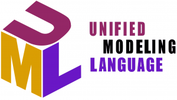
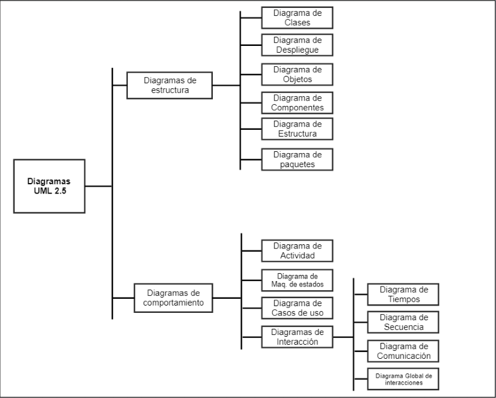

#### Ingeniería de Software

### Unidad XI

# Diseño Orientado a Objetos
Created by <i class="fab fa-telegram"></i>
[edme88]("https://t.me/edme88")

---
<!-- .slide: style="font-size: 0.60em" -->

## Temario

### Calidad del Software
* Definición
* Manejo de la calidad
* Qué es calidad?
* Compromiso de Calidad
* Actividades de manejo de calidad
* Atributos de la calidad del software
* Calidad basada en procesos
* Estándares de Software
* Importancia de los estándares
* Problemas con estándares

* ISO 9000-9001
* Certificación ISO
* Revisión
* Procedimientos de Revisión
* Revisiones de Calidad
* Tipos de Revisiones
* Inspecciones del programa
* Métricas de calidad del producto
* Suposición de métricas
* Métricas estáticas de productos de software
* Métricas Orientadas a Objetos
* Métricas de acoplamiento
* Madures de las métricas

---
### Objetos y clases
En diseño orientado a objetos, los ****objetos** representan entidades con estado (atributos) y comportamiento (métodos). 
Las **clases** son sus plantillas.

Permiten encapsulación, herencia y polimorfismo.

Facilitan el modelado del sistema basado en el mundo real.

---
### Proceso de diseño orientado a objetos
Es una metodología estructurada para desarrollar software basado en objetos. 

Generalmente sigue estos pasos:
1. **Identificación de objetos/clases:** a partir de requisitos o modelos del dominio.
2. **Definición de relaciones:** herencia, asociaciones, composición.
3. **Especificación de interfaces:** qué métodos ofrecerá cada clase.
4. **Diseño de colaboraciones:** cómo interactúan los objetos para cumplir con los casos de uso.

---
### Evolución del diseño
La evolución del diseño del software es un proceso continuo que lleva unas 6 décadas. 

Inicialmente el foco estaba en crear programas modulares y en métodos para mejorar estructuras de software.

Posteriormente propusieron un enfoque orientado a objeto para diseñar derivaciones.

----

### Evolución del diseño
Actualmente el énfasis al desarrollar software está en la arquitectura y en los patrones de diseño. 

Se pone cada vez más importancia a los métodos de desarrollo orientado al modelo y a las pruebas, con el objetivo de lograr una mejor modularidad.

----

### Evolución del diseño
Si bien se aplican varios métodos de diseño, todos estos tienen algunas características en común: 
1. Un mecanismo para traducir el modelo de requerimientos en una representación del diseño
2. Una notación para representar las componentes funcionales y sus interfaces, 
3. Una heurística para mejorar y hacer particiones
4. Lineamientos para evaluar la calidad.

---
### UML
* Siglas de "Unified Modeling Language".
* Lenguaje de modelado estándar para modelado orientado a objetos.
* Tiene numerosos tipos de diagramas, pero en la gran mayoría de sistemas se usan solo 5.
* UML puede usarse para visualizar, especificar, construir y documentar los artefactos de un sistema de software

----

### ¿Por qué UML?
* Es **sencillo**
* Es capaz de modelar todo tipo de sistemas.
* Es un lenguaje universal
* Es fácilmente extensible.
* Es visual y, por lo tanto, intuitivo.
* Es independiente del desarrollo, del lenguaje y de la plataforma.
* Bien ejecutado aporta un conjunto considerable de buenas prácticas.

----

### Consideraciones sobre UML
Los diagramas UML NO son completos. Utilizando los distintos diagramas no podemos estar seguros de comprender con 
totalidad el sistema que va a desarrollarse. 

Los diagramas, para facilitar la comprensión pueden (y suelen) omitir 
información, pueden tener partes que se entienden de distintas maneras o, incluso, pueden tener conceptos que no 
pueden ser representados por ningún diagrama.

---

---

### Diagramas UML
<!--http://www.softwero.com/2017/08/los-13-diagramas-uml-y-sus-componentes-1.html-->

### Diagramas de Estructura 

1. Diagrama de clases
2. Diagrama de Objetos
3. Diagrama de Componentes
4. Diagrama de Estructura Compuesta
5. Diagrama de Despliegue
6. Diagrama de Paquetes

### Diaramas de Comportamiento

7. Diagrama de Actividad
8. Diagrama de Casos de Uso
9. Diagrama de Máquinas de Estado
10. Diagrama de Secuencia
11. Diagrama de Comunicaciones
12. Diagrama de Tiempo
13. Diagrama de Descripción de Interacción

----

### Tipos de diagramas UML

<!-- .slide: style="font-size: 0.90em" -->
* **Diagramas de actividades:** Muestran las actividades involucradas en un proceso o en el procesamiento de datos.
* **Diagramas de casos de uso:** Muestran las interacciones entre un sistema y su entorno.
* **Diagramas de secuencia:** Muestran las interacciones entre los actores y el sistema y entre los componentes del sistema.
* **Diagramas de clases:** Muestran las clases de objetos en el sistema y las asociaciones entre estas clases.
* **Diagramas de estado:** Muestran cómo el sistema reacciona a los acontecimientos internos y externos.

---

### Perspectivas del sistema
* Una **perspectiva externa**, donde se modela el contexto o el entorno del sistema.
* Una **perspectiva de interacción**, donde se modelan las interacciones entre un sistema y su entorno, o entre los 
componentes de un sistema.
* Una **perspectiva estructural**, donde se modela la organización de un sistema o de la estructura de los datos que son 
procesados por el sistema.
* Una **perspectiva conductual**, en la que se modela el comportamiento dinámico del sistema y la forma en que responde 
a los eventos.

---
## ¿Dudas, Preguntas, Comentarios?
