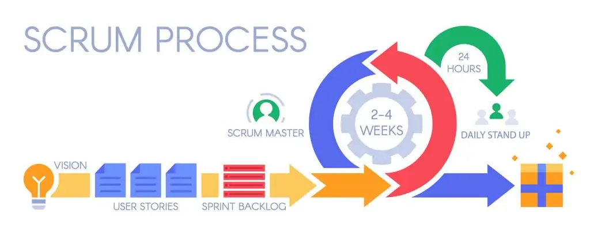
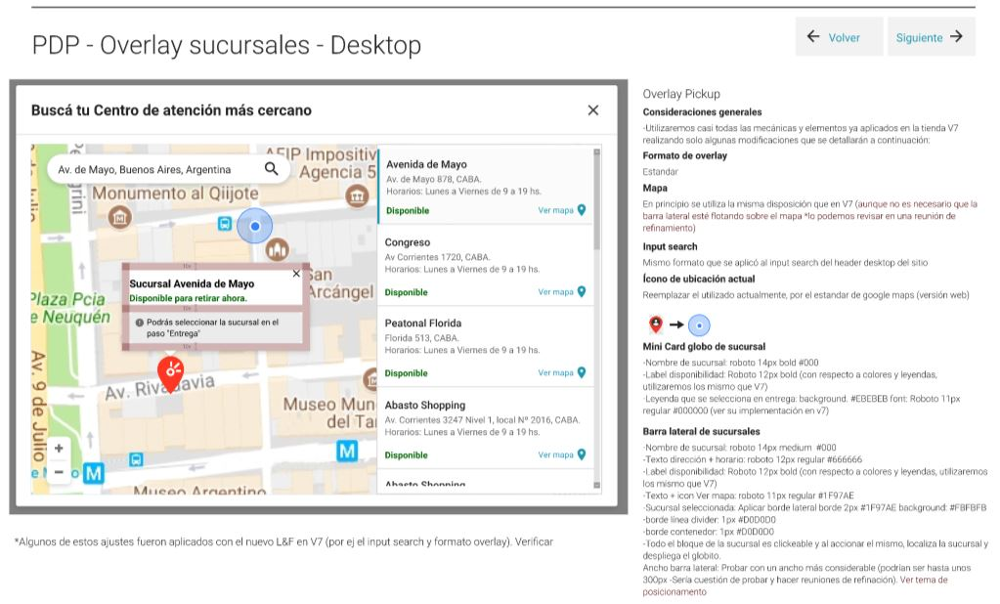
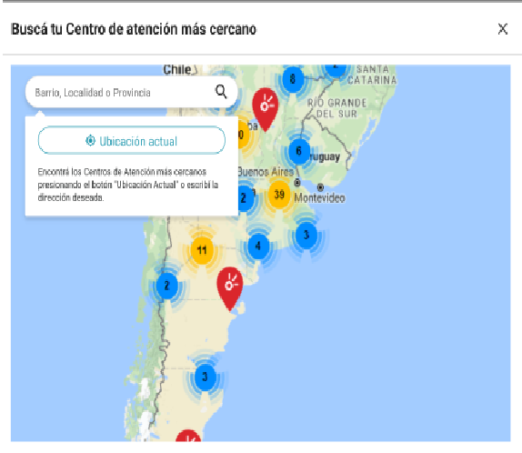
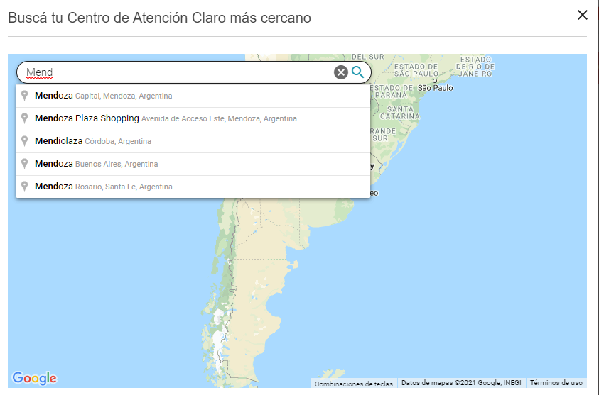
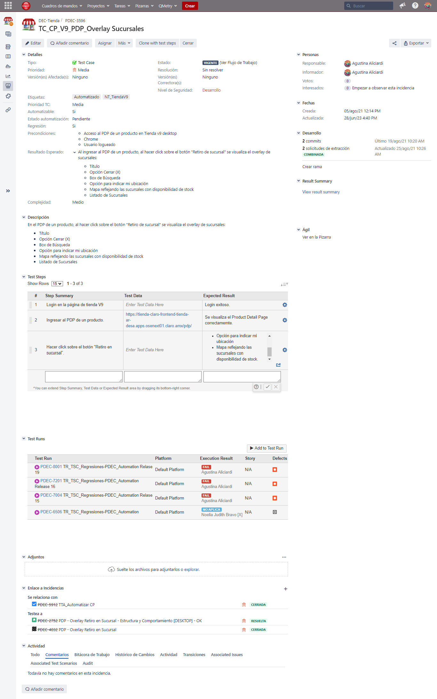

# Ingeniería de Software

## Resumen Práctico

Created by <i class="fab fa-telegram"></i>
[edme88]("https://t.me/edme88")

---

<!-- .slide: style="font-size: 0.60em" -->

## Temario

### En la práctica

- Proceso de Desarrollo
- Épicas
- Historias de Usuario
- Mejoras
- Tests

---

### Proceso de Desarrollo

---

### ÉPICAS

La épica sirve para describir y agrupar un grupo de tickets relacionados. Las épicas pueden ser
una extensa historia de usuario, que necesuta ser dividida en tareas más pequeñas las
cuales pueden ser entregadas en distintas iteraciones.
Habitualmente agrupa diversas historias de usuario.

---

### ÉPICAS

Para algunos autores...Una épica nace de una necesidad de usuario muy grande, y posiblemente
abstracta al principio. Las historias de usuario «nacerán» de esta épica. No es que las historias
se agrupen y se «asocien» en una épica. Es la épica la que genera historias.

---

---

### Diseño

Cualquiera sea el tipo de ticket, es habitual incluir un link al prototipo, para que los
desarrolladores, el área QA y todos los interesados logren comprender la funcionalidad esperada.

Link a prototipo: [Figma: Claro Tienda](https://www.figma.com/proto/h5wKQ7FzejsrPIlw9MTKEx/Tienda-Claro---Desktop-%2B-Mobile?page-id=57%3A2&node-id=195-4644)

---

### HISTORIA

Son breves requisitos o solicitudes escritas desde el punto de vista del usuario final.
Su propósito es articular cómo proporcionará una función de software valor al cliente.

---

### HISTORIA

Si bien algunos piensan que las historias "SON" los requisitos del sistema, no es así.
Ponen a los usuarios finales reales en el centro de la 'conversación', lo que impulsa la colaboración
y la creatividad y mejora el producto en general.
Las historias utilizan un lenguaje no técnico para ofrecer contexto al equipo de desarrollo.

---

### HISTORIA

Es la unidad de trabajo más pequeña en un marco de metodologías ágiles.
En el scrum, las historias de los usuarios se añaden a los sprints y se van realizando a lo largo del sprint.
Las historias de usuario ayudan a los equipos de scrum a mejorar en la estimación y planificación de sprints,
lo que conduce a un pronóstico más preciso y a una mayor agilidad.

---

### HISTORIA

---

### HISTORIA 1

---

### HISTORIA 1

---

### HISTORIA

Al escribir la historia de usuario se debe tener en cuenta:

- Definición de “Listo”
- Describe tareas o subtareas
- Perfiles de usuario
- Pasos ordenados
- Escucha el feedback
- Tiempo

---

### HISTORIA

- **Definición de “Listo”:** la historia suele estar “lista” cuando el usuario puede completar la tarea descrita,
  pero debes asegurarte de definir lo que representa completarla.
- **Describe tareas o subtareas:** decide qué pasos específicos deben completarse y quién es responsable de cada uno de ellos.
- **Perfiles de usuario:** ¿para quién? Si hay varios usuarios finales, considera crear varias historias.

---

### HISTORIA

- **Pasos ordenados:** escribe una historia para cada paso en un proceso más grande.
- **Escucha el feedback:** habla con los usuarios/clientes y capta sus problemas o necesidades en lo que dicen.
- **Tiempo:** Dado que las historias deberían completarse en un sprint, aquellas que puedan necesitar semanas o meses deberían dividirse en historias más pequeñas o considerarse un epica independiente.

---

### HISTORIA

Las historias de usuario suelen expresarse con una frase simple con la siguiente estructura:

“Como [perfil], [quiero] [para].”

---

### MEJORA

Es un tipo de incidencia/ticket que sirve para registrar nuevas características que se desean implementar en el proyecto.
Suelen estar relacionadas con la adición de nuevas funcionalidades, la optimización de características existentes o la resolución de problemas que no son críticos pero que mejorarían la calidad o la experiencia del producto.

---

### MEJORA

Estos tickets se utilizan para documentar solicitudes de cambios que no son correcciones de errores críticos, sino que representan mejoras planificadas o cambios que se desean realizar en el software. Pueden incluir detalles sobre los objetivos de la mejora, los requisitos específicos, la prioridad, la asignación a un miembro del equipo y otros metadatos relevantes.

---

### MEJORA

Distinguir entre diferentes tipos de tareas permitir una gestión más efectiva de los proyectos, ya que permite priorizar y llevar un registro de las mejoras propuestas en el software, lo que facilita la planificación y la toma de decisiones en el desarrollo del proyecto.

---

### MEJORA

---

### MEJORA

---

### MEJORA

---

### TEST CASE

---

## ¿Dudas, Preguntas, Comentarios?

