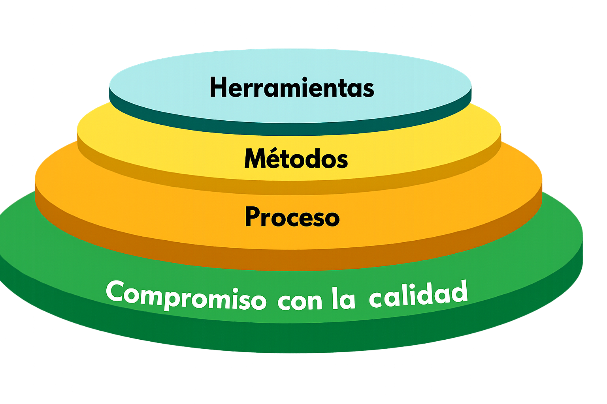
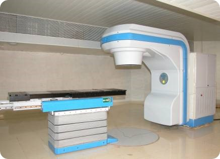
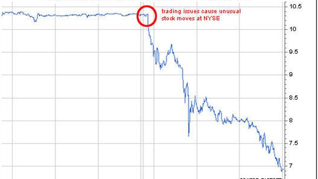
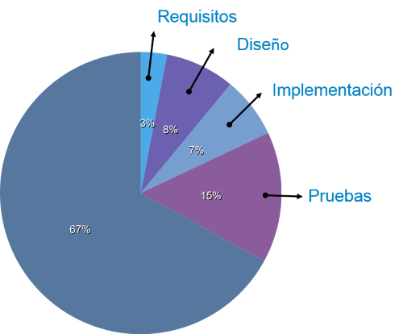
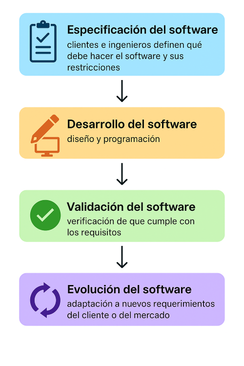

#### Ingeniería de Software

# Introducción

Created by <i class="fab fa-telegram"></i>
[edme88]("https://t.me/edme88")

---

<!-- .slide: style="font-size: 0.60em" -->

## Temario

### Ingeniería de Software

- Definición
- ¿Por qué es importante?
- Errores de Software
- Costos del software
- Productos de software
- Especificaciones del producto
- Preguntas sobre la ingeniería de Software

---

# ¿Qué es la ingeniería de Software?

## ¿Qué es el software?

---

## Software

El software es el conjunto de instrucciones, programas y datos que permiten que una computadora o dispositivo electrónico realice tareas específicas.

Es intangible y está compuesto por código que puede ser interpretado o ejecutado por una máquina.

---

## Ingenieria de Software

“La ingeniería de software es una disciplina que se enfoca en el diseño, desarrollo, prueba, implementación y mantenimiento de sistemas de software de alta calidad”. 

Para ello es necesario aplicar de manera sistemática principios, teorías, métodos y herramientas para el desarrollo de software profesional, y satisfacer las necesidades de los usuarios y las empresas.

---

### Capas de la Ingeniería de Software

---

### Ingenieria de Software. ¿Por qué es importante?

- La economía de muchos países depende en alguna medida del software.
- Cada vez más sistemas son controlados por software.
- A largo plazo, es más barato realizar una buena planificación del software en una etapa inicial, que refactorizar continuamente.
- El gasto en software representa una fracción significativa del PBI
- Los errores de software pueden ser muy caros

---

## Errores de Software

Enfocarse en la **calidad del software** permite reducir los errores y problemas que el mismo puede tener asociados. 

----

## Errores de Software
En el software, los errores son llamados bugs, debido a que en 1947 Grace Hopper encontró que las fallas del Mark II, computadora electromecánica desarrollada en Harvard, se debían a una polilla, “bug”, entre los relés.

----

## Errores de Software

- Los errores en el software son un problema común y...en muchos casos, no hay graves consecuencias,
  se soluciona con una nueva versión corregida
- EN MUCHOS OTROS CASOS PUEDE HABER CONSECUENCIAS FATALES, GRAVES O MUY CARAS.

---

## Errores de Software

Para reflexionar sobre este tema vamos a ver el siguiente video:

<blockquote class="instagram-media" data-instgrm-captioned data-instgrm-permalink="https://www.instagram.com/reel/DBzhG9jOmUx/?utm_source=ig_embed&amp;utm_campaign=loading" data-instgrm-version="14" style=" background:#FFF; border:0; border-radius:3px; box-shadow:0 0 1px 0 rgba(0,0,0,0.5),0 1px 10px 0 rgba(0,0,0,0.15); margin: 1px; max-width:540px; min-width:326px; padding:0; width:99.375%; width:-webkit-calc(100% - 2px); width:calc(100% - 2px);">
 <a href="https://www.instagram.com/reel/DBzhG9jOmUx/?utm_source=ig_embed&amp;utm_campaign=loading" style=" background:#FFFFFF; line-height:0; padding:0 0; text-align:center; text-decoration:none; width:100%;" target="_blank"> 
 

 
 

 

 
<svg width="50px" height="50px" viewBox="0 0 60 60" version="1.1" xmlns="https://www.w3.org/2000/svg" xmlns:xlink="https://www.w3.org/1999/xlink"><g stroke="none" stroke-width="1" fill="none" fill-rule="evenodd"><g transform="translate(-511.000000, -20.000000)" fill="#000000"><g><path d="M556.869,30.41 C554.814,30.41 553.148,32.076 553.148,34.131 C553.148,36.186 554.814,37.852 556.869,37.852 C558.924,37.852 560.59,36.186 560.59,34.131 C560.59,32.076 558.924,30.41 556.869,30.41 M541,60.657 C535.114,60.657 530.342,55.887 530.342,50 C530.342,44.114 535.114,39.342 541,39.342 C546.887,39.342 551.658,44.114 551.658,50 C551.658,55.887 546.887,60.657 541,60.657 M541,33.886 C532.1,33.886 524.886,41.1 524.886,50 C524.886,58.899 532.1,66.113 541,66.113 C549.9,66.113 557.115,58.899 557.115,50 C557.115,41.1 549.9,33.886 541,33.886 M565.378,62.101 C565.244,65.022 564.756,66.606 564.346,67.663 C563.803,69.06 563.154,70.057 562.106,71.106 C561.058,72.155 560.06,72.803 558.662,73.347 C557.607,73.757 556.021,74.244 553.102,74.378 C549.944,74.521 548.997,74.552 541,74.552 C533.003,74.552 532.056,74.521 528.898,74.378 C525.979,74.244 524.393,73.757 523.338,73.347 C521.94,72.803 520.942,72.155 519.894,71.106 C518.846,70.057 518.197,69.06 517.654,67.663 C517.244,66.606 516.755,65.022 516.623,62.101 C516.479,58.943 516.448,57.996 516.448,50 C516.448,42.003 516.479,41.056 516.623,37.899 C516.755,34.978 517.244,33.391 517.654,32.338 C518.197,30.938 518.846,29.942 519.894,28.894 C520.942,27.846 521.94,27.196 523.338,26.654 C524.393,26.244 525.979,25.756 528.898,25.623 C532.057,25.479 533.004,25.448 541,25.448 C548.997,25.448 549.943,25.479 553.102,25.623 C556.021,25.756 557.607,26.244 558.662,26.654 C560.06,27.196 561.058,27.846 562.106,28.894 C563.154,29.942 563.803,30.938 564.346,32.338 C564.756,33.391 565.244,34.978 565.378,37.899 C565.522,41.056 565.552,42.003 565.552,50 C565.552,57.996 565.522,58.943 565.378,62.101 M570.82,37.631 C570.674,34.438 570.167,32.258 569.425,30.349 C568.659,28.377 567.633,26.702 565.965,25.035 C564.297,23.368 562.623,22.342 560.652,21.575 C558.743,20.834 556.562,20.326 553.369,20.18 C550.169,20.033 549.148,20 541,20 C532.853,20 531.831,20.033 528.631,20.18 C525.438,20.326 523.257,20.834 521.349,21.575 C519.376,22.342 517.703,23.368 516.035,25.035 C514.368,26.702 513.342,28.377 512.574,30.349 C511.834,32.258 511.326,34.438 511.181,37.631 C511.035,40.831 511,41.851 511,50 C511,58.147 511.035,59.17 511.181,62.369 C511.326,65.562 511.834,67.743 512.574,69.651 C513.342,71.625 514.368,73.296 516.035,74.965 C517.703,76.634 519.376,77.658 521.349,78.425 C523.257,79.167 525.438,79.673 528.631,79.82 C531.831,79.965 532.853,80.001 541,80.001 C549.148,80.001 550.169,79.965 553.369,79.82 C556.562,79.673 558.743,79.167 560.652,78.425 C562.623,77.658 564.297,76.634 565.965,74.965 C567.633,73.296 568.659,71.625 569.425,69.651 C570.167,67.743 570.674,65.562 570.82,62.369 C570.966,59.17 571,58.147 571,50 C571,41.851 570.966,40.831 570.82,37.631"></path></g></g></g></svg>

 
View this post on Instagram

 

 

 

 

 

 

 

 

 

 
 

 

</a>
<a href="https://www.instagram.com/reel/DBzhG9jOmUx/?utm_source=ig_embed&amp;utm_campaign=loading" style=" color:#c9c8cd; font-family:Arial,sans-serif; font-size:14px; font-style:normal; font-weight:normal; line-height:17px; text-decoration:none;" target="_blank">A post shared by Ingeniero Binario / Programación y Sistemas (@ingenierobinario)</a>

</blockquote>

---

### Algunos "Grandes Errores" de Software...

#### LA EXPLOSIÓN DEL ARIANE 5

1000 millones de dólares perdidos

¿El problema? reutilización de código.
Se reutilizó el código del Ariane 4.
El código asignaba el valor de una variable de 64 bits a una de 16 bits.
Lo que no era un problema en el Ariane 4, destruyó el Ariane 5.

16 bits: −32.768 a 32.767

64 bits: −9.223.372.036.854.775.808 a 9.223.372.036.854.775.807

----

#### LA EXPLOSIÓN DEL ARIANE 5

<iframe width="560" height="315" src="https://www.youtube.com/embed/gp_D8r-2hwk" title="YouTube video player" frameborder="0" allow="accelerometer; autoplay; clipboard-write; encrypted-media; gyroscope; picture-in-picture; web-share" allowfullscreen></iframe>

----

### Algunos "Grandes Errores" de Software...

#### EXCESO DE RADIACIÓN EN EL THERAC-25

<!-- .slide: style="font-size: 0.80em" -->

Mato a 5 pacientes

La máquina de radiación Therac-25 aplicó un exceso de radiación a varios pacientes provocando la muerte de al menos cinco de ellos.

¿ La causa?
El control de la concurrencia de las rutinas que se ejecutaban en paralelo.

UNA clásica RACE CONDITION

Si bien la interfaz indicaba que todo iba bien, los pacientes estaban recibiendo 125 veces más radiación que lo indicado.

----

#### EXCESO DE RADIACIÓN EN EL THERAC-25

----

### Algunos "Grandes Errores" de Software...

#### MARS CLIMATE ORBITER

<!-- .slide: style="font-size: 0.80em" -->

Un error de unidades

El sistema de control de la nave en la Tierra usaba el sistema métrico anglosajón.

El sistema de navegación de la nave esperaba valores en el sistema métrico decimal.

La trayectoria de la nave se acerco a Marte y fue desintegrada por la fuerza de fricción atmosférica del planeta.

Se incumplieron los requisitos del sistema donde se especificaba que todo el software debía usar el sistema métrico decimal.

----

#### MARS CLIMATE ORBITER

----

### Algunos "Grandes Errores" de Software...

#### DESPLIEGUE DE UNA VERSIÓN INCORRECTA

<!-- .slide: style="font-size: 0.80em" -->

Mas de 400 millones de U$S perdidos en 45 minutos

El grupo Knight Capital perdió 460 millones de dólares en menos de una hora.

Se desplego una nueva versión sin modificar la configuración del algoritmo.

Hubo 4 millones de operaciones en 45 minutos

Se ejecuto en modo test, donde, para probar el comportamiento en condiciones extremas, estaban desactivadas las restricciones.
El sistema comenzó a comprar y vender acciones sin evaluar las consecuencias.

----

#### DESPLIEGUE DE UNA VERSIÓN INCORRECTA

<!-- .slide: style="font-size: 0.80em" -->

---

### Ejercicio

Construye una tabla para analizar la información obtenida y la información del video:

<table>
<thead>
<tr>
<th>Año</th>
<th>Software afectado</th>
<th>Sector</th>
<th>Causa del Error</th>
<th>Impacto</th>
</tr>
</thead>
<tbody>
<tr>
<td>1985–1987</td>
<td>Therac-25</td>
<td>Médico</td>
<td>Fallos al cambiar parámetros rápidamente</td>
<td>Al menos 5 pacientes recibieron dosis letales de radiación</td>
</tr>
<tr>
<td></td>
<td>Ariane 5</td>
<td></td>
<td></td>
<td></td>
</tr>
<tr>
<td></td>
<td>Mars Climate Orbiter</td>
<td></td>
<td></td>
<td></td>
</tr>
<tr>
<td></td>
<td>Knight Capital</td>
<td></td>
<td></td>
<td></td>
<td></td>
<td>Y2K</td>
<td></td>
<td></td>
<td></td>
</tr>
</tbody>
</table>

---

### Ejercicio

¿Qué otros escenarios catastróficos pero realistas se les ocurren que hagan que el fallo en un programa pudiera ocasionar un gran daño económico o humano?

---

### Costos del software

El costo del software suele ser mayor que el costo del hardware.

El mantenimiento del software cuesta más que el desarrollo del mismo.
Para sistemas que tienen una larga vida, los costos de mantenimiento superan ampliamente los costos de desarrollo.

La ingeniería de software tiene que ver con el desarrollo de software rentable.

----

### Costos del software

El costo de mantenimiento suele ser del **67%** del total del ciclo de desarrollo.

---

### Productos de software

<!-- .slide: style="font-size: 0.90em" -->

- **Productos genéricos**  
  Sistemas que se comercializan y venden a cualquier cliente:
  Ejemplos - Software para gráficos, herramientas de gestión de proyectos; Software CAD; software para mercados específicos
  (Sistema de turno para dentista).

- **Productos personalizados**  
  Software que encarga un cliente específico para satisfacer sus propias necesidades.
  Ejemplos - Sistema de control o monitoreo, software de control del tráfico aéreo, etc.

---

### Especificaciones del producto

- **Productos Genéricos**  
  La especificación de lo que el software debe hacer es propiedad del desarrollador del software y las decisiones sobre
  los cambios en el software son hechas por el desarrollador.

- **Productos personalizados**  
  La especificación de lo que el software debe hacer es propiedad del cliente del software y el es el que toma decisiones
  sobre los cambios de software necesarios.

----

### Ejercicio

Nombre ejemplos de software que sean **productos genéricos** y software que sean **productos personalizados**.

----

### Ejercicio

Clasifica los siguientes productos de software en:
- **Producto genérico:** desarrollado para un público amplio, con funcionalidades estándar.
- **Producto personalizado:** desarrollado específicamente para una organización, empresa o necesidad concreta.

----

<!-- .slide: style="font-size: 0.70em" -->
Listado de software para clasificar:
1. Microsoft Word
2. App de gestión para una clínica veterinaria local
3. Canva
4. Sistema de reservas de vuelos de Aerolíneas Argentinas
5. Spotify
6. Aplicación web para controlar el inventario de un supermercado de barrio
7. WhatsApp
8. Plataforma Moodle personalizada para una universidad
9. Google Chrome
10. Software hecho a medida para controlar el ingreso al gimnasio
11. Mercado Libre
12. Sistema de facturación hecho por un programador freelance para un taller mecánico
13. Adobe Photoshop
14. Aplicación de pedidos interna para una cadena de restaurantes
15. Excel

---

### Diferentes disciplinas

En el desarrollo de software intervienen distintas disciplinas que, aunque todas relacionadas, tienen enfoques y objetivos específicos.

- Ciencias de la computación
- Ingeniería de software
- Ingeniería de sistemas

----

### Diferentes disciplinas
<!-- .slide: style="font-size: 0.80em" -->
- **Ciencias de la computación:** Se enfocan en teoría y fundamentos de la computación (algoritmos, estructuras de datos, complejidad, etc).

- **Ingeniería de software:** Se ocupa de todos los aspectos de la producción de software desde las etapas iniciales de la especificación del sistema hasta el mantenimiento del mismo después de que haya entrado en uso.

- **Ingeniería de sistemas:** Se ocupa del desarrollo completo de sistemas basados en computadoras, integrando hardware, software y procesos. 

---

### Ingeniería de software

- Disciplina de Ingeniería  
  El uso de las teorías y los métodos adecuados para resolver los problemas teniendo en cuenta las limitaciones financieras y de organización.

- Todos los aspectos de la producción de software  
  No sólo el proceso técnico de desarrollo. También la gestión de proyectos y el desarrollo de herramientas, métodos, etc. para apoyar la producción de software.

---

### Importancia de la ingeniería de software

<!-- .slide: style="font-size: 0.90em" -->

- Cada vez más personas y la sociedad en general dependen de sistemas de software avanzados. Tenemos que ser capaces de
  producir sistemas fiables de manera económica y rápida.

- Por lo general es más barato, en el largo plazo, el uso de métodos de ingeniería de software y técnicas para los
  sistemas de software en lugar de escribir los programas como si fuera un proyecto de programación personal.

- La mayor parte de los costos corresponde a los costos de corregir el software después de que ha entrado en uso.

----

### Ejercicio

Piensen en ejemplos tanto positivos como negativos del impacto del software en la socidad.

---

### Diversidad en la ingeniería de software
Hay muchos tipos diferentes de sistemas de software y no existe un conjunto universal de las técnicas de software que sea aplicable a todas ellas.

Los **métodos** de ingeniería de software y las **herramientas** que se utilizan dependen del tipo de aplicación que se está desarrollando, los requisitos del cliente y los antecedentes del equipo de desarrollo. 

----

### Diversidad en la ingeniería de software
<!-- .slide: style="font-size: 0.80em" -->
Si bien todo proyecto de software debe **gestionarse y desarrollarse** de manera profesional, existen diferentes técnicas que son adecuadas para distintos tipos de sistema. 

Por ejemplo, los juegos siempre deben diseñarse usando una serie de prototipos, mientras que los sistemas críticos de control de seguridad requieren de una especificación completa y analizable para su desarrollo. 

No puede decirse que un método sea mejor que otro. La elección del método de gestión y desarrollo depende del tipo de software que se debe contruir.

----

### Tipos de aplicaciones

- Aplicaciones autónomas
- Aplicaciones basadas en transacciones interactivas
- Sistemas embebidos o de control
- Sistemas de procesamiento por lotes
- Sistemas de entretenimiento
- Sistemas para el modelado y simulación
- Sistemas de adquisición de datos
- Sistemas de sistemas

----

### Tipos de aplicaciones

<!-- .slide: style="font-size: 0.80em" -->

- **Aplicaciones autónomas**  
  Estos son los sistemas de aplicación que se ejecutan en un equipo local, como un PC. Incluyen toda la funcionalidad
  necesaria y no es necesario estar conectado a una red.

- **Aplicaciones basadas en transacciones interactivas**  
  Las aplicaciones que se ejecutan en un equipo remoto y se puede acceder por los usuarios desde sus propios ordenadores
  o terminales. Esto incluye aplicaciones web.

- **Sistemas embebidos o de control**  
  Se trata de sistemas de software que controlan y gestionan dispositivos de hardware. Su número es superior a cualquier
  otro tipo de sistema.

----

### Tipos de aplicaciones

<!-- .slide: style="font-size: 0.80em" -->

- **Sistemas de procesamiento por lotes**  
  Estos son que están diseñados para procesar los datos en grandes lotes. Procesan un gran número de entradas individuales
  para crear salidas correspondientes.

- **Sistemas de entretenimiento**  
  Se trata de sistemas que son principalmente para su uso personal y que están destinados a entretener al usuario.

- **Sistemas para el modelado y simulación**  
  Se trata de sistemas cuyo objetivo es modelar procesos físicos donde distintas entidades interactúan entre si.

----

### Tipos de aplicaciones

- **Sistemas de adquisición de datos**
  Se trata de sistemas que recopilan datos de su entorno utilizando un conjunto de sensores y envían estos datos a otros
  sistemas para el procesamiento.

- **Sistemas de sistemas**
  Estos son sistemas que están compuestos de un número de otros sistemas de software.

----

### Ejercicio

Nombre ejemplos específicos de cada uno de los tipos de aplicaciones:
  - Aplicaciones autónomas
  - Aplicaciones basadas en transacciones interactivas
  - Sistemas embebidos o de control
  - Sistemas de procesamiento por lotes
  - Sistemas de entretenimiento
  - Sistemas para el modelado y simulación
  - Sistemas de adquisición de datos
  - Sistemas de sistemas

---

### Actividades

Tareas que se deben llevar a cabo en el proceso de desarrollo:

1. **Especificación del software:** clientes e ingenieros definen qué debe hacer el software y sus restricciones.
2. **Desarrollo del software:** diseño y programación.
3. **Validación del software:** verificación de que cumple con los requisitos.
4. **Evolución del software:** adaptación a nuevos requerimientos del cliente o del mercado.

----

---

### Atributos esenciales de un buen software

 Un buen software debe reunir ciertas cualidades fundamentales que garanticen su utilidad,calidad y sostenibilidad a lo largo del tiempo. 
 
 Los atributos esenciales de un buen software son:

- Mantenimiento
- Confiabilidad y seguridad
- Eficiencia
- Aceptabilidad

----

### Atributos esenciales de un buen software

<!-- .slide: style="font-size: 0.80em" -->

- **Mantenimiento:** El software debe escribirse de tal forma que pueda evolucionar para satisfacer las necesidades cambiantes de los clientes. Éste es un atributo crítico porque el cambio del software es un requerimiento inevitable de un entorno empresarial variable.

- **Confiabilidad y seguridad:** La confiabilidad del software implica su capacidad para funcionar correctamente sin fallos graves. La seguridad asegura que usuarios malintencionados no puedan acceder o dañar el sistema.

----

### Atributos esenciales de un buen software

<!-- .slide: style="font-size: 0.80em" -->

- **Eficiencia:** El software debe optimizar el uso de los recursos del sistema, como la memoria y los ciclos del procesador. Por lo tanto, la eficiencia incluye la capacidad de respuesta, el tiempo de procesamiento, la utilización de la memoria, etc.

- **Aceptabilidad:** El software debe ser aceptable para el tipo de usuario para el que está diseñado. Esto significa que debe ser comprensible, utilizable y compatible con otros sistemas que utilizan.

----

### Ejercicio

¿Da ejemplos positivos o negativos donde se vea claramente la presencia o ausencia muy marcada de los atributos escenciales de un buen software?
- Mantenimiento
- Confiabilidad y seguridad
- Eficiencia
- Aceptabilidad

----

### Ejercicios

A continuación, se presentan distintas situaciones relacionadas con programas o sistemas de uso común.
Identificar qué atributo esencial del software está en juego en cada caso.

----

🔍 Situaciones:
<!-- .slide: style="font-size: 0.70em" -->
1. Un software de facturación permite incorporar fácilmente nuevas reglas impositivas cada vez que cambia la ley.
2. Una app de transferencias bancarias muestra errores inesperados al confirmar montos y algunas veces duplica pagos.
3. Una página web de inscripción a becas funciona rápido y consume pocos recursos del navegador.
4. Un sistema educativo online no se adapta bien a dispositivos móviles y muchos usuarios lo consideran difícil de usar.
5. Un programa que gestiona turnos médicos incluye copias de seguridad automáticas y encriptación de los datos.
6. Una empresa cambia su sistema contable y el nuevo software se adapta fácilmente a sus procesos sin necesidad de rehacer todo.
7. Un videojuego popular recibe constantes actualizaciones para corregir errores y agregar contenido.
8. Una app de mensajería encripta los mensajes y solo permite el acceso con doble autenticación.

<!--
N°	Atributo
1	Mantenimiento
2	Confiabilidad
3	Eficiencia
4	Aceptabilidad
5	Seguridad
6	Mantenimiento
7	Mantenimiento
8	Seguridad
-->

---

### Detalles que afectan el desarrollo del software

<!-- .slide: style="font-size: 0.80em" -->

- **Heterogeneidad**  
  Cada vez con mayor frecuencia se requieren sistemas que operen como sistemas distribuidos a través de redes que incluyan
  diferentes tipos de computadoras y dispositivos móviles.

- **Cambio empresarial y social**  
  Los negocios y la sociedad cambian de manera rápida, conforme se desarrollan las economías emergentes y nuevas
  tecnologías están a la disposición. Ambos necesitan tener la posibilidad de cambiar su software existente y desarrollar
  rápidamente uno nuevo.

- **Seguridad y confianza**  
  Dado que el software está vinculado con todos los aspectos de la vida, es esencial confiar en dicho software

---

### Fundamentos de la ingeniería de software

<!-- .slide: style="font-size: 0.80em" -->

Algunos principios se aplican a todos los tipos de sistema de software:
- **Proceso controlado:** Los sistemas deben desarrollarse mediante un proceso dirigido y comprendido.
- **Fiabilidad y rendimiento:** Son esenciales en todo tipo de sistema.
- **Gestión de requisitos:** Entender y administrar correctamente lo que el software debe hacer es clave.
- **Reutilización:** Siempre que sea posible, se deben reutilizar componentes de software existentes en lugar de desarrollarlos desde cero.

---

### La ingeniería de software y la web

La Web es hoy una plataforma estándar y las organizaciones están utilizando cada vez más los sistemas basados en la web en lugar de los sistemas locales.

En este modelo, conocido como SaaS (Software as a Service), las aplicaciones se ejecutan de forma remota en la 'nube', y los usuarios pagan por el acceso y el uso del software en lugar de comprarlo de manera tradicional. Algunos ejemplos de SaaS son Gmail, Google Drive o Netflix.

----

### La ingeniería de software y la web

- **Reutilización de software:** Se diseña a partir de componentes y sistemas de software pre-existentes.

- **Desarrollo y entrega incremental:** en general no es práctico especificar todos los requisitos para este tipo de sistemas con anticipación.

Las **interfaces** de usuario dependen de las capacidades de los navegadores web.

---

### Diseño de sistemas

Es el proceso de definición global de un sistema, que contempla:
- Arquitectura
- Módulos
- Interfaces
- Datos 
para satisfacer requisitos específicos de los usuarios.

Este proceso busca garantizar que el sistema sea eficiente, escalable y mantenible a lo largo del tiempo.

----

### Diseño de sistemas: Arquitectura
La **arquitectura** de sistemas se refiere al diseño de alto nivel que define cómo interactúan los diferentes componentes de un sistema, incluyendo hardware, software, redes y bases de datos, para lograr un objetivo común.

- Una arquitectura bien diseñada debe:
- Responder a los requerimientos del sistema.
- Asegurar la eficiencia en el uso de recursos.
- Permitir la escalabilidad para adaptarse a futuros cambios.
- Facilitar la mantenibilidad del sistema.

----

### Diseño de sistemas: Arquitectura
El diseño arquitectónico debe estar siempre basado en los requerimientos funcionales y no funcionales que expresan las necesidades del usuario.

Para simplificar y mejorar el proceso de diseño, se utiliza el modelado de sistemas. 

----

### Diseño de sistemas: Modelado
<!-- .slide: style="font-size: 0.80em" -->
El modelado consiste en la creación de modelos abstractos que representan diferentes perspectivas del sistema, ayudando a comprender su estructura y comportamiento.

Generalmente, estos modelos se expresan mediante notaciones gráficas, siendo el Lenguaje Unificado de Modelado (UML) uno de los estándares más utilizados.

El modelado de sistemas cumple dos funciones esenciales:
- Ayuda a los analistas y diseñadores a comprender la funcionalidad del sistema.
- Sirve como medio de comunicación efectivo con los clientes y usuarios.

---

### Atributos de Calidad en el Diseño de Sistemas
Durante el diseño, es fundamental considerar ciertos atributos de calidad que impactarán en la confiabilidad y desempeño del sistema:

- Confiabilidad
- Disponibilidad
- Seguridad
- Protección

Un diseño de sistemas exitoso debe equilibrar estos atributos para construir soluciones robustas, seguras y adaptables.

----

### Atributos de Calidad en el Diseño de Sistemas
- **Confiabilidad:** Es la probabilidad de que el sistema funcione correctamente y sin errores durante un período de tiempo determinado en un entorno específico.
- **Disponibilidad:** Representa la capacidad del sistema para estar operativo y accesible cuando los usuarios lo necesitan, minimizando interrupciones o tiempos de inactividad.

----

### Atributos de Calidad en el Diseño de Sistemas
- **Seguridad:** Consiste en proteger el sistema frente a amenazas externas y garantizar su resistencia ante ataques cibernéticos. La seguridad debe ser considerada a lo largo de todo el ciclo de vida del software, desde los requisitos hasta el mantenimiento.
- **Protección:** Se refiere a salvaguardar la propiedad intelectual del software, proteger información confidencial y prevenir copias o accesos no autorizados.

---
### Diferencias: Atributos del software y del diseño
Los **atributos esenciales** están más ligados a la experiencia del usuario y a lo que se espera del software terminado.

Los **atributos de calidad** del diseño están más relacionados con la estructura interna del sistema, facilitando su evolución, mantenimiento y escalabilidad.

----

### Ejercicio

¿Da ejemplos positivos o negativos donde se vea claramente la presencia o ausencia muy marcada de los atributos de calidad de un software?
- Confiabilidad
- Disponibilidad
- Seguridad
- Protección

----

#### Ejercicio

A continuación, se presentan diferentes situaciones relacionadas con el diseño de un sistema informático.
Identificar qué atributo de calidad se ve más involucrado en cada caso (confiabilidad, disponibilidad, seguridad o protección).

----

🔍 Situaciones:
<!-- .slide: style="font-size: 0.75em" -->
1. Una app de home banking presenta fallos cada vez que los usuarios intentan hacer transferencias por la noche.
2. Un sistema de turnos online para un hospital permanece caído durante más de 3 horas, sin notificaciones a los usuarios.
3. Un sitio de comercio electrónico cifra los datos de tarjeta de crédito antes de enviarlos al servidor.
4. Un sistema bloquea automáticamente a un usuario tras 3 intentos fallidos de inicio de sesión.
5. Una empresa pierde datos de clientes tras una caída inesperada del sistema y no tiene respaldo actualizado.
6. Una app de mensajería implementa doble autenticación para ingresar desde un nuevo dispositivo.
7. Una plataforma de streaming funciona bien, pero se desconecta cada vez que hay muchos usuarios conectados al mismo tiempo.
8. En una empresa, los usuarios solo pueden acceder a las secciones del sistema correspondientes a su rol.

<!--
N°	Atributo	Justificación breve
1	Confiabilidad	La app falla en una función clave (transferencias).
2	Disponibilidad	El sistema no está operativo por varias horas.
3	Seguridad	Se protege la información sensible con cifrado.
4	Protección	Se limita el acceso tras intentos fallidos.
5	Confiabilidad	No hay respaldo ante una falla, lo que afecta la confianza del sistema.
6	Seguridad	Se protege el acceso con doble autenticación.
7	Disponibilidad	El sistema no soporta alta demanda de usuarios.
8	Protección	Se restringe el acceso según el rol del usuario.
-->

---

## ¿Dudas, Preguntas, Comentarios?

