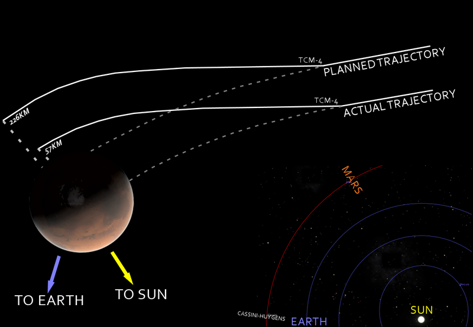

#### Ingeniería de Software

# Introducción

Created by <i class="fab fa-telegram"></i>
[edme88]("https://t.me/edme88")

---

<!-- .slide: style="font-size: 0.60em" -->

## Temario

### Ingeniería de Software

- Definición
- ¿Por qué es importante?
- Errores de Software
- Costos del software
- Productos de software
- Especificaciones del producto
- Preguntas sobre la ingeniería de Software

---

## Libros:

“Ingeniería del Software: Un enfoque práctico 7ma ed.” de Roger Pressman

---

## Ingenieria de Software

La ingeniería de software aplica teorías, métodos y herramientas para el desarrollo de software profesional.

---

## Ingenieria de Software. ¿Por qué es importante?

- La economía de muchos países depende en alguna medida del software.
- Cada vez más sistemas son controlados por software.
- El gasto en software representa una fracción significativa del PBI
- Los errores de software pueden ser muy caros

---

## Errores de Software

El primer “bug”, una polilla entre los relés del Mark II en 1947.

----

## Errores de Software

- Los errores en el software son un problema común y...en muchos casos, no hay graves consecuencias,
  se soluciona con una nueva versión corregida
- EN MUCHOS OTROS CASOS PUEDE HABER CONSECUENCIAS FATALES, GRAVES O MUY CARAS.

---

### Algunos "Grandes Errores" de Software...

#### LA EXPLOSIÓN DEL ARIANE 5

1000 millones de dólares perdidos

¿El problema? reutilización de código.
Se reutilizó el código del Ariane 4.
El código asignaba el valor de una variable de 64 bits a una de 16 bits.
Lo que no era un problema en el Ariane 4, destruyó el Ariane 5.

16 bits: −32.768 a 32.767

64 bits: −9.223.372.036.854.775.808 a 9.223.372.036.854.775.807

----

#### LA EXPLOSIÓN DEL ARIANE 5

<iframe width="560" height="315" src="https://www.youtube.com/embed/gp_D8r-2hwk" title="YouTube video player" frameborder="0" allow="accelerometer; autoplay; clipboard-write; encrypted-media; gyroscope; picture-in-picture; web-share" allowfullscreen></iframe>

----

### Algunos "Grandes Errores" de Software...

#### EXCESO DE RADIACIÓN EN EL THERAC-25

<!-- .slide: style="font-size: 0.80em" -->

Mato a 5 pacientes

La máquina de radiación Therac-25 aplicó un exceso de radiación a varios pacientes provocando la muerte de al menos cinco de ellos.

¿ La causa?
El control de la concurrencia de las rutinas que se ejecutaban en paralelo.

UNA clásica RACE CONDITION

Si bien la interfaz indicaba que todo iba bien, los pacientes estaban recibiendo 125 veces más radiación que lo indicado.

----

#### EXCESO DE RADIACIÓN EN EL THERAC-25

----

### Algunos "Grandes Errores" de Software...

#### MARS CLIMATE ORBITER

<!-- .slide: style="font-size: 0.80em" -->

Un error de unidades

El sistema de control de la nave en la Tierra usaba el sistema métrico anglosajón.

El sistema de navegación de la nave esperaba valores en el sistema métrico decimal.

La trayectoria de la nave se acerco a Marte y fue desintegrada por la fuerza de fricción atmosférica del planeta.

Se incumplieron los requisitos del sistema donde se especificaba que todo el software debía usar el sistema métrico decimal.

----

#### MARS CLIMATE ORBITER

----

### Algunos "Grandes Errores" de Software...

#### DESPLIEGUE DE UNA VERSIÓN INCORRECTA

<!-- .slide: style="font-size: 0.80em" -->

Mas de 400 millones de U$S perdidos en 45 minutos

El grupo Knight Capital perdió 460 millones de dólares en menos de una hora.

Se desplego una nueva versión sin modificar la configuración del algoritmo.

Hubo 4 millones de operaciones en 45 minutos

Se ejecuto en modo test, donde, para probar el comportamiento en condiciones extremas, estaban desactivadas las restricciones.
El sistema comenzó a comprar y vender acciones sin evaluar las consecuencias.

----

#### DESPLIEGUE DE UNA VERSIÓN INCORRECTA

<!-- .slide: style="font-size: 0.80em" -->

---

### Ejercicio

¿Qué otros escenarios catastróficos pero realistas se les ocurren que hagan que el fallo en un programa pudiera ocasionar un gran daño económico o humano?

---

### Costos del software

El costo del software suele ser mayor que el costo del hardware.

El mantenimiento del software cuesta más que el desarrollo del mismo.
Para sistemas que tienen una larga vida, los costos de mantenimiento superan ampliamente los costos de desarrollo.

La ingeniería de software tiene que ver con el desarrollo de software rentable.

----

### Costos del software

El costo de mantenimiento suele ser del **67%** del total del ciclo de desarrollo.

---

### Productos de software

<!-- .slide: style="font-size: 0.90em" -->

- **Productos genéricos**  
  Sistemas que se comercializan y venden a cualquier cliente:
  Ejemplos - Software para gráficos, herramientas de gestión de proyectos; Software CAD; software para mercados específicos
  (Sistema de turno para dentista).

- **Productos personalizados**  
  Software que encarga un cliente específico para satisfacer sus propias necesidades.
  Ejemplos - Sistema de control o monitoreo, software de control del tráfico aéreo, etc.

---

### Especificaciones del producto

- **Productos Genéricos**  
  La especificación de lo que el software debe hacer es propiedad del desarrollador del software y las decisiones sobre
  los cambios en el software son hechas por el desarrollador.

- **Productos personalizados**  
  La especificación de lo que el software debe hacer es propiedad del cliente del software y el es el que toma decisiones
  sobre los cambios de software necesarios.

----

### Ejercicio

Nombre ejemplos de software que sean **productos genéricos** y software que sean **productos personalizados**.

---

### Preguntas sobre la ingeniería de Software

<!-- .slide: style="font-size: 0.80em" -->

- **¿Qué es software?**  
  Programas de cómputo y documentación asociada.
  Los productos de software se desarrollan para un cliente en particular o para un mercado general.

- **¿Cuáles son los atributos del buen software?**  
  El buen software debe entregar al usuario la funcionalidad y el desempeño requeridos, y debe ser sustentable, confiable y utilizable.

----

### Preguntas sobre la ingeniería de Software

- **¿Qué es ingeniería de Software?**  
  La ingeneiría de software es una disciplina de la ingeniería que se interesa por todos los aspectos de la producción de software.

- **¿Cuáles son las actividades fundamentales de la ingeniería de software?**  
  Especificación, desarrollo, validación y evolución del software.

----

### Preguntas sobre la ingeniería de Software

<!-- .slide: style="font-size: 0.80em" -->

- **¿Cuál es la diferencia entre ingeniería de software y ciencias de la computación?**  
  Las ciencias de la computación se enfocan en teoría y fundamentos; mientras la ingeniería de software se enfoca en el
  sentido práctico del desarrollo y en la distribución de software.

- **¿Cuál es la diferencia entre ingeniería de software e ingeniería de Sistemas?**  
  La ingeniería de sistemas se interesa por todos los aspectos del desarrollo de sistemas basados en computadoras, incluidos
  hardware, software e ingeniería de procesos. La ingeniería de software es parte de este proceso más general.

----

### Preguntas sobre la ingeniería de Software

<!-- .slide: style="font-size: 0.80em" -->

- **¿Cuáles son los principales retos que enfrenta la ingeniería de software?**  
  Tiempos de distribución limitados y desarrollo de software confiable.

- **¿Cuáles son los costos de la ingeniería de software?**
  Aproximadamente 60% de los costos del software son de desarrollo, y 40% de prueba. Para el software elaborado específicamente,
  los costos de evolución superan con frecuencua los costos de desarrollo.

----

### Preguntas sobre la ingeniería de Software

<!-- .slide: style="font-size: 0.70em" -->

- **¿Cuáles son los mejores métodos y técnicas de la ingeniería de software?**  
  Aún cuando todos los proyectos de software deben gestionarse y desarrollarse de manera profesional, existen diferentes
  técnicas que son adecuadas para distintos tipos de sistema. Por ejemplo, los juegos siempre deben diseñarse usando una
  serie de prototipos, mientras que los sistemas críticos de control de seguridad requieren de una especificación completa
  y analizable para su desarrollo. Por lo tanto, no puede decirse que un método sea mejor que otro.

- **¿Qué diferencias ha marcado la Web a la ingeniería de software?**  
  La Web ha llevado a la disponibilidad de servicios de software y a la posibilidad de desarrollar sistemas basados en
  servicios distribuidos ampliamente. El desarrollo de sistemas basados en Web ha conducido a importantes avances en
  lenguajes de programación y reutilización de software.

---

### Atributos esenciales de un buen software

- Mantenimiento
- Confiabilidad y seguridad
- Eficiencia
- Aceptabilidad

----

### Atributos esenciales de un buen software

<!-- .slide: style="font-size: 0.80em" -->

- **Mantenimiento:** El software debe escribirse de tal forma que pueda evolucionar para satisfacer las necesidades
  cambiantes de los clientes. Éste es un atributo crítico porque el cambio del software es un requerimiento inevitable de
  un entorno empresarial variable.

- **Confiabilidad y seguridad:** La confiabilidad del software incluye una variedad de características incluyendo
  confiabilidad y seguridad. El software fiable no debe causar daño físico o económico en caso de fallo del sistema.
  Los usuarios malintencionados no deben poder acceder o dañar el sistema.

----

### Atributos esenciales de un buen software

<!-- .slide: style="font-size: 0.80em" -->

- **Eficiencia:** El software debe optimizar el uso de los recursos del sistema, como la memoria y los ciclos del
  procesador. Por lo tanto, la eficiencia incluye la capacidad de respuesta, el tiempo de procesamiento, la utilización de
  la memoria, etc.

- **Aceptabilidad:** El software debe ser aceptable para el tipo de usuario para el que está diseñado. Esto significa
  que debe ser comprensible, utilizable y compatible con otros sistemas que utilizan.

---

### Ingeniería de software

<!-- .slide: style="font-size: 0.80em" -->

- La ingeniería de software es una disciplina de la ingeniería que se ocupa de todos los aspectos de la producción de
  software desde las etapas iniciales de la especificación del sistema hasta el mantenimiento del sistema después de que
  haya entrado en uso.

- Disciplina de Ingeniería  
  El uso de las teorías y los métodos adecuados para resolver los problemas teniendo en cuenta las limitaciones financieras y de organización.

- Todos los aspectos de la producción de software  
  No sólo el proceso técnico de desarrollo. También la gestión de proyectos y el desarrollo de herramientas, métodos, etc. para apoyar la producción de software.

---

### Importancia de la ingeniería de software

<!-- .slide: style="font-size: 0.90em" -->

- Cada vez más personas y la sociedad en general dependen de sistemas de software avanzados. Tenemos que ser capaces de
  producir sistemas fiables de manera económica y rápida.

- Por lo general es más barato, en el largo plazo, el uso de métodos de ingeniería de software y técnicas para los
  sistemas de software en lugar de escribir los programas como si fuera un proyecto de programación personal.

- La mayor parte de los costos corresponde a los costos de corregir el software después de que ha entrado en uso.

----

### Ejercicio

Piensen en ejemplos tanto positivos como negativos del impacto del software en la socidad.

---

### Actividades del proceso de software

<!-- .slide: style="font-size: 0.90em" -->

- **Especificación del software**, donde clientes e ingenieros definen el software que se producirá y las restricciones
  en su operación.

- **Desarrollo del software**, donde se diseña y programa el software.

- **Validación del software**, donde se verifica el software para asegurar que sea lo que el cliente requiere.

- **Evolución del software**, donde se modifica el software para reflejar los requerimientos cambiantes del cliente y del mercado.

---

### Detalles generales que afectan la mayoría del software

<!-- .slide: style="font-size: 0.80em" -->

- **Heterogeneidad**  
  Cada vez con mayor frecuencia se requieren sistemas que operen como sistemas distribuidos a través de redes que incluyan
  diferentes tipos de computadoras y dispositivos móviles.

- **Cambio empresarial y social**  
  Los negocios y la sociedad cambian de manera rápida, conforme se desarrollan las economías emergentes y nuevas
  tecnologías están a la disposición. Ambos necesitan tener la posibilidad de cambiar su software existente y desarrollar
  rápidamente uno nuevo.

- **Seguridad y confianza**  
  Dado que el software está vinculado con todos los aspectos de la vida, es esencial confiar en dicho software

---

### Diversidad de ingeniería de software

Hay muchos tipos diferentes de sistemas de software y no existe un conjunto universal de las técnicas de software que
sea aplicable a todas ellas.

Los métodos de ingeniería de software y las herramientas que se utilizan dependen del tipo de aplicación que se está
desarrollando, los requisitos del cliente y los antecedentes del equipo de desarrollo.

---

### Tipos de aplicaciones

- Aplicaciones autónomas
- Aplicaciones basadas en transacciones interactivas
- Sistemas embebidos o de control
- Sistemas de procesamiento por lotes
- Sistemas de entretenimiento
- Sistemas para el modelado y simulación
- Sistemas de adquisición de datos
- Sistemas de sistemas

----

### Tipos de aplicaciones

<!-- .slide: style="font-size: 0.80em" -->

- **Aplicaciones autónomas**  
  Estos son los sistemas de aplicación que se ejecutan en un equipo local, como un PC. Incluyen toda la funcionalidad
  necesaria y no es necesario estar conectado a una red.

- **Aplicaciones basadas en transacciones interactivas**  
  Las aplicaciones que se ejecutan en un equipo remoto y se puede acceder por los usuarios desde sus propios ordenadores
  o terminales. Esto incluye aplicaciones web.

- **Sistemas embebidos o de control**  
  Se trata de sistemas de software que controlan y gestionan dispositivos de hardware. Su número es superior a cualquier
  otro tipo de sistema.

----

### Tipos de aplicaciones

<!-- .slide: style="font-size: 0.80em" -->

- **Sistemas de procesamiento por lotes**  
  Estos son que están diseñados para procesar los datos en grandes lotes. Procesan un gran número de entradas individuales
  para crear salidas correspondientes.

- **Sistemas de entretenimiento**  
  Se trata de sistemas que son principalmente para su uso personal y que están destinados a entretener al usuario.

- **Sistemas para el modelado y simulación**  
  Se trata de sistemas cuyo objetivo es modelar procesos físicos donde distintas entidades interactúan entre si.

----

### Tipos de aplicaciones

- **Sistemas de adquisición de datos**
  Se trata de sistemas que recopilan datos de su entorno utilizando un conjunto de sensores y envían estos datos a otros
  sistemas para el procesamiento.

- **Sistemas de sistemas**
  Estos son sistemas que están compuestos de un número de otros sistemas de software.

----

### Ejercicio

Nombre ejemplos específicos de cada uno de los tipos de aplicaciones:
  - Aplicaciones autónomas
  - Aplicaciones basadas en transacciones interactivas
  - Sistemas embebidos o de control
  - Sistemas de procesamiento por lotes
  - Sistemas de entretenimiento
  - Sistemas para el modelado y simulación
  - Sistemas de adquisición de datos
  - Sistemas de sistemas

---

### Fundamentos de la ingeniería de software

<!-- .slide: style="font-size: 0.80em" -->

Algunos principios fundamentales se aplican a todos los tipos de sistema de software, con independencia de las técnicas
de desarrollo utilizados:

- Los sistemas deben ser desarrollados mediante un proceso de desarrollo dirigido y entendido. Diferentes procesos se
  utilizan para diferentes tipos de software.
- La fiabilidad y el rendimiento son importantes para todos los tipos de sistema.
- La comprensión y la gestión de la especificación de requisitos de software y (lo que el software debe hacer) son fundamentales.
- Siempre que sea posible reutilizar el software ya creado en lugar de desarrollar uno nuevo.

---

### La ingeniería de software y la web

La Web es hoy una plataforma estándar y las organizaciones están utilizando cada vez más los sistemas basados en la web
en lugar de los sistemas locales.

El enfoque SaS (Software as Service) esta cada vez mas difundido. Las aplicaciones se ejecutan de forma remota en la
"nube". Los usuarios no compran software pagan en función del uso.

----

### La ingeniería de software y la web

Reutilización de software: es dominante para la construcción de sistemas basados en la web. Se diseña a partir de
componentes y sistemas de software pre-existentes.

Desarrollo y entrega incremental: en general no es práctico especificar todos los requisitos para este tipo de sistemas
con anticipación.

Las interfaces de usuario dependen de las capacidades de los navegadores web.

---

### Puntos clave

<!-- .slide: style="font-size: 0.90em" -->

- La ingeniería de software es una disciplina de ingeniería que se interesa por todos los aspectos de la producción de software.
- Los atributos esenciales de los productos de software son mantenimiento, confiabilidad, seguridad, eficiencia y aceptabilidad.
- Las actividades de alto nivel de especificación, desarrollo, validación y evolución son parte de todos los procesos de software.
- Las nociones fundamentales de la ingeniería de software son universalmente aplicables a todos los tipos de desarrollo de sistema.

---

### Casos de Estudio

<!-- .slide: style="font-size: 0.80em" -->

- Una bomba de insulina personal  
  Un sistema embebido, una bomba de insulina utilizada por pacientes diabéticos para mantener el control de la glucosa en sangre

- Un sistema de gestión de pacientes en clinicas de salud mental  
  Un sistema gestión para mantener un registro de las personas que reciben la atención en clínicas especializadas en salud mental.

- Una estación meteorológica en zonas deshabitadas  
  Un sistema de recolección de datos que recoge información sobre las condiciones climáticas en las zonas remotas.

---

#### Sistema de control para una bomba de insulina

<!-- .slide: style="font-size: 0.80em" -->

Sistema embebido que mediante un sensor determina el nivel de glucosa en sangre y calcula la cantidad de insulina que se
debe inyectar a la persona.

- Cálculo basado en la tasa de variación de los niveles de glucosa en la sangre.
- Envía señales a la micro-bomba para enviar la dosis adecuada de insulina.
- Sistema de seguridad crítico:
  - Niveles bajos de azúcar en sangre pueden provocar el mal funcionamiento cerebral, coma y la muerte;
  - Niveles altos de azúcar en sangre tienen consecuencias a largo plazo, como lesiones oculares y renales.

----

#### Arquitectura del Hardware de bomba de insulina

----

#### Modelo de actividad de la bomba de insulina

----

#### Requerimientos esenciales de alto nivel

- El sistema tiene que estar disponible para entregar insulina cuando se requiera.
- El sistema requiere funcionar de manera confiable y entregar la cantidad correcta de insulina, para contrarrestar el
  nivel actual de azúcar en la sangre.

Por consiguiente, el sistema debe diseñarse e implementarse para garantizar que siempre satisfaga dichos requerimientos.

----

### Ejercicio

¿Qué otras preguntas le realizarian al cliente que solicitó el software para refinar estos requerimientos?

---

#### Un sistema de gestión de pacientes en clínicas especializadas en salud mental

Un sistema de información médica, que gestiona la información de los pacientes y los tratamientos que reciben.

- La mayoría de los pacientes con problemas de salud mental no requieren internación, pero sí asistir regularmente a
  clínicas especializadas donde se reúnen con un médico que tiene conocimiento detallado de sus problemas.
- Estas clínicas funcionan en hospitales, consultorios médicos locales o centros comunitarios.

----

#### MHC-PMS

- El MHC-PMS (sistema de administración de pacientes con problemas de salud mental) es un sistema de información
  destinado para usarse en clínicas.
- Utiliza una base de datos centralizada con información de los pacientes. Puede operarse también en modo local desde
  sitios sin conectividad.
- Cuando se dispone de acceso a red, se accede a la información en la base de datos. De lo contrario se utilizan copias
  locales de los registros de pacientes.

----

#### Las metas de MHC-PMS

- Generar información de gestión que permita a los administradores de servicios de salud valorar el desempeño contra
  objetivos locales y de gobierno.
- Proporcionar al personal médico información oportuna para apoyar el tratamiento de los pacientes.

----

#### La organizacion de MHC-PMS

----

#### Características clave MHC-PMS

<!-- .slide: style="font-size: 0.70em" -->

- **Administración de atención individual**  
  Los médicos de atención primaria crean registros para pacientes, editan la información en el sistema, ven el historial
  del paciente, etc. El sistema soporta resúmenes de datos para que los médicos se enteren rápidamente de los problemas y
  tratamientos clave que se prescribieron.

- **Monitorización del paciente**  
  El sistema monitoriza regularmente los registros de los pacientes que están involucrados en tratamiento y emite
  advertencias cuando se detectan posibles dificultades.

- **Informes administrativos**  
  El sistema genera mensualmente informes administrativos que muestran el número de pacientes tratados en cada clínica,
  la cantidad de pacientes que ingresaron y salieron del sistema de salud, el total de pacientes internados, los
  medicamentos prescritos y sus costos, etc.

----

#### Cuestiones críticas en MHC-PMS

<!-- .slide: style="font-size: 0.80em" -->

- **Privacidad**  
  Es esencial que la información de los pacientes sea confidencial y nunca se revele a nadie más, aparte del personal
  médico autorizado y los mismos pacientes.

- **Seguridad**  
  Algunas patologías mentales hacen que los pacientes se vuelvan suicidas o un peligro para otros individuos. Siempre que
  sea posible, el sistema debe advertir al personal médico acerca de pacientes potencialmente suicidas o peligrosos.

El sistema tiene que estar disponible cuando se necesite, de otro modo la seguridad estaría comprometida y sería
imposible prescribir a los pacientes el medicamento correcto.

----

### Ejercicio

¿Qué otras preguntas le realizarian al cliente que solicitó el software para refinar estos requerimientos?

---

#### Estación meteorológica en zonas deshabitadas

<!-- .slide: style="font-size: 0.80em" -->

En un país con grandes áreas deshabitadas se decidió instalar varios cientos de estaciones meteorológicas en dichas áreas.

- Las estaciones meteorológicas recopilan datos de un conjunto de instrumentos que miden temperatura y presión, luz
  solar, lluvia, y rapidez y dirección del viento.

- Cada estación meteorológica incluye algunos instrumentos que miden parámetros climatológicos como rapidez y dirección
  del viento, temperaturas del terreno y aire, presión barométrica y lluvia durante un periodo de 24 horas. Cada uno de
  dichos instrumentos está controlado por un sistema de software que toma periódicamente lecturas de parámetros y gestiona
  los datos recolectados desde los instrumentos.

----

#### El entorno de la estación meteorológica

----

### Sistema de información meteorológica

<!-- .slide: style="font-size: 0.85em" -->

- **El sistema de estación meteorológica**  
  Es responsable de recolectar datos meteorológicos, realizar cierto procesamiento de datos inicial y transmitirlo al
  sistema de gestión de datos.

- **El sistema de gestión y archivado de datos**  
  Recolecta los datos de todas las estaciones meteorológicas a campo abierto, realiza procesamiento y análisis de datos.

- **El sistema de mantenimiento de estación**  
  Se comunica por satélite con todas las estaciones meteorológicas a campo abierto, para monitorizar el estado de dichos
  sistemas y dar reportes sobre problemas.

----

### Funcionalidad adicional del software

<!-- .slide: style="font-size: 0.90em" -->

- Monitorear los instrumentos, la energía y el hardware de comunicación, reportar fallas al sistema de administración.
- Administrar la energía del sistema, garantizar que las baterías se carguen si las condiciones ambientales lo permiten
  y desconectar los generadores ante condiciones meteorológicas adversas (viento fuerte).
- Permitir la reconfiguración dinámica donde partes del software se sustituyan con nuevas versiones, y los instrumentos
  de respaldo se enciendan en el sistema en caso de falla de éste.

----

### Ejercicio

¿Qué otras preguntas le realizarian al cliente que solicitó el software para refinar estos requerimientos?

---

## ¿Dudas, Preguntas, Comentarios?

