#### Ingeniería de Software
# Procesos de Software
Created by <i class="fab fa-telegram"></i>
[edme88]("https://t.me/edme88")

---
<!-- .slide: style="font-size: 0.60em" -->

## Temario

### Procesos de Software
* Definición
* Descripciones
* Plan y Procesos
* Modelos
  * Modelo de Cascada
  * Desarrollo Incremental
  * Orientado a Reutilización
* Componentes de Software
* Actividades de Proceso
* Especificaciones de Software

---
### El proceso del Software
<!-- .slide: style="font-size: 0.80em" -->
* Un conjunto estructurado de actividades necesarias para desarrollar un sistema de software
* Muchos de los procesos de software son diferentes, pero todos implican:
  * **Especificación** - la definición de lo que el sistema debe hacer;
  * **Diseño e implementación** - la definición de la organización del sistema y la implementación del sistema;
  * **Validación** - la comprobación de que hace lo que quiere el cliente;
  * **Evolución** - el cambio del sistema en respuesta a las necesidades cambiantes de los clientes.
* Un modelo de proceso de software es una representación abstracta de un proceso. Se presenta una descripción de un 
proceso a partir de una perspectiva particular.

---
### Descripciones de procesos de software
<!-- .slide: style="font-size: 0.80em" -->
* Cuando describimos y discutimos los procesos, por lo general hablamos de las **actividades** en estos procesos, como la 
especificación de un modelo de datos, el diseño de una interfaz de usuario, etc, y el ordenamiento de estas actividades.
* Descripciones de proceso también pueden incluir:
  * **Productos**, que son los resultados de una actividad del proceso;
  * **Roles**, que reflejan las responsabilidades de las personas involucradas en el proceso;
  * **Pre-y post-condiciones**, que son declaraciones que son verdaderas antes y después de una actividad de proceso se ha 
promulgado o elaborado un producto.

---
### Proceso dirigido por Plan y procesos ágiles
<!-- .slide: style="font-size: 0.90em" -->
* En un desarrollo **dirigido por plan** todas las actividades del proceso se planifican con antelación y el progreso se 
mide en contra de este plan.
* En los procesos **ágiles**, la planificación es gradual y es más fácil para cambiar el proceso para reflejar los requisitos cambiantes de los clientes.
* En la práctica, la mayoría de los procesos prácticos incluyen elementos de ambos enfoques el dirigido por plan y el ágil.
* No hay procesos de software correctos o incorrectos.

---
### Modelos de procesos de software
<!-- .slide: style="font-size: 0.80em" -->
* **El modelo de cascada**  
Modelo dirigido por  Plan. Fases separadas y distintas de especificación y desarrollo.

* **El desarrollo incremental**  
Especificación, desarrollo y validación se intercalan. Puede ser el dirigido por plan o ágil.

* **Ingeniería de software orientado a reutilización**  
El sistema se ensambla a partir de componentes existentes. Puede ser el dirigido por plan o ágil.

**En la práctica, la mayoría de los grandes sistemas se desarrollan mediante un proceso que incorpora elementos de todos estos modelos.**

---

### Metodologías de Desarrollo de Software

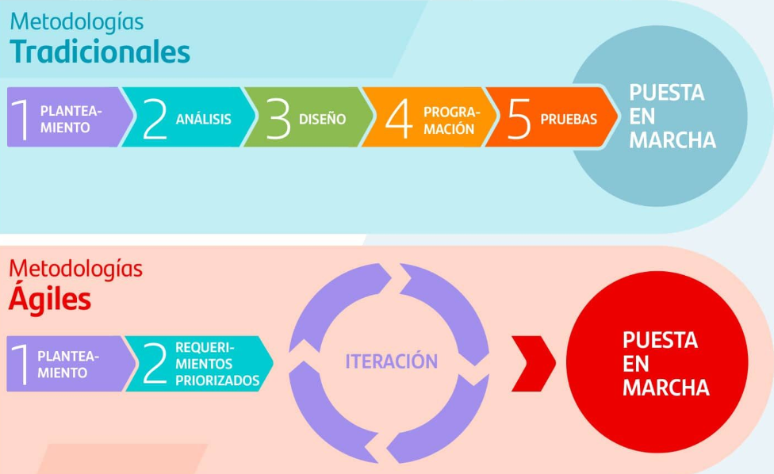

---
### Modelo de Cascada
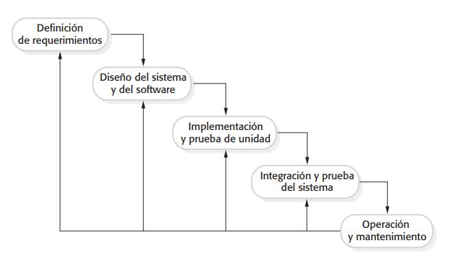

----

### Fases del Modelo de Cascada
<!-- .slide: style="font-size: 0.90em" -->
Hay fases identificadas por separado en el modelo de cascada:
1. El análisis de requerimientos y su definición
2. El diseño del sistema y del software
3. Implementación y prueba  de unidades
4. Integración y pruebas del sistema
5. Operación y mantenimiento

El principal inconveniente del modelo de la cascada es la dificultad de acomodar el cambio después de que está en marcha 
el proceso. En principio, **una fase tiene que ser completa antes de pasar a la siguiente fase**.

----

### Problemas del Modelo de Cascada
<!-- .slide: style="font-size: 0.90em" -->
* **Inflexible**, la división del proyecto en fases estructuradas hace difícil responder a las necesidades cambiantes de 
los clientes. Por lo tanto, este modelo sólo es apropiado cuando los *requisitos son bien entendidos* y los cambios serán 
bastante limitados durante el proceso de diseño.
* POCOS SISTEMAS tienen requisitos estables.
* El modelo de cascada se utiliza sobre todo para los grandes proyectos de ingeniería de sistemas especialmente si un 
sistema se desarrolla en varios lugares. En estas circunstancias el modelo de cascada ayuda a coordinar el trabajo.

----

### Ejercicio

Piense que proyectos podrían desarrollarse empleando el **modelo de cascada**.

----

### Ejercicio

<!-- .slide: style="font-size: 0.80em" -->
Diseñar una aplicación simple (ej: una calculadora, gestor de tareas o agenda de contactos) siguiendo todas las fases del modelo Waterfall.

Fases:
1. **Requerimientos:** Levantar requisitos funcionales y no funcionales.
2. **Diseño:** Hacer diagramas de arquitectura, clases o flujo.
3. **Implementación:** Programar el sistema según el diseño.
4. **Pruebas:** Crear y ejecutar pruebas unitarias y de integración.
5. **Despliegue simulado:** Documentar cómo se haría el despliegue.
6. **Mantenimiento (opcional):** Proponer cómo se manejarían cambios.

🔁 Reflexión final: Analizar qué pasó si un error apareció en implementación, ¿a qué fase hubiera sido necesario volver?

---
### Desarrollo incremental
Especificación, desarrollo y validación se intercalan.

Se aplica este tipo de modelo cuando los requerimientos están razonablemente claros desde el principio.

----

### El desarrollo incremental
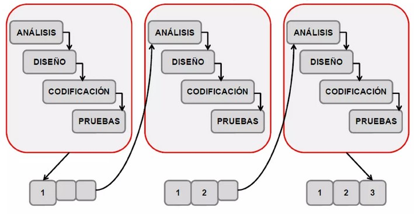

----

### El desarrollo incremental

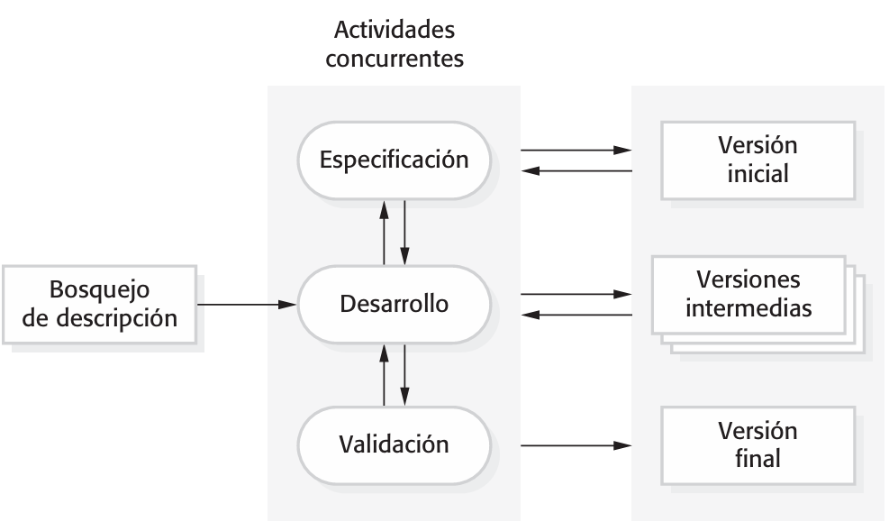

----

### Beneficios de desarrollo incremental
<!-- .slide: style="font-size: 0.80em" -->
* El costo de atender las necesidades cambiantes de los clientes se reduce.
* La cantidad de análisis y la documentación que tiene hacerse de nuevo es mucho menor que la que se requiere con el modelo de cascada.
* Es más fácil obtener retroalimentación de los clientes en el trabajo de desarrollo.
* Los clientes pueden hacer comentarios sobre el avance del desarrollo del software y probar lo que se ha implementado.
* Más rápida entrega y despliegue de software de utilidad para el cliente.
* Los clientes pueden usar y obtener valor a partir del software más rápidamente  de lo que es posible con un proceso de cascada.

----

### Problemas de desarrollo incremental
<!-- .slide: style="font-size: 0.90em" -->
* El proceso no es visible.
Los gerentes necesitan entregas regulares para medir el progreso. No es rentable producir documentos que reflejen todas las versiones del sistema.

* Estructura del sistema tiende a degradarse a medida que se añaden nuevos incrementos.
Se gasta menos tiempo y dinero en la refactorización para mejorar el software, lo que tiende a corromper su estructura. La incorporación de nuevos cambios se vuelve cada vez más difícil y costoso.

---

### Ejercicio: ¿Ágil o por plan?

Evalua los siguientes escenarios y evalúa si conviene emplear un modelo: ágil, por plan, o híbrido?
(Justifica con 2 o + razones).

**Escenario 1: Software médico**
Una empresa desarrolla un sistema que controla la dosis de insulina de una bomba automática. Debe pasar auditorías de calidad, cumplir normativas sanitarias y garantizar cero errores.

----

**Escenario 2: App para una startup**
Un equipo de 4 personas lanza una nueva app para compartir recetas en comunidad. Quieren salir al mercado rápidamente y validar con usuarios reales antes de invertir más.

**Escenario 3: Sistema bancario de backend**
Se va a reemplazar el sistema de liquidación de sueldos y cuentas corrientes de un banco nacional. El nuevo sistema debe integrarse con los existentes y cumplir requisitos legales estrictos.

----

**Escenario 4: Plataforma educativa online**
Una universidad quiere desarrollar su propia plataforma de clases virtuales. Saben lo básico que quieren, pero esperan hacer muchos ajustes según la experiencia del alumnado y el equipo docente.

**Escenario 5: Aplicación para automatizar invernaderos**
Una empresa agroindustrial quiere monitorear temperatura y riego con sensores en tiempo real. No hay una solución previa, pero quieren ver resultados rápidos en campo.

<!--
| Escenario                             | Enfoque Recomendado | Justificación Principal                                     |
|---------------------------------------|----------------------|--------------------------------------------------------------|
| **1. Software médico**                | Por plan             | Riesgo alto, normativa estricta, necesidad de trazabilidad. |
| **2. App de recetas para startup**    | Ágil                 | Cambios frecuentes, MVP, feedback de usuarios constante.     |
| **3. Backend bancario**               | Por plan o híbrido   | Integración crítica, cumplimiento legal, alto riesgo.        |
| **4. Plataforma educativa**           | Ágil o híbrido       | Requisitos adaptables, experiencia del usuario evolutiva.    |
| **5. Automatización de invernaderos** | Ágil                 | Pruebas en campo, prototipado, necesidad de ajustes rápidos. |
-->

----

<table border="1" cellpadding="8" cellspacing="0">
  <thead>
    <tr style="background-color: #f2f2f2;">
      <th>Criterio</th>
      <th>Ágil</th>
      <th>Por Plan</th>
    </tr>
  </thead>
  <tbody>
    <tr>
      <td>Nivel de incertidumbre</td>
      <td>Alto</td>
      <td>Bajo</td>
    </tr>
    <tr>
      <td>Cambios frecuentes esperados</td>
      <td>Sí</td>
      <td>No</td>
    </tr>
    <tr>
      <td>Necesidad de cumplir normativas</td>
      <td>No obligatorio</td>
      <td>Crítica</td>
    </tr>
    <tr>
      <td>Tamaño y distribución del equipo</td>
      <td>Pequeño, flexible</td>
      <td>Grande, estructurado</td>
    </tr>
    <tr>
      <td>Presupuesto fijo</td>
      <td>No necesariamente</td>
      <td>Sí</td>
    </tr>
    <tr>
      <td>Riesgo del error</td>
      <td>Bajo o moderado</td>
      <td>Alto</td>
    </tr>
  </tbody>
</table>

---

### Ingeniería de software orientado a Reutilización
<!-- .slide: style="font-size: 0.90em" -->
Se basa en la reutilización sistemática de código, los sistemas se integran a partir de componentes o sistemas existentes.

Etapas del proceso
1. Análisis de requerimientos
2. Análisis de los componentes
3. Modificación de requerimientos
4. Configuración del sistema con la reutilización
5. Desarrollo e integración

La reutilización es ahora el enfoque estándar para la construcción de muchos tipos de sistemas.

----

### Ingeniería de software orientado a Reutilización

El modelo se basa en la reutilización sistemática de código, en integrar componentes o sistemas pre-existentes.

En este modelo se distinguen las siguientes etapas:
1. Análisis de requerimientos
2. Análisi de los componentes
3. Modificación de requerimientos
4. Configuración del sistema con la reutilización
5. Desarrollo e integración

----

### Ingeniería de software orientado a Reutilización
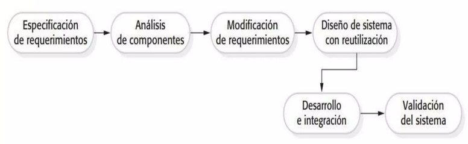

---

### Modelo Evolutivo
<!-- .slide: style="font-size: 0.90em" -->
El modelo se construye mediante una serie de **prototipos**, que se van refinando y evolucionando con el tiempo.
Permite al cliente explorar requisitos poco claros o cambiantes. Se parte con una versión básica y se mejora a partir del feedback del usuario.

En este modelo se distinguen las siguientes fases:
1. Desarrollo de un prototipo inicial
2. Retroalimentación del usuario
3. Refinamiento del prototipo
4. Se repite el ciclo hasta llegar al producto final.

Generalmente se aplica este tipo de modelo cuando los requerimientos no están bien definidos desde el principio.

---

### Iteración de los procesos

Enfoque donde cada etapa o ciclo se repite para refinar y mejorar un producto o proyecto.

- **Entrega incremental:** se divide el proyecto en etapas que se van entregando gradualmente.
- **Desarrollo en espiral:** se utilizan ciclos de planificación, diseño desarrollo, prueba y evaluación para gestionar los riesgos y las complejidades del proyecto.

----

#### Desarrollo incremental

- Se divide el proyecto en partes más pequeñas y manejables, llamadas incrementos.
- Cada incremento se entrega a los usuarios para su evaluación y retroalimentación.
- Se utiliza la retroalimentación para mejorar el producto en cada iteración, añadiendo funcionalidades o corrigiendo errores.
- Permite adaptarse a los cambios en los requisitos o las necesidades del cliente.

---
### Entrega incremental
* En lugar de entregar el sistema en una sola vez, el desarrollo y la entrega se desglosan en incrementos, con cada incremento se entrega de parte de la funcionalidad requerida.
* Requisitos de usuario se priorizan y se incluyen los requisitos de más alta prioridad en incrementos tempranos.
* Una vez que se inicia el desarrollo de un incremento, los requisitos están congelados, aunque los requisitos para incrementos posteriores pueden seguir evolucionando.

---

### El desarrollo incremental y la entrega
<!-- .slide: style="font-size: 0.72em" -->
* El desarrollo incremental
  * Desarrollar el sistema en incrementos y evaluar cada incremento antes de continuar con el desarrollo del siguiente incremento;
  * Aproximación normal utilizado en los métodos ágiles;
  * La evaluación puede ser hecha por el usuario / cliente.

* Entrega incremental
  * Implementar un incremento para su uso por los usuarios finales;
  * Una evaluación más realista sobre el uso práctico del software;
  * Difícil de implementar para el caso de sustitución de sistemas existentes, los incrementos tienen menos funcionalidad que el sistema está reemplazando.

----

### Entrega Incremental
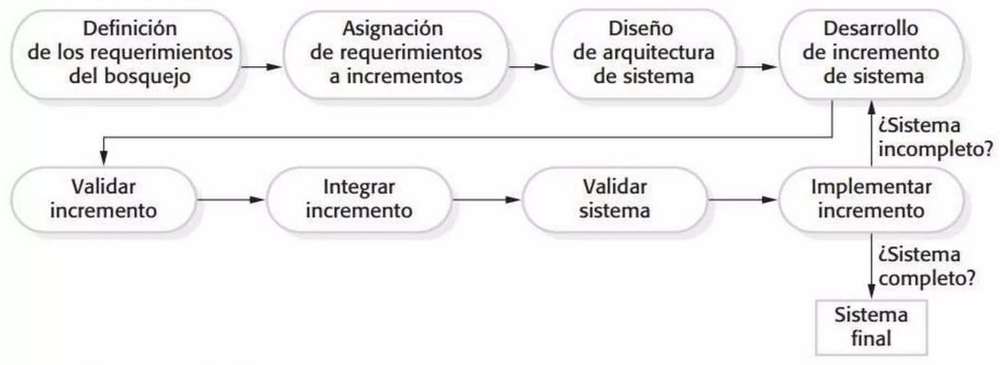

----

### Ventajas entrega incremental
* El sistema está disponible antes, con cada entrega se agrega funcionalidad al sistema.
* Las primeras entregas actúan como un prototipo, esto es útil para el esclarecimiento de requisitos para incrementos posteriores.
* Menor riesgo de fracaso del proyecto en general.
* Los servicios de mayor prioridad se entregan antes y tienden a recibir la mayor cantidad de pruebas.

----

### Problemas de entrega incremental
<!-- .slide: style="font-size: 0.90em" -->
La mayoría de los sistemas requieren un conjunto de servicios básicos que se utilizan por diferentes partes del sistema.
Dado que los requisitos no están definidos en detalle hasta que se llegue al  incremento de su ejecución, puede ser difícil identificar las funcionalidades comunes que son necesarias para todos los incrementos.

La esencia de los procesos iterativos es que la especificación se desarrolla en conjunto con el software.
Sin embargo, esto entra en conflicto con el modelo de adquisición de muchas organizaciones, donde la especificación 
completa del sistema es parte del contrato de desarrollo del sistema.

---

### Desarrollo en Espiral

Cada ciclo en espiral se divide en 4 sectores:
1. Establecimiento de objetivos
2. Valoración y reducción del riesgo
3. Desarrollo y validación
4. Planeación

----

### Desarrollo en Espiral
<!-- .slide: style="font-size: 0.90em" -->
El proceso de desarrollo se organiza en ciclos o bucles que repiten las fases de planificación, diseño, desarrollo, prueba y evaluación.

Se enfoca en la identificación y gestión de riesgos en cada ciclo, permitiendo tomar decisiones informadas y mitigar los riesgos potenciales.

Permite adaptarse a cambios y modificaciones durante el desarrollo del proyecto.

Facilita la incorporación de nuevas funcionalidades o mejoras en cada iteración, basándose en la experiencia y la retroalimentación de los usuarios.

----

### Desarrollo en Espiral

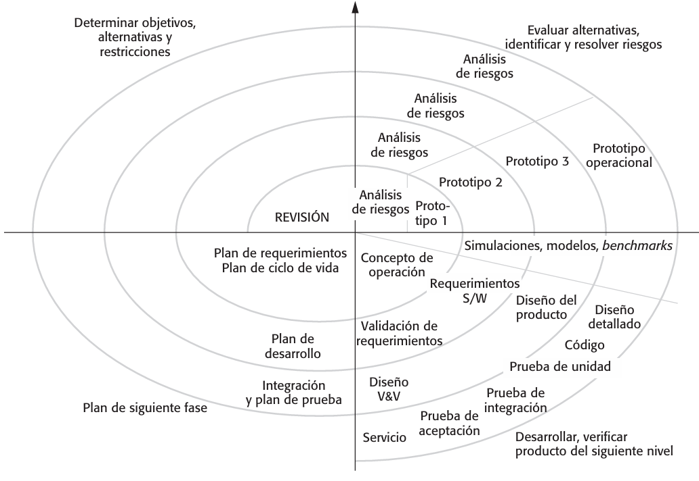

---
### Actividades de proceso
* Procesos de software reales son *secuencias* intercalados de actividades técnicas, de colaboración y de gestión con el 
objetivo general de la **especificación, diseño, implementación y prueba** de un sistema de software.
* Las cuatro actividades básicas del proceso son: especificación, desarrollo, validación y evolución y están organizados 
de manera diferente según el proceso de desarrollo. En el modelo de cascada, se organizan en secuencia, mientras que en 
el desarrollo incremental son intercalados.

---
### Especificaciones de Software
<!-- .slide: style="font-size: 0.80em" -->
El proceso de establecer qué servicios son necesarios y las limitaciones de funcionamiento y desarrollo del sistema.

Ingeniería de Requisitos o Requerimientos:
* Estudio de factibilidad  
¿Es técnicamente y financieramente factible para construir el sistema?
* Requerimientos, obtención y análisis  
¿Qué requieren los diferentes actores del sistema o esperan del sistema ?
* Especificación de Requerimientos  
Definición de los requisitos en detalle
* Validación de Requerimientos  
Comprobación de la validez de los requisitos

---
### El proceso de ingeniería de requerimientos
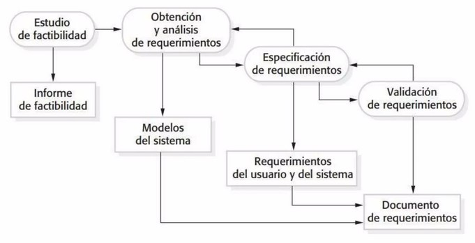

---
### Diseño de software y la implementación
* Proceso de conversión entre la especificación del sistema en un sistema ejecutable.

* El diseño de software   
Diseñar una estructura de software que da cuenta de la especificación;

* Implementación  
Traducir esta estructura en un programa ejecutable;

* Las actividades de diseño e implementación están estrechamente relacionados y pueden ser intercaladas.

---
### Un modelo general del proceso de diseño
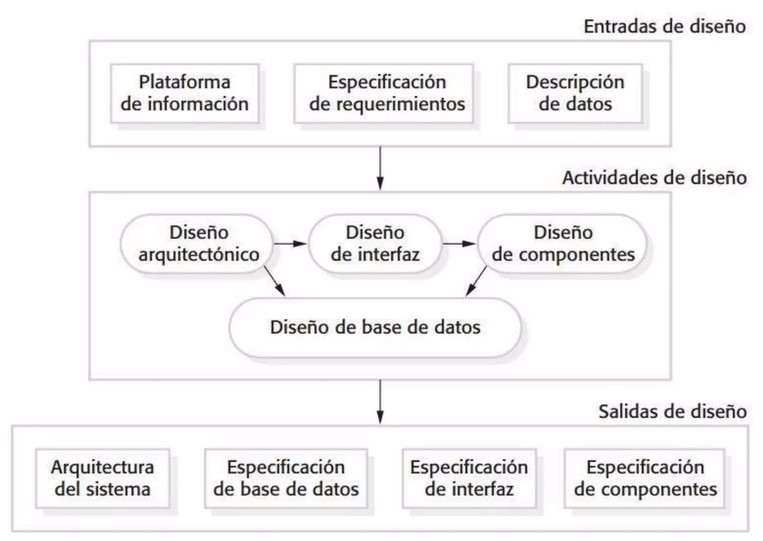

---
### Actividades de Diseño
<!-- .slide: style="font-size: 0.90em" -->
* **Diseño arquitectónico**, donde se identifica la estructura general del sistema, los componentes principales (a veces llamados subsistemas o módulos), sus relaciones y la forma en que se distribuyen.
* **Diseño de la interfaz**, donde se definen las interfaces entre los componentes del sistema.
* **Diseño de componentes**, donde se toma cada componente del sistema y el diseño de cómo se va a operar.
* **Diseño de base de datos**, donde se diseña la estructura de datos del sistema y de cómo éstos han de estar representados en una base de datos.

---
### Validación del Software
* **Verificación y validación** (V & V) está destinado a demostrar que un sistema cumple con su especificación y cumple con los requisitos del cliente.

Involucra procesos de control, revisión y prueba del sistema.

Las pruebas del sistema implica ejecutar el sistema con casos de prueba que se derivan de la especificación utilizando datos reales.

La prueba es la actividad de V & V más utilizada.

---
### Etapas de la prueba
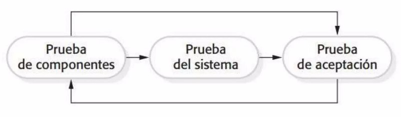

----

### Etapas de prueba
<!-- .slide: style="font-size: 0.90em" -->
* **Pruebas de Desarrollo o componente**  
Los componentes individuales se prueban de forma independiente;
Los componentes pueden ser funciones, objetos o agrupaciones coherentes de estas entidades.

* **Las pruebas del sistema**  
Pruebas del sistema como un todo. El ensayo de las propiedades emergentes es particularmente importante.

* **Las pruebas de aceptación**  
Las pruebas realizadas por el cliente para verificar que el sistema cumple con sus necesidades.

---
### Fases de prueba en un proceso de software
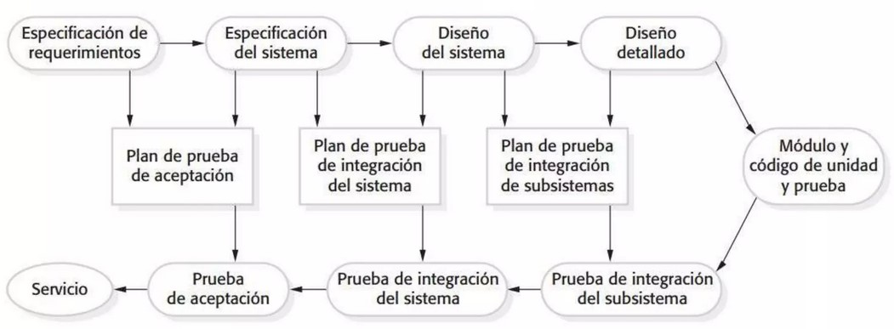

---
### La evolución del software
* El software es inherentemente flexible y puede cambiar.
* Las circunstancias cambiantes de negocios hacen que el software que soporta la empresa también deba evolucionar y cambiar.
* Si bien se habla de desarrollo y evolución (mantenimiento) como etapas diferentes, la diferencia es cada vez más 
irrelevante, cada vez son menos los sistemas completamente nuevos.

---
### Evolución del Sistema
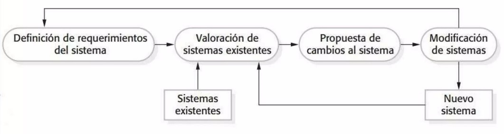

---
### El problema del cambio
<!-- .slide: style="font-size: 0.90em" -->
* El cambio es inevitable en todos los grandes proyectos de software.
  * Cambios en el negocio conducen a requisitos nuevos y modificaciones  del sistema
  * Las nuevas tecnologías abren nuevas posibilidades de mejorar las implementaciones
  * Cambio de plataformas requieren cambios en las aplicaciones

* Los costos del cambio incluyen tanto la reelaboración (por ejemplo, requisitos de re-analizar), como los costos de implementación de nuevas funcionalidades

---
### La reducción de los costos de rehacer
<!-- .slide: style="font-size: 0.75em" -->
* **Evitar el Cambio**, donde el proceso de software incluye actividades que pueden anticipar posibles cambios para 
evitar repetir el trabajo.
  * Por ejemplo, un prototipo del sistema puede ser desarrollado para mostrar algunas de las características clave del sistema para los clientes.

* **Tolerancia al Cambio**, en el que el proceso está diseñado de modo que los cambios pueden afrontarse con un costo relativamente bajo.
  * Esto implica alguna forma de desarrollo incremental. Los cambios propuestos pueden implementarse en incrementos que aún 
no se han desarrollado. Sólo un único incremento (una pequeña parte del sistema) debe ser alterado para incorporar el cambio.

---
### Software Prototipado
Un prototipo es una versión inicial de un sistema que se utiliza para demostrar conceptos y probar opciones de diseño.

Un prototipo se puede utilizar en:
* El proceso de ingeniería de requerimientos para ayudar con la obtención de requisitos y validación;
* En los procesos de diseño para explorar opciones y desarrollar un diseño de interfaz de usuario;
* En el proceso de pruebas.

---
### Beneficios del prototipado
* Mejora de la usabilidad del sistema.
* Una aproximación más exacta a las necesidades reales de los usuarios.
* Mejora de la calidad del diseño.
* Mejora de la capacidad de mantenimiento.
* Reduce del esfuerzo de desarrollo.

---
### El proceso de desarrollo de prototipos
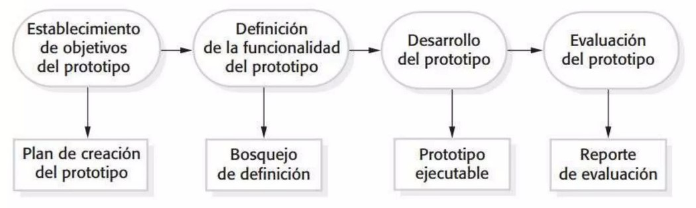

---
### Desarrollo de prototipos
* Prototipo debe centrarse en las áreas del producto que no se conocen bien
* La comprobación de errores y recuperación pueden no estar incluidos en el prototipo
* Centrarse en los requisitos funcionales y no en los  no funcionales tales como la fiabilidad y la seguridad

---
### Prototipos desechables
Los prototipos deben desecharse ya que no son una buena base para un sistema de producción:
* Puede ser imposible para ajustar el sistema para cumplir con los requisitos no funcionales;
* Los prototipos son normalmente indocumentados;
* La estructura del prototipo se suele degradarse a través de un cambio rápido;
* El prototipo probablemente no va a cumplir con los estándares de calidad normal de la organización.

---
### Ejemplos de Prototipos

[Figma - Web](https://www.figma.com/proto/8qUZMI4k0iAAX33xV3vvnZ/Carrito-M%C3%BAltiple?node-id=1655-15444&scaling=scale-down&page-id=1119%3A10172&starting-point-node-id=1655%3A15343)

[Adobe XD](https://xd.adobe.com/view/79dd4690-1c36-4223-9d53-c4d50d2463c9-2c8e/)

[Nivel de Detalle](https://www.figma.com/proto/h5wKQ7FzejsrPIlw9MTKEx/Tienda-Claro---Desktop-%2B-Mobile?node-id=2265-1936&scaling=contain&page-id=0%3A1&starting-point-node-id=2265%3A1936)

---
### Actividades a realizar en grupo
En grupos de máximo 3 personas deberán investigar las siguientes metodologías, generar un informe/ppt y presentar la investigación al curso (fecha 23/08)

1. CLEANROOM SOFTWARE ENGINEERING
2. KANBAN
3. ADAPTIVE SOFTWARE DEVELOPMENT
4. CRYSTAL
5. LEAN SOFTWARE DEVELOPMENT (LSD)
6. FEATURE DRIVEN DEVELOPMENT
7. DEVOPS

---
## ¿Dudas, Preguntas, Comentarios?

