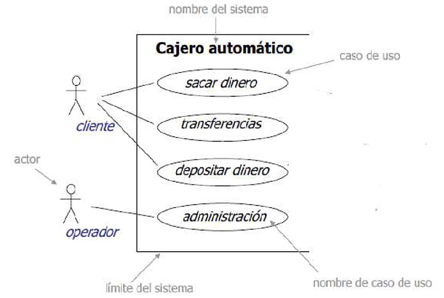

# Ingeniería de Software
## Ingeniería de Requerimientos
Created by <i class="fab fa-telegram"></i>
[edme88]("https://t.me/edme88")

---
<!-- .slide: style="font-size: 0.60em" -->

## Temario

### Ingeniería de Requerimientos
* Definición
* Que es un requerimiento?
* Tipos de requerimiento
* Requerimientos del usuario y del sistema
* Requerimientos funcionales y no funcionales
* Requerimientos del MHC-PMS
* Imprecisión de requerimientos
* integridad y la coherencia

* Requerimientos no funcionales
* Clasificación de Req No Func
* Objetivos y Requerimientos
* Requerimientos de usabilidad
* Métricas para Req No Func
* Requerimientos de Dominio

---
### Ingeniería de requerimientos
* El proceso de establecimiento de los servicios que el cliente necesita de un sistema y las limitaciones con las
que opera y se desarrolla.
* Los requisitos, en sí, son las descripciones de los servicios del sistema y las limitaciones que se generan
durante el proceso de ingeniería de requerimientos.

---
### Definicion de Requerimiento (Davis)
<!-- .slide: style="font-size: 0.88em" -->
"Si una empresa desea realizar un contrato para un proyecto de desarrollo de software grande, debe definir sus necesidades de una
manera suficientemente abstracta para que no se malentienda la solución. Los requisitos deben ser escritos de manera que varios
contratistas puedan hacer una propuesta para el contrato, ofreciendo, tal vez, diferentes formas de satisfacer las necesidades de la
organización del cliente. Una vez que el contrato ha sido adjudicado, el desarrollador debe escribir una definición del sistema para el cliente
detalladamente para que el cliente entienda y pueda validar lo que el software hará. Ambos documentos pueden ser llamados el documento
de requerimientos para el sistema ".

---
### Qué es un requerimiento?
<!-- .slide: style="font-size: 0.80em" -->
Propiedad o restricción, determinada con precisión, que un producto software debe satisfacer

* Como se expresa un requerimiento?
La definicion de un requerimiento puede variar de una declaración abstracta de un servicio o de una
restricción de sistema a una especificación funcional matemática detallada.

Que Problemas hay?
* Dificultad de comunicación entre el equipo de  desarrollo y el grupo de clientes/usuarios.
* Cambio de los requerimientos.
* Imposibilidad de identificar la totalidad de los requerimientos de un producto

---
### La comunicación...

---
### Tipos de requerimientos
* Requerimientos del usuario (Alto nivel)
  * Declaraciones en lenguaje natural que define los servicios que  debe proporcionar el sistema y sus limitaciones. 
Escrito para que los clientes entiendan.
* Requerimientos del sistema (Detallado)
  * Descripciones detalladas de las funciones del sistema, los servicios y las limitaciones operativas. Define todo lo 
que debe ser implementado así que puede ser parte de un documento entre el cliente y el desarrollador.

---
### Requerimientos de usuario y del sistema
<!-- .slide: style="font-size: 0.70em" -->
Requerimiento del usuario & Requerimientos del sistema:
1. El software debe proveer un medio para representar y acceder a archivos externos creados por otras herramientas. 
   1. Al usuario se le proveerá con los recursos para definir el tipo de archivos externos. 
   2. Cada tipo de archivo externo tendrá una herramienta asociada que será aplicada al archivo.
   3. Cada tipo de archivo externo se representará como un icono específico sobre la pantalla del usuario. 
   4. Se proveerán recursos para que el usuario defina el icono que representa un tipo de archivo externo. 
   5. Cuando un usuario selecciona un icono que representa un archivo externo, el efecto de esa selección es aplicar la
      herramienta asociada con este tipo de archivo al archivo representado por el icono seleccionado.

---
### Requerimientos funcionales y no funcionales
<!-- .slide: style="font-size: 0.80em" -->
* Requerimientos funcionales
  * Enunciados acerca de los servicios del sistema que debe proporcionar, como el sistema debe reaccionar a entradas
generales y cómo el sistema debe comportarse en situaciones
particulares.
  * Pueden explicar lo que el sistema no debe hacer.
* Requerimientos no funcionales
  * Limitaciones en los servicios o funciones que ofrece el sistema, como restricciones de tiempo, restricciones del proceso de
desarrollo, normas, etc.
  * A menudo se aplica al sistema en su conjunto, en lugar de a las funciones o servicios individuales.
* Requerimientos de dominio 
  * Las restricciones en el sistema segun el dominio de operación

---
### Requerimientos funcionales
* Describe los servicios de funcionalidad o servicios del  sistema.
* Dependerá del tipo de software, los usuarios esperados y el tipo de entorno en el que se utiliza el software.
* Requerimientos funcionales de los usuarios son  declaraciones de alto nivel de lo que el sistema debe hacer
* Requerimientos funcionales de sistema deben describir los servicios del sistema en detalle.

---
### Requerimientos funcionales para el MHC-PMS
* Un usuario debe ser capaz de buscar las listas de citas de todas las clínicas.
* El sistema deberá generar cada día, por cada clínica, una lista de pacientes que se espera que asistan a las
citas de ese día.
* Cada miembro del personal que utiliza el sistema deberá ser identificado únicamente por su número de empleado 8
dígitos.

---
### Imprecisión de requerimientos
<!-- .slide: style="font-size: 0.90em" -->
* Los problemas surgen cuando los requerimientos no se expresan con precisión.
* Requisitos ambiguos pueden ser interpretados de diferentes maneras por los desarrolladores y usuarios.
* Considere el término ‘buscar' en un requerimiento
  * Intención del usuario - búsqueda de un nombre de paciente a través de todas las citas en todas las clínicas
  * Interpretación Desarrollador - buscar un nombre de paciente en una clínica individual. El usuario elige la clínica 
luego se realiza la búsqueda.

---
### La integridad y la coherencia de Requerimientos
En principio, los requerimientos deben ser a la vez completos y coherentes.
* **Completo:** Deben incluir una descripción de todos los servicios requeridos.
* **Coherente:** No debe haber conflictos o contradicciones en las descripciones de los servicios del sistema.

En la práctica, es dificil producir un documento de requisitos completo y consistente.

---
### Requerimientos no funcionales
<!-- .slide: style="font-size: 0.80em" -->
Definen
* Propiedades transversales a todo el sistema :
  * Los requerimientos de fiabilidad 
  * Tiempo de respuesta. 
  * Necesidad almacenamiento.
* Limitaciones:
  * Uso de un IDE en particular 
  * Lenguaje de programación. 
  * Método de desarrollo.
  
Requisitos no funcionales pueden ser más críticos que los requerimientos funcionales. Si éstos no se cumplen, el sistema puede ser inútil.

----

### Requerimientos no funcionales
<!-- .slide: style="font-size: 0.80em" -->
* Requisitos no funcionales pueden afectar a la arquitectura general de un sistema en lugar de a los componentes individuales.
    * Por ejemplo, para garantizar que se cumplen los requerimientos de rendimiento, puede que tenga que organizar el sistema para
      minimizar las comunicaciones entre componentes.
* Un requisito no funcional , como un requisito de seguridad, puede generar una serie de requerimientos
  funcionales relacionados que definen los servicios del sistema que se requieren.
    * También puede generar requerimientos que restringen los requerimientos existentes.
  
---
### Clasificación de requerimientos no funcionales
<!-- .slide: style="font-size: 0.90em" -->
* **Requerimientos del producto**, que especifican como el producto debe comportarse, por ejemplo velocidad de
ejecución, fiabilidad, etc.
* **Requerimientos organizacionales**, que son consecuencia de las políticas y procedimientos de la organización, por 
ejemplo, estándares de procesos utilizados, los requisitos de implementación, etc.
* **Requerimientos externos**, que surgen de factores que son externos al sistema y su proceso de desarrollo, por 
ejemplo, requisitos de interoperabilidad, los requisitos legislativos, etc.

---
### Tipos de requerimientos no funcionales

---
### Ejemplo de requerimientos no funcionales de MHC-PMS
<!-- .slide: style="font-size: 0.90em" -->
* **Requerimientos del producto**
El MHC-PMS estará a disposición de todas las clínicas durante las horas normales de trabajo (lun-vie, 08:30 a 17:30). 
El tiempo de inactividad dentro de las horas normales de trabajo no excederá de cinco segundos en cualquiera de un día.
* **Requerimiento organizacional**
Los usuarios del sistema MHC-PMS deberán autenticarse usando su tarjeta de identidad autoridad sanitaria.
* **Requisito externo**
El sistema deberá aplicar las disposiciones de privacidad del paciente según lo establecido en HStan-03-2006-priv.

---
### Ejemplo de requerimientos no funcionales sistema de bibliotecas LIBSYS
<!-- .slide: style="font-size: 0.80em" -->
* Requerimiento del producto
  * La interfaz del usuario para LIBSYS deberá ser implementada como HTML simple sin marcos o applets.
* Requerimiento organizativo
  * El proceso de desarrollo del sistema y los documentos a entregar debe ajustarse al proceso y a los productos a entregar definifos en el STAN-95
* Requerimiento externo
  * El sistema no deberá revelar a sus operadores alguna información personal de los clientes excepto su nombre y número de referencia.

---
### Objetivos y requerimientos
<!-- .slide: style="font-size: 0.80em" -->
Requerimientos no funcionales pueden ser muy difíciles de explicar y requerimientos imprecisos pueden ser muy difíciles de verificar

* Objetivos 
  * Una declaración general de lo que el cliente quiere, como la facilidad del uso.
* Requerimiento no funcional verificable 
  * Una declaración mediante una cierta medida que se puede probar de forma objetiva.
    
Los objetivos son útiles para los desarrolladores, ya que transmiten las intenciones de los usuarios del sistema.

---
### Requerimientos de usabilidad
* El sistema debe ser fácil de usar por el personal médico y debe ser organizado de tal manera que los
errores de los usuarios se reducen al mínimo. (Objetivo)
* El personal médico debe ser capaz de utilizar todas las funciones del sistema después de cuatro horas de
entrenamiento. Después de este entrenamiento, el número medio de errores cometidos por los usuarios
experimentados no excederá de dos por cada hora de uso del sistema. (Requerimiento no funcional verificable)

---
### Métricas para la especificación de requisitos no funcionales

<!--
| Propiedad        | Medida                                                                                                                                        |
|------------------|-----------------------------------------------------------------------------------------------------------------------------------------------|
| Velocidad        | Transacciones procesadas por segundo   Tiempo de respuesta al usuario y a eventos   Tiempo de actualización de la pantalla              | 
| Tamaño           | M Bytes   Número de chips de ROM                                                                                                           |
| Facilidad de uso | Tiempo de formación   Número de marcos de ayuda                                                                                            |
| Confiabilidad    | Tiempo medio entre fallos   Probabilidad de no disponibilidad   Tasa de ocurrencia de dallos   Disponibilidad                        |
| Robustez         | Tiempo de reinicio después de fallo   Porcentaje de eventos que causan fallos   Probabilidad de corrupción de datos después de un fallo |
| Portabilidad     | Porcentaje de declaraciones dependientes de objetivo                                                                                          |
-->
<table>
<thead>
<tr>
<th>Propiedad</th>
<th>Medida</th>
</tr>
</thead>
<tbody>
<tr>
<td>Velocidad</td>
<td>Transacciones procesadas por segundo   Tiempo de respuesta al usuario y a eventos   Tiempo de actualización de la pantalla</td>
</tr>
<tr>
<td>Tamaño</td>
<td>M Bytes   Número de chips de ROM</td>
</tr>
<tr>
<td>Facilidad de uso</td>
<td>Tiempo de formación   Número de marcos de ayuda</td>
</tr>
<tr>
<td>Confiabilidad</td>
<td>Tiempo medio entre fallos   Probabilidad de no disponibilidad   Tasa de ocurrencia de dallos   Disponibilidad</td>
</tr>
<tr>
<td>Robustez</td>
<td>Tiempo de reinicio después de fallo   Porcentaje de eventos que causan fallos   Probabilidad de corrupción de datos después de un fallo</td>
</tr>
<tr>
<td>Portabilidad</td>
<td>Porcentaje de declaraciones dependientes de objetivo</td>
</tr>
</tbody>
</table>

---
### Requerimientos del dominio
* Dominio operacional del sistema impone requerimientos.
  * Por ejemplo, un sistema de control de trenes tiene que tener en cuenta las características de frenado en diferentes
condiciones climáticas.
* Requerimientos de dominio generan nuevos requisitos funcionales, limitaciones sobre los requisitos existentes o definir
cálculos específicos.
* Si los requerimientos de dominio no están satisfechos, el sistema puede ser inutilizable.

---
### Problemas de los requerimientos de dominio
* Comprensibilidad
  * Los requerimientos se expresan en el lenguaje del dominio de aplicación
  * A menudo, esto no es entendido por los ingenieros de software de desarrollo del sistema.
* Implícito 
  * Especialistas del dominio entienden la zona tan bien, que no piensan en hacer de las exigencias de dominio explícito.

---
### Documento de requerimientos de software
* El documento de requisitos de software es la declaración oficial de lo que se requiere de los
desarrolladores del sistema.
* Debe incluir tanto una definición de los requisitos del usuario y una especificación de los requisitos del sistema.
* NO es un documento de diseño.

Debe establecer de lo QUE el sistema DEBE hacer y NO COMO es que debe hacerlo.

---
### Métodos agiles y requerimientos
* Muchos métodos ágiles argumentan que la producción de un documento de requisitos es una pérdida de tiempo que
los requisitos cambian tan rápidamente.
* El documento es, por tanto, siempre actualizado.
* Métodos como XP utilizan requisitos expresados como "historias de usuario”
* Esto es práctico para ciertos sistemas, pero problemático para los sistemas que requieren una gran cantidad de
análisis previo a la entrega (por ejemplo, sistemas críticos) o sistemas desarrollados por varios equipos.

---
### Los usuarios de un documento de requerimientos

---
### Documento de Requerimientos
* La información contenida en el documento de requerimientos depende del tipo de sistema y el enfoque
de desarrollo utilizado.
* Los sistemas desarrollados por incrementos, por lo general, tienen menos detalle en el documento de requerimientos.
* Las Normas para documentos de requerimientos estan especificadas por el estándar IEEE. En su mayoría son
aplicables a los requisitos para los grandes proyectos de ingeniería de sistemas.

---
### La estructura de un documento de requerimientos
<!--
| Capitulo                                | Descripción                                                                                                                                                                                                                                                                                                                                                     |
|-----------------------------------------|-----------------------------------------------------------------------------------------------------------------------------------------------------------------------------------------------------------------------------------------------------------------------------------------------------------------------------------------------------------------|
| Prefacio                                | Esto debe definir el número de lectores se espera del documento y describir su historial de versiones, incluyendo una justificación para la creación de una nueva versión y un resumen de los cambios realizados en cada versión.                                                                                                                               |
| Introducción                            | Esto debería describir la necesidad de que el sistema. Debe describir brevemente las funciones del sistema y explicar cómo va a funcionar con otros sistemas. También debe describir cómo el sistema se ajusta a los objetivos generales de la empresa o estratégicos de la organización puesta en marcha del software.                                         |
| Glosario                                | Esto debería definir los términos técnicos utilizados en el documento. No debería hacer suposiciones acerca de la experiencia o los conocimientos del lector.                                                                                                                                                                                                   | 
| Definición de requerimientos de usuario | Aquí, usted describe los servicios proporcionados por el usuario. Los requisitos del sistema no funcionales también deben ser descritos en esta sección. Esta descripción puede usar el lenguaje natural, diagramas u otras anotaciones que sean comprensibles para los clientes. Las normas de productos y de procesos que deben seguirse deben especificarse. |
| Arquitectura del sistema                | Este capítulo debe presentar una descripción de alto nivel de la arquitectura del sistema previsto, que muestra la distribución de funciones a través de los módulos del sistema. Los componentes arquitectónicos que se reutilizan deben destacarse.                                                                                                           |
-->
<table>
<thead>
<tr>
<th>Capitulo</th>
<th>Descripción</th>
</tr>
</thead>
<tbody>
<tr>
<td>Prefacio</td>
<td>Esto debe definir el número de lectores se espera del documento y describir su historial de versiones, incluyendo una justificación para la creación de una nueva versión y un resumen de los cambios realizados en cada versión.</td>
</tr>
<tr>
<td>Introducción</td>
<td>Esto debería describir la necesidad de que el sistema. Debe describir brevemente las funciones del sistema y explicar cómo va a funcionar con otros sistemas. También debe describir cómo el sistema se ajusta a los objetivos generales de la empresa o estratégicos de la organización puesta en marcha del software.</td>
</tr>
<tr>
<td>Glosario</td>
<td>Esto debería definir los términos técnicos utilizados en el documento. No debería hacer suposiciones acerca de la experiencia o los conocimientos del lector.</td>
</tr>
<tr>
<td>Definición de requerimientos de usuario</td>
<td>Aquí, usted describe los servicios proporcionados por el usuario. Los requisitos del sistema no funcionales también deben ser descritos en esta sección. Esta descripción puede usar el lenguaje natural, diagramas u otras anotaciones que sean comprensibles para los clientes. Las normas de productos y de procesos que deben seguirse deben especificarse.</td>
</tr>
<tr>
<td>Arquitectura del sistema</td>
<td>Este capítulo debe presentar una descripción de alto nivel de la arquitectura del sistema previsto, que muestra la distribución de funciones a través de los módulos del sistema. Los componentes arquitectónicos que se reutilizan deben destacarse.</td>
</tr>
</tbody>
</table>

----

### La estructura de un documento de requerimientos
<!--
| Capitulo                                     | Descripción                                                                                                                                                                                                                                                                                                                                                                                                                           |
|----------------------------------------------|---------------------------------------------------------------------------------------------------------------------------------------------------------------------------------------------------------------------------------------------------------------------------------------------------------------------------------------------------------------------------------------------------------------------------------------|
| Especificación de requerimientos del sistema | Esto debería describir los requisitos funcionales y no funcionales en más detalle. Si es necesario, mayor detalle puede añadirse a los requerimientos no funcionales. Interfaces para otros sistemas pueden ser definidos.                                                                                                                                                                                                            |
| Modelos del sistema                          | Esto podría incluir modelos gráficos del sistema que muestran las relaciones entre los componentes del sistema y el sistema y su entorno. Ejemplos de posibles modelos son modelos de objetos, modelos de flujo de datos, o los modelos de datos semánticos.                                                                                                                                                                          |
| Sistema de evaluación                        | Este debe describir los supuestos fundamentales en que se basa el sistema, y cualquier cambio previsto debido a la evolución del hardware, cambios en las necesidades de los usuarios, y así sucesivamente. Esta sección es útil para los diseñadores de sistemas, ya que puede ayudar a evitar las decisiones de diseño que limitarían los probables cambios futuros en el sistema.                                                  |
| Apéndices                                    | Estos deben proporcionar información detallada y la información específica que se relaciona con la aplicación en desarrollo; por ejemplo, el hardware y las descripciones de bases de datos. Requerimientos de hardware definen las configuraciones de mínimos y óptimos para el sistema. Los requerimientos de base de datos definen la organización lógica de los datos utilizados por el sistema y las relaciones entre los datos. |
| Índice                                       | Se pueden incluir varios índice. Así como un índice alfabético normal, puede haber un índice de diagramas, un índice de funciones, y así sucesivamente. |
-->
<table>
<thead>
<tr>
<th>Capitulo</th>
<th>Descripción</th>
</tr>
</thead>
<tbody>
<tr>
<td>Especificación de requerimientos del sistema</td>
<td>Esto debería describir los requisitos funcionales y no funcionales en más detalle. Si es necesario, mayor detalle puede añadirse a los requerimientos no funcionales. Interfaces para otros sistemas pueden ser definidos.</td>
</tr>
<tr>
<td>Modelos del sistema</td>
<td>Esto podría incluir modelos gráficos del sistema que muestran las relaciones entre los componentes del sistema y el sistema y su entorno. Ejemplos de posibles modelos son modelos de objetos, modelos de flujo de datos, o los modelos de datos semánticos.</td>
</tr>
<tr>
<td>Sistema de evaluación</td>
<td>Este debe describir los supuestos fundamentales en que se basa el sistema, y cualquier cambio previsto debido a la evolución del hardware, cambios en las necesidades de los usuarios, y así sucesivamente. Esta sección es útil para los diseñadores de sistemas, ya que puede ayudar a evitar las decisiones de diseño que limitarían los probables cambios futuros en el sistema.</td>
</tr>
<tr>
<td>Apéndices</td>
<td>Estos deben proporcionar información detallada y la información específica que se relaciona con la aplicación en desarrollo; por ejemplo, el hardware y las descripciones de bases de datos. Requerimientos de hardware definen las configuraciones de mínimos y óptimos para el sistema. Los requerimientos de base de datos definen la organización lógica de los datos utilizados por el sistema y las relaciones entre los datos.</td>
</tr>
<tr>
<td>Índice</td>
<td>Se pueden incluir varios índice. Así como un índice alfabético normal, puede haber un índice de diagramas, un índice de funciones, y así sucesivamente.</td>
</tr>
</tbody>
</table>

---
### Especificación de requerimientos
<!-- .slide: style="font-size: 0.90em" -->
* El proceso de escribir los requerimientos del sistema del usuario y en un documento de requisitos.
* Los requerimientos de usuario tienen que ser comprensibles por los usuarios finales y los clientes quienes no tienen una formación técnica.
* Los requerimientos del sistema son requerimientos más detallados y pueden incluir más información técnica.
* Los requerimientos pueden ser parte de un contrato para el desarrollo del sistema 
  * Por lo tanto, es importante que estos sean tan completos como sea posible.

---
### La estructura de un documento de requerimientos
<!--
| Notación                           | Descripción                                                                                                                                                                                                                                                                                                                                                                                       |
|------------------------------------|---------------------------------------------------------------------------------------------------------------------------------------------------------------------------------------------------------------------------------------------------------------------------------------------------------------------------------------------------------------------------------------------------|
| Lenguaje natural                   | Los requerimientos están escritos con oraciones numeradas en lenguaje natural. Cada oración debe expresar un requerimiento.                                                                                                                                                                                                                                                                       |
| Lenguaje natural Estructurado      | Los requerimientos están escritos en lenguaje natural en un formulario o plantilla estándar. Cada campo proporciona información acerca de un aspecto del requerimiento.                                                                                                                                                                                                                           |
| Lenguajes de descripción de Diseño | Este enfoque utiliza un lenguaje como un lenguaje de programación, pero con características más abstractas para especificar los requisitos mediante la definición de un modelo operacional del sistema. Este enfoque se utiliza raramente aunque puede ser útil para las especificaciones de interfaz.                                                                                            |
| Notaciones graficas                | Modelos gráficos, complementada con anotaciones de texto, se utilizan para definir los requisitos funcionales para el sistema; UML de casos de uso y diagramas de secuencia se utilizan comúnmente.                                                                                                                                                                                               |
| Especificaciones matemáticas       | Estas anotaciones se basan en conceptos matemáticos, tales como máquinas de estados finitos o conjuntos. Aunque estas especificaciones no ambiguas pueden reducir la ambigüedad en un documento de requisitos, la mayoría de los clientes no entienden una especificación formal. Ellos no pueden controlar que representa lo que quieren y se resisten a aceptarlo como un contrato del sistema. |
-->
<table>
<thead>
<tr>
<th>Notación</th>
<th>Descripción</th>
</tr>
</thead>
<tbody>
<tr>
<td>Lenguaje natural</td>
<td>Los requerimientos están escritos con oraciones numeradas en lenguaje natural. Cada oración debe expresar un requerimiento.</td>
</tr>
<tr>
<td>Lenguaje natural Estructurado</td>
<td>Los requerimientos están escritos en lenguaje natural en un formulario o plantilla estándar. Cada campo proporciona información acerca de un aspecto del requerimiento.</td>
</tr>
<tr>
<td>Lenguajes de descripción de Diseño</td>
<td>Este enfoque utiliza un lenguaje como un lenguaje de programación, pero con características más abstractas para especificar los requisitos mediante la definición de un modelo operacional del sistema. Este enfoque se utiliza raramente aunque puede ser útil para las especificaciones de interfaz.</td>
</tr>
<tr>
<td>Notaciones graficas</td>
<td>Modelos gráficos, complementada con anotaciones de texto, se utilizan para definir los requisitos funcionales para el sistema; UML de casos de uso y diagramas de secuencia se utilizan comúnmente.</td>
</tr>
<tr>
<td>Especificaciones matemáticas</td>
<td>Estas anotaciones se basan en conceptos matemáticos, tales como máquinas de estados finitos o conjuntos. Aunque estas especificaciones no ambiguas pueden reducir la ambigüedad en un documento de requisitos, la mayoría de los clientes no entienden una especificación formal. Ellos no pueden controlar que representa lo que quieren y se resisten a aceptarlo como un contrato del sistema.</td>
</tr>
</tbody>
</table>

---
### Diseño y requerimientos
<!-- .slide: style="font-size: 0.90em" -->
En principio, los requerimientos deberán establecer lo que el sistema debe hacer y el
diseño debe describir cómo se hace esto.

* En práctica, los requerimientos y el diseño están unidos 
* Una arquitectura de sistema puede ser diseñada para respetarlos requisitos
* El sistema puede interoperar con otros sistemas que generan requisitos de diseño
* Puede ser necesario el uso de una arquitectura específica para satisfacer los requisitos no funcionales o esta puede ser
la consecuencia de un requisito reglamentario.

---
### Especificación en lenguaje natural
* Los requerimientos se escriben como sentencias en lenguaje natural complementados con diagramas y tablas.
* Se utiliza para la escritura de los requisitos, ya que es expresiva, intuitiva y universal.

**Los requisitos deben ser entendidos por los usuarios y clientes**

---
### Guías para la redacción de los requerimientos

* Generar un formato estándar y utilizarlo para todas las necesidades.
* Utilizar el lenguaje de manera clara para distinguir entre requerimientos obligatorios y deseables.
* Usar texto resaltado (negrilla, cursiva o color) para seleccionar  partes clave del requerimiento.
* Evitar el uso de lenguaje informático.
* Incluir una explicación (lógica) de por qué un requisito es necesario.

---
### Requerimientos de bomba de insulina
<!-- .slide: style="font-size: 0.80em" -->
3.2 El sistema deberá medir el azúcar en la sangre cada 10
minutos y administrar la insulina si es necesario. Los cambios
en el azúcar en la sangre son relativamente lentas lo que la
medición más frecuente podría llevar a valores
peligrosamente bajos de azúcar; una medición menos
frecuente podría llevar a niveles peligrosamente altos de azúcar.)

3.6 El sistema deberá ejecutar una rutina de prueba
automática cada minuto. Una rutina de autocomprobación
puede descubrir problemas de hardware y/o software y
alertar al usuario sobre el hecho de la operación anormal

---
### Problemas con el lenguaje natural
* Falta de claridad
  * La precisión es difícil sin hacer que el documento sea difícil de leer.
* Confusión de requerimientos
  * Requisitos funcionales y no funcionales tienden a ser confusos.
* Fusión de requerimientos
  * Varios requerimientos diferentes pueden expresarse juntos.

---
### Especificación estructurada
* La libertad del escritor de los requerimientos es limitada
y los requerimientos están escritos de una manera estándar.
* Esto funciona bien para algunos tipos de requerimientos
por ejemplo, requerimientos para un sistema de control
embebido, pero a veces es demasiado rígido para la
escritura de requerimientos del sistema de negocios.

----

### Especificación estructurada
* Definición de la función o entidad.
* Descripción de las entradas y de dónde vienen.
* Descripción de las salidas y donde van.
* Información acerca de la información necesaria para el cálculo y otras entidades usadas.
* Descripción de la acción a tomar.
* Pre y post condiciones (si son apropiadas).
* Los efectos secundarios (si existen) de la función.

---
### Requisito para una bomba de insulina

---
### Especificación tabular
* Se utiliza para complementar el lenguaje natural.
* Es particularmente útil cuando se tiene que definir una
serie de posibles cursos de acción alternativos.
* Por ejemplo, el sistema la de bomba de insulina basa
sus cálculos de la tasa de cambio del nivel de azúcar en la
sangre y la especificación tabular explica cómo realizar el
calculo para los diferentes escenarios.

---
### Especificación tabular del cálculo de la dosis de insulina
<!--
| Condición | Acción |
|:----------|:-------|
| Nivel de azúcar cayendo(r2 < r1) | CompDosis = 0 |
| Nivel de azúcar estable (r2 = r1) | CompDosis = 0 |
| Nivel de azúcar aumentado y la frecuencia bajando ((r2 – r1) < (r1 – r0)) | CompDosis = 0 |
| Nivel de azúcar incrementando y la frecuencia aumentando o estable ((r2 – r1) ≥ (r1 – r0)) | CompDosis = cerca ((r2 – r1)/4) If cerca result = 0 then CompDosis = MinimoDosis |
-->
<table>
<thead>
<tr>
<th style="text-align:left">Condición</th>
<th style="text-align:left">Acción</th>
</tr>
</thead>
<tbody>
<tr>
<td style="text-align:left">Nivel de azúcar cayendo(r2 &lt; r1)</td>
<td style="text-align:left">CompDosis = 0</td>
</tr>
<tr>
<td style="text-align:left">Nivel de azúcar estable (r2 = r1)</td>
<td style="text-align:left">CompDosis = 0</td>
</tr>
<tr>
<td style="text-align:left">Nivel de azúcar aumentado y la frecuencia bajando ((r2 – r1) &lt; (r1 – r0))</td>
<td style="text-align:left">CompDosis = 0</td>
</tr>
<tr>
<td style="text-align:left">Nivel de azúcar incrementando y la frecuencia aumentando o estable ((r2 – r1) ≥ (r1 – r0))</td>
<td style="text-align:left">CompDosis = cerca ((r2 – r1)/4) If cerca result = 0 then CompDosis = MinimoDosis</td>
</tr>
</tbody>
</table>

---
### Procesos de ingeniería de requerimientos
<!-- .slide: style="font-size: 0.80em" -->
* Los procesos utilizados para IR varían ampliamente
dependiendo del dominio de la aplicación, las personas
involucradas y la organización el desarrollo de los requisitos.
* Sin embargo, hay una serie de actividades genéricas comunes a todos los procesos
  * Obtención de requerimientos;
  * El análisis de requerimientos;
  * La validación de requerimientos ;
  * La gestión de requerimientos.
* En la práctica, IR es una actividad iterativa en el que se intercalan estos procesos.

---
### Obtención y análisis de requerimientos
* A veces se denomina obtención de requerimientos o
descubrimiento de requerimientos.
* Involucra al personal técnico que trabaja con los
clientes para averiguar sobre el dominio de aplicación, los
servicios que el sistema debe proporcionar y limitaciones
operativas del sistema.
* Puede involucrar a los usuarios finales, gerentes,
ingenieros involucrados en el mantenimiento, los
expertos de dominio, los sindicatos, etc. Estos se llaman
las partes interesadas.

---
### Problemas con el análisis de requerimientos
* Los interesados no saben lo que realmente quieren.
* Las partes interesadas expresan requisitos en sus propios términos.
* Las diferentes partes interesadas pueden tener requisitos contradictorios.
* Factores organizativos y políticos pueden influir en los requisitos del sistema.
* Los requisitos cambian durante el proceso de análisis.
Nuevos actores pueden surgir y el entorno empresarial puede cambiar.

---
### Obtención y análisis de requerimientos
* Los ingenieros de software trabajan con una variedad de
actores del sistema para obtener información sobre el
dominio de aplicación, los servicios que el sistema debe
proporcionar, el rendimiento del sistema requerido, las
limitaciones de hardware, otros sistemas, etc.
* Las etapas incluyen:
  * Descubrimiento requerimientos
  * Clasificación y organización de requerimientos
  * Priorizar y negociar requerimientos
  * Especificación de requerimientos.

---
### Proceso de obtención y análisis de requerimientos

---
### Actividades del proceso
<!-- .slide: style="font-size: 0.80em" -->
* Descubrimiento de requerimientos
  * La interacción con las partes interesadas para descubrir sus necesidades.
  * Los requerimientos de dominio también se descubren en esta etapa.
* Clasificación y organización de requerimientos
  * Requerimientos relacionados organizados en grupos coherentes.
* Priorización y negociación
  * Dar prioridad a los requerimientos y resolver los conflictos.
* Especificación de requerimientos
  * Los requerimientos se documentan

---
### Problemas en la obtención de requerimientos
<!-- .slide: style="font-size: 0.90em" -->
* Los interesados no saben expresar lo que realmente quieren.
* Las partes interesadas expresan los requerimientos en sus propios términos.
* Las diferentes partes interesadas pueden tener requisitos contradictorios.
* Factores organizativos y políticos pueden influir en los requerimientos del sistema.
* Los requerimientos cambian durante el proceso de análisis.
* Pueden surgir nuevos actores pueden surgir con nuevos requerimientos.

---
### Descubrimiento de requerimientos
**El proceso de recopilación de información sobre las
necesidades del sistema mediante la interaccion con
los distintos actores.**
* La interacción es con TODOS los actores del sistema
(desde administradores hasta reguladores externos).
* Los sistemas normalmente tienen un rango de grupos de
interés. (ROLES)

---
### Partes interesadas en el sistema para MHC-PMS
* Los pacientes cuya información se registra en el sistema.
* Los médicos que se encargan de evaluar y tratar a los pacientes.
* Las enfermeras que coordinan las consultas con los
médicos y administran algunos tratamientos.
* Recepcionistas médicos que administran las citas de los
pacientes.
* El personal de TI que son responsables de la instalación y mantenimiento del sistema.

---
### Partes interesadas en el sistema para MHC-PMS
* Un gerente de la ética médica que debe asegurar que el
sistema cumple con las normas éticas vigentes para la
atención al paciente.
* Los gerentes de salud que obtienen información de
gestión del sistema.
* Personal de registros médicos que son responsables de
asegurar que la información del sistema se pueden
mantener y preservados, y que los procedimientos de
mantenimiento de registros han sido ejecutadas
correctamente.

---
### Entrevistas
* Las entrevistas formales o informales con las partes interesadas son
parte de la mayoría de los procesos de la IR.
* Tipos de entrevistas
  * Entrevistas cerradas a base de lista de preguntas predeterminada
  * Entrevistas abiertas donde varios temas se exploran con las  partes interesadas.

---
### Entrevistas efectivas
* Tener la mente abierta, evitar las ideas preconcebidas
acerca de los requerimientos y estár dispuestos a
escuchar a las partes interesadas.
* Preguntar al entrevistado y obtener discusiones usando
una pregunta clave, una propuesta de requerimientos, o
si trabajan juntos en un sistema prototipo.

---
### Entrevistas en la práctica
<!-- .slide: style="font-size: 0.90em" -->
* Normalmente, una mezcla de la entrevista cerrada y abierta.
* Las entrevistas son buenas para conseguir una
comprensión global de lo que los actores hacen y cómo
podrían interactuar con el sistema.
* Las entrevistas no son buenas para la comprensión de los requerimientos de dominio
  * Los técnicos pueden no entender la terminología de dominio específico;
  * Algunos dominios del conocimiento pueden ser tan familiares
que la gente encuentra difícil dar detalles o piensan que no es
necesario hacerlo.

---
### Escenarios
Los escenarios son ejemplos reales de cómo se puede utilizar un sistema.
* Estos deberían incluir
  * Una descripción de la situación de partida;
  * Una descripción del flujo normal de los acontecimientos;
  * Una descripción de lo que puede salir mal;
  * Información sobre otras actividades concurrentes;
  * Una descripción de la situación cuando el escenario termina.

---
### Escenario para la recolección de información medica del sistema para MHC-PMS
<!-- .slide: style="font-size: 0.70em" -->
**Suposición inicial:** El paciente fue atendido por una recepcionista
médica que ha creado un registro en el sistema y se recoge información
personal del paciente (nombre, dirección, edad, etc.) Una enfermera ha
iniciado sesión en el sistema y está recopilando antecedentes clínicos.

**Normal:** La enfermera busca al paciente por su apellido Si hay más de un
paciente con el mismo apellido, el nombre y la fecha de nacimiento se
utilizaran para identificar al paciente.
La enfermera ingresa en la opción de menú para añadir antecedentes
clínicos.

La enfermera sigue una serie de indicaciones del sistema para introducir
información sobre las consultas en otros centros de salud mental (entrada
de texto libre), condiciones médicas existentes (enfermera selecciona
condiciones en el menú), medicamentos que se toman actualmente
(seleccionado en el menú), alergias (libre texto), y la vida familiar
(formulario).

---
### Escenario para la recolección de información medica del sistema para MHC-PMS
<!-- .slide: style="font-size: 0.60em" -->

**Qué puede salir mal:**
* **El historial del paciente no existe o no se puede encontrar:** La
enfermera debe crear un nuevo registro con la información personal.
* **Las Condiciones del paciente o la medicación no existen entre las
opciones predefinidas:** La enfermera debe elegir la opción de "otro" y
escriba el texto libre que describe la condición / medicación.
Paciente no puede / no quiere proporcionar información sobre su
historial médico: La enfermera debe introducir texto libre indicando la
incapacidad / falta de voluntad del paciente para proporcionar
información. El sistema debe imprimir un formulario indicando que la
falta de información puede significar que el tratamiento no sea efectivo.
Esto debe ser firmado y entregado al paciente.
* **Otras actividades:** Registro podrá ser consultado , pero no editado por
el resto del personal mientras se introduce información.
* **El estado del sistema al terminar:** El registro del paciente se agrega
en la base de datos de historia clínica. Se agrega un registro en el
registro del sistema que muestra el inicio y fin de la sesión y la
enfermera involucrada.

---
### Casos de uso
* Casos de uso son una técnica basado de escenario en UML que
permiten identificar a los actores en una interacción y que describen
la interacción misma.
* Un conjunto de casos de uso debe describir todas las posibles
interacciones con el sistema.
* Modelo gráfico de alto nivel complementado con una descripción
más detallada de cuadro.
* Los diagramas de secuencia se pueden utilizar para agregar el
detalle a los casos de uso, mostrando la secuencia de procesamiento
de eventos en el sistema.

---
### Elementos de un diagrama de casos de uso

---
### Casos de uso para MHC-PMS

---
### Etnografía
* La etnografía es una técnica de observación que se usa para
entender los procesos operacionales y ayudar a derivar
requerimientos de apoyo para dichos procesos.
* Es necesario observar y analizar cómo las personas trabajan
realmente.
* Pueden ser observados los factores sociales y organizacionales de importancia.
* Los estudios etnográficos han demostrado que el trabajo suele
ser más rico y complejo de lo que sugieren los modelos de
sistemas simples.

---
### Ámbito de aplicación de la etnografía
* Los requerimientos que se derivan de la forma en que las
personas trabajan realmente en vez de la forma en la cual las
definiciones del proceso indican que debería trabajar.
* Los requerimientos que se derivan de la cooperación y el
conocimiento de las actividades de otras personas.
* Los estudios etnográficos pueden revelar detalles críticos de
procesos, que con frecuencia se pierden con otras técnicas de
adquisición de requerimientos.

---
### Etnografía y prototipos para el análisis de los requerimientos

---
### Validación de requerimientos
Proceso de verificar que los requerimientos
definan realmente el sistema que quiere el cliente.

Falta de validación de requerimientos implica costos altos.
La solución de un error de los
requerimientos después de entrega puede
llegar a costar hasta 100 veces el costo de
arreglar un error de ejecución.

---
### Comprobación de requerimientos
* **Validez:** ¿El sistema provee las funciones que mejor ayudan a las necesidades del cliente?
* **Consistencia:** ¿Existen conflictos de los requerimientos?
* **Integridad:** ¿Están todas las funciones requeridas por el cliente incluidas?
* **Realismo:** Pueden implementarse los requerimientos dado el presupuesto y la tecnología disponible?
* **Verificabilidad:** ¿Se pueden comprobar los requisitos?

---
### Técnicas de validación de requerimientos
* Criticas de requerimientos
  * Análisis manual sistemático de los requerimientos.
* Prototipado
  * Utilizando un modelo ejecutable del sistema para comprobar requerimientos.
* Generación de test
  * El desarrollo de las pruebas de requerimientos para comprobar la capacidad de prueba.

---
### Criticas de los requerimientos
* Las revisiones periódicas deben ser sostenidas mientras
la definición de requerimientos se formula.
* Tanto el cliente como el personal del proyecto deben
participar en las revisiones.
* Las revisiones pueden ser formales (con documentos
completos) o informales. Buenas comunicaciones entre
los desarrolladores, clientes y usuarios pueden resolver
problemas en una etapa temprana.

---
### REQUERIMIENTOS:
* La verificabilidad: Los requerimientos son verificables
* Comprensibilidad: Los requerimientos fueron entendidos correctamente
* Trazabilidad: El origen de la obligación se declaró con claridad
* Adaptabilidad: El requerimiento puede cambiar sin un gran impacto en otros requerimientos

---
### Gestión de requerimientos
La gestión de requerimientos es el proceso que permite
realizar el seguimiento de los cambios en los
requerimientos durante el proceso de ingeniería de
requerimientos y de desarrollo del sistema.
* Es necesario hacer un seguimiento de los
requerimientos individuales y sus vínculos con
requerimientos dependientes para evaluar el impacto de
los cambios.
* Es necesario establecer un proceso formal para las
propuestas de cambio y su vinculacion con los
requisitos del sistema.

---
### Cambio en los requerimientos
<!-- .slide: style="font-size: 0.80em" -->
* El entorno empresarial del sistema siempre cambia
después de la instalación:

Nuevo hardware, interconeccion con otros sistemas, las prioridades de
negocio pueden cambiar (con los consiguientes cambios en el apoyo al
sistema es necesario), nueva legislación y los reglamentos etc.

* Las personas que pagan por un sistema y los
usuarios de dicho sistema rara vez son las mismas
personas.

Los clientes del sistema imponen requerimientos debido a las
limitaciones organizativas y presupuestarias. Estos pueden estar en
conflicto con los requisitos de los usuarios finales y, después de la
entrega, las nuevas características pueden tener que ser añadidas
para el soporte al usuario si el sistema quiere cumplir sus objetivos.

---
### Cambio en los requerimientos
* Los grandes sistemas suelen tener una diversa
comunidad de usuario, con muchos usuarios que tienen
diferentes necesidades y prioridades que pueden ser
conflictivas o contradictorias.
  * Los requerimientos finales del sistema son inevitablemente un
compromiso entre ellos y, con la experiencia, a menudo se
descubre que el saldo de la ayuda dada a los diferentes usuarios
tiene que ser cambiado.

---
### Evolución de los requerimientos

---
### Planificación de la gestión de requerimientos
<!-- .slide: style="font-size: 0.70em" -->
* Establece el nivel de detalle de la gestión de requerimientos que se requiere.
* Decisiones de gestión requerimientos:
  * **La identificación de requerimientos:** Cada requerimiento debe ser
identificada de modo que pueda ser una referencia cruzada con otros requerimientos.
  * **Proceso de gestión de cambios:** Este es el conjunto de actividades
que evalúan el impacto y el costo de los cambios. Se verá este
proceso con más detalle en la siguiente sección.
  * **Políticas de trazabilidad:** Estas políticas definen las relaciones entre
cada requisito y entre los requerimientos y el diseño del sistema que se
debe registrar.
  * **Herramientas de apoyo:** herramientas que se pueden utilizar que van
desde sistemas de gestión de requerimientos especializados para
hojas de cálculo y hasta sistemas de bases de datos simples

---
### Gestión de cambio de los requerimientos
<!-- .slide: style="font-size: 0.60em" -->
* Decidir si un cambio de requerimientos debe ser aceptado
  * **Análisis del problema y especificación del cambio**
    * Durante esta etapa, el problema o la propuesta de cambio se analiza para comprobar que sea válida. Este análisis 
se realimenta al solicitante al que pidió el cambio quién puede responder con requerimientos más específicos cambiar la
propuesta, o si decide retirar la solicitud.
  * **Análisis del cambio y cálculo de costos**
    * El efecto del cambio propuesto se evaluó a través de la información de trazabilidad y el conocimiento general de 
los requerimientos del sistema. Una vez completado este de análisis, se toma la decisión de si se debe o no proceder con 
el cambio de requerimientos.
  * **Implementación del cambio**
    * El documento de requerimientos y, en su caso, el diseño e implementación del sistema, se modifican. Lo ideal sería 
que el documento debe ser organizado de tal manera que los cambios se pueden implementar fácilmente.

---
### Gestión de cambio de los requerimientos

---
## ¿Dudas, Preguntas, Comentarios?

