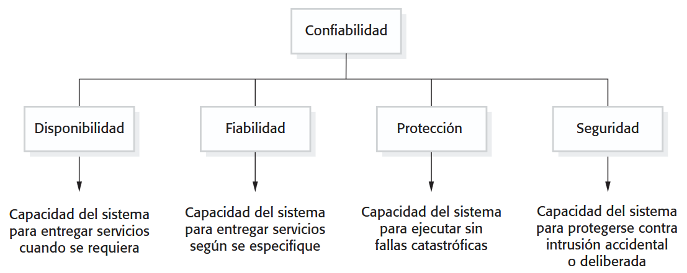
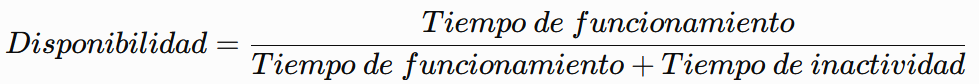
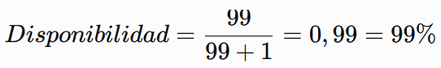

#### Ingeniería de Software

### Unidad III

# Sistemas Críticos

Created by <i class="fab fa-telegram"></i>
[edme88]("https://t.me/edme88")

---

<!--

## Temario

    
### Ingeniería de Software

- Software
- Ingeniería de Software
  - Capas
- Importancia
- Errores de Software
- Costos
- Productos Genéricos
- Productos personalizados

- Disciplinas
- Tipos de aplicaciones
- Actividades
- Atributos Esenciales
- Afecta desarrollo
- Web
- Diseño: Arquitectura
- Atributos de calidad

-->

### Sistemas críticos
Los **sistemas críticos** son sistemas cuya falla puede producir consecuencias graves para las personas, el medio ambiente, la economía, la seguridad o el funcionamiento de una organización. 

Por este motivo, además de cumplir con los requisitos funcionales, deben cumplir requisitos especialmente estrictos relacionados con su confiabilidad, disponibilidad, fiabilidad, seguridad y protección.

----

### Sistemas críticos
Algunos ejemplos son:

- Sistemas de control de aeronaves
- Sistemas de control ferroviario
- Sistemas médicos, como monitores de pacientes o equipos de radioterapia
- Sistemas de control de centrales eléctricas
- Sistemas de emergencia
- Sistemas bancarios y financieros
- Sistemas de control industrial
- Sistemas de comunicaciones de servicios esenciales

---

---

### Confiabilidad de un sistema

La **confiabilidad** *(dependability)* es la capacidad de un sistema de brindar un servicio en el que se pueda confiar.

No se refiere solamente a que el sistema funcione correctamente. Un sistema confiable debe continuar proporcionando un servicio adecuado incluso cuando se producen errores, fallos o situaciones inesperadas.

----

### Confiabilidad de un sistema
La confiabilidad es un concepto amplio que engloba diferentes propiedades, entre ellas:

- **Disponibilidad:** el sistema debe estar disponible cuando se necesita.
- **Fiabilidad:** el sistema debe funcionar correctamente durante un período determinado.
- **Seguridad (safety):** las fallas del sistema no deben provocar consecuencias peligrosas.
- **Protección (security):** el sistema debe evitar accesos, modificaciones o usos no autorizados.

----

### Confiabilidad de un sistema
Por ejemplo, un sistema de control de un tren debe ser confiable porque no basta con que funcione normalmente: también debe comportarse de manera segura cuando alguno de sus componentes falla.

----

### La confiabilidad representa el grado de confianza que podemos depositar en que un sistema prestará correctamente el servicio esperado.

---

### Disponibilidad de un sistema

La **disponibilidad** *(availability)* representa la probabilidad de que un sistema esté operativo y disponible para prestar su servicio cuando sea necesario.

Un sistema puede tener una alta disponibilidad aunque ocasionalmente falle, siempre que pueda recuperarse rápidamente.

----

### Disponibilidad de un sistema
Por ejemplo, un servicio web que funciona durante 23 horas y 59 minutos al día y se recupera rápidamente ante una falla tiene una disponibilidad muy elevada.

----

### Disponibilidad de un sistema
Una forma habitual de expresarla es:

	​

Por ejemplo, si un sistema funciona durante 99 horas y permanece fuera de servicio durante 1 hora:

----

### Disponibilidad de un sistema
La disponibilidad está relacionada principalmente con:
- **Prevención de fallos:** intentar evitar que ocurran.
- **Tolerancia a fallos:** continuar funcionando aunque ocurra un fallo.
- **Recuperación:** volver a funcionar rápidamente después de una falla.

---

### Fiabilidad de un sistema

La **fiabilidad** *(reliability)* es la capacidad de un sistema de funcionar correctamente y sin fallos durante un período determinado y bajo determinadas condiciones.

Un sistema puede fallar, recuperarse rápidamente y volver a funcionar. En ese caso puede tener una alta disponibilidad, pero una fiabilidad menor.

----

### Fiabilidad de un sistema
Por ejemplo:

- **Sistema A:** funciona durante 10 horas, falla durante 1 minuto y vuelve a funcionar.
- **Sistema B:** funciona durante 10 horas y no presenta ninguna falla.

Ambos pueden tener una disponibilidad elevada, pero el Sistema B presenta una mayor fiabilidad durante ese período.

----

### Fiabilidad de un sistema
La fiabilidad es especialmente importante cuando una falla puede tener consecuencias graves.

Por ejemplo, en un sistema de control de una aeronave no es suficiente con que el sistema pueda recuperarse rápidamente: es fundamental que funcione correctamente durante toda la operación.

---

### Disponibilidad vs. fiabilidad

<table>
<thead>
<tr>
<th>Característica</th>
<th>Disponibilidad</th>
<th>Fiabilidad</th>
</tr>
</thead>
<tbody>
<tr>
<td>Pregunta principal</td>
<td>¿Está disponible cuando lo necesito?</td>
<td>¿Funciona correctamente durante el período esperado?</td>
</tr>
<tr>
<td>Se centra en</td>
<td>Tiempo operativo</td>
<td>Ausencia de fallos</td>
</tr>
<tr>
<td>Considera recuperación</td>
<td>Sí, es muy importante</td>
<td>No es su objetivo principal</td>
</tr>
<tr>
<td>Un sistema puede fallar</td>
<td>Sí, si se recupera rápidamente</td>
<td>Idealmente no</td>
</tr>
<tr>
<td>Ejemplo</td>
<td>Servidor que se recupera rápidamente</td>
<td>Servidor que funciona sin fallar</td>
</tr>
</tbody>
</table>

---

### Seguridad (Safety)

La **seguridad** *(safety)* se refiere a la capacidad de un sistema para funcionar sin provocar daños inaceptables a las personas, al medio ambiente o a otros sistemas.

En sistemas críticos, una falla no solamente puede significar que el sistema deje de funcionar. Puede provocar un accidente.

----

### Seguridad

Por ejemplo, consideremos un sistema de control ferroviario.

Si el sistema falla y simplemente deja de mostrar información, tenemos un problema de disponibilidad.

Pero si una falla provoca que dos trenes reciban autorización para ocupar simultáneamente la misma vía, estamos ante un problema de safety, porque la falla puede producir consecuencias peligrosas.

----

### Seguridad (Safety)

La seguridad busca:
- Identificar posibles situaciones peligrosas.
- Analizar las consecuencias de los fallos.
- Reducir la probabilidad de accidentes.
- Diseñar mecanismos para llevar el sistema a un estado seguro.
- Evitar que una falla produzca consecuencias catastróficas.

----

### Seguridad: Ejemplo

Un sistema de control de temperatura industrial puede tener como comportamiento seguro:

Si el sensor de temperatura presenta un valor imposible, el sistema detiene automáticamente el proceso.

En este caso, el sistema sacrifica disponibilidad para mantener la seguridad.

---

### Protección (Security)

La **protección** *(security)* se refiere a la capacidad de un sistema para resistir accesos, usos, modificaciones, destrucción o divulgación no autorizados.

----

### Protección
Está relacionada con amenazas intencionales, como:
- Ataques informáticos.
- Accesos no autorizados.
- Robo de información.
- Modificación de datos.
- Código malicioso.
- Suplantación de identidad.
- Ataques de denegación de servicio.

----

### Protección
La protección busca preservar principalmente:
- **Confidencialidad:** solamente las personas autorizadas pueden acceder a la información.
- **Integridad:** la información no puede ser modificada de manera no autorizada.
- **Disponibilidad:** los servicios y datos deben permanecer accesibles para quienes están autorizados.

----

### Protección: Ejemplo

En un sistema bancario:
- Un usuario no autorizado no debe poder consultar una cuenta **→ confidencialidad**.
- Un atacante no debe poder modificar el saldo **→ integridad**.
- Los clientes deben poder utilizar el servicio cuando lo necesitan **→ disponibilidad**.

----

### Safety vs Security
<table>
<thead>
<tr>
<th>Concepto</th>
<th>Safety</th>
<th>Security</th>
</tr>
</thead>
<tbody>
<tr>
<td>Objetivo</td>
<td>Evitar daños o accidentes</td>
<td>Evitar acciones no autorizadas</td>
</tr>
<tr>
<td>Amenaza principal</td>
<td>Fallos, errores, accidentes</td>
<td>Ataques y accesos maliciosos</td>
</tr>
<tr>
<td>Ejemplo</td>
<td>Evitar que un tren avance con una señal incorrecta</td>
<td>Evitar que alguien modifique la señal</td>
</tr>
<tr>
<td>Pregunta</td>
<td>¿Puede el sistema provocar un daño?</td>
<td>¿Puede alguien comprometer el sistema?</td>
</tr>
</tbody>
</table>

----

### Safety vs Security
Una falla de hardware puede afectar al **safety**, mientras que un atacante que modifica deliberadamente el comportamiento del sistema afecta al **security**.

Ambos aspectos pueden estar relacionados. Por ejemplo, un atacante que consigue modificar un sistema de control industrial podría provocar una situación peligrosa.

---

### Ejemplo integrador
<!-- .slide: style="font-size: 0.80em" -->
Consideremos un sistema de control de una central eléctrica:
- **Fiabilidad:** debe funcionar correctamente durante largos períodos.
- **Disponibilidad:** debe estar operativo cuando se necesita controlar la instalación.
- **Safety:** una falla no debe provocar una situación peligrosa.
- **Security:** una persona no autorizada no debe poder modificar el sistema.
- **Confiabilidad:** el conjunto de estas propiedades permite confiar en que el sistema prestará su servicio de manera adecuada.

Por lo tanto, en un sistema crítico no alcanza con que el sistema "funcione". Es necesario determinar qué ocurre cuando algo falla, cuando el sistema es atacado y cuando se producen situaciones inesperadas.

---

## ¿Dudas, Preguntas, Comentarios?

