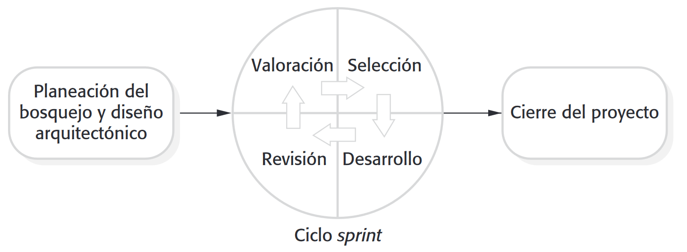

# Ingeniería de Software
## Desarrollo Ágil de Software
Created by <i class="fab fa-telegram"></i>
[edme88]("https://t.me/edme88")

---
<!-- .slide: style="font-size: 0.60em" -->

## Temario

### Desarrollo Ágil de Software
* Definición
* Manifiesto Ágil
* Aplicabilidad
* Problemas
* Mantenimiento
* Desarrollo Guiado por Plan
* Cuestiones técnicas, humanas y organizacionales
* Programación Extrema
* Escenarios de Requerimientos
* Refactorización
* Pruebas

* Automatización de Pruebas
* Programación en pares
* Gestión Ágil
* Scrum
* Ciclo Sprint
* Beneficios de Scrum
* Desarrollo de Sistemas Grandes

---
### Desarrollo ágil de software
<!-- .slide: style="font-size: 0.80em" -->
* El rápido desarrollo y la entrega son ahora los
requisitos más importantes para los sistemas de software
  * Los requisitos de las empresas cambian rápidamente y es
prácticamente imposible producir un conjunto de requerimientos de software estable.
  * El Software tiene que evolucionar rápido para reflejar los cambios en las necesidades del negocio.

---
### Desarrollo ágil de software
<!-- .slide: style="font-size: 0.90em" -->
Aunque existen muchos enfoques para el desarrollo ágil, todos comparten ciertas características:
1. Especificación, diseño e implementación estan entrelazados
2. El sistema se desarrolla en diferentes versiones. Se pueden proponer cambios y nuevos requerimientos en versiones posteriores.
3. Las interfaces del usuario se desarrollan a menudo utilizando un IDE y herramientas gráficas
4. Se emplea desarrollo incremental
5. Se involucra al cliente en el desarrollo
6. Poca documentación

---
### Métodos Ágiles
<!-- .slide: style="font-size: 0.80em" -->
* La insatisfacción con los gastos involucrados en los métodos
de diseño de software de los años 1980 y 1990 dieron lugar a la
creación de métodos ágiles. Estos métodos:
  * Se enfocan en el código en lugar del diseño
  * Se basan en un enfoque iterativo para el desarrollo de software
  * Tienen la intencion de ofrecer software de trabajo de forma rápida y
evolucionar rápidamente para satisfacer las cambiantes necesidades.
* El objetivo de los métodos ágiles es reducir los gastos
generales del proceso de software (por ejemplo, limitando la
documentación) y ser capaces de responder rápidamente a las
necesidades cambiantes sin rehacer trabajo de manera
excesiva

---
#### Manifiesto Ágil: Valores

---
### Métodos Ágiles: Ejemplos
* Programación Extrema (Beck)
* Scrum (Cohn, Schwaber, Beedle)
* Crystal (Cockburn)
* ASD - Desarrollo de Software Adaptativo (Highsmith)
* DSDM - Desarrollo de Sistemas Dinámicos (Stapleton)
* FDD - Desarrollo dirigido por características (Palmer y Felsing)

---

### Principios de los métodos ágiles
<!-- .slide: style="font-size: 0.60em" -->
<!--
| Principio | Descripción                                                                                                                                                                                     |
|-----------|-------------------------------------------------------------------------------------------------------------------------------------------------------------------------------------------------|
| Participación del Cliente | Los clientes deben intervenir estrechamente durante el proceso de desarrollo. Su función consiste en ofrecer y priorizar nuevos requerimientos del sistema y evaluar las iteraciones del mismo. |
| Entrega Incremental | El software se desarrolla en incrementos y el cliente especifica los requerimientos que se van a incluir en cada incremento.                                                                    |
| Personas, no procesos | Tienen que reconocerse y aprovecharse las habilidades del equipo de desarrollo. Debe permitirse a los miembros del equipo desarrollar sus propias formas de trabajar sin procesos establecidos. |
| Adoptar el cambio | Esperar a que cambien los requerimientos del sistema y, de este modo, diseñar el sistema para adaptar dichos cambios |
| Mantener simplicidad | Enfocarse en la simpliciddad tanto en el software a desarrollar como en el proceso de desarrollo. Siempre que sea posible, trabajar de manera activa para eliminar la complejidad del sistema |
-->
<table>
<thead>
<tr>
<th>Principio</th>
<th>Descripción</th>
</tr>
</thead>
<tbody>
<tr>
<td>Participación del Cliente</td>
<td>Los clientes deben intervenir estrechamente durante el proceso de desarrollo. Su función consiste en ofrecer y priorizar nuevos requerimientos del sistema y evaluar las iteraciones del mismo.</td>
</tr>
<tr>
<td>Entrega Incremental</td>
<td>El software se desarrolla en incrementos y el cliente especifica los requerimientos que se van a incluir en cada incremento.</td>
</tr>
<tr>
<td>Personas, no procesos</td>
<td>Tienen que reconocerse y aprovecharse las habilidades del equipo de desarrollo. Debe permitirse a los miembros del equipo desarrollar sus propias formas de trabajar sin procesos establecidos.</td>
</tr>
<tr>
<td>Adoptar el cambio</td>
<td>Esperar a que cambien los requerimientos del sistema y, de este modo, diseñar el sistema para adaptar dichos cambios</td>
</tr>
<tr>
<td>Mantener simplicidad</td>
<td>Enfocarse en la simpliciddad tanto en el software a desarrollar como en el proceso de desarrollo. Siempre que sea posible, trabajar de manera activa para eliminar la complejidad del sistema</td>
</tr>
</tbody>
</table>

---
### Aplicabilidad del método ágil
* Desarrollo de productos, donde una compañía de software está desarrollando un producto de pequeño o mediano tamaño para la venta.
* El desarrollo de sistemas a medida para una organización, donde hay un claro compromiso por parte del cliente para participar en el proceso de desarrollo y donde
no hay muchas reglas y regulaciones externas que afectarán el software.
* Pequeños equipos, bien integrados. Hay problemas en la ampliación de los métodos ágiles a grandes sistemas

---
### Problemas con métodos ágiles
* Puede ser difícil mantener el interés de los clientes que están involucrados en el proceso.
* Los miembros del equipo pueden ser inadecuados para la intensa participación que caracteriza a los métodos ágiles.
* Priorizar cambios puede ser difícil donde hay múltiples partes interesadas.
* Mantener simplicidad requiere un trabajo extra
* Los contratos pueden ser un problema

---
### Los métodos ágiles y el mantenimiento de Software
<!-- .slide: style="font-size: 0.80em" -->
* La mayoría de las organizaciones gastan más en el mantenimiento del software existente que en el desarrollo de nuevo software.
* Los métodos ágiles deben facilitar tanto el mantenimiento como el desarrollo inicial.
* Dos problemas fundamentales:
  * ¿Son mantenibles los sistemas desarrollados con metodologias ágiles?
  * ¿se pueden utilizar los métodos ágiles con eficacia para la evolución de un sistema?

**Pueden surgir problemas si el equipo de desarrollo original no puede mantenerse.**

---

### Ejercicio
<!-- .slide: style="font-size: 0.90em" -->
De los siguientes sistema, piense que metodología se adapta mejor a su desarrollo, ágil o dirigida por plan:
1. Sistema de Control de Tráfico Aéreo <!--cascada-->
2. Aplicación Móvil de Redes Sociales <!--ágil-->
3. Sistema de Gestión de Historias Clínicas Electrónicas (HCE) <!--cascada-->
4. Sitio Web de Comercio Electrónico para una Startup <!--ágil-->
5. Software de Navegación para Vehículos Autónomos <!--cascada-->
6. Aplicación para la Gestión de Proyectos en una Empresa <!--ágil-->
7. Sistema de Control de Calidad en una Planta de Manufactura <!--cascada-->
8. Plataforma de Educación en Línea <!--ágil-->

---
### Desarrollo guiado por plan y el desarrollo ágil
<!-- .slide: style="font-size: 0.80em" -->
#### Desarrollo guiado por plan:
* Identifica etapas separadas en el proceso de software con salidas asociadas a cada etapa. 
* Las salidas de una etapa se usan como base para planear la siguiente actividad del proceso. 
* Las iteraciones se producen dentro de las actividades.

#### Desarrollo Ágil
* Especificación, diseño, implemetación y pruebas estan intercalados.

**La mayoría de los proyectos de software incluyen prácticas de los enfoques ágil y basado en plan**

----

### Desarrollo guiado por plan y el desarrollo ágil

---
### Cuestiones técnicas, humanas y organizacionales
<!-- .slide: style="font-size: 0.80em" -->
* La mayoría de los proyectos incluyen elementos del guiado por plan y procesos ágil.
* La decisión depende de:
  1. ¿Es importante contar con una especificación y diseño muy detallado antes de pasar a la implementación? Si es así, utilizar un enfoque guiado por plan.
  2. ¿Puede realizarse una estrategia de entrega incremental? Si es así, considere el uso de los métodos ágiles.
  3. ¿Qué tan grande es el sistema que se está desarrollando? Los métodos ágiles son más eficaces cuando el sistema se puede
desarrollar con un equipo pequeño que pueda comunicarse de manera informal. Esto puede no ser posible para los grandes
sistemas que requieren equipos de desarrollo grandes y distribuidos.

----

### Cuestiones técnicas, humanas y organizacionales
<!-- .slide: style="font-size: 0.70em" -->
4. ¿Qué tipo de sistema se está desarrollando?
  * Los enfoques guiado por plan pueden ser necesarios para los sistemas que requieren una gran cantidad de análisis antes 
de la aplicación (por ejemplo, sistema en tiempo real con complejos Requisitos de temporización).
5. ¿Cuál es la expectativa de vida del sistema?
  * Los sistemas de larga vida requieran mas documentación de diseño para comunicar las intenciones originales de los desarrolladores del
sistema al equipo de soporte.
6. ¿Qué tecnologías están disponibles para apoyar el desarrollo del sistema?
  * Los métodos ágiles se basan en buenas herramientas para realizar un seguimiento de la evolución de un diseño
7. ¿Cómo se organiza el equipo de desarrollo?
  * Si el equipo de desarrollo se distribuye o si parte del desarrollo se subcontrata, entonces son necesarios los 
documentos de diseño para comunicar a los equipos de desarrollo.

----

### Cuestiones técnicas, humanas y organizacionales
<!-- .slide: style="font-size: 0.80em" -->
8. ¿Hay cuestiones culturales o de organización que puedan afectar al desarrollo del sistema?
  * Las organizaciones tradicionales tienen una cultura basada en el planes.
9. ¿Qué tan buenos son los diseñadores y programadores del equipo de desarrollo?
  * A veces se argumenta que los métodos ágiles requieren niveles más altos de capacitación que los enfoques basados en 
planes, en el que los programadores simplemente traducen un diseño detallado en código.
10. ¿El sistema está sujeto a regulación externa?
  * Si un sistema tiene que ser aprobado por un regulador externo (por ejemplo, que el FAA aprueba el software crítico 
para el funcionamiento de una aeronave) entonces se debe producir documentación detallada .

---
### Programación extrema
Tal vez el más conocido y más utilizado método ágil.

Extreme Programming (XP) :
* Las nuevas versiones se pueden construir varias veces al día;
* Los incrementos se entregan a los clientes cada 2 semanas;
* Todas las pruebas se deben ejecutar para cada iteracion y la integracion sólo se acepta si las pruebas resultan satisfactorias.

----

#### Ciclo de liberación de Programación extrema

---
### XP y principios ágiles
1. **Participación del cliente:** un compromiso a tiempo completo del cliente con el equipo
2. **Entrega incremental:** el desarrollo incremental es apoyado a través pequeños sistemas de comunicación frecuentes.
3. **Personas no procesos:** a través de la programación en pares y propiedad colectiva del codigo.
4. **Adoptar el cambio:** Cambios soportados a través sistemas regulares de comunicación.
5. **Mantener la simplicidad:** refactorizacion constante de código.

---
### Prácticas de Extreme programming
<!-- .slide: style="font-size: 0.60em" -->

<!--
| Principio o práctica              | Descripción                                                                                                                                                                                                                  |
|-----------------------------------|------------------------------------------------------------------------------------------------------------------------------------------------------------------------------------------------------------------------------|
| Planificación Incremental         | Los requisitos se graban en historiales y las historias son incluidas en una publicación determinada por el tiempo disponible y su prioridad relativa. Los desarrolladores rompen esta historias en el desarrollo de tareas. |
| Incrementos pequeños              | El mínimo conjunto útil de funcionalidad que ofrece valor al negocio es desarrollado primero. Se añaden funcionalidades frecuentes e incrementales en cada versión del sistema desde la primera vez.                         |
| Diseño Simple                     | El diseño suficiente se lleva a cabo para satisfacer las necesidades actuales y no más.                                                                                                                                      |
| Desarrollo de las pruebas primero | Un marco de pruebas unitarias automatizadas es usado para escribir pruebas para una nueva función antes de que la funcion  sea implementada.                                                                                 |
| Refactorizacion                   | Se espera de todos los desarrolladores de reconstruir el código continuamente ni bien las mejoras se hallan. Esto mantiene el código simple y mantenible.                                                                    |
-->
<table>
<thead>
<tr>
<th>Principio o práctica</th>
<th>Descripción</th>
</tr>
</thead>
<tbody>
<tr>
<td>Planificación Incremental</td>
<td>Los requisitos se graban en historiales y las historias son incluidas en una publicación determinada por el tiempo disponible y su prioridad relativa. Los desarrolladores rompen esta historias en el desarrollo de tareas.</td>
</tr>
<tr>
<td>Incrementos pequeños</td>
<td>El mínimo conjunto útil de funcionalidad que ofrece valor al negocio es desarrollado primero. Se añaden funcionalidades frecuentes e incrementales en cada versión del sistema desde la primera vez.</td>
</tr>
<tr>
<td>Diseño Simple</td>
<td>El diseño suficiente se lleva a cabo para satisfacer las necesidades actuales y no más.</td>
</tr>
<tr>
<td>Desarrollo de las pruebas primero</td>
<td>Un marco de pruebas unitarias automatizadas es usado para escribir pruebas para una nueva función antes de que la funcion  sea implementada.</td>
</tr>
<tr>
<td>Refactorizacion</td>
<td>Se espera de todos los desarrolladores de reconstruir el código continuamente ni bien las mejoras se hallan. Esto mantiene el código simple y mantenible.</td>
</tr>
</tbody>
</table>

----

### Prácticas de Extreme programming
<!-- .slide: style="font-size: 0.60em" -->
<!--
| Principio o práctica           | Descripción                                                                                                                                                                                                                                                                                               |
|--------------------------------|-----------------------------------------------------------------------------------------------------------------------------------------------------------------------------------------------------------------------------------------------------------------------------------------------------------|
| Programación en pares          | Los desarrolladores trabajan en parejas , revisando el trabajo mutuamente y dandose apoyo para hacer siempre un buen trabajo.                                                                                                                                                                             |
| Propiedad colectiva del código | La pareja de desarrolladores trabaja en todas las áreas del sistema, para que no queden islas de conocimiento desarrolladas y todos los desarrolladores asumen responsabilidad por todo el código. Nadie puede cambiar nada.                                                                              |
| Integración continua           | Tan pronto como el trabajo en una tarea esta completo, es integrado en el sistema. Luego de cada integración, se corren todas las pruebas unitarias.                                                                                                                                                      |
| Ritmo sostenible               | Grandes cantidades de horas extras no se consideran aceptables como el efecto neto es a menudo para reducir la calidad del código y mediana productividad                                                                                                                                                 |
| Cliente en el sitio            | Un representante de los usuarios finales del sistema (el cliente) debe estar disponible a tiempo completo para el equipo de XP. En un proceso de programación extrema, el cliente es miembro del equipo de desarrollo y es responsable de llevar requisitos del sistema para el equipo de implementación. |
-->
<table>
<thead>
<tr>
<th>Principio o práctica</th>
<th>Descripción</th>
</tr>
</thead>
<tbody>
<tr>
<td>Programación en pares</td>
<td>Los desarrolladores trabajan en parejas , revisando el trabajo mutuamente y dandose apoyo para hacer siempre un buen trabajo.</td>
</tr>
<tr>
<td>Propiedad colectiva del código</td>
<td>La pareja de desarrolladores trabaja en todas las áreas del sistema, para que no queden islas de conocimiento desarrolladas y todos los desarrolladores asumen responsabilidad por todo el código. Nadie puede cambiar nada.</td>
</tr>
<tr>
<td>Integración continua</td>
<td>Tan pronto como el trabajo en una tarea esta completo, es integrado en el sistema. Luego de cada integración, se corren todas las pruebas unitarias.</td>
</tr>
<tr>
<td>Ritmo sostenible</td>
<td>Grandes cantidades de horas extras no se consideran aceptables como el efecto neto es a menudo para reducir la calidad del código y mediana productividad</td>
</tr>
<tr>
<td>Cliente en el sitio</td>
<td>Un representante de los usuarios finales del sistema (el cliente) debe estar disponible a tiempo completo para el equipo de XP. En un proceso de programación extrema, el cliente es miembro del equipo de desarrollo y es responsable de llevar requisitos del sistema para el equipo de implementación.</td>
</tr>
</tbody>
</table>

---
### Escenarios de los requerimientos
* En XP, el cliente o usuario es parte del equipo y es responsable de tomar decisiones sobre los requisitos
* Solicitudes de los usuarios se expresan como escenarios o historias del usuario.
* Las historias de Usuario se dividen y plasman en tareas. Estas tareas son la base del calendario y de la estimación de los costos.
* El cliente elige las historias para su inclusión en el próximo incremento en base a sus prioridades y calendario.

---

<!-- .slide: style="font-size: 0.57em" -->

### Una historia para “Prescripción de medicamentos”
Kate es una médica que quiere prescribir fármacos a un paciente que se atiende en una clínica. El archivo del paciente
ya se desplegó en su computadora, de manera que da click en el campo del medicamente y luego puede seleccionar 
"medicamento actual", "medicamento nuevo" o "formulario".

Si selecciona "medicamento actual", el sistema le pude comprobar la dosis. Si quiere cambiar la dosis, ingresa la dosis
y luego confirma la prescripción.

Si elige "medicamento nuevo", el sistema supone que Kate sabe cuál medicamento prescribir. Ella teclea las primera
letras del nombre del medicamento. El sistema muestra una lista de medicamentos posibles cuyo nombre inicia con esas
letras. Posteriormente elige el fármaco requerido y el sistema responde solicitándole que verifique que el medicamento
seleciconado sea el correcto. Ella ingresa la dosis y luego confirma la prescripción.
Si Kate elige "formulario", el sistema muestra un recuadro de búsqeuda para el formulario aprobado. Entonces busca el
medicamento requerido. Ella selecciona un medicamento y el sistema le pide comprobar que éste sea el correcto. Luego
ingresa la dosis y confirma la prescripción.

El sistema siempre verifica que la dosis esté dentro del rango aprobado. Si no es así, le pide a Kate que la modifique.
Después de que ella confirma la prescripción, se desplegará para su verificación. Kate hace click o en "OK" o en "Cambiar".
Si hace click en "OK", la prescripción se registra en la base de datos de auditoría. Si hace lcick en "Cambiar", 
reingresa al proceso de "prescripción de medicamento".

---
### Ejemplos de tarjetas de tareas para la prescripción de medicamentos
<!-- .slide: style="font-size: 0.80em" -->
1. Cambiar dosis del medicamento prescripto
2. Selección de formulario
3. Validación de dosis

La verificación de dosis es una prevención de seguridad para comprobar que el médico no prescribe una dosis
riesgosamente pequeña o grande.
Al usar el ID del formulario para el nombre genérico del medicamento, busca el formulario y recupera las dosis, máxima
y mínima, recomendadas.
Verifica la dosis prescrita contra el mínimo y el máximo. Si está fuera de rango, emite un mensaje de error señalando
que la dosis es muy alta o muy baja.
Si está dentro del rango, habilita el botón "Confirmar".

---
### XP y el cambio
* La sabiduría convencional en la ingeniería de software es diseñar para el cambio. Sostiene que vale la pena el gasto de
tiempo y esfuerzo anticipando los cambios ya que esto reduce costos más tarde.
* XP sostiene que no vale la pena anticipar los cambios ya que cambios no se pueden prever de forma fiable
* Propone la mejora constante de código (refactorización) para poder realizar cambios más fácilmente.

---
### Refactorizacion
* El equipo de programación busca posibles mejoras de código y realiza las mejoras aunque no sean de inmmediata necesidad.
* Esto mejora la comprensibilidad del software y reduce la necesidad de documentación.
* Los cambios son más fáciles de hacer ya que el código está bien estructurado y claro.
* Sin embargo, algunos cambios requieren reconstrucción de la arquitectura y esto es mucho más caro

---
### Ejemplos de Refactorizacion
* Re-organización de una jerarquía de clases para eliminar código duplicado.
* Ordenar y cambiar el nombre de los atributos y métodos para facilitar su comprensión.
* La sustitución de líneas de código con llamadas a métodos que se han incluido en una biblioteca de programas.

---
### Las pruebas en XP
<!-- .slide: style="font-size: 0.90em" -->
* Las Pruebas son fundamentales para XP. El software se comprueba después de que cada cambio.
* Funciones de prueba de XP:
  * Desarrollo de las pruebas en primer lugar
  * Desarrollo de pruebas incrementales de escenarios.
  * Participación de los usuarios en el desarrollo de la prueba y validación.
  * Juego de pruebas automatizadas que se utilizan para ejecutar todas las pruebas de componentes cada vez que una nueva versión está construida.

---
### Desarrollo de las pruebas primero
<!-- .slide: style="font-size: 0.90em" -->
* Escribir pruebas antes del código aclara los requisitos para ser implementados.
* Las pruebas se escriben como programas en lugar de datos de manera que se pueden ejecutar de forma automática. La prueba incluye una comprobación de que se ha ejecutado correctamente.
  * Por lo general, se basa en un marco de pruebas tales como Junit.
* Todas las pruebas anteriores y las nuevas se ejecutan automáticamente cuando se añade una nueva funcionalidad, comprobando así que la nueva funcionalidad no ha introducido errores.

---
### Participación de los clientes
<!-- .slide: style="font-size: 0.90em" -->
* El papel del cliente en el proceso de pruebas es ayudar desarrollar pruebas de aceptación de las historias que han de
ser implementadas en la próxima versión del sistema
* El cliente que es parte del equipo de pruebas, escribe pruebas simultáneamente al desarrollo. Por consiguiente, todo nuevo
código es validado para asegurarse de que es lo que necesita el cliente.
* Problemas: las personas que adoptan el papel de clientes disponen de limitado tiempo. Ellos pueden sentir que la
presentación de la requisitos era suficiente contribución y por tanto pueden ser reacios a involucrarse en el proceso de
prueba.

---
### Descripción del caso de prueba para la comprobación de dosis
<!-- .slide: style="font-size: 0.70em" -->
Prueba 4: Comprobación de dosis
Entrada: 
1. Un número en mg que represente una sola dosis del medicamento.
2. Un número que signifique el número de dosis individuales por día.

Pruebas:
1. Probar las entradas donde la dosis individual sea correcta, pero la frecuencia muy elevada.
2. Probar las entradas donde la dosis individual sea muy alta y muy baja.
3. Probar las entradas donde la dosis individual x frecuencia sea muy alta o muy baja.
4. Probar las entradas donde la dosis individual x frecuencia esté en el rango permitido.

Salida: 
OK o mensaje de error que indique que la dosis está fuera del rango de seguridad.

---
### La automatización de pruebas
<!-- .slide: style="font-size: 0.80em" -->
* La automatización de pruebas significa que las pruebas se escriben como componentes ejecutables antes de que la tarea se implemente
  * Estos componentes de prueba deben ser independientes, deberían
simular la presentación de la entrada para ser probado y debe comprobar que el resultado cumple con las especificaciones de salida.
Un marco de prueba automatizada (por ejemplo Junit) es un sistema que hace que sea fácil escribir y ejecutar pruebas
* Cuando se automatizan las pruebas, siempre hay un conjunto de pruebas que puede ser rápida y fácilmente ejecutado
  * Siempre que se agrega alguna funcionalidad al sistema, las pruebas de
regresión se deben corren y si el nuevo código introdujo problemas se identifican inmediatamente

---
### Dificultades en pruebas XP
<!-- .slide: style="font-size: 0.80em" -->
* Los programadores prefieren la programación a las pruebas y a veces se toman atajos al escribir pruebas. Por
ejemplo, pueden escribir pruebas incompletas que no comprueban todas las posibles excepciones que puedan ocurrir.
* Algunas pruebas pueden ser muy difíciles de escribir de forma incremental. Por ejemplo, en una interfaz de usuario
compleja, es a menudo difícil de escribir pruebas unitarias para el código que implementa la 'lógica de visualización 
"y flujo de trabajo entre las pantallas
* Es difícil juzgar la integridad de un conjunto de pruebas. Aunque se tengan muchas pruebas, la prueba de conjunto
puede no proporcionar una cobertura completa.

---
### Programación en pares
* En XP, los programadores trabajan en parejas, sentados juntos a desarrollar código.
* Esto ayuda a desarrollar la propiedad común de código y difunde el conocimiento a través del equipo.
* Sirve como un proceso de revisión informal, ya que cada línea de código es visto por más de 1 persona.
* Alienta a la refactorización.
* Las mediciones muestran que la productividad de desarrollo con la programación par es similar a la de dos
personas trabajando en paralelo

---
### Programación en pares
<!-- .slide: style="font-size: 0.80em" -->
* En la programación en pares, los programadores se sientan juntos en la misma estación de trabajo para desarrollar el
software.
* Las parejas se crean dinámicamente para que todos los miembros del equipo trabajen unos con otros durante el proceso
de desarrollo.
* El intercambio de conocimientos que sucede entre la pareja durante la programación es muy importante, ya que reduce
riesgos para el proyecto cuando algún miembro del equipo se va.
* La programación en parejas no es necesariamente ineficiente y no hay evidencia que trabajar juntos es más eficiente que 2
programadores por separado

---
### Ventajas de la programación en parejas
<!-- .slide: style="font-size: 0.80em" -->
* Apoya la idea de la propiedad y responsabilidad colectiva.
  * Los individuos no son responsables de los problemas con el código. En su lugar, el equipo tiene la responsabilidad 
colectiva para resolver estos problemas
  * Actúa como un proceso de revisión informal, ya que cada línea de código se mira por al menos dos personas.
* Ayuda apoyando a la refactorizacion, que es un proceso de mejora de software.
  * Cuando se utiliza la programación en pares y la propiedad
colectiva, otros se benefician inmediatamente de la refactorización de modo que es probable que apoyen el proceso.

---
### Gestión de proyectos ágil
<!-- .slide: style="font-size: 0.90em" -->
* La principal responsabilidad de los directores de proyectos de software es la gestión del proyecto para que
el software se entregue a tiempo y dentro del presupuesto previsto para el proyecto
* El enfoque estándar para la gestión de proyectos es dirigido por plan. Gerentes elaboran un plan para el
proyecto determinando qué debería ser entregado, cuándo debería ser entregado y quién trabajara en el desarrollo del
proyecto
* La gestión de proyectos ágil requiere un enfoque diferente, adaptado para desarrollo incremental y la
fortalezas particulares de los métodos ágiles.

---
### Scrum
<!-- .slide: style="font-size: 0.80em" -->
El enfoque de Scrum es un método ágil, su atención se centra en la gestión del desarrollo iterativo

Hay tres fases en Scrum.
1. La **fase inicial** es una fase en fase de anteproyecto, donde se establecen los objetivos generales del proyecto y 
se diseña la arquitectura de software.
2. Esto es seguido por una serie de **ciclos**, donde cada ciclo desarrolla un incremento del sistema.
3. La **fase de cierre** del proyecto concluye el proyecto, completa documentación requerida, tales como marcos de ayuda del
sistema y manuales de usuario y evalúa las lecciones aprendidas del proyecto.

---
### El Ciclo de Sprint
* Los Sprints son de longitud fija, normalmente 2-4 semanas. Ellos corresponden al desarrollo de una versión del sistema en XP.
* El punto de partida para la planificación es la la lista de tareas a realizar en el proyecto.
* La fase de selección involucra a todo el equipo del proyecto, que trabajan con el cliente para seleccionar las
funcionalidades que se desarrollará durante el sprint.

----

### El Ciclo de Sprint
* Una vez que éstos están de acuerdo, el equipo se organizan para desarrollar el software. Durante esta etapa,
el equipo está aislado del cliente y la organización, con toda comunicaciones canalizadas a través del denominado
'Scrum Master‘.
* El papel del Scrum Master es proteger el equipo de desarrollo de las distracciones externas.
* Al final del sprint, el trabajo realizado es revisado y se presenta a las partes interesadas. El siguiente ciclo de
sprint comienza entonces

---
### Trabajo en equipo en Scrum
<!-- .slide: style="font-size: 0.90em" -->
* El 'Scrum Master' es un facilitador que organiza reuniones diarias, rastrea la lista de trabajos por hacer,
registra las decisiones, mide el progreso y se comunica con los clientes y la gestión fuera del equipo.
* Todo el equipo asiste a las reuniones diarias cortas donde todos los miembros del equipo comparten
información, describen su progreso desde la última reunión, los problemas que han surgido y que se ha
previsto para el día siguiente.

**Esto significa que todos en el equipo saben lo que está pasando y, si surgen problemas, puede volver a planear el
trabajo a corto plazo para hacer frente a ellos.**

---
### Beneficios de Scrum
* El producto se divide en un conjunto de fragmentos manejables y comprensibles.
* Requisitos inestables son mas manejables.
* Todo el equipo tiene visibilidad de todo y por lo tanto se mejora la comunicación del equipo.
* Los clientes ven la entrega a tiempo y se obtiene retroalimentación sobre cómo funciona el producto.
* Se genera confianza entre los clientes y los desarrolladores . Se crea una cultura positiva en la que
todos esperan que el proyecto tenga éxito.

---
### Escala métodos ágiles
<!-- .slide: style="font-size: 0.90em" -->
* Los métodos ágiles han demostrado ser un éxito para los proyectos pequeños y medianos que pueden ser
desarrolladas por un equipo pequeño co-ubicado.
* A veces se argumenta que el éxito de estos métodos viene a causa de la mejora de las comunicaciones, que
es posible cuando todos trabajan juntos.
* La ampliación de los métodos ágiles implica el cambio de éstos para hacer frente a grandes proyectos, más
largos, en los que hay varios equipos de desarrollo, tal vez trabajando en diferentes lugares.

---
### Desarrollo de sistemas grandes
<!-- .slide: style="font-size: 0.80em" -->
* Los grandes sistemas suelen ser colecciones de sistemas de independientes en los que equipos separados desarrollan cada
sistema. Con frecuencia, estos equipos están trabajando en diferentes lugares, a veces en diferentes zonas horarias.
* Los sistemas grandes son "sistemas abandonados”, que interactúan con una serie de sistemas existentes. Muchos de los requisitos del
sistema tienen que ver con esta interacción por lo que no se prestan realmente a la flexibilidad y el desarrollo incremental.
* Si varios sistemas se integran para crear un sistema, una parte importante del desarrollo tiene que ver con la configuración del sistema
en lugar de desarrollo de código inicial.

----

### El desarrollo del sistemas grandes
<!-- .slide: style="font-size: 0.90em" -->
* Grandes sistemas y sus procesos de desarrollo estan a menudo limitados por las reglas y regulaciones externas
que limitan la forma en que se pueden desarrollar.
* Los sistemas grandes tienen un tiempo de desarrollo largo. Es difícil mantener equipos coherentes que conocen
el sistema a lo largo de ese período ya que, inevitablemente, la gente se mueve a otros trabajos y proyectos.
* Los sistemas grandes suelen tener un conjunto diverso de partes interesadas. Es prácticamente imposible incluir
todas estas diferentes partes interesadas en el proceso de desarrollo.

---
### El escalado horizontal y la ampliación
<!-- .slide: style="font-size: 0.90em" -->
* La "expansión" tiene que ver con el uso de los métodos ágiles de desarrollo de sistemas de software grandes que
no pueden ser desarrollados por un equipo pequeño.
* La "ampliación“ se refiere a cómo los métodos ágiles pueden introducirse a través de una gran organización con
muchos años de experiencia en desarrollo de software.
* Al escalar los métodos ágiles es esencial mantener los fundamentos ágiles
  * Planificación flexible, versiones frecuentes del sistema, integración continua, desarrollo basado en pruebas y
las buenas comunicaciones del equipo.

---
### La expansión para los grandes sistemas
<!-- .slide: style="font-size: 0.90em" -->
* Para el desarrollo de grandes sistemas, no es posible centrarse únicamente en el código del sistema. Se tiene
que hacer diseño y documentación.
* Mecanismos de comunicación entre los equipos tienen que ser diseñados y utilizados. Este procedimiento incluirá
conferencias telefónicas y de vídeo regulares y frecuentes donde los equipos se actualizan entre sí sobre los
progresos.
* La integración continua, donde se revisa cada vez cualquier desarrollador realiza un cambio es
prácticamente imposible.

---
### La ampliación a grandes empresas
<!-- .slide: style="font-size: 0.80em" -->
* Los administradores de proyectos que no cuentan con experiencia en métodos ágiles pueden ser reacios a aceptar el 
riesgo de un nuevo enfoque.
* Las grandes organizaciones suelen tener procedimientos y normas de calidad que se espera que todos los proyectos sigan 
y, por su carácter burocrático, éstos tienden a ser incompatibles con los métodos ágiles.
* Los métodos ágiles parecen funcionar mejor cuando los miembros del equipo tienen un nivel relativamente alto de 
habilidad. Sin embargo, dentro de las grandes organizaciones, lo mas probable es que se tenga
una amplia gama de habilidades y capacidades.
* Existe resistencia cultural a los métodos ágiles, especialmente en aquellas organizaciones que tienen una larga 
historia de uso de los procesos de ingeniería de sistemas convencionales.

---
### El Proceso Scrum

---
## ¿Dudas, Preguntas, Comentarios?

