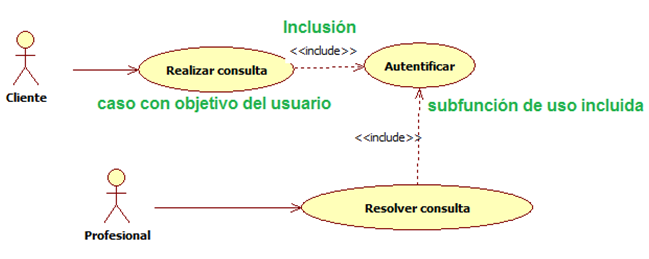

# Ingeniería de Software
## UML: Casos de Uso
Created by <i class="fab fa-telegram"></i>
[edme88]("https://t.me/edme88")

---
### Diagramas de Caso de Uso
Ayudan a determinar la funcionalidad y características del software desde la perspectiva del usuario.

Un caso de uso describe la manera en la que un usuario interactúa con el sistema, definiendo
los pasos requeridos para lograr una meta específica.

---

---
### Diagramas de Caso de Uso
El diagrama se compone:
* **Actores**: Persona que interactúa con el sistema (puede tener diversos roles).
* **Casos de Uso**: Ovalos, acciones que se pueden realizar.
* **Limites**: Rectángulo que engloba a los casos de uso.
* Relaciones entre casos de uso

---
### CU: Límites
Límites del sistema a construir.
El sujeto o límite se define:
* Quién o qué utilizará el sistema
* Que beneficios ofrece el sistema

---
### CU: Actores
* Rol que cierta entidad externa adopta para interactuar con el sistema.
* Puede ser: Rol de usuario, otro sistema, un hardware e incluso el tiempo.
* El actor es siempre EXTERNO al sistema.

---
### CU: Caso de Uso
* Interacción entre el Sistema (o subsistema) y un actor externo
* Una especificación de secuencias de acciones
* Incluye variantes y secuencias de error
* Son iniciados siempre por un actor

---
### Modelado avanzado de Caso de uso
Tiene en cuenta:
* Generalización del actor
* Generalización del Caso de Uso
* Relación _include_
* Relación _extend_

---
### CU Avanzado: Generalización del actor
Se emplea cuando existen muchas similitudes entre actores.

---
### CU Avanzado: Generalización del CU
* Se emplea cuando uno o mas casos de uso son realmente especificaciones o un caso de uso más general.
* Hijos son más específicos que el padre
  * Heredan características
  * Añaden características
  * Anulan y/o cambian características
* Se deben emplear etiquetas (libre)

---
### CU Avanzado: Include
* Evita repetir especificaciones innecesariamente
* Incluye el comportamiento de un caso de uso en el flujo de otro caso de uso.

---
### CU Avanzado: Extend
* Inserta un nuevo comportamiento en un caso de uso existente
* El punto de extensión no forma parte del flujo principal

---
### Consejos
* No abusar de las características avanzadas
* Mantener los casos de uso breves y sencillos (1 hoja)
* Centrarse en el qué y no en el cómo
* Evitar la descomposición funcional (descomponer como si fueran casos de uso de alto nivel y primitivos)

---
### Ejercicios:
Diseña los diagramas de **Casos de Uso** de los ejercicios de la guía de trabajos prácticos.

---
### Detalle de CU
<!-- .slide: style="font-size: 0.60em" -->

Generalmente el diagrama de casos de uso por si solo no es suficiente, y es necesario detallar cada **caso de uso** con
una planilla como la siguiente:
<!--
| **Proyecto:** Nombre del Proyecto                      | **Versión:** 0.1             |
|:-------------------------------------------------------|:-----------------------------|
| **Caso de Uso:** Nombre del caso de uso                | **Fecha de Versión:** fecha  |
| **Estado:** en elaboración/en revisión/listo/deprecado |                              |
-->
<table>
<thead>
<tr>
<th style="text-align:left"><strong>Proyecto:</strong> Nombre del Proyecto</th>
<th style="text-align:left"><strong>Versión:</strong> 0.1</th>
</tr>
</thead>
<tbody>
<tr>
<td style="text-align:left"><strong>Caso de Uso:</strong> Nombre del caso de uso</td>
<td style="text-align:left"><strong>Fecha de Versión:</strong> fecha</td>
</tr>
<tr>
<td style="text-align:left"><strong>Estado:</strong> en elaboración/en revisión/listo/deprecado</td>
<td style="text-align:left"></td>
</tr>
</tbody>
</table>

<!--
| N° | Campo                           | Descripción del Campo                                   |
|:---|:--------------------------------|:--------------------------------------------------------|
| 1  | Nombre del Caso de Uso          |                                                         |
| 2  | Actor                           |                                                         |
| 3  | Breve Descripción               |                                                         |
| 4  | Precondiciones                  |                                                         |
| 5  | Flujo de Eventos                | paso a paso de lo que se debe realizar en las pantallas |
| 6  | Postcondiciones                 |                                                         |
| 7  | Consideraciones y Observaciones |                                                         |
| 8  | Frecuencia de Uso               |                                                         |
-->
<table>
<thead>
<tr>
<th style="text-align:left">N°</th>
<th style="text-align:left">Campo</th>
<th style="text-align:left">Descripción del Campo</th>
</tr>
</thead>
<tbody>
<tr>
<td style="text-align:left">1</td>
<td style="text-align:left">Nombre del Caso de Uso</td>
<td style="text-align:left"></td>
</tr>
<tr>
<td style="text-align:left">2</td>
<td style="text-align:left">Actor</td>
<td style="text-align:left"></td>
</tr>
<tr>
<td style="text-align:left">3</td>
<td style="text-align:left">Breve Descripción</td>
<td style="text-align:left"></td>
</tr>
<tr>
<td style="text-align:left">4</td>
<td style="text-align:left">Precondiciones</td>
<td style="text-align:left"></td>
</tr>
<tr>
<td style="text-align:left">5</td>
<td style="text-align:left">Flujo de Eventos</td>
<td style="text-align:left">paso a paso de lo que se debe realizar en las pantallas</td>
</tr>
<tr>
<td style="text-align:left">6</td>
<td style="text-align:left">Postcondiciones</td>
<td style="text-align:left"></td>
</tr>
<tr>
<td style="text-align:left">7</td>
<td style="text-align:left">Consideraciones y Observaciones</td>
<td style="text-align:left"></td>
</tr>
<tr>
<td style="text-align:left">8</td>
<td style="text-align:left">Frecuencia de Uso</td>
</tr>
</tbody>
</table>

---
### Detalle de CU

---
### Ejercicios:
Empleando la tabla de la diapositiva anterior como template, refina los **Casos de Uso** de los ejercicios de la guía de 
trabajos prácticos previamente diseñados.

---
## ¿Dudas, Preguntas, Comentarios?

