#### Ingeniería de Software
# UML: Diagrama de Secuencia
Created by <i class="fab fa-telegram"></i>
[edme88]("https://t.me/edme88")

---
### DIAGRAMA DE SECUENCIA
Es un diagrama de interacción.
Permite:
* Representar el intercambio de mensajes entre los distintos objetos del sistema para cumplir con una funcionalidad.
* Definir el comportamiento dinámico del sistema de información.
* Definir como se realiza un caso de uso.
* Comprender el diagrama de clases.

Muestra como las instancias de clases interactúan mediante el.

---
## Ventajas
Puede verse con facilidad cómo se distribuyen las tareas entre los componentes. Pueden identificarse los modelos de 
interacción que dificultan la actualización de software.

---
Está construido a partir de dos dimensiones:
* Horizontal: Representa los objetos que participan en la secuencia.
* Vertical: Representa la línea de tiempo sobre la que los elementos actúan. Va de arriba hacia abajo.

---
### Elementos

* **Objetos**
* **Mensajes**, que permiten la interacción entre los elementos.

---
### Objeto:
* Representa a un participante en la interacción.
* Puede ser instancia de una clase, un módulo, un grupo de clases, es decir un componente software que tiene una 
funcionalidad específica
* Cada objeto representa solamente una instancia.
* Se representa mediante un rectángulo que incluye un identificador en su interior
* De cada uno sale una línea vertical hacia abajo que representa el tiempo en el que está presente.

----

---
Algunas veces un diagrama de secuencia tendrá una línea de vida con un símbolo del elemento actor en la parte superior.
Este usualmente sería el caso si un diagrama de secuencia es contenido por un caso de uso. Los elementos entidad,
control y límite de los diagramas de robustez también pueden contener líneas de vida.

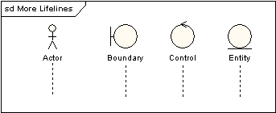

---
## Mensaje:
* Se representa con una flecha del remitente al receptor
* Representa el paso de un mensaje entre dos objetos o entre un objeto y sí mismo.
* Flecha con el nombre del mensaje y los argumentos y que va desde el objeto que envía hacia el objeto que recibe.

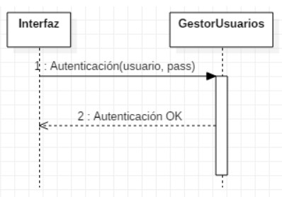

----

### Mensaje
<!-- .slide: style="font-size: 0.80em" -->
* Un **mensaje síncrono** es denotado por una punta de flecha oscura. Si se envía este mensaje es porque se necesita una 
respuesta antes de continuar. Los mensajes sincrónicos se utilizan para representar llamadas de función ordinarias 
dentro de un programa, así como otros tipos de mensaje que se comportan de la misma manera.
* Un **mensaje asíncrono** es denotado por una punta de flecha en línea. Es un mensaje que no requiere una respuesta
  antes de que el remitente continúe. Se utiliza para representar la comunicación entre subprocesos diferentes o la
  creación de un nuevo subproceso.
* Un **mensaje de retorno** asíncrono es denotado por una línea punteada. 

---

---
### Mensaje Self
Un mensaje self puede representar una llamada recursiva de una operación, o un método llamando a otro método 
perteneciente al mismo objeto. Este se muestra como cuando crea un foco de control anidado en la ocurrencia de 
ejecución de la línea de vida.

---
### Mensajes perdidos y encontrados
<!-- .slide: style="font-size: 0.80em" -->
Los mensajes perdidos son aquellos que han sido enviados pero que no han llegado al destino esperado, o que han llegado 
a un destino que no se muestra en el diagrama actual. Los mensajes encontrados son aquellos que llegan de un remitente 
no conocido, o de un remitente no conocido en el diagrama actual. Ellos se denotan yendo o llegando desde un elemento 
de punto final.

---
### Inicio y final de línea de vida
<!-- .slide: style="font-size: 0.80em" -->
Una línea de vida se puede crear o destruir durante la escala de tiempo representada por un diagrama de secuencia. 
En el último caso, la línea de vida se termina por un símbolo de detención, representado como una cruz. En el primer 
caso, el símbolo al inicio de la línea de vida se muestra en un nivel más bajo de la página que el símbolo del objeto 
que causó la creación. El siguiente diagrama muestra un objeto que fue creado y destruido.

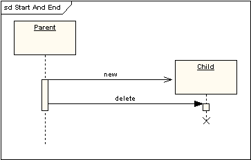

---
### Restricciones de tiempo y duración
<!-- .slide: style="font-size: 0.70em" -->
En forma predeterminada, un mensaje se muestra como una línea horizontal. Ya que la línea de vida representa el pasaje 
de tiempo hacia abajo, cuando se modela un sistema en tiempo real, o incluso un proceso de negocios en tiempo límite, 
puede ser importante considerar el tiempo que toma realizar las acciones. Al configurar una restricción de duración para 
un mensaje, el mensaje se mostrará como una línea inclinada.

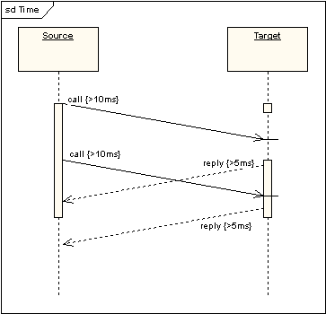

---
### Fragmentos combinados
* Permiten modelar varias estructuras de control de manera explícita.
* Permiten describir una seri de ritas de ejecución posibles de forma compacta y precisa.
* Se representa mediante un rectángulo, con el tipo de operador específico por la palabra clave respectiva.

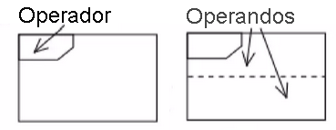

---
### Fragmentos combinados
Hay 12 tipos de operadores. Los mismos se clasifican en:
* Bifurcaciones y bucles
* Concurrencia y orden
* Filtros y afirmaciones

----

<!-- .slide: style="font-size: 0.55em" -->
Bifurcaciones y bucles:
1. **Alternative**, _alt_ modela estructuras _if…then…else_.
2. **Option**, _opt_ modela estructuras switch.
3. **Loop** incluye una serie de mensajes que están repetidos.
4. **Break** modela una secuencia alternativa de eventos que se procesa en lugar de todo del resto del diagrama.

Concurrencia y orden:

5. **Parallel**, _par_ modela procesos concurrentes.
6. **Weak**, _seq_ incluye un número de secuencias para las cuales todos los mensajes se deben procesar en un segmento anterior, antes de que el siguiente segmento pueda comenzar, pero que no impone ningún secuenciado en los mensajes que no comparten una línea de vida.
7. **Strict**, _strict_ incluye una serie de mensajes que se deben procesar en el orden proporcionado.
8. **Critical** incluye una sección crítica.

Filtros y afirmaciones:

9. **Negative**, _neg_ incluye una serie de mensajes inválidos.
10. **Ignore** declara un mensaje o mensajes que no son de ningún interés si este aparece en el contexto actual.
11. **Consider** es el opuesto del fragmento Ignore: cualquier mensaje que no se incluya en el fragmento Consider se debería ignorar.
12. **Assertion**, _assert_ designa que cualquier secuencia que no se muestra como un operando de la aserción es inválida.

----

El siguiente diagrama muestra un fragmento loop:

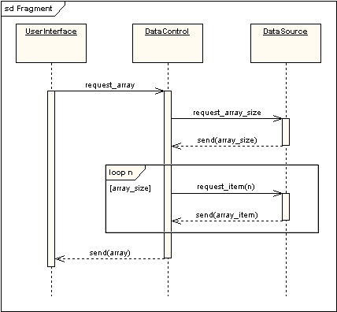

----

#### Ejemplo: Alt & Opt

Cuando un alumno quiere matricularse pueden darse estos casos:
1. Hay plazas disponibles en el exámen
2. Hay plaza disponible en lista de espera
3. Mensaje de error

----

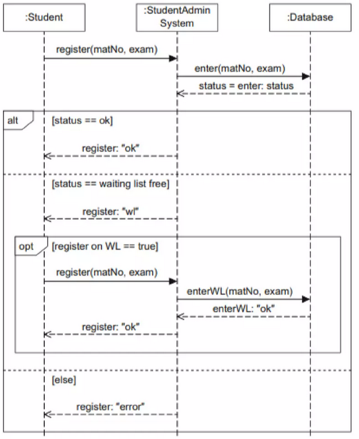

----

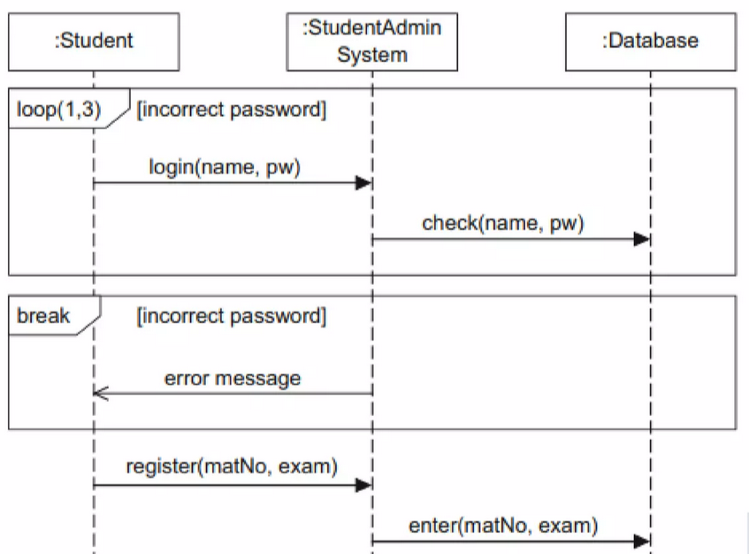

----

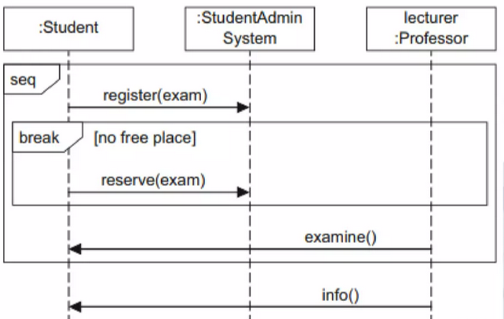

----

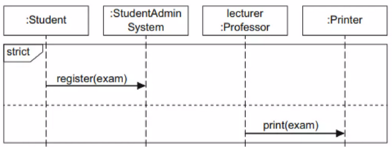

----

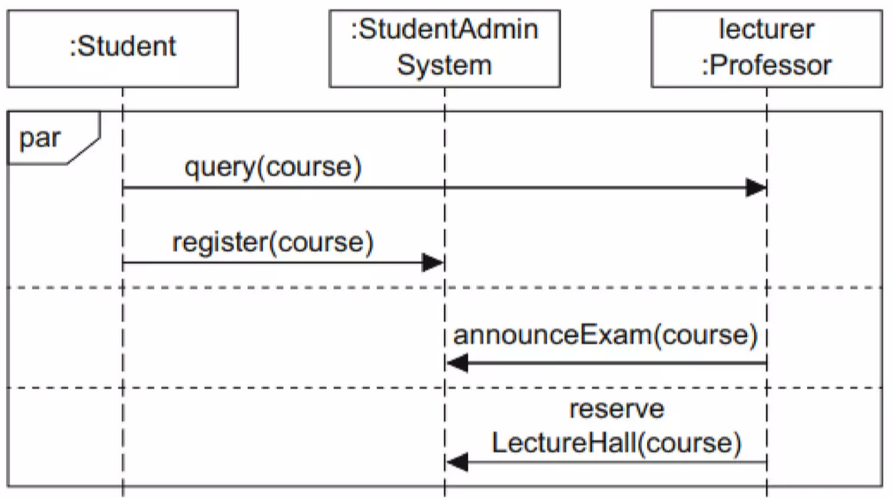

----

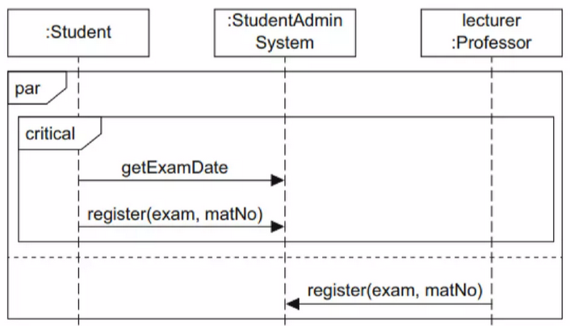

----

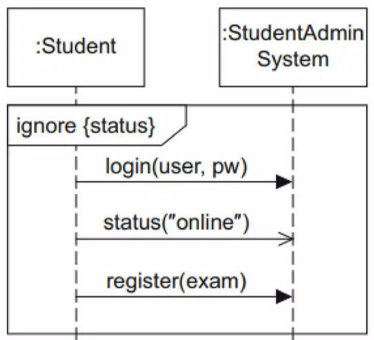

----

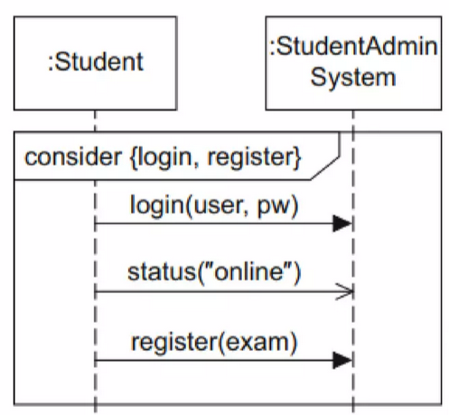

----

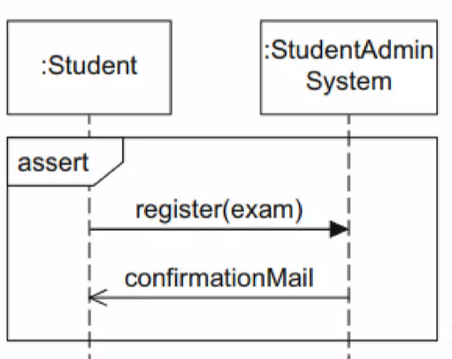

----

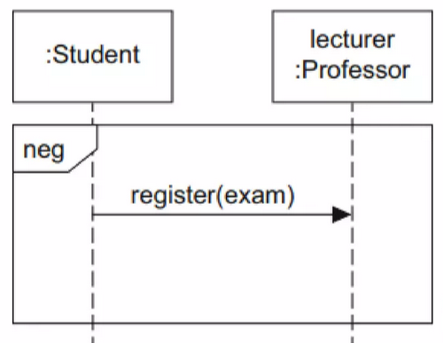

---
### Puerta
Una "puerta" se refiere a un elemento que se utiliza para mostrar bifurcaciones o puntos de decisión en la secuencia de 
interacciones entre objetos. Estas puertas se utilizan para representar condiciones lógicas o ramificaciones en el 
flujo de ejecución de un sistema o función.

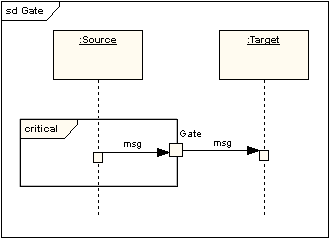

----

<!-- .slide: style="font-size: 0.80em" -->
### Puerta
Hay dos tipos principales de puertas en un diagrama de secuencia:
* **Puerta de bifurcación (fork):** Se utiliza para dividir una secuencia de mensajes en múltiples caminos paralelos. 
Representa una situación en la que un objeto envía mensajes a varios objetos simultáneamente. Cada línea que sale de la 
puerta de bifurcación representa un flujo de ejecución independiente que se ejecuta en paralelo con otros.
* **Puerta de unión (join):** Se utiliza para unir múltiples caminos paralelos en uno solo. Representa el punto en el 
que los flujos de ejecución paralelos se vuelven a unir después de haberse bifurcado previamente. Esto suele ocurrir 
después de que se haya completado una serie de actividades en paralelo, y los flujos deben converger nuevamente.

---
### Descomposición en parte
Un objeto puede tener más de una línea de vida que viene de ésta. Esto permite mensajes de entre e intra objetos para que se muestren en el mismo diagrama.

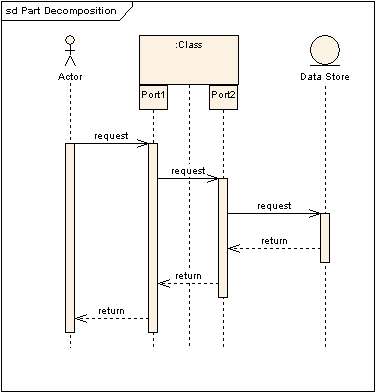

---
### Continuaciones / Invariantes de Estado
<!-- .slide: style="font-size: 0.70em" -->
Una invariante de estado es una restricción ubicada en una línea de vida que debe ser verdadera en el tiempo de 
ejecución. Esta se muestra como un rectángulo con los extremos en semi-circulos.

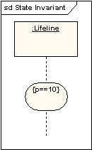

Una continuación tiene la misma notación que una invariante de estado pero se usa en fragmentos combinados y puede 
extenderse a través de más de una línea de vida.

---

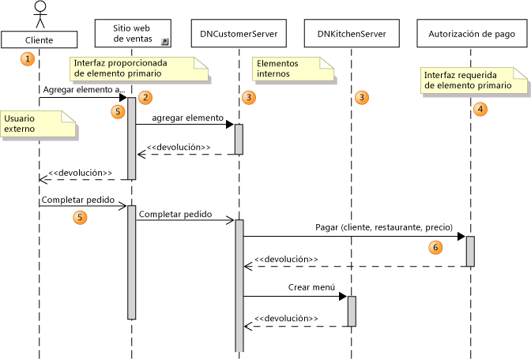

---

Puedes leer más info en:
https://es.slideshare.net/rene5254/diagramas-de-secuencia-251060499

---
## ¿Dudas, Preguntas, Comentarios?

<!--Más info en http://www.sparxsystems.com.ar/resources/tutorial/uml2_sequencediagram.php-->
<!--https://manuel.cillero.es/doc/metodologia/metrica-3/tecnicas/diagrama-de-interaccion/diagrama-de-secuencia/-->
<!--https://diagramasuml.com/secuencia/-->
<!--https://wiki.ead.pucv.cl/Diagrama_de_Secuencia-->
<!--https://es.slideshare.net/rafadalberto/diagrama-de-secuencia?related=1-->
<!--https://learn.microsoft.com/es-mx/previous-versions/visualstudio/visual-studio-2015/modeling/uml-sequence-diagrams-guidelines?view=vs-2015&redirectedfrom=MSDN#Using-->