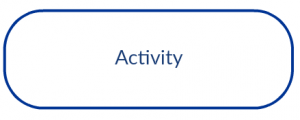
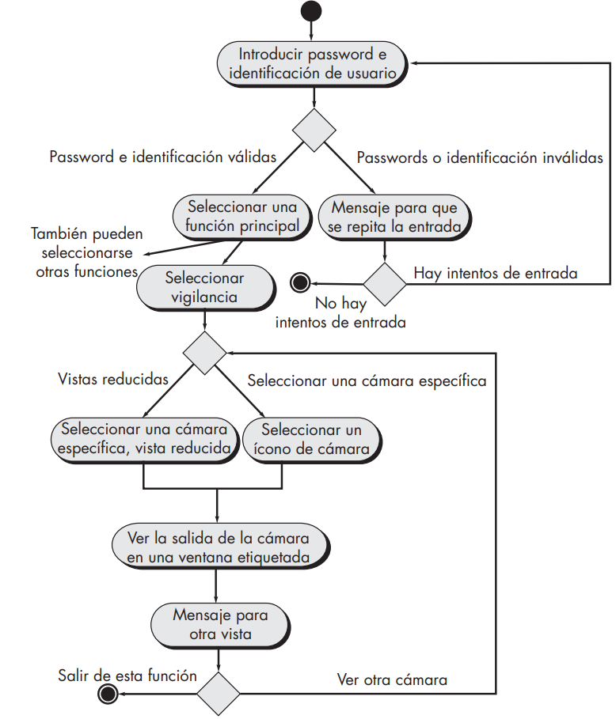
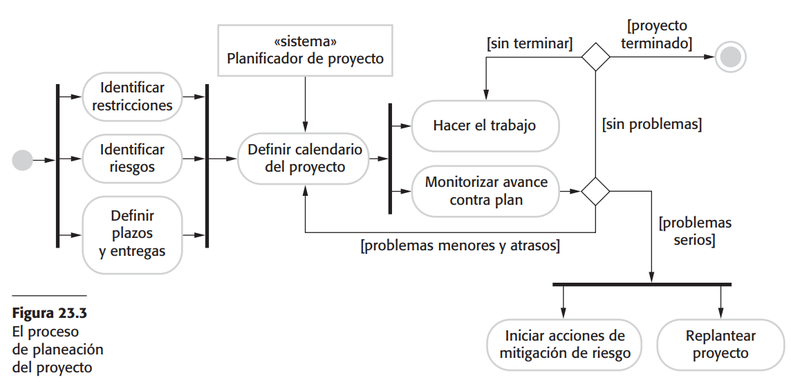
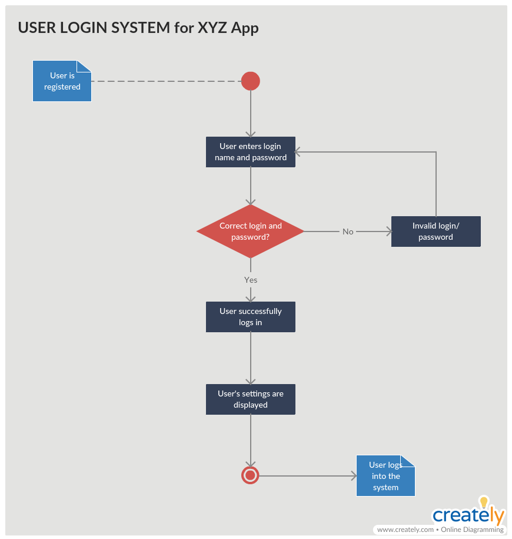
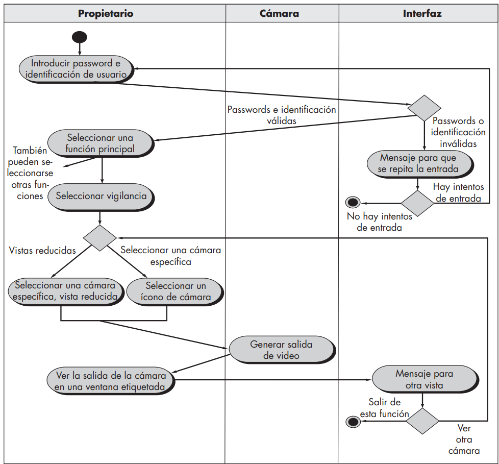
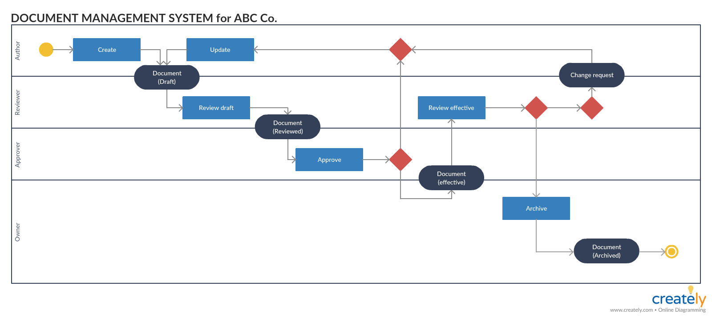
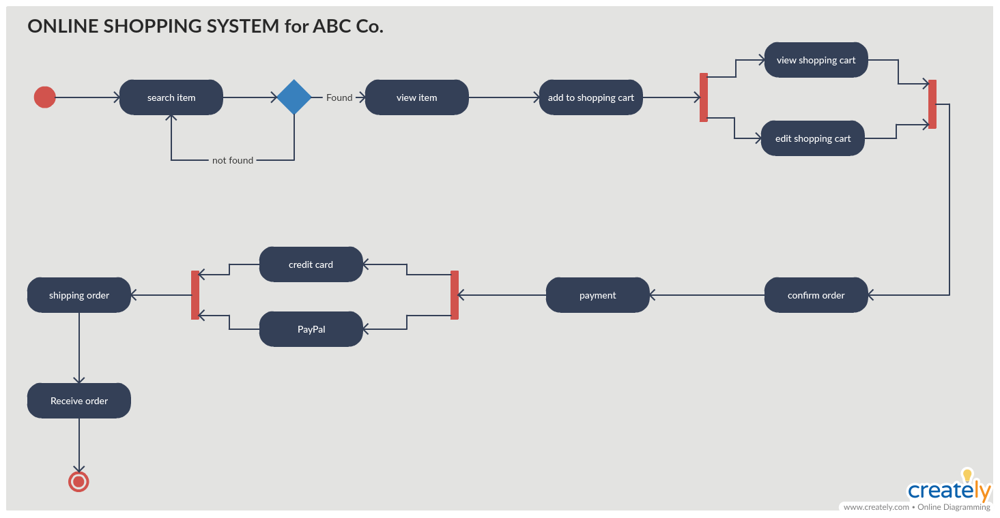
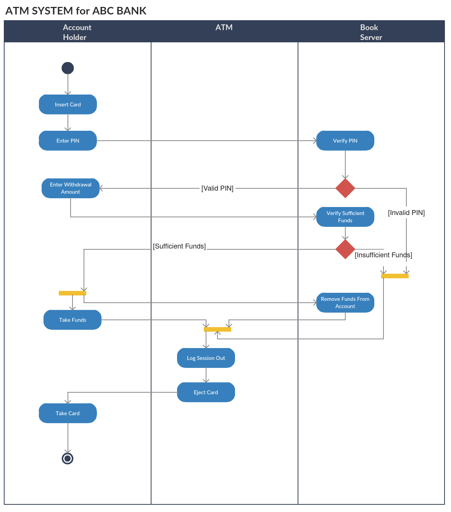
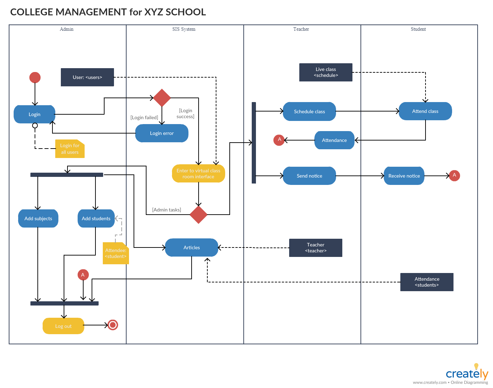

#### Ingeniería de Software
# UML: Diagrama de Actividad
Created by <i class="fab fa-telegram"></i>
[edme88]("https://t.me/edme88")

---
### DIAGRAMA DE ACTIVIDAD

Es un diagrama de **comportamiento**, muy similar a un diagrama de flujo.

Ayuda a visualizar un determinado caso de uso a un nivel más detallado. Ilustra el flujo de actividades  a través de un sistema.

---

<!-- .slide: style="font-size: 0.70em" -->

### Símbolos

<table>
<thead>
    <tr>
        <th>Símbolo</th>
        <th>Nombre</th>
        <th>Uso</th>
    </tr>
</thead>
<tbody>
    <tr>
        <td></td>
        <td>Nodo de inicio</td>
        <td>Representa el punto de partida o el estado inicial de una actividad.</td>
    </tr>
    <tr>
        <td></td>
        <td>Actividad</td>
        <td>Se utiliza para representar las actividades del proceso</td>
    </tr>
    <tr>
        <td></td>
        <td>Control de flujo</td>
        <td>Representa el flujo de control de una acción a otra</td>
    </tr>
</tbody>
</table>

---

<!-- .slide: style="font-size: 0.70em" -->

### Símbolos

<table>
<thead>
    <tr>
        <th>Símbolo</th>
        <th>Nombre</th>
        <th>Uso</th>
    </tr>
</thead>
<tbody>
    <tr>
        <td></td>
        <td>Nodo Final</td>
        <td>Marca el final de todos los flujos de control</td>
    </tr>
    <tr>
        <td></td>
        <td>Nodo de decisión</td>
        <td>Representa un punto de ramificación condicional con una entrada y múltiples salidas.</td>
    </tr>
    <tr>
        <td></td>
        <td>tenedor</td>
        <td>Representa un flujo que puede ramificarse en dos o más flujos paralelos</td>
    </tr>
    <tr>
        <td></td>
        <td>Nota / Comentario </td>
        <td>Permite añadir comentarios pertinentes a los elementos</td>
    </tr>
</tbody>
</table>

---

Diagrama de actividades para la función Acceder a la vigilancia con cámaras por 
internet, mostrar vistas de cámaras

---

---

### Diagrama de actividad para el acceso

---

- Las actividades representan acciones observables o relevantes en el proceso.
- Puede incluir actividades del usuario, del sistema, de un servicio externo o de una base de datos, pero siempre pensando en “qué ocurre en el proceso”, no en el detalle técnico de mensajes.

Ejemplos:
- “Verificar disponibilidad de copia” (lo hace el sistema, no un humano).
- “Registrar préstamo en base de datos” (acción del sistema).
- “Presentar credencial” (acción del usuario).

---

### Diagramas de canal (swimlane)

Es una variación del diagrama de actividad. Permite representar el flujo de actividades descritas por el caso de uso; al mismo tiempo, indica qué **actor** (si hubiera muchos involucrados en un caso específico de uso) o clase de análisis es responsable de la acción descrita por un rectángulo de actividad. 

Las **responsabilidades** se representan con segmentos paralelos que dividen el diagrama en 
forma vertical como los canales.

---

---

Los casos de uso, junto con los diagramas de actividades y de canal, están orientados al 
procedimiento. Representan la manera en la que los distintos actores invocan funciones específicas para satisfacer los requerimientos del sistema.

---

### Pasos para dibujar un diagrama de flujo

1. Averiguar los pasos de acción del caso de uso
2. Identificar a los actores (responsables) que están involucrados
3. Encontrar un flujo entre las actividades (Averiguar en qué orden se procesan las acciones, si se pueden paralelizar)
4. Añade los canales según los responsables

---

### Diagrama de actividades del sistema de gestión de documentos

---

### Diagrama de actividad para el sistema de compras en línea

---

### Diagrama de actividad para ATM

---

### Diagrama de actividades del sistema de gestión de la universidad

---

### Alcance
1) ¿un mega-diagrama o varios específicos?

- Un diagrama por caso de uso (recomendada):

<small>Consultar catálogo, Préstamo, Devolución, Reserva, Renovación, Actualización de catálogo.
Así cada uno empieza en su propio nodo inicial (●) y queda más claro y mantenible.</small>

- Único diagrama orquestador: empieza en un nodo inicial con “Elegir acción”  y desde ahí llama a sub-actividades para cada caso. Es más grande pero coherente.

**Regla de oro:** empieza por el flujo feliz más frecuente y luego añade variantes/excepciones.

---

### ¿Cuál conviene modelar primero?

- Empieza por el flujo principal de mayor valor/frecuencia:
<small>
Préstamo de libro (socio, copia disponible, sin reservas, límite OK, 3 días/3 semanas).
</small>
- Luego agrega variaciones
<small>revista (solo trabajadores), límites (6/12), no disponible → reserva, renovación (si no hay reservas), devolución y por último actualización de catálogo (solo personal autorizado).</small>

---

### ¿Cómo estructurarlo bien?

- Mantén particiones por rol (Usuario/Socio/Trabajador vs Sistema)
- Usa decisión/merge simétricos (cerrar con un merge antes de volver al flujo común)
- Separa reglas de negocio del front (“Usuario” solo tenga acciones del usuario; validaciones/límites, en “Sistema”)
- Donde haya notificaciones emplear un fork/join para modelar procesos en paralelo
- Dejar claro pre-requisito

---
## ¿Dudas, Preguntas, Comentarios?

<!--https://es.venngage.com/blog/diagrama-de-actividades/-->