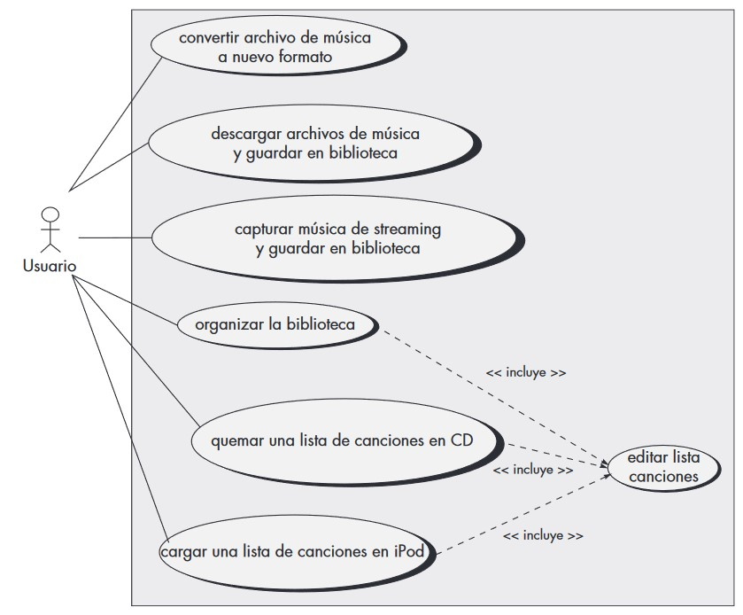
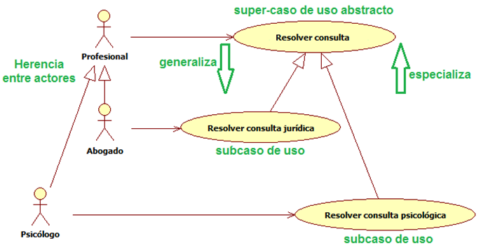
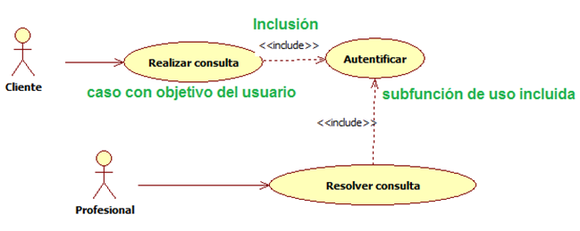
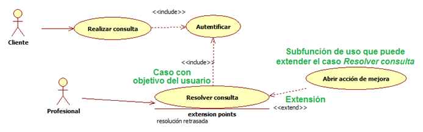

# Ingeniería de Software
## UML: Practico
Created by <i class="fab fa-telegram"></i>
[edme88]("https://t.me/edme88")

---
<!-- .slide: style="font-size: 0.60em" -->

## Temario

### Desarrollo Ágil de Software
* Actualizar

---
## Libros:

“Ingeniería del Software: Un enfoque práctico 7ma ed.” de Roger Pressman
Apéndice 1: Introducción a UML

---
### UML
Significa **Lenguaje de Modelado Unificado**, y es un lenguaje estándar para escribir diseños de software.

El UML puede usarse para visualizar, especificar, construir y documentar los artefactos de un sistema de software.

---
### UML: Caracteristicas
* Lenguaje Uniificado de Modelado
* Modelo Visual para sistemas
* No tiene relacionado ninguna metodología

---
### Diagramas UML
<!--http://www.softwero.com/2017/08/los-13-diagramas-uml-y-sus-componentes-1.html-->

1.Diagrama de clases
2.Diagrama de Objetos
3.Diagrama de Componentes
4.Diagrama de Estructura Compuesta

5.Diagrama de Despliegue

6.Diagrama de Paquetes

7.Diagrama de Actividad

8.Diagrama de Casos de Uso
9.Diagrama de Máquinas de Estado

10.Diagrama de Secuencia

11.Diagrama de Comunicaciones

12.Diagrama de Tiempo

13.Diagrama de Descripción de Interacción

---
### Diagramas UML
Suelen clasificarse en:
* Diagramas de Estructura
* Diagramas de Comportamiento

---
### Diagramas de Estructura
* Diagrama de clases
* Diagrama de Objetos
* Diagrama de Despliegue 

### Diagramas de Comportamiento
* Diagrama de Actividad
* Diagrama de Casos de Uso
* Diagrama de Máquinas de Estado

---
### Diagramas de Caso de Uso
Ayudan a determinar la funcionalidad y características del software desde la perspectiva del usuario.

Un caso de uso describe la manera en la que un usuario interactúa con el sistema, definiendo
los pasos requeridos para lograr una meta específica.

---

---
### Diagramas de Caso de Uso
El diagrama se compone:
* **Actores**: Persona que interactúa con el sistema (puede tener diversos roles).
* **Casos de Uso**: Ovalos, acciones que se pueden realizar.
* **Limites**: Rectángulo que engloba a los casos de uso.
* Relaciones entre casos de uso

---
### CU: Límites
Límites del sistema a construir.
El sujero o límite se define:
* Quién o qué utilizará el sistema
* Que beneficios ofrece el sistema

---
### CU: Actores
* Rol que cierta entidad externa adopta para interactuar con el sistema.
* Puede ser: Rol de usuario, otro sistema, un hardware e incluso el tiempo.
* El actor es siempre EXTERNO al sistema.

---
### CU: Caso de Uso
* Interacción entre el Sistema (o subsistema) y un actor externo
* Una especificación de secuencias de acciones
* Incluye variantes y secuencias de error
* Son iniciados siempre por un actor

---
### Detalle de CU
Generalmente el diagrama de casos de uso por si solo no es suficiente, y es necesario detallar cada **caso de uso** con 
una planilla como la siguiente:

| **Proyecto:** Nombre del Proyecto                      | **Versión:** 0.1             |
|:-------------------------------------------------------|:-----------------------------|
| **Caso de Uso:** Nombre del caso de uso                | **Fecha de Versión:** fecha  |
| **Estado:** en elaboración/en revisión/listo/deprecado |                              |

| N° | Campo | Descripción del Campo |
|:---|:------|:---------------------|
| 1  | Nombre del Caso de Uso | |
| 2  | Actor | |
| 3  | Breve Descripción | |
| 4  | Precondiciones | |
| 5  | Flujo de Eventos | paso a paso de lo que se debe realizar en las pantallas |
| 6  | Postcondiciones | |
| 7  | Consideraciones y Observaciones | |
| 8  | Frecuencia de Uso | |

---
### Modelado avanzado de Caso de uso
Tiene en cuenta:
* Generalización del actor
* Generalización del Caso de Uso
* Relación _include_
* Relación _extend_

---
### CU Avanzado: Generalización del actor
Se empleacuando existen muchas similitudes entre actores.

---
### CU Avanzado: Generalización del CU
* Se emplea cuando uno o mas casos de uso son realmente especificaciones o un caso de uso mas general.
* Hijos son más específicos que el padre
  * Heredan características
  * Añaden características
  * Anulan y/o cambian características
* Se deben emplear etiquetas (libre)

---
### CU Avanzado: Include
* Evita repetir especificaciones innecesariamente
* Incluye el comportamiento de un caso de uso en el flujo de otro caso de uso.

---
### CU Avanzado: Extend
* Inserta un nuevo comportamiento en un caso de uso existente
* El punto de extensión no forma parte del flujo principal

---
## ¿Dudas, Preguntas, Comentarios?

