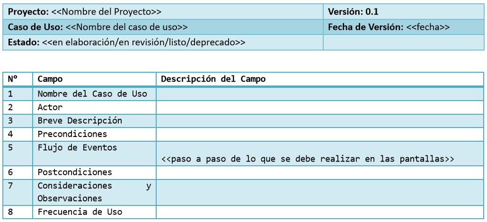

# Ingeniería de Software
## UML: Practico
Created by <i class="fab fa-telegram"></i>
[edme88]("https://t.me/edme88")

---
<!-- .slide: style="font-size: 0.60em" -->

## Temario

### Desarrollo Ágil de Software
* Libros
* UML
* UML: Características
* UML: Diagramas
* Diagramas de caso de uso
* Caso de Uso: Límites
* Caso de Uso: Actores
* Caso de Uso: Detalles
* Modelado Avanzado

---
## Libro:

“Ingeniería del Software: Un enfoque práctico 7ma ed.” de Roger Pressman
Apéndice 1: Introducción a UML

---
### UML
Significa **Lenguaje de Modelado Unificado**, y es un lenguaje estándar para escribir diseños de software.

El UML puede usarse para visualizar, especificar, construir y documentar los artefactos de un sistema de software.

---
### UML: Caracteristicas
* Lenguaje Uniificado de Modelado
* Modelo Visual para sistemas
* No tiene relacionado ninguna metodología

---
### Diagramas UML
<!--http://www.softwero.com/2017/08/los-13-diagramas-uml-y-sus-componentes-1.html-->

1.Diagrama de clases
2.Diagrama de Objetos
3.Diagrama de Componentes
4.Diagrama de Estructura Compuesta

5.Diagrama de Despliegue

6.Diagrama de Paquetes

7.Diagrama de Actividad

8.Diagrama de Casos de Uso
9.Diagrama de Máquinas de Estado

10.Diagrama de Secuencia

11.Diagrama de Comunicaciones

12.Diagrama de Tiempo

13.Diagrama de Descripción de Interacción

---
### Diagramas UML
Suelen clasificarse en:
* Diagramas de Estructura
* Diagramas de Comportamiento

---
### Diagramas de Estructura
* Diagrama de clases
* Diagrama de Objetos
* Diagrama de Despliegue 

### Diagramas de Comportamiento
* Diagrama de Actividad
* Diagrama de Casos de Uso
* Diagrama de Máquinas de Estado

---
### Diagramas de Caso de Uso
Ayudan a determinar la funcionalidad y características del software desde la perspectiva del usuario.

Un caso de uso describe la manera en la que un usuario interactúa con el sistema, definiendo
los pasos requeridos para lograr una meta específica.

---

---
### Diagramas de Caso de Uso
El diagrama se compone:
* **Actores**: Persona que interactúa con el sistema (puede tener diversos roles).
* **Casos de Uso**: Ovalos, acciones que se pueden realizar.
* **Limites**: Rectángulo que engloba a los casos de uso.
* Relaciones entre casos de uso

---
### CU: Límites
Límites del sistema a construir.
El sujero o límite se define:
* Quién o qué utilizará el sistema
* Que beneficios ofrece el sistema

---
### CU: Actores
* Rol que cierta entidad externa adopta para interactuar con el sistema.
* Puede ser: Rol de usuario, otro sistema, un hardware e incluso el tiempo.
* El actor es siempre EXTERNO al sistema.

---
### CU: Caso de Uso
* Interacción entre el Sistema (o subsistema) y un actor externo
* Una especificación de secuencias de acciones
* Incluye variantes y secuencias de error
* Son iniciados siempre por un actor

---
### Detalle de CU
<!-- .slide: style="font-size: 0.60em" -->

Generalmente el diagrama de casos de uso por si solo no es suficiente, y es necesario detallar cada **caso de uso** con 
una planilla como la siguiente:

| **Proyecto:** Nombre del Proyecto                      | **Versión:** 0.1             |
|:-------------------------------------------------------|:-----------------------------|
| **Caso de Uso:** Nombre del caso de uso                | **Fecha de Versión:** fecha  |
| **Estado:** en elaboración/en revisión/listo/deprecado |                              |

| N° | Campo | Descripción del Campo |
|:---|:------|:---------------------|
| 1  | Nombre del Caso de Uso | |
| 2  | Actor | |
| 3  | Breve Descripción | |
| 4  | Precondiciones | |
| 5  | Flujo de Eventos | paso a paso de lo que se debe realizar en las pantallas |
| 6  | Postcondiciones | |
| 7  | Consideraciones y Observaciones | |
| 8  | Frecuencia de Uso | |

---
### Detalle de CU

---
### Modelado avanzado de Caso de uso
Tiene en cuenta:
* Generalización del actor
* Generalización del Caso de Uso
* Relación _include_
* Relación _extend_

---
### CU Avanzado: Generalización del actor
Se empleacuando existen muchas similitudes entre actores.

---
### CU Avanzado: Generalización del CU
* Se emplea cuando uno o mas casos de uso son realmente especificaciones o un caso de uso mas general.
* Hijos son más específicos que el padre
  * Heredan características
  * Añaden características
  * Anulan y/o cambian características
* Se deben emplear etiquetas (libre)

---
### CU Avanzado: Include
* Evita repetir especificaciones innecesariamente
* Incluye el comportamiento de un caso de uso en el flujo de otro caso de uso.

---
### CU Avanzado: Extend
* Inserta un nuevo comportamiento en un caso de uso existente
* El punto de extensión no forma parte del flujo principal

---
### Consejos
* No abusar de las características avanzadas
* Mantener los casos de uso breves y sencillos (1 hoja)
* Centrarse en el qué y no en el cómo
* Evitar la descomposición funcional (descomponer como si fueran casos de uso de alto nivel y primitivos)

---
# ANÁLISIS

---
### Workflow de Análisis
Ayuda a definir y especificar el sistema a ser construido. En esta fase se analizan, refinan y estructuran los requisitos 
con el fin de llegar a una mayor comprensión de los mismos.

---
### Workflow de Análisis
* Crean modelos que capturan el comportamiento deseado del sistema (Se solapa con los requerimientos)
* Van de la mano con los requerimientos, los clarifica y los completa.
* Se dejan los detalles para el diseño.

---
### Worflow de Análisis: Características
* El limite entre el análisis y diseño es difuso
* Generan dos artefactos claves:
  * Clases de análisis: Modelan conceptos claves del dominio
  * Realizaciones de casos de Uso: Muestran cómo las instancias de análisis pueden interactuar para realizar el comportamiento del sistema.

---
* Solo deben crearse clases relacionadas al dominio y no al diseño de la solución (ejemplo: “Clase de Comunicaciones”)
* Decisiones de implementación es parte del “Diseño e Implementación”.

---
### Reglas para el análisis
<!-- .slide: style="font-size: 0.90em" -->
* Siempre se habla en términos del negocio.
* Los modelos deben “contar una historia” (Si el diagrama no aclara comportamiento no sirve)
* Concentrarse en la idea general (No en detalles de implementación)
* Distinguir el “Dominio del Problema” del “Dominio de la Solución”
* Siempre minimizar el acoplamiento
* Explorar la herencias si parece haber una jerarquía natural de abstracciones
* Siempre pregúntense si el modelo es de utilidad para otros (Costo vs. Beneficio)

---
## CLASES DE ANÁLISIS
* Representan una abstracción en el dominio del problema
* Deberían mapearse con conceptos de negocio del mundo real (Cliente, producto, cuenta).
* Se intentan clarificar los conceptos, se aclara el dominio
* Las clases de análisis pueden resultar en 1 o más clases de diseño

---
### Anatomía de una Clase de Análisis
* Presentan atributos de muy “alto nivel”
* Las operaciones de la clase de análisis especifican en, en “alto nivel”, los servicios claves que debe ofrecer.
* Se evitan detalles de implementación
* Se capturan ideas principales, de “alto nivel”.

---
### Datos mínimos de una clase de análisis
* Nombre
* Atributos
* Operaciones
* Visibilidad (Generalmente no se muestra)
* Estereotipos (Ayudan a complementar el lenguaje)
* Valores etiquetados

---
### ¿Qué hace una buena clase de Análisis?
* Su nombre refleja su intención
* Modela un elemento específico del dominio del problema
* Se mapea con el dominio del problema
* Tiene un conjunto de responsabilidades (Contrato u obligación de una clase con sus “Clientes”) bien definidas
* Alta cohesión
* Bajo acoplamiento

---
### Reglas generales
* De 3 a 5 responsabilidades por clase
* Ninguna clase permanece sola (deben trabajar en conjunto con otras).
* Tenga cuidado con muchas clases pequeñas y muy grandes, es difícil encontrar el equilibrio.
* Cuidado con clases omnipotentes
* Evite arboles de herencia muy profundos.

---
### Encontrar Clases
* No existe un algoritmo sencillo para encontrar clases de análisis correctas.
* Existen técnicas probadas y testeadas que llevan hacia “una buena respuesta”.
  * Encontrar clases al utilizar análisis nombre/verbo
  * Encontrar clases al utilizar análisis CRC
  * Encontrar clases al utilizar los estereotipos RUP

---
### Nombre/Verbo
* Técnica que permite inferir clases de análisis
* Se basa en el análisis de textos
* Análisis directo del lenguaje dominio del problema
* Peligroso si el dominio está mal definido
* Mapea:
  * Nombres y frases nominales -> Clases y Atributos
  * Verbos o frases verbales -> Responsabilidades

---
### Análisis CRC
* CRC= Clase, Responsabilidad, Colaboradores
* Emplea el como herramienta los “post-it”
* Se divide en tres compartimentos
* Se puede emplear como un complemento del análisis nombre/verbo.
* Se divide en dos fases
  * Fase 1: Tormenta de ideas: Recopilar información
  * Fase 2: Analizar información

---
### Estereotipos RUP
* Se consideran tres tipos de clases
* Es empleada como complemento de las otras
* Existen tres estereotipos definidos por RUP
  * <<boundary>>: Clase mediadora entre el sistema y su entorno
  * <<control>>: Una clase que encapsula comportamiento especifico de caso de uso
  * <<entity>>: Una clase que se utiliza para modelar información persistente sobre algo

---
### Clases Boundary
* Estas clases existen en el límite del sistema
* Se comunican con los actores externos
* Existen 3 tipos de clases Boundary
  * Clases de interfaz de usuario (Actor persona)
  * Clases de interfaz de sistema (Actor sistema)
  * Clases de interfaz de dispositivo (Actor dispositivo)

---
### Clases Control
* Son clases controladoras
* Se encargan de la coordinación del comportamiento del sistema
* Útil cuando el comportamiento no se puede repartir simplemente entre los otros estereotipos.

---
### Clases entidad
* Modelan información sobre algo
* Tienen comportamiento sencillo y acotado
* Se limitan a obtener y establecer valores
* Ejemplos clase Dirección, clase Persona
* Proporcionan y aceptan información de clases límite.
* A menudo son persistentes, íntimamente relacionadas con el modelo de datos.

---
### Otras técnicas
Fuentes potenciales de clases de análisis:
* Objetos físicos ejemplo: Avión, gente, y hoteles, etc
* El papeleo. Recibos, facturas, etc.
* Las interfaces conocidas con el mundo exterior. pantallas, teclados, etc
* Entidades conceptuales que justifiquen a nivel de
abstracción cohesiva su creación “CuentaBancaria”, “ProgramaFidelidad”

---
### Relaciones
* Conexiones significativas entre elementos de modelado
* Es la forma en que UML conecta elementos
  * Casos de Uso y Actores
  * Entre Casos de Uso
  * Entre Actores

---
### Vínculos
* En un programa OO, tenemos Objetos que colaboran para dar una cierta funcionalidad.
* Las relaciones entre objetos se conocen como “vínculos”, estos son dinámicos.
* Es posible verlos en los “Diagramas de Objetos”
* Muestra objetos y sus relaciones (vínculos) en un punto en el tiempo.

---
### Asociaciones
* Son relaciones entre clases
* Análogo a los vínculos (conectan clases)
* A nivel de análisis, las asociaciones son “básicas”.
* Las asociaciones “avanzadas” se ven en durante el diseño.

---
### Atributos de las relaciones
* Las relaciones pueden tener asociadas:
  * Nombre
  * Roles
  * Multiplicidad
  * Navegabilidad
* Sirven como complementos, y deben aclarar el diagrama.
* Si no suma al entendimiento, no se debería agregar.

---
### Nombres
* Frases verbales, indican acción del objeto fuente sobre el objeto destino.
* Ejemplo: Empresa ”emplea” Persona
* Roles que los objetos instancias desempeñan cuando los objetos se vinculan.
* Ejemplo: “empleador”- “empleado”

---
### Multiplicidad
* Restricción que sirve para especificar cuantos objetos pueden participar en una relación determinada.
* Se especifica cómo una lista de intervalos por coma:
  * mínimo… máximo - Deben ser enteros, o expresiones equivalentes

---
### Navegabilidad
* Nos muestra que es posible pasar desde un objeto de la clase fuente a uno o más objetos de la clase destino.
* Permite minimizar el acoplamiento entre clases
* Se indica con la punta de flecha en la asociación
* A nivel de lenguaje, el objeto fuente, tiene una “referencia” al objeto destino. Comúnmente se traducen a atributos

---
### Casos especiales
Clases de asociación:
* Sirven para acomodar atributos de las relaciones  entre relaciones “muchos a muchos”.
* Ejemplo: Empresa-Persona (Sueldo)

Asociaciones cualificadas:
* Reduce una asociación “n a muchos” a una “n- a 1”
* Ilustra como navegar hasta objetos específicos
* Se agrega un “calificador”

---
### Dependencias
* Indica una relación entre dos o más elementos
* Un cambio en un elemento (proveedor) puede afectar a otro elemento (cliente)
* “El cliente depende del proveedor”
* Ejemplo: Puede pasar un objeto de una clase como un parámetro a una operación de otra clase.

---
### Tipos de dependencias
Existen tres tipos básicos de dependencias:
* Uso
* Abstracción
* Permiso

---
### De Uso
El cliente utiliza alguno de los servicios del proveedor para implementar su propio comportamiento.

Tipos:
* `<<use>>`: El cliente hace uso del proveedor
* `<<call>>`: La operación cliente invoca la del proveedor
* `<<parameter>>`: El proveedor es un paraemtro de la operación cliente
* `<<send>>`: El cliente es una operación que envía el proveedor

---
### De abstracción
Modelan dependencias entre elementos con diferentes niveles de abstracción:

---
### De abstracción: Tipos
* `<<trace>>`: Sirven para indicar que el proveedor y el cliente son conceptualmente lo mismo, pero están en diferentes modelos.
* `<<substitute>>`: El cliente se puede sustituir por el proveedor en tiempo de ejecución. Se deben ajustar contratos e interfaces.
* `<<refine>>`: Permite especificar dependencias dentro del mismo modelo.
* `<<derive>>`: Permite mostrar que un elemento se puede derivar de otro.

---
### De permiso
Dan la posibilidad que un elemento acceda a otro.

Tipos:
* `<<access>>`: Permite que un paquete acceda a los contenidos públicos de otro
* `<<import>>`: Fusiona el espacio de nombres del proveedor, con el del cliente
* `<<permit>>`: “Violación de la encapsulación en forma controlada”. Se acceden a todo el elemento proveedor sin tener en cuenta la visibilidad.

---
# Herencia y Polimorfismo

---
### Generalización
* Es la relación entre un elemento mas general y uno más específico
* Obedecen el principio de sustitución
  * “Se puede emplear el elemento más específico en cualquier lugar que se espere el elemento más general sin romper el sistema”
* Debemos tener en cuenta los “niveles de abstracción” (Jaguar-Camión)

---
### Herencia
* En una jerarquía de generalización, implícitamente se indica que las subclases “heredan” todas las características de sus
súper clases.
* Estas también pueden añadir nuevas características y anular operaciones

---
### Operaciones y clases abstractas
* Son clases que no podemos “instanciar”
* Operaciones que no podemos “invocar”
* Existen cuando preferiríamos diferir la implementación de una operacion a una subclase
  * Ejemplo: Operación dibujarFigura() de la clase “Figura”

---
### Polimorfismo
* Polimorfismo significa “muchas formas”
* Son operaciones que tienen varias implementaciones posibles
* Una operación puede tener “muchas formas”, por lo que se considera una operación polimórfica

---
# PAQUETES DE ANALISIS

---
### ¿Qué es un paquete?
* Un paquete es un elemento de agrupación de UML
* Es un contenedor para elementos de modelo
* Todo paquete tiene su espacio de nombres
* Permite organizar elementos de modelo y diagramas en grupos.
* Mecanismo lógico de agrupación

---
* Sintaxis sencilla
* Los paquetes de análisis deben contener:
  * UC
  * Clases de análisis
  * Realizaciones de Casos de Uso
* Todo elemento tiene una visibilidad
  * (+): Pública
  * (-): Privada

---
* Definen un espacio de nombres
* Es posible anidar paquetes (se puede dibujar de dos maneras)
* Se pueden definir dependencias entre paquetes (similar a las dependencias entre clases)
* Se pueden generalizar
* Se deben evitar dependencias cíclicas (dos alternativas, fusionar o dividir)

---
## ¿Dudas, Preguntas, Comentarios?

