# Ingeniería de Software
## Diagramas UML
Created by <i class="fab fa-telegram"></i>
[edme88]("https://t.me/edme88")

---
<!-- .slide: style="font-size: 0.60em" -->

## Temario

### Diagramas UML
* Diagramas de Casos de Uso
* Finalidad
* Elementos
* Relaciones
* Descripción de requisitos
* Ejemplos de CU

* Diagramas de Clase
* Elementos
* Relaciones
* Diagramas de Secuencia
* Objetos
* Mensajes

---
### DIAGRAMA DE CASOS DE USO

<!--https://diagramasuml.com/casos-de-uso/-->
* Especifica un comportamiento deseado del sistema.
* Representa los requisitos funcionales del sistema.
* Describe qué hace el sistema, no cómo lo hace.

Un caso de uso especifica un conjunto de secuencias de acciones, incluyendo variantes, que el sistema puede ejecutar y
que produce un resultado observable de valor para un particular actor.

---
### Es un diagrama de comportamiento
* Se utiliza para representar los actores externos que interactúan con el sistema de información.
* Muestra de manera visual las distintas funciones que puede realizar un usuario (más bien un tipo de usuario) de un
Sistema de Información.

---
### Finalidad
* Representar los requisitos funcionales.
* Representar los actores que se comunican con el sistema.
* Representar las relaciones entre requisitos funcionales y actores.
* Guiar el desarrollo del sistema.
* Comunicarse de forma precisa entre cliente y desarrollador.

---
### Elementos
* **Actores:** un actor es algo o alguien externo al sistema que interactúa de forma directa con el sistema.
* **Casos de uso:** Es una secuencia de acciones que hace el sistema y que producen un resultado que puede percibir
un usuario.
* **Relaciones:** Conectan los casos de uso con los actores o los casos de uso entre sí.

----

### Elementos
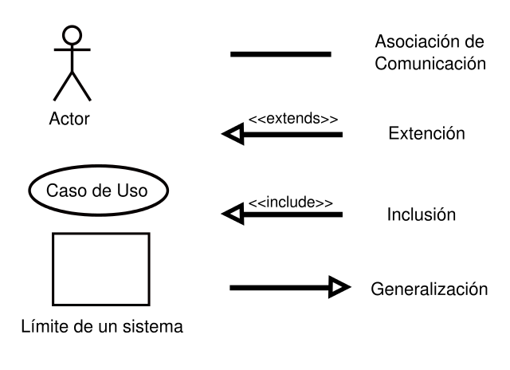

----

### Relaciones
Cuando conectan un actor con un caso de uso representa que ese actor interactúa de alguna manera con ese caso de uso y 
se representa con una línea continua Cuando conectan casos de uso entre sí se pueden diferenciar dos tipos de 
relaciones: `<<include>>` o `<<extend>>`.

* `<<include>>:` Se utiliza para representar que un caso de uso utiliza siempre a otro caso de uso.
* `<<extend>>:` Este tipo de relaciones se utilizan cuando un caso de uso tiene un comportamiento opcional, reflejado 
en otro caso de uso

----

### Relaciones
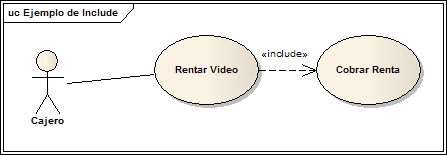

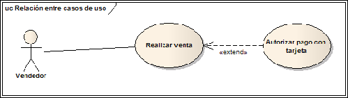

----

### Descripción de requisitos
<!-- .slide: style="font-size: 0.70em" -->
Se describe cada caso de uso junto con la secuencia de pasos necesaria para completarlo y las posibles excepciones.
Esta descripción sirve de guía para el desarrollo:
* Identificador y nombre descriptivo
* Versión
* Autores
* Objetivos asociados
* Requisitos asociados
* Descripción
* Precondición
* Secuencia normal
* Postcondición
* Excepciones
* Importancia
* Urgencia
* Comentarios

----

<!-- .slide: style="font-size: 0.40em" -->
<!--
| RF-01                | Acceso Aplicación                                                                                                              |
| :------------------- | :----------------------------------------------------------------------------------------------------------------------------- |
| Versión              | Versión 1.0                                                                                                                    |
| Autores              | Agustina Aliciardi                                                                                                             |
| Objetivos Asociados  | OBJ-01: Acceso Controlado a la Aplicación Software                                                                             |
| Requisitos asociados | RI-01: Información de los Usuarios.                                                                                            |
| Descripción          | El sistema deberá comportarse como se describe en el siguiente caso de uso cuando un usuario decida acceder a la aplicación.   |
| Precondición         | El usuario tiene que disponer de un nombre de usuario y una contraseña para poder acceder y deberá tener el acceso habilitado. |
| Secuencia normal     | 1. El usuario solicita al sistema entrar en la aplicación.                                                                     |
|                      | 2. El sistema solicita al usuario que introduzca el nombre de usuario y su contraseña.                                         |
|                      | 3. El usuario introduce su nombre y su contraseña.                                                                             |
|                      | 4. El sistema comprueba los datos introducidos.                                                                                |
|                      | 5. Si los datos son correctos el sistema muestra la página de inicio de la aplicación.                                         |
| Excepciones          | 5. Si el nombre de usuario no es correcto, el sistema muestra un mensaje. Ir al paso 2.                                        |
|                      | 5. Si la contraseña no es correcta, el sistema muestra un mensaje. Ir al paso 2.                                               |
|                      | 5. Si el sistema no tiene el acceso habilitado a la aplicación, se muestra un mensaje. Ir al paso 2.                           |
| Postcondición        | Si el nombre de usuario y la contraseña son correctos accede a la pantalla de inicio de la aplicación                          |
| Importancia          | Vital                                                                                                                          |
| Urgencia             | Inmediatamente                                                                                                                 |
| Comentarios          | Ninguno                                                                                                                        |
-->
<table>
<thead>
<tr>
<th style="text-align:left">RF-01</th>
<th style="text-align:left">Acceso Aplicación</th>
</tr>
</thead>
<tbody>
<tr>
<td style="text-align:left">Versión</td>
<td style="text-align:left">Versión 1.0</td>
</tr>
<tr>
<td style="text-align:left">Autores</td>
<td style="text-align:left">Agustina Aliciardi</td>
</tr>
<tr>
<td style="text-align:left">Objetivos Asociados</td>
<td style="text-align:left">OBJ-01: Acceso Controlado a la Aplicación Software</td>
</tr>
<tr>
<td style="text-align:left">Requisitos asociados</td>
<td style="text-align:left">RI-01: Información de los Usuarios.</td>
</tr>
<tr>
<td style="text-align:left">Descripción</td>
<td style="text-align:left">El sistema deberá comportarse como se describe en el siguiente caso de uso cuando un usuario decida acceder a la aplicación.</td>
</tr>
<tr>
<td style="text-align:left">Precondición</td>
<td style="text-align:left">El usuario tiene que disponer de un nombre de usuario y una contraseña para poder acceder y deberá tener el acceso habilitado.</td>
</tr>
<tr>
<td style="text-align:left">Secuencia normal</td>
<td style="text-align:left">1. El usuario solicita al sistema entrar en la aplicación.</td>
</tr>
<tr>
<td style="text-align:left"></td>
<td style="text-align:left">2. El sistema solicita al usuario que introduzca el nombre de usuario y su contraseña.</td>
</tr>
<tr>
<td style="text-align:left"></td>
<td style="text-align:left">3. El usuario introduce su nombre y su contraseña.</td>
</tr>
<tr>
<td style="text-align:left"></td>
<td style="text-align:left">4. El sistema comprueba los datos introducidos.</td>
</tr>
<tr>
<td style="text-align:left"></td>
<td style="text-align:left">5. Si los datos son correctos el sistema muestra la página de inicio de la aplicación.</td>
</tr>
<tr>
<td style="text-align:left">Excepciones</td>
<td style="text-align:left">5. Si el nombre de usuario no es correcto, el sistema muestra un mensaje. Ir al paso 2.</td>
</tr>
<tr>
<td style="text-align:left"></td>
<td style="text-align:left">5. Si la contraseña no es correcta, el sistema muestra un mensaje. Ir al paso 2.</td>
</tr>
<tr>
<td style="text-align:left"></td>
<td style="text-align:left">5. Si el sistema no tiene el acceso habilitado a la aplicación, se muestra un mensaje. Ir al paso 2.</td>
</tr>
<tr>
<td style="text-align:left">Postcondición</td>
<td style="text-align:left">Si el nombre de usuario y la contraseña son correctos accede a la pantalla de inicio de la aplicación</td>
</tr>
<tr>
<td style="text-align:left">Importancia</td>
<td style="text-align:left">Vital</td>
</tr>
<tr>
<td style="text-align:left">Urgencia</td>
<td style="text-align:left">Inmediatamente</td>
</tr>
<tr>
<td style="text-align:left">Comentarios</td>
<td style="text-align:left">Ninguno</td>
</tr>
</tbody>
</table>

----

| RNF-01 | Entorno de Explotación                                                                                                                        |
|--------|-----------------------------------------------------------------------------------------------------------------------------------------------|
| Versión | Versión 1.0                                                                                                                                   |
|Autores| Juan Perez                                                                                                                                    |
|Objetivos asociados | OBJ-05: Funcionamiento óptimo por usuario estándar                                                                                            |
| Requisitos asociados|                                                                                                                                               |
|Descripción| El sistema deberá funcionar sin ningún tipo de limitación en equipos con: Pention IV a 2,4 GHz, con 1GB de RAm y al menos 6 GB de disco duro. |
|Importancia| Vital                                                                                                                                         |
|Urgencia| Inmediata                                                                                                                                     |
|Estabilidad| Alta                                                                                                                                          |
|Comentario| Ninguno                                                                                                                                       |

---
### Diseño de una aplicación que gestione los tramites a realizar en una clínica veterinaria
<!-- .slide: style="font-size: 0.55em" -->
* Se deben almacenar los datos de contacto de los clientes: Nombre, Apellidos, DNI, Fecha de nacimiento, Teléfono o Email.
* Se debe almacenar la información de las mascotas. Cada cliente puede tener más de una mascota, una mascota pertenece a un único cliente.
* Es posible cambiar el dueño de una mascota por otro.
* Estos datos son introducidos y gestionados por los auxiliares.
* Al dar de alta un nuevo animal, se comprobará en el registro del REIAC (Red Española de Identificación de Animales de 
Compañía) si el animal está correctamente dado de alta. Este proceso únicamente se hará en animales que tengan la 
obligación de estar identificados.
* Para toda consulta debe registrar Tiempo de consulta, Profesional, Animal tratado, Importe, Resolución, Recetas.
* Si el animal queda internado, el cliente podrá acceder a su estado en tiempo real y podrá comunicarse con una cámara 
para ver su situación actual. La gestión de estas cámaras no corresponde al sistema.
* Las recetas y otros documentos relacionados con el servicio se incluirán en un gestor de contenidos que ya está en 
funcionamiento en la clínica veterinaria.
* El cliente podrá realizar el pago mediante la aplicación. Si el pago tarda mas de una semana se efectuará un recargo 
sobre el precio inicial.
* El cliente podrá obtener un histórico de todas las consultas que se han realizado para sus mascotas.

----

### Diagrama de casos de uso del actor Auxiliar
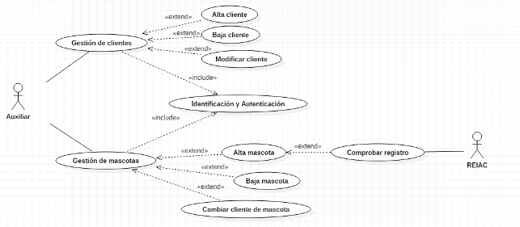

----

### Diagrama de casos de uso del actor Cliente
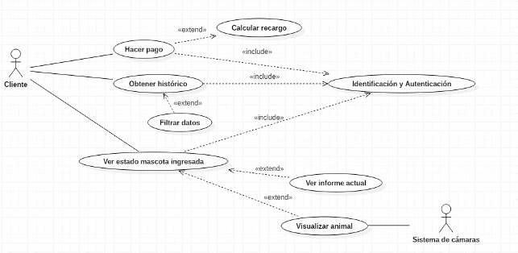

----

### Diagrama de casos de uso del actor Veterinario
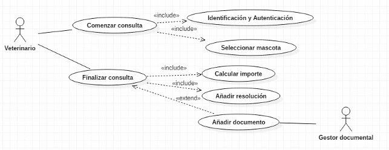

---
### DIAGRAMA DE CLASES
Es un diagrama de estructura
* Se utiliza para representar los elementos que componen un sistema de información desde un punto de vista estático.
* No incluye la forma en la que se comportan los distintos elementos a lo largo de la ejecución

----

Es un diagrama puramente orientado al modelo de programación orientado a objetos
* Define las clases que se utilizarán en la fase de construcción y la manera en que se relacionan las mismas.
 Muestra:
* La representación de datos y su interacción.
* El modelo lógico de los datos de un sistema.

---
### Elementos
<!-- .slide: style="font-size: 0.80em" -->
* **Clases:** elemento principal del diagrama y representa una clase dentro del paradigma de la orientación a
objetos. Define un grupo de objetos que comparten características, condiciones y significado.

Una clase está compuesta por tres elementos: nombre de la clase, atributos, funciones.
* (+) Pública. Representa que se puede acceder al atributo o función desde cualquier lugar de la aplicación.
* (-) Privada. Representa que se puede acceder al atributo o función únicamente desde la misma clase.
* (#) Protegida. Representa que el atributo o función puede ser accedida únicamente desde la misma clase o desde las 
clases que heredan de ella (clases derivadas)

----

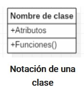 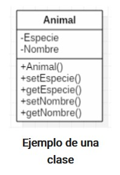

----

### Relaciones
<!-- .slide: style="font-size: 0.90em" -->
* Una relación identifica una dependencia.
* Las relaciones se representan con una línea que une las clases
* Propiedades:
  * Multiplicidad. Es decir, el número de elementos de una clase que participan en una relación. Se puede
indicar un número, un rango y se utiliza n o * para identificar un número cualquiera.
  * Nombre de la asociación. En ocasiones se escribe una indicación de la asociación que ayuda a
entender la relación que tienen dos clases. Suelen utilizarse verbos.

----

### Relaciones
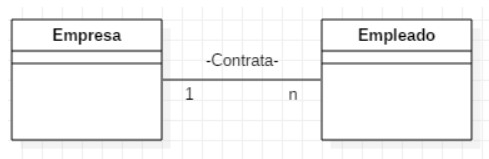

---
### Tipos de relaciones
* Asociación.
* Agregación.
* Composición.
* Herencia.

----

### Asociación
Este tipo de relación es el más común y se utiliza para representar dependencia semántica.
Se representa con una simple línea continua que une las clases que están incluidas en la asociación.

Ejemplo
Una mascota pertenece a una persona

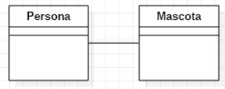

---
### Agregación
<!-- .slide: style="font-size: 0.90em" -->
Es una representación jerárquica que indica a un objeto y las partes que componen ese objeto.
Representa relaciones en las que un objeto es parte de otro pero tiene existencia en sí mismo.
Se representa con una línea que tiene un rombo en la la clase que es una agregación de la otra (en la clase que
contiene las otras).

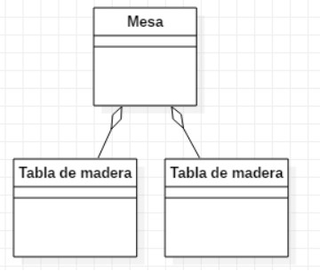

---
### Composición
<!-- .slide: style="font-size: 0.80em" -->
Representa una relación jerárquica entre un objeto y las partes que lo componen de una forma más fuerte que en la
agregación.
Cuando el elemento contenedor desaparece, desaparecen todos los contenidos. No tienen sentido por si mismos.
Contenedor y contenidos tienen los mismos tiempo de vida. 
Se representa con una línea continua con un rombo relleno en la clase que es compuesta.

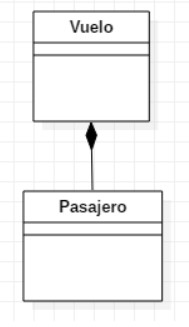

---
### Herencia
<!-- .slide: style="font-size: 0.90em" -->
Este tipo de relaciones permiten que una clase (clase hija o subclase) reciba los atributos y métodos de
otra clase (clase padre o superclase).
Estos atributos y métodos recibidos se suman a los que la clase tiene por sí misma.
Se utiliza en relaciones “es un”.

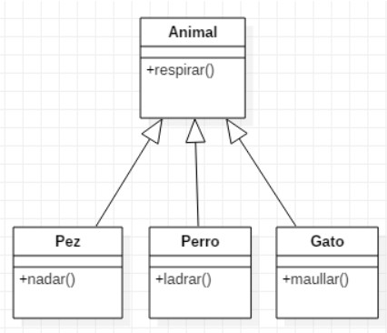

---
### Diagrama de clases para la clínica veterinaria

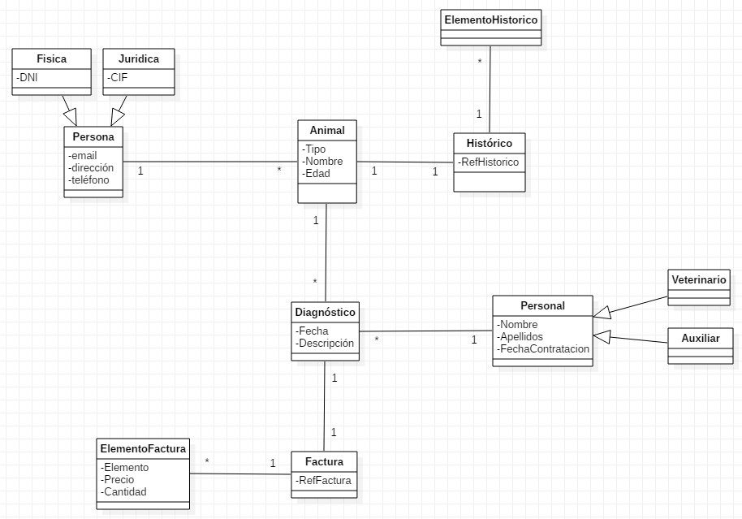

---
### DIAGRAMA DE SECUENCIA
Es un diagrama de interacción.
Permite:
* Representar el intercambio de mensajes entre los distintos objetos del sistema para cumplir con una funcionalidad.
* Definir el comportamiento dinámico del sistema de información.
* Definir como se realiza un caso de uso.
* Comprender el diagrama de clases.

Muestra como las instancias de clases interactúan mediante el.

----

Está construido a partir de dos dimensiones:
* Horizontal: Representa los objetos que participan en la secuencia.
* Vertical: Representa la línea de tiempo sobre la que los elementos actúan.

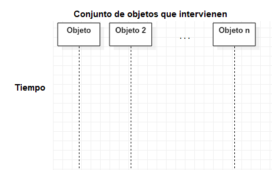

----

### Objeto:
* Representa a un participante en la interacción.
* Puede ser instancia de una clase, un módulo, un grupo de clases, es decir un componente software que tiene una funcionalidad específica
* Cada objeto representa solamente una instancia.
* Se representa mediante un rectángulo que incluye un identificador en su interior
* De cada uno sale una línea vertical hacia abajo que representa el tiempo en el que está presente.

----

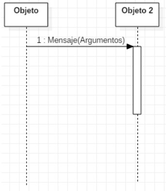

----

### Mensaje:
* Representa el paso de un mensaje entre dos objetos o entre un objeto y sí mismo.
* Flecha con el nombre del mensaje y los argumentos y que va desde el objeto que envía hacia el objeto que recibe.

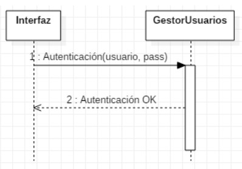

----

---
## ¿Dudas, Preguntas, Comentarios?

