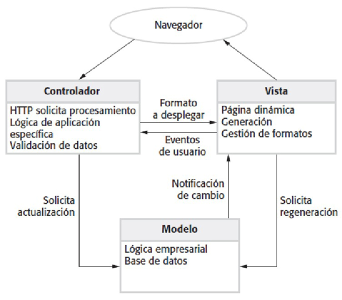

#### Ingeniería de Software
# Diseño Arquitectónico
Created by <i class="fab fa-telegram"></i>
[edme88]("https://t.me/edme88")

---
<!-- .slide: style="font-size: 0.60em" -->

## Temario

### Diseño Arquitectónico
* Arquitectura de Software
* Ventajas de la Arq. Explicita
* La Arq. y características del sistema
* Estructura del sistema
* Box y diagramas
* Decisiones de Diseño Arq.
* Reutilización de la Arq.

* Estilos Arquitectónicos
* Modelos Arquitectónicos
* Modelo Vista-Controlador
* Modelo Repositorio
* Modelo Cliente-Servidor
* Modelo de Capas
* Modelo de Tubería y Filtro

---

### Diseño Arquitectónico
Se refiere a la estructura y organización a gran escala de un sistema de software. Es la planificación de los componentes principales de un sistema y la forma en que interactúan entre ellos. El diseño arquitectónico se enfoca en la visión global del sistema, definiendo módulos, componentes, subsistemas, bases de datos, servidores y cómo todo se conecta y comunica.

----

### Diseño Arquitectónico: Ejemplo
- **Ejemplo:** Decidir si usar una arquitectura monolítica o una basada en microservicios.
- **Objetivo:** Crear una estructura robusta, escalable y eficiente que sirva de base para todo el sistema.

----

**Diseño Arquitectónico** y **Patrones de Diseño** NO son lo mismo.

----

### Patrones de Diseño
Son soluciones probadas y reutilizables para problemas comunes en el desarrollo de software a un nivel más detallado. Estos patrones se aplican a problemas específicos dentro del código o en la interacción de ciertos componentes, y son como "buenas prácticas" que se pueden seguir.

- **Ejemplo:** Patrones como Singleton, Factory, o Observer.
- **Objetivo:** Resolver problemas frecuentes de diseño en el nivel del código y mejorar la mantenibilidad y flexibilidad del software.

----

#### Diseño Arquitectónico vs. Patrones de Diseño
- **Escala:** El diseño arquitectónico trabaja a una escala más alta y global (visión del sistema completo), mientras que los patrones de diseño se centran en problemas más específicos y detallados dentro del código.
- **Finalidad:** El diseño arquitectónico es más estratégico y se refiere a la estructura general del sistema, mientras que los patrones de diseño son tácticos y se aplican a situaciones puntuales para mejorar la calidad del código.

---
### ARQUITECTURA DE SOFTWARE
* El diseño arquitectónico es un proceso de diseño que permite la identificación de los
sub-sistemas que componen un sistema y su comunicación
* El resultado de este proceso de diseño es una descripción de la arquitectura de software.

---
### DISEÑO ARQUITECTÓNICO
* Una fase temprana del proceso de diseño del sistema.
* Representa el vínculo entre los procesos de especificación y diseño.
* Suelen llevarse a cabo en paralelo con las actividades de algunas especificaciones.
* Se trata de identificar los principales componentes del sistema y sus comunicaciones.

---
### VENTAJAS DE LA ARQUITECTURA EXPLÍCITA
* **Comunicación entre los stakeholders**: La arquitectura puede ser utilizada como un foco de discusión del sistema 
por los stakeholders.
* **Análisis del sistema**: Significa que el análisis de si el sistema puede
hacer frente a sus requerimientos no funcionales es posible.
* **Reutilización a gran escala**: La arquitectura puede ser reutilizable a través
de una variedad de sistemas.

---
### LA ARQUITECTURA Y CARACTERÍSTICAS DEL SISTEMA
* **Rendimiento:** Reducir al mínimo las operaciones de comunicaciones. Uso de grano grueso en lugar de
componentes de grano fino.
* **Seguridad:** Una arquitectura con los procesos críticos en las capas interiores.
* **Disponibilidad:** Incluir componentes redundantes y los mecanismos de tolerancia a fallos.
* **Mantenibilidad:** Uso de grano fino, los componentes reemplazables.

---
### ESTRUCTURA DEL SISTEMA
* Concerniente a la descomposición del sistema en sub-sistemas.
* El diseño arquitectónico se expresa normalmente como un diagrama de bloques que presentan un
panorama general de la estructura del sistema.
* Modelos más específicos muestran cómo los sub-sistemas comparten los datos, se distribuyen y la
interfaz con los demás también pueden ser desarrollados.

---
### SISTEMA DE CONTROL DE ROBOT DE EMBALAJE

---
### BOX Y DIAGRAMAS
* Muy abstracto - que no muestran la naturaleza de los componentes ni las relaciones de las
propiedades visibles externamente de los sub-sistemas.
* Sin embargo, útil para la comunicación con las partes interesadas y para la planificación de proyectos.

---
### DECISIONES DE DISEÑO ARQUITECTÓNICO
* Diseño arquitectónico es un proceso creativo, por lo que el proceso es diferente dependiendo del
tipo de sistema que se está desarrollado.
* Sin embargo, es común una serie de decisiones, en todos los procesos de diseño.

---
### DECISIONES DE DISEÑO ARQUITECTÓNICO
* Existe una arquitectura de aplicaciones genéricas que se pueden utilizar?
* Cómo se distribuirá el sistema?
* Qué estilos arquitectónicos son apropiados?
* Qué enfoque se utilizará para la estructura del sistema?
* Cómo el sistema se descompone en módulos?
* Qué estrategia de control se debe utilizar?
* Cómo el diseño arquitectónico se evaluará?
* Cómo debe ser documentada la arquitectura?

---
### REUTILIZACIÓN DE LA ARQUITECTURA
* Sistemas en el mismo dominio a menudo tienen arquitecturas similares que reflejan conceptos del dominio.
* La aplicación de líneas de producción se construye en torno a un núcleo con arquitectura
particular, con variantes que satisfagan las necesidades del cliente.

---
### ESTILOS ARQUITECTÓNICOS
* El modelo arquitectónico de un sistema puede ajustarse a un modelo genérico o estilo arquitectónico.
* La conciencia de estos estilos puede simplificar el problema de la definición de arquitecturas de sistemas.
* Sin embargo, la mayoría de los grandes sistemas son heterogéneos y no siguen un mismo estilo arquitectónico.

---
### MODELOS ARQUITECTÓNICOS
<!-- .slide: style="font-size: 0.90em" -->
* Utilizarse para documentar un diseño arquitectónico.
* Modelo estructural estático, que muestra los principales componentes del sistema.
* Modelo de proceso dinámico que muestra el modelo de proceso de la estructura del sistema.
* Modelo de interfaz que define las interfaces de sub-sistemas.
* Modelo de relaciones, como un modelo de flujo de datos que muestra las relaciones de sub-sistemas.
* Modelo de distribución que muestra cómo los sub-sistemas se distribuyen a través de computadoras.

---
### MODELO VISTA-CONTROLADOR

---
### APLICACION WEB CON ARQUITECTURA MVC

---
### EL MODELO REPOSITORIO
* Sub-sistemas de intercambio de datos. Esto puede hacerse de dos maneras:
  * Datos compartidos se lleva a cabo en un repositorio o base de datos central y puede ser visitada por todos
los sub-sistemas;
  * Cada sub-sistema mantiene su propia base de datos y pasa datos explícitamente a otros subsistemas.
* Cuando grandes cantidades de datos sean compartidos, el modelo de repositorio compartido es más comúnmente utilizado.

---
### ARQUITECTURA DE REPOSITORIO IDE

---
### MODELO REPOSITORIO CARACTERÍSTICAS
**Ventajas**
* Manera eficaz de compartir grandes cantidades de datos;
* Sub-sistemas no tienen por qué preocuparse de cómo los datos se producen, por ejemplo, la gestión centralizada
copia de seguridad, seguridad, etc
* Un modelo a compartir se publica como el esquema del repositorio.

---
### MODELO REPOSITORIO CARACTERÍSTICAS
**Desventajas**
* Sub-sistemas deben ponerse de acuerdo sobre un modelo repositorio de datos. Inevitablemente, un compromiso;
* La evolución de datos es difícil y costosa;
* No hay lugar para las políticas de gestión específicas;
* Difícil de distribuir de manera eficiente.

---
### MODELO CLIENTE-SERVIDOR
* Sistema distribuido que muestra cómo el modelo de datos y procesamiento se distribuye a través
de una gama de componentes.
* Conjunto de servidores independientes que ofrecen servicios específicos, tales como la
impresión, gestión de datos, etc
* Conjunto de clientes que piden a éstos los servicios.
* Red que permite a los clientes acceder a los servidores.

---
### BIBLIOTECA DE IMÁGENES Y PELÍCULAS

---
### CLIENTE-SERVIDOR CARACTERÍSTICAS
**Ventajas**
* Distribución de datos es sencilla;
* Hace un uso eficaz de los sistemas en red. Puede requerir hardware más barato;
* Fácil añadir nuevos servidores o actualizar los servidores existentes.

---
### CLIENTE-SERVIDOR CARACTERÍSTICAS
**Desventajas**
* No hay un modelo de datos compartidos, así que los sub-sistemas utilizan diferentes datos de la organización.
Intercambio de datos puede ser ineficaz;
* Redundantes en la gestión de cada servidor;
* No hay registro central de nombres y servicios - que puede ser difícil de averiguar qué servidores y servicios están
disponibles.

---
### MODELO DE CAPAS
* Se utiliza para modelar la interacción de sub-sistemas.
* Organiza el sistema en un conjunto de capas (o máquinas abstractas) cada uno de los cuales
provee un conjunto de servicios.
* Apoya el desarrollo gradual de sub-sistemas en diferentes capas. Cuando una capa cambia, sólo
la capa adyacente se ve afectada.

---
### SISTEMA DE GESTIÓN

---
### SISTEMA DE BIBLIOTECA

---
### MODELO DE TUBERIA Y FILTRO
* Cada componente de procesamiento (filtro) es discreto y realiza un tipo de transformación de datos.
* Los datos fluyen (como en una tubería) de un componente a otro para su procesamiento.
* Se utiliza en aplicaciones de procesamiento de datos (tanto basadas en lotes como en transacciones),

---
### MODELO DE TUBERIA Y FILTRO

---
### THE STRUCTURE OF TRANSACTION PROCESSING APPLICATIONS

---
### THE SOFTWARE ARCHITECTURE OF AN ATM SYSTEM

---
### LAYERED INFORMATION SYSTEM ARCHITECTURE

---
### THE ARCHITECTURE OF THE MHC-PMS

---
### THE ARCHITECTURE OF A LANGUAGE PROCESSING SYSTEM

---
### A PIPE AND FILTER COMPILER ARCHITECTURE

---
### REPOSITORY ARCHITECTURE FOR A LANGUAGE PROCESSING SYSTEM

---
## ¿Dudas, Preguntas, Comentarios?

