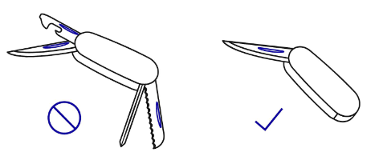
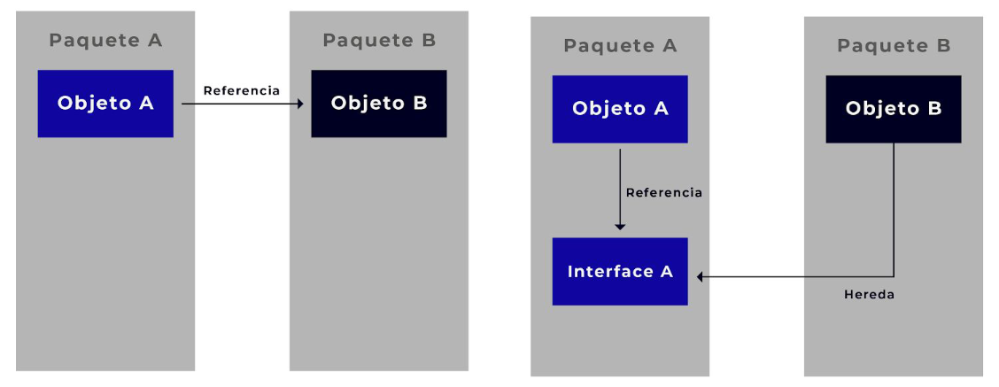
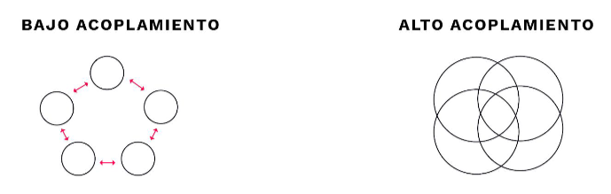

#### Ingeniería de Software
# Principios de Diseño
Created by <i class="fab fa-telegram"></i>
[edme88]("https://t.me/edme88")

---
<!-- .slide: style="font-size: 0.60em" -->

## Temario

### Principios de Desarrollo
* Introducción
* DRY
* KISS
* SOLID
* YAGNI
* Ley de Curly
* Optimización Prematura

* Inversion of Control
* Ley de Demeter
* Clean Code

---
### Principios de Desarrollo
Son una serie de reglas y recomendaciones que se deben seguir durante el desarrollo de software para lograr escribir un 
código limpio, comprensible y fácil de mantener.

----

Utilizar estos principios de forma descuidada puede hacer más mal que bien. El costo de aplicar estos principios en la 
arquitectura de un programa es que puede hacerlo más complicado de lo que debería.

---
### DRY
Es el acrónimo de “Don’t repeat yourself”. Implica que el código no debe contener líneas redundantes o duplicadas de lógica.
Cada pieza de funcionalidad debe tener una identidad única, no ambigua.

----

### DRY: Ventajas
- **Mantenibilidad:** Si alguna vez cambia la funcionalidad, no se debe re-implementar en todas partes.
- **Reduce el tamaño del código:** Esto lo hace más legible y entendible.
- **Ahorra tiempo:**  Tener fragmentos de lógica disponibles para reutilizase permite implemtnarlos rápidamente.

---
### KISS
Es un acrónimo de “keep it simple, stupid”, es decir, “mantenlo simple, estúpido”.
Minimizar los errores tratando de realizar las tareas de forma efectiva y eficiente complicandose lo mínimo posible.

La simplicidad debe ser un objetivo clave en el diseño, el desarrollo de la solución. Se debe evitar la complejidad innecesaria.

---
### SOLID
Es una regla mnemotécnica para cinco principios de diseño ideados para hacer que los diseños de software sean más
comprensibles, flexibles y fáciles de mantener.
- **S**ingle Responsibility
- **O**pen/Closed
- **L**iskov Substitution
- **I**nterface Segregation
- **D**ependency Inversion

----

### Single Responsibility
El principio de responsabilidad única establece que un módulo de software debe tener una y solo una razón para cambiar. Esta
razón para cambiar es lo que se entiende por responsabilidad.

----

Se debe limitar el impacto de un cambio, y eso se logra reduciendo el alcance de las funciones y clases.
Tener más de una responsabilidad también hace que el código sea difícil de leer, testear y mantener.

----

### Open/closed
Los módulos de software deben ser abiertos para su extensión pero cerrados para su modificación.
**Abierto para la extensión:** A medida que cambian los requisitos de la aplicación, podemos ampliar el módulo con nuevos 
comportamientos que satisfagan esos cambios.
**Cerrado por modificación:** Un módulo estará cerrado si dispone de una descripción (interface) estable y bien definida.

Cuando el comportamiento cambie de la manera esperada, no debamos hacer cambios radicales en todos los módulos del sistema.

----

### Liskov Substitution
Los objetos de un programa deberían ser reemplazables por instancias de sus subtipos sin alterar el correcto
funcionamiento del programa.

Si en alguna parte de nuestro código estamos usando una clase, y esta clase es extendida, tenemos que
poder utilizar cualquiera de las clases hijas y que el programa siga siendo válido. 

Esto nos obliga a asegurarnos de que cuando extendemos una clase no estamos alterando el comportamiento de la clase padre.

----

### Interface Segregation
El principio de segregación de interfaces establece que muchas interfaces cliente específicas son mejores que una 
interfaz de propósito general. Esto ayuda a reducir el acoplamiento innecesario.

----

### Dependency Inversion
Las entidades de software deben depender de abstracciones, no de implementaciones. 
Los módulos de alto nivel no deberían depender de los de bajo nivel.
Ocultamos los detalles de implementación, ganando flexibilidad.

----

### Dependency Inversion

---
### YAGNI
Es el acrónimo de "You Aren't Gonna Need It", o "No vas  anecesitar eso".
No se deben agregar funcionalidades extras hasta que no sea necesario. 

----

### YAGNI
Escribir código innecesario ahora que puede ser útil a futuro, tiene varias desventajas:
- desperdicio tiempo que se puede destinar a la funcionalidad básica
- cuando se requiera la nueva funcionalidad, quizás la misma no está correctamnete implementada.

---
### Ley de Curly
Cada función debe hacer una sola cosa y hacerla bien.
Una variable debe significar una sola cosa.
Se relaciona con el principio de responsabilidad única.

---
### Optimización Prematura
Optimizar el código o el rendimiento del sistema prematuramente, antes de que sea necesario o justificado puede conducir 
a ineficiencias, mayor complejidad y esfuerzo injustificado. 

Se anima a los desarrolladores a centrarse en la funcionalidad, la legibilidad y la mantenibilidad durante las etapas 
iniciales de desarrollo. 

----

### Optimización Prematura

Los esfuerzos de optimización deben reservarse para situaciones en las que se identifican y validan problemas de 
rendimiento reales.

---

### Inversion of Control
### Don’t call us, we’ll call you 
### Hollywood Principle
Delegar en un tercero flujos de control permite reducir el acoplamiento.
Permite aumentar la modularidad del programa, haciéndolo más testeable, mantenible y extensible.

----

### Inversion of Control
Algunos patrones de diseño son implementaciones de este principio:
- Service locator
- Dependency injection
- Template method
- Strategy
- Abstract Factory
- Observer

---
### Regla del Boy Scout
Si vemos alguna parte del código que se pueda mejorar, independientemente de quién lo haya hecho, debemos
mejorarlo.

El objetivo es mejorar la calidad del código y evitar su deterioro con el fin de ayudar al siguiente desarrollador a
cambiar o desarrollar una nueva funcionalidad de una forma más sencilla.

----

### Regla del Boy Scout
Se promueve el trabajo en equipo por encima de la individualidad, ya que no solo es importante la tarea que esa persona
ha realizado, sino el proyecto en general y si se ve que algo se puede mejorar, se hace.

----

### Regla del Boy Scout
La idea es mejorar pequeñas partes de código de manera acotada y segura, ya que tampoco es cuestión de cambiar un módulo
entero, sino poco a poco, ir mejorando su calidad.

---

### Law of Demeter (LoD)
### Principle of least knowledge
### Don’t talk to strangers
Un método de un objeto sólo debería interactuar con:
1. Métodos del propio objeto.
2. Los argumentos que recibe.
3. Cualquier objeto creado dentro del método.
4. Cualquier propiedad / campo directo dentro del propio objeto

----

### Law of Demeter (LoD)
Un objeto no tiene porqué conocer la estructura interna de los objetos con los que colabora.
Evitar (que posee acoplamiento):

`object.getX().getY().getZ().doSomething()`

----

### Law of Demeter (LoD)

----

### Law of Demeter (LoD)
La arquitectura con bajo acoplamiento
- Reduce el riesgo de que un cambio en un elemento pueda provocar cambios en otros elementos.
- Simplifica las pruebas, el mantenimiento y la resolución de problemas.
- Los componentes pueden reemplazarse más sencillamente.

---
### Separation of Concerns
Un sistema debe estar organizado de tal manera que cada parte del sistema (módulo, componente, clase, etc.) se encargue 
de una única preocupación o responsabilidad específica. Esto se hace para mejorar la mantenibilidad, modularidad, 
legibilidad, y facilidad de prueba del código. Cada parte del sistema se enfoca en una tarea específica y no se mezcla con otras responsabilidades.

----

### Separation of Concerns

Ejemplo: En una aplicación web, puedes separar el manejo de la lógica de negocio, la presentación (interfaz de usuario), 
y el acceso a datos en componentes distintos. De esta forma, cada componente se encarga de su propia responsabilidad.

---
### Readability
La legibilidad del código hace referencia a lo fácil que es leer, entender y seguir el código escrito por alguien. 
El código legible es aquel que puede ser comprendido no solo por la persona que lo escribió, sino también por otros 
programadores, incluso después de un tiempo. 

----

### Readability
Un código con alta legibilidad tiene las siguientes características:
- **Claridad en la estructura:** El código está organizado de manera que su estructura es fácil de seguir. 
Está dividido en módulos o funciones con responsabilidades claras.
- **Nombres descriptivos:** Variables, funciones y clases tienen nombres que describen claramente su propósito.
- **Simplicidad:** Las funciones y métodos hacen una sola cosa, evitando la complejidad innecesaria.
- **Comentarios adecuados:** Se usan comentarios cuando es necesario, pero el código en sí es tan claro que no depende 
- de ellos para entenderse.

----

### Readability
- La legibilidad es crucial porque un código más fácil de leer es también más fácil de mantener y modificar. 
- Facilita la colaboración entre desarrolladores, 
- Reduce la posibilidad de errores, 
- Hace que el código sea más intuitivo de actualizar cuando sea necesario.

---
### Testeability
La testeabilidad se refiere a lo fácil que es probar el código para asegurar que funciona correctamente. 
Un código altamente testeable es aquel que puede ser cubierto de manera eficiente por pruebas automatizadas o manuales, 
permitiendo verificar su correcto funcionamiento y encontrar errores rápidamente.

----

### Testeability: Características
- **Modularidad:** El código está organizado en pequeñas unidades (como funciones o clases) que se pueden probar de 
manera independiente.
- **Desacoplamiento:** Las dependencias entre módulos están claramente definidas, lo que permite probar cada componente 
sin necesidad de involucrar a todo el sistema.
- **Inyección de dependencias:** En lugar de que las dependencias (como bases de datos o APIs externas) estén "fijas" 
dentro del código, se pueden pasar desde fuera, lo que facilita la creación de pruebas unitarias sin depender de esos recursos externos.
- **Predicibilidad:** Las funciones son puras, \producen la misma salida para los mismos valores de entrada sin efectos 
secundarios, lo que facilita su prueba.

----

### Testeability
Un código testeable permite que se escriban pruebas unitarias, de integración o funcionales de manera sencilla y eficiente, 
reduciendo la posibilidad de errores y facilitando el mantenimiento a largo plazo.

---
### Least Astonishment
### Menor Sorpresa
Cuando un programador, usuario o desarrollador utiliza un sistema, su comportamiento debe ser predecible y coherente 
con lo que ellos esperan. Es decir, el software debe comportarse de manera que cause la menor cantidad de sorpresas o confusión posible.

----

### Menor Sorpresa: Beneficios
- **Mejor experiencia de usuario:** Los usuarios no necesitan aprender nuevos comportamientos o leer la documentación 
con frecuencia, ya que el sistema se comporta de manera predecible.
- **Mejor mantenibilidad:** Otros desarrolladores que trabajen en el código podrán entenderlo fácilmente, ya que sigue 
convenciones comunes y consistentes.
- **Menos errores:** Cuando los usuarios o desarrolladores entienden claramente cómo deben funcionar las cosas, es menos probable que cometan errores.

---
### RubberDuckin

---
### Clean Code

---
## ¿Dudas, Preguntas, Comentarios?

