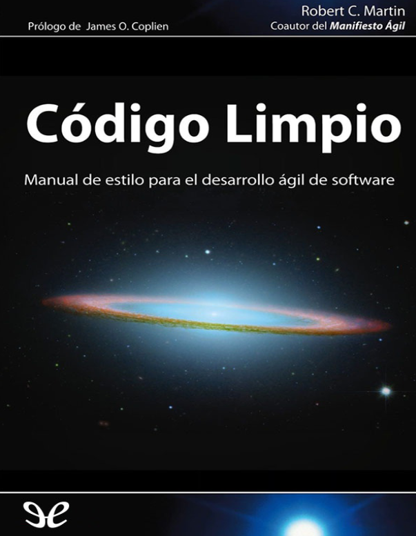
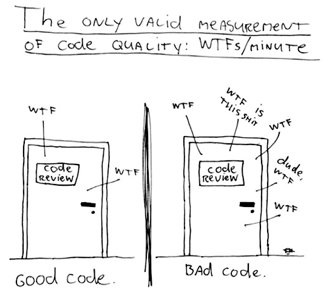
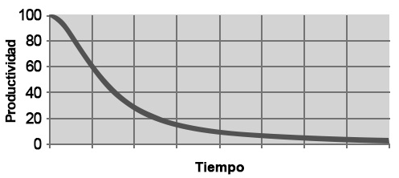

#### Ingeniería de Software
# Clean Code
Created by <i class="fab fa-telegram"></i>
[edme88]("https://t.me/edme88")

---
<!-- .slide: style="font-size: 0.60em" -->
<style>
.grid-container2 {
    display: grid;
    grid-template-columns: auto auto;
    font-size: 0.8em;
    text-align: left !important;
}

.grid-item {
    border: 3px solid rgba(121, 177, 217, 0.8);
    padding: 20px;
    text-align: left !important;
}
</style>
## Temario
<div class="grid-container2">
<div class="grid-item">

### Clean Code

<div class="grid-item">

</div>
</div>

---
### Clean Code



---
### Mantenimiento productivo total
<!-- .slide: style="font-size: 0.90em" -->
Enfoque que se centra en el mantenimiento y no en la producción. Tiene los siguientes principios:
- **organización:** Saber dónde están las cosas, mediante el uso de nombres correctos.
- **sistematización:** Un fragmento de código debe estar donde esperamos encontrarlo; en caso contrario, refactorice
- **limpieza:** Eliminar los comentarios innecesarios.
- **estandarización:** Tener un estilo de código coherente y una serie de prácticas dentro del grupo.
- **disciplina:** Reflejar las buenas prácticas en el trabajo y aceptar los cambios.

---

## Crear código legible es tan importante como crear código ejecutable.

----

La calidad es el resultado de un millón de acciones cuidadosas, no de un método magnífico caído del cielo.

---
### Los pequeños detalles importan
- Hemos hecho todo lo posible para dejar las cosas mejor que como las encontramos?
- Hemos refactorizado el código antes de terminarlo? 

---



---

La maestría se consigue de dos formas: 
- conocimientos 
- trabajo
 
Debe adquirir el conocimiento de los principios, patrones, prácticas y heurística propios de un maestro, y dominar 
dichos conocimientos a través de la práctica.

----

Aprender a crear código limpio es complicado. 
Requiere algo más que conocer principios y patrones.
Debe practicarlo y fallar.

---

¿Plazos de entrega acotados? Puede que pensara que no tenía tiempo para hacer un buen trabajo; que su jefe se enfadaría si
necesitaba tiempo para limpiar su código. O puede que estuviera cansado de trabajar en ese programa y quisiera acabar 
cuanto antes. O que viera el trabajo pendiente y tuviera que acabar con un módulo para pasar al siguiente.

Todos hemos sentido el alivio de ver cómo un programa incorrecto funcionaba y hemos decidido que un mal programa que 
funciona es mejor que nada. Todos hemos dicho que lo solucionaríamos después.

#### ley de LeBlanc: Después es igual a nunca.

---
<!-- .slide: style="font-size: 0.90em" -->
Los equipos que avancen rápidamente al inicio de un proyecto pueden acabar muy lentamente.
Ningún cambio es trivial. Para ampliar o modificar el sistema es necesario comprender todos los detalles, efectos y
consecuencias, para de ese modo poder añadir nuevos detalles, efectos y consecuencias.



La única forma de cumplirlo, la única forma de avanzar, es intentar que el código siempre sea limpio.

---
#### Código Limpio: Según Bjarne, inventor de C++
Me gusta que mi código sea elegante y eficaz. 
La lógica debe ser directa para evitar errores ocultos, 
las dependencias deben ser mínimas para facilitar el mantenimiento, 
el procesamiento de errores completo y sujeto a una estrategia articulada, 
y el rendimiento debe ser óptimo para que los usuarios no tiendan a estropear el código con
optimizaciones sin sentido. 
El código limpio hace bien una cosa.

El código incorrecto intenta hacer demasiadas cosas y su
cometido es ambiguo y enrevesado

----

#### Código Limpio: Según Grady Booch, autor de libros OO
El código limpio es simple y directo. 
El código limpio se lee como un texto bien escrito. 
El código limpio no oculta la intención del diseñador, sino que muestra nítidas abstracciones y líneas directas de control

----

#### Código Limpio: Según Dave Thomas, estrategia Eclipse
El código limpio se puede leer y mejorar por parte de un programador que no sea su autor original. 
Tiene pruebas de unidad y de aceptación.
Tiene nombres con sentido. 
Ofrece una y no varias formas de hacer algo. 
Sus dependencias son mínimas, se definen de forma explícita y ofrece una API clara y mínima. 
El código debe ser culto en función del lenguaje, ya que no toda la información necesaria se puede
expresar de forma clara en el código.

----

#### Código Limpio: Según MiChael Feathers, trabajo con proyectos Legacy
El código limpio siempre parece que ha sido escrito por alguien a quien le importa. 
No hay nada evidente que hacer para mejorarlo. 
El autor del código pensó en todos los aspectos posibles.

----

#### Código Limpio: Según Ron Jeffries, autor de libros de C#
El código simple:
- Ejecuta todas las pruebas.
- No contiene duplicados.
- Expresa todos los conceptos de diseño del sistema.
- Minimiza el número de entidades como clases, métodos, funciones y similares.

----

#### Código Limpio: Según Ward Cunningham, inventor de Wiki
Cada rutina que leemos resulta ser lo que esperábamos.

---

No se puede escribir código si no se puede leer el código circundante.

Por eso es importante la **regla del Boy Scout**...Si todos entregamos el código más limpio de 
lo que lo hemos recibido, no se corromperá.

---
### 2. Nombres con sentido
- Bautizar las variables con el mismo cuidado que su primogénico.
- Usar nombres que revelen las intenciones
- No usar siglas confusas que se puedan confundir con otras
- No emplear nombres de variables que varien mínimamente
- Evitar nombres como a\[2] que generan desinformación
- Usar nombres que se puedan pronunciar
- Usar nombres que se puedan buscar (variables no cortas)

----

### 2. Nombres con sentido
- Los nombres de las clases y objetos deben ser frases, no verbos.
- Los métodos deben ser verbos
- No emplee bromas o juegos de palabras (en lugar de eatMyShorts() decir abort())

----

Definir con el equipo que tipo de notación emplear y en que circunstancias.
  - camelCase
  - snake_case
  - kebab-case
  - PascalCase
  - Notación Hungara

---
### 3. Funciones
- Deben tener un tamaño reducido (se recomienda 20 líneas)
- Espaciado (identación, lintting) adecuados
- Cada función debe hacer una cosa, hacerlo bien... Y debe ser lo único que hagan
- Usar nombres descriptivo
- Deben recibir pocos argumentos (0,1,2...nunca +3)
- Evitar la duplicación de código empleando funciones adecuadamente

----

### 3. Funciones
- Refactorizar una vez terminado el trabajo. Re-estructurar la función, dividirla, re-organizarla, cambiar nombres,
eliminar duplicados.
- La primera versión de código siempre es desorganizada, como un borrador.

---
### 4. Comentarios
- No hay nada más útil que un comentario bien colocado.
- No agregar comentarios dogmáticos innecesarios.
- Nunca comentar líneas de código. Eliminarlas. Si son necesarias a futuro, el sistema de control de versiones las
mantiene guardadas.
- No agregar comentarios innecesarios (los programadores nunca los mantienen)
- El código debe ser lo suficientemente auto-descriptivo.
- Los comentarios no compensan el código incorrecto.

----

### 4. Comentarios
- Advertir de las consecuencias ```No ejecutar a menos que se disponga de 5hs```
- Comentarios **TODO** para marcar una función que actualmente es correcta, pero se debe ampliar su funcionalidad. O,
que debe ser refactorizada
- Evitar comentarios redundantes, confusos, obligatorios, periódicos, sobrantes

---
### 5. Formato
- Es importante porque ayuda  a la claridad y legibilidad del código
- Todo el equipo debe ponerse de acuerdo en las normas de formateo y lintting que emplearán
- Se recomienda archivos de menos de 500 líneas
- Las funciones relacionadas entre si deben mantenerse juntas (poco distanciadas)
- La declaración de variables debe realizarse cercana a su uso

---
### 6. Objetos y Estructuras de Datos


---
## ¿Dudas, Preguntas, Comentarios?

