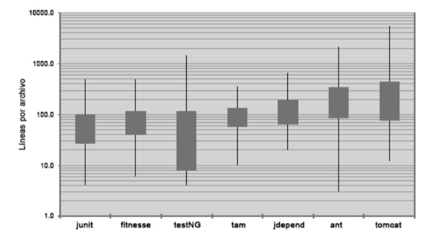
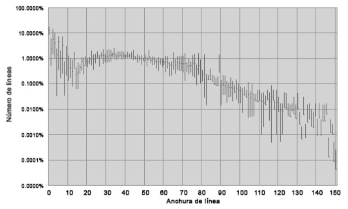

#### Ingeniería de Software
# Clean Code
Created by <i class="fab fa-telegram"></i>
[edme88]("https://t.me/edme88")

---
<!-- .slide: style="font-size: 0.60em" -->
<style>
.grid-container2 {
    display: grid;
    grid-template-columns: auto auto;
    font-size: 0.8em;
    text-align: left !important;
}

.grid-item {
    border: 3px solid rgba(121, 177, 217, 0.8);
    padding: 20px;
    text-align: left !important;
}
</style>
## Temario
<div class="grid-container2">
<div class="grid-item">

### Clean Code

* Mantenimiento productivo total
* ¿Qué es el código limpio?
* 2. Nombres con sentido
* 3. Funciones
* 4. Comentarios

</div>
<div class="grid-item">

5. Formato
6. Objetos y Estructuras de Datos
7. Procesar Errores
8. Límites
9. Pruebas de Unidad
10. Clases

</div>
</div>

---


---
### Mantenimiento productivo total
<!-- .slide: style="font-size: 0.90em" -->
Enfoque que se centra en el mantenimiento y no en la producción. Tiene los siguientes principios:
- **organización:** Saber dónde están las cosas, mediante el uso de nombres correctos.
- **sistematización:** Un fragmento de código debe estar donde esperamos encontrarlo; en caso contrario, refactorice
- **limpieza:** Eliminar los comentarios innecesarios.
- **estandarización:** Tener un estilo de código coherente y una serie de prácticas dentro del grupo.
- **disciplina:** Reflejar las buenas prácticas en el trabajo y aceptar los cambios.

---

## Crear código legible es tan importante como crear código ejecutable.

----

La calidad es el resultado de un millón de acciones cuidadosas, no de un método magnífico caído del cielo.

---
### Los pequeños detalles importan
- Hemos hecho todo lo posible para dejar las cosas mejor que como las encontramos?
- Hemos refactorizado el código antes de terminarlo? 

---


---

La maestría se consigue de dos formas: 
- conocimiento
- trabajo
 
Debe adquirir el conocimiento de los principios, patrones, prácticas y heurística propios de un maestro, y dominar 
dichos conocimientos a través de la práctica.

----

Aprender a crear código limpio es complicado. 
Requiere algo más que conocer principios y patrones.
#### Debe practicarlo y fallar.

---

¿Plazos de entrega acotados? Puede que pensara que no tenía tiempo para hacer un buen trabajo; que su jefe se enfadaría si
necesitaba tiempo para limpiar su código. O puede que estuviera cansado de trabajar en ese programa y quisiera acabar 
cuanto antes. O que viera el trabajo pendiente y tuviera que acabar con un módulo para pasar al siguiente.

Todos hemos sentido el alivio de ver cómo un programa incorrecto funcionaba y hemos decidido que un mal programa que 
funciona es mejor que nada. Todos hemos dicho que lo solucionaríamos después.

#### ley de LeBlanc: Después es igual a nunca.

---
<!-- .slide: style="font-size: 0.90em" -->
Los equipos que avancen rápidamente al inicio de un proyecto pueden acabar muy lentamente.
Ningún cambio es trivial. Para ampliar o modificar el sistema es necesario comprender todos los detalles, efectos y
consecuencias, para de ese modo poder añadir nuevos detalles, efectos y consecuencias.


La única forma de cumplirlo, la única forma de avanzar, es intentar que el código siempre sea limpio.

---
#### Código Limpio: Según Bjarne, inventor de C++
Me gusta que mi código sea elegante y eficaz. 
La lógica debe ser directa para evitar errores ocultos, 
las dependencias deben ser mínimas para facilitar el mantenimiento, 
el procesamiento de errores completo y sujeto a una estrategia articulada, 
y el rendimiento debe ser óptimo para que los usuarios no tiendan a estropear el código con
optimizaciones sin sentido. 
El código limpio hace bien una cosa.

El código incorrecto intenta hacer demasiadas cosas y su
cometido es ambiguo y enrevesado

----

#### Código Limpio: Según Grady Booch, autor de libros OO
El código limpio es simple y directo. 
El código limpio se lee como un texto bien escrito. 
El código limpio no oculta la intención del diseñador, sino que muestra nítidas abstracciones y líneas directas de control

----

#### Código Limpio: Según Dave Thomas, estrategia Eclipse
El código limpio se puede leer y mejorar por parte de un programador que no sea su autor original. 
Tiene pruebas de unidad y de aceptación.
Tiene nombres con sentido. 
Ofrece una y no varias formas de hacer algo. 
Sus dependencias son mínimas, se definen de forma explícita y ofrece una API clara y mínima. 
El código debe ser culto en función del lenguaje, ya que no toda la información necesaria se puede
expresar de forma clara en el código.

----

#### Código Limpio: Según MiChael Feathers, trabajo con proyectos Legacy
El código limpio siempre parece que ha sido escrito por alguien a quien le importa. 
No hay nada evidente que hacer para mejorarlo. 
El autor del código pensó en todos los aspectos posibles.

----

#### Código Limpio: Según Ron Jeffries, autor de libros de C#
El código simple:
- Ejecuta todas las pruebas.
- No contiene duplicados.
- Expresa todos los conceptos de diseño del sistema.
- Minimiza el número de entidades como clases, métodos, funciones y similares.

----

#### Código Limpio: Según Ward Cunningham, inventor de Wiki
Cada rutina que leemos resulta ser lo que esperábamos.

---

No se puede escribir código si no se puede leer el código circundante.

Por eso es importante la **regla del Boy Scout**...Si todos entregamos el código más limpio de 
lo que lo hemos recibido, no se corromperá.

---
### 2. Nombres con sentido
- Bautizar las variables con el mismo cuidado que su primogénico.
- Usar nombres que revelen las intenciones
- No usar siglas confusas que se puedan confundir con otras
- No emplear nombres de variables que varien mínimamente
- Evitar nombres como a\[2] que generan desinformación
- Usar nombres que se puedan pronunciar
- Usar nombres que se puedan buscar (variables no cortas)

----

### 2. Nombres con sentido
- Los nombres de las clases y objetos deben ser frases, no verbos.
- Los métodos deben ser verbos
- No emplee bromas o juegos de palabras (en lugar de eatMyShorts() decir abort())

----

Definir con el equipo que tipo de notación emplear y en que circunstancias.
  - camelCase
  - snake_case
  - kebab-case
  - PascalCase
  - Notación Hungara

---
### 3. Funciones
- Deben tener un tamaño reducido (se recomienda 20 líneas)
- Espaciado (identación, lintting) adecuados
- Cada función debe hacer una cosa, hacerlo bien... Y debe ser lo único que hagan
- Usar nombres descriptivos
- Deben recibir pocos argumentos (0,1,2...nunca +3)
- Evitar la duplicación de código empleando funciones adecuadamente

----

### 3. Funciones
- Refactorizar una vez terminado el trabajo. Re-estructurar la función, dividirla, re-organizarla, cambiar nombres,
eliminar duplicados.
- La primera versión de código siempre es desorganizada, como un borrador.

---
### 4. Comentarios
- No hay nada más útil que un comentario bien colocado.
- No agregar comentarios dogmáticos innecesarios.
- Nunca comentar líneas de código. Eliminarlas. Si son necesarias a futuro, el sistema de control de versiones las
mantiene guardadas.
- No agregar comentarios innecesarios (los programadores nunca los mantienen)
- Los comentarios no compensan el código incorrecto.

----

### 4. Comentarios
- El código debe ser lo suficientemente auto-descriptivo.
````javascript
// Comprobar si el empleado tiene derecho a todos los beneficios
if ((employee.flags & HOURLY_FLAG) && (employee.age > 65))
````
Puede mejorarse como:
````javascript
if (employee.isEligibleForFullBenefits())
````

----

### 4. Comentarios
- Advertir de las consecuencias ```No ejecutar a menos que se disponga de 5hs```
- Comentarios **TODO** para marcar una función que actualmente es correcta, pero se debe ampliar su funcionalidad. O,
que debe ser refactorizada
- Evitar comentarios redundantes, confusos, obligatorios, periódicos, sobrantes

---
### 5. Formato
- Es importante porque ayuda  a la claridad y legibilidad del código
- Todo el equipo debe ponerse de acuerdo en las normas de formateo y lintting que emplearán
- Las funciones relacionadas entre si deben mantenerse juntas (poco distanciadas)
- La declaración de variables debe realizarse cercana a su uso

----

#### 5. Formato



----

#### 5. Formato
- Las líneas no deben ser demasiado extensas (de 20 a 60 caracteres)



---
### 6. Objetos y Estructuras de Datos
- Los objetos muestran comportamiento y ocultan datos.
- Las estructuras de datos muestran datos y carecen de comportamiento significativo.
- Lo que es difícil para la programación orientada a objetos es fácil para los procedimientos y viceversa.

----

### 6. Objetos y Estructuras de Datos
La **Ley de Demeter** afirma que un módulo no debe conocer los entresijos de los objetos que manipula.
Un objeto no debe mostrar su estructura interna a través de métodos de acceso.

---
### 7. Procesar Errores
- El control de errores es importante, pero si oscurece la lógica es incorrecto.
- Usar excepciones en lugar de códigos devueltos.
- Emplear Try-Catch-Finally
- Ofrecer contexto junto a las excepciones, para determinar origen y ubicación del error.
- Los mensajes de error deben ser informativos: operación fallida y tipo de fallo.

----

### 7. Procesar Errores
- No devolver null
- El código limpio es legible pero también debe ser robusto.

---
### 8. Límites
- No hay control sobre paquetes de tercetos, programas de código abierto ó códiga de nuestra propia empresa, de otra 
área o equpo.
- El código de tercetos permite obtener mayor funcionalidad en menos tiempo (se deben crear pruebas del código empleado)
- Crear "pruebas de aprendizaje" para entender el funcionamiento de software de 3ros (y verificar si falla).

---
### 9. Pruebas de Unidad
El DGP o Desarrollo Guiado por Pruebas tiene 3 leyes:
- **1 Ley:** No debe crear código de producción hasta que haya creado una prueba de unidad que falle.
- **2 Ley:** No debe crear más de una prueba de unidad que baste como fallida, y no compilar se considera un fallo.
- **3 Ley:** No debe crear más código de producción que el necesario para superar la prueba de fallo actual

----

### 9. Pruebas de Unidad
- Tener pruebas incorrectas es lo mismo que no tener ninguna prueba.
- Las pruebas hacen que el código sea flexible, que se pueda mantener y reutilizar
- Las pruebas también deben ser limpias (tener legibilidad)
- Una afirmación por prueba (1 assert)

----

### 9. Pruebas de Unidad: FIRST
- **Rapidez (Fast):** Los tests deben ejecutarse de forma rápida. Si lo hacen lentamente, no se ejecutarán con frecuencia.
- **Independencia:** Las pruebas no deben depender unas de otras. Cada prueba se debe poder ejecutar de forma independiente.
- **Repetición:** Las pruebas deben poder repetirse en cualquier entorno. 
- **Validación automática:** Las pruebas deben tener un resultado booleano: o aciertan o fallan. 
- **Puntualidad:** Las pruebas deben crearse antes que el código del programa.

---
### 10. Clases
- Deben estar correctamente organizadas (primero las constantes, luego las variables privadas, públicas, funciones)
- Las clases deben ser de tamaño reducido
- El nombre de la clase no debe ser ambiguo o extenso
- Deben manejar un número reducido de variables

----

### 10. Clases
- Las clases deben abrirse para su ampliacion y cerrarse para su modificación.

---
### 11. Sistemas
Los sistemas de software deben separar el proceso de inicio, en el que
se crean los objetos de la aplicación y se conectan las dependencias,
de la lógica de ejecución que toma el testigo tras el inicio.

----

### 11. Sistemas
Conseguir sistemas perfectos a la primera es un mito. Por el contrario,
debemos implementar hoy, y refactorizar y ampliar mañana. Es la esencia de
la agilidad iterativa e incremental. El desarrollo controlado por pruebas, la
refactorización y el código limpio que generan hace que funcione a nivel del
código.

----

### 11. Sistemas
No es necesario realizar un Buen diseño por
adelantado (Big Design Up Front, BDUF). De hecho, BDUF puede ser
negativo ya que impide la adaptación al cambio, debido a la resistencia
fisiológica a descartar esfuerzos previos y a la forma en que las decisiones
arquitectónicas influyen en la concepción posterior del diseño.

----

### 11. Sistemas
Los estándares facilitan la reutilización de ideas y componentes,
reclutan individuos con experiencia, encapsulan buenas ideas y
conectan componentes. Sin embargo, el proceso de creación de
estándares puede tardar demasiado para el sector, y algunos pierden
el contacto con las verdaderas necesidades de aquello para los que
están dirigidos.

---
### 12. Emergencia
Según **Kent Beck** (XP, TDD) un diseño sencillo sigue 4 reglas:
1. Ejecuta todas las pruebas.
2. No contiene duplicados.
3. Expresa la intención del programador.
4. Minimiza el número de clases y métodos.

----

### 12. Emergencia
-  Sistemas que no se pueden probar no se pueden verificar, y
un sistema que no se puede verificar no debe implementarse.
- Debemos mantener limpio el código y las clases.
Para ello, refactorizamos el código progresivamente.

----

### 12. Emergencia
- El código debe expresar con claridad la intención de su autor. Cuando más claro sea el
código, menos tiempo perderán otros en intentar comprenderlo. Esto reduce
los defectos y el coste de mantenimiento.
- Uno de los principales objetivos de una prueba es servir de documentación mediante ejemplos.

---
### 13. Concurrencia
- Algunos sistemas tienen limitaciones de tiempo de respuesta y producción
que requieren soluciones concurrentes.

----

### 13. Concurrencia: Mitos
- La concurrencia siempre mejora el rendimiento.
- El diseño no cambia al crear programas concurrentes: De hecho, el
diseño de un algoritmo concurrente puede ser muy distinto al de un
sistema de un solo proceso.
- No es importante entender los problemas de concurrencia al trabajar
con un contenedor Web

----

### 13. Concurrencia
- La concurrencia genera cierta sobrecarga, tanto en rendimiento como
en la creación de código adicional.
- La concurrencia correcta es compleja, incluso para problemas sencillos.
- Los errores de concurrencia son difíciles de repetir (y por lo tanto, de solucionar).
- La concurrencia suele acarrear un cambio fundamental de la estrategia de diseño

----

### 13. Concurrencia: Consejos
- Separe el código de concurrencia del resto del código
- Encapsule los datos y limite el acceso a los datos compartidos.
- Ejecute el código con procesos en todas las
plataformas de destino con frecuencia y en las fases iniciales.
- La combinación de pruebas bien escritas y ejecuciones
aleatorias puede aumentar considerablemente la capacidad de detectar
errores.

---
### 14. Refinamiento sucesivo
- No espero que pueda crear programas limpios y elegantes a la primera.
- Para escribir código limpio, primero debe crear código imperfecto y después limpiarlo.
- Refactorizar progresivamente.
- Mantener el funcionamiento mientras se cambia gradualmente la forma del programa.
- Las pruebas siempre deben ser satisfactorias.

----

### 14. Refinamiento sucesivo
- La refactorización es como resolver el cubo de Rubik. Se necesitan muchos
pasos pequeños para lograr un objetivo mayor. Cada paso habilita el
siguiente.
- El diseño de software correcto se basa gran parte en las particiones, en
crear zonas adecuadas para incluir distintos tipos de código. Esta separación
hace que el código sea más fácil de entender y mantener.

----

### 14. Refinamiento sucesivo
- No basta con que el código funcione. El código que funciona suele ser incorrecto. 
- Puede que teman que no tienen tiempo para mejorar la estructura y el diseño del código. 
Pero no hay nada que afecte más negativamente a un proyecto de desarrollo que el código
incorrecto. 
- El código incorrecto se puede limpiar pero resulta muy costoso. 
- Resulta relativamente sencillo mantener código limpio. Si comete un
error en un módulo, es más fácil limpiarlo directamente.

---
### 15. Pruebas Unitarias
- Larefactorización es un proceso iterativo de ensayo y error, e inevitablemente
converge en algo que consideramos digno de un profesional.
- Siempre cumpla la Regla del Boy Scout. Hemos dejado este módulo más
limpio de como lo encontramos.

---
### 16. Refactorización
- A través de las críticas es como podemos aprender.

---
### 17. Síntomas y Heurística
- En el libro Refactoring, Martin Fowler identifica diversos síntomas de código (Smells).

----

### 17. Smells: Comentarios:
- **C1: Información inapropiada**
No es apropiado que un comentario contenga información que se pueda
almacenar en otro tipo de sistema como un sistema de control de código
fuente, de seguimiento de problemas o de mantenimiento de registros. 
Los comentarios deben reservarse para notas técnicas sobre el
código y el diseño.

----

### 17. Smells: Comentarios:
- **C2: Comentario obsoleto**
Un comentario anticuado, irrelevante e incorrecto es obsoleto. Los
comentarios envejecen rápidamente. Es recomendable no escribir un
comentario que vaya a quedar obsoleto. Si detecta un comentario obsoleto,
conviene actualizarlo o eliminarlo lo antes posible. 
- **C3: Comentario redundante**
Un comentario es redundante si describe algo que ya se define correctamente por si mismo.

----

### 17. Smells: Comentarios:
- **C4: Comentario mal escrito**
Un comentario que merezca la pena escribir merece la pena ser leído.
Elija las palabras con atención. Use gramática y puntuación correctas. No
divague. No afirme lo evidente. Sea breve.

- **C5: Código comentado**
El código comentado es una aberración.
Cuando vea código comentado, elimínelo.

----

### 17. Smells: Entorno:
- **E1: La generación requiere más de un paso**
La generación de un proyecto debería ser una operación sencilla.

- **E2: Las pruebas requieren más de un paso**
Debería poder ejecutar todas las pruebas de unidad con un solo comando. 
La capacidad de ejecutar todas las pruebas es tan importante que
debe ser algo rápido, sencillo y obvio.

----

### 17. Smells: Funciones:
- **F1: Demasiados argumentos**
Las funciones deben tener un número reducido de argumentos. Lo mejor es
que no tengan, seguido de uno, dos y tres argumentos. Más de tres ya es
cuestionable y debería evitarse.

----

### 17. Smells: Funciones:
- **F2: Argumentos de salida**
Los argumentos de salida son ilógicos. Si su función tiene que cambiar el estado de algo,
haga que cambie el estado del objeto en el que se invoca.

- **F3: Argumentos de indicador**
Los argumentos booleanos declaran abiertamente que la función hace más de
una cosa. Resultan confusos y deben eliminarse.

- **F4: Función muerta**
Los métodos que nunca se invocan deben descartarse. La presencia de código
muerto es innecesaria. No tema eliminar la función.

----

### 17. Smells: General:
- **G1: Varios lenguajes en un archivo de código**
Lo ideal sería que el archivo de código incluyera un solo lenguaje.

- **G2: Comportamiento evidente no implementado**
De acuerdo al Principio de la Mínima Sorpresa, una función o clase debe
implementar los comportamientos que otro programador esperaría.

----

### 17. Smells: General:
- **G3: Comportamiento incorrecto en los límites**
El código debe comportarse de forma correcta. Busque todas las
condiciones de límite y cree pruebas para cada una.

- **G4: Medidas de seguridad canceladas**
Anular las medidas de seguridad es un riesgo.
La desactivación de determinadas advertencias del compilador corre el riesgo de
sufrir interminables sesiones de depuración.

----

### 17. Smells: General:
- **G5: Duplicación**
Seguir el principio DRY (Don't Repeat Yourself, No repetirse).
La duplicación podría convertirse en una subrutina o en
otra clase.
Localice los elementos duplicados y elimínelos siempre que pueda.

- **G6: Código en un nivel de abstracción incorrecto**
Es importante crear abstracciones que separen conceptos generales de nivel
superior de conceptos detallados de nivel inferior.

----

### 17. Smells: General:
- **G7: Clases base que dependen de sus variantes**
Los conceptos de nivel superior de la clase base sean independientes
de los de nivel inferior de las derivadas.

- **G8: Exceso de información**
Los módulos bien definidos tienen interfaces reducidas que nos permiten
hacer mucho con poco. 
Una interfaz bien definida no ofrece demasiadas funciones y las conexiones son reducidas.
Cuantas menos variables de instancia tenga una clase, mejor.

----

### 17. Smells: General:
- **G9: Código muerto**
El código muerto no se actualiza al cambiar los diseños.
Bórrelo del sistema.

- **G10: Separación vertical**
Variables y funciones deben definirse cerca de donde se utilicen. Las
variables locales deben declararse por encima de su primer uso y deben tener
un reducido ámbito vertical

----

### 17. Smells: General:
- **G11: Incoherencia**
Si hace algo de una forma concreta, aplique la misma técnica a operaciones similares.

- **G12: Desorden**
Variables sin usar, funciones que nunca se invocan, comentarios que no
añaden información, etc. Todos estos elementos sobran y deben eliminarse.

---

## ¿Dudas, Preguntas, Comentarios?

