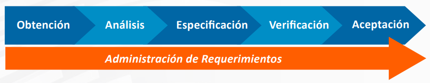
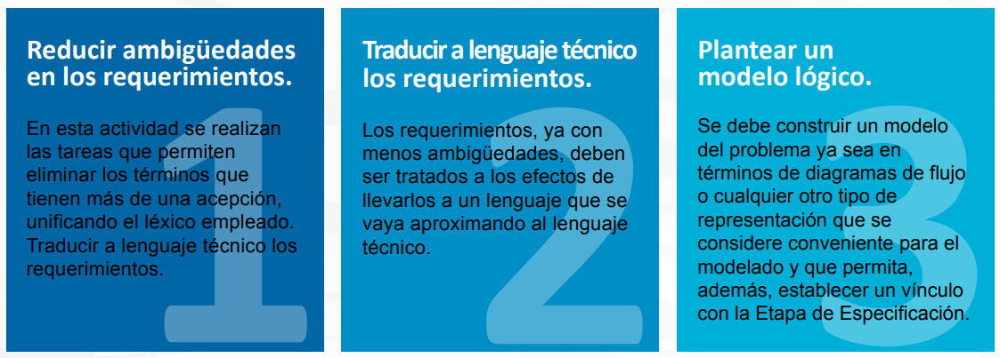
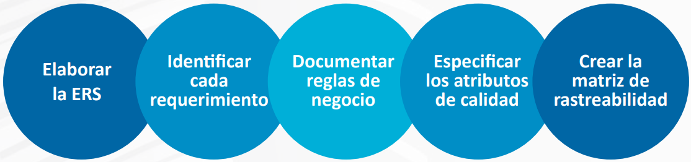
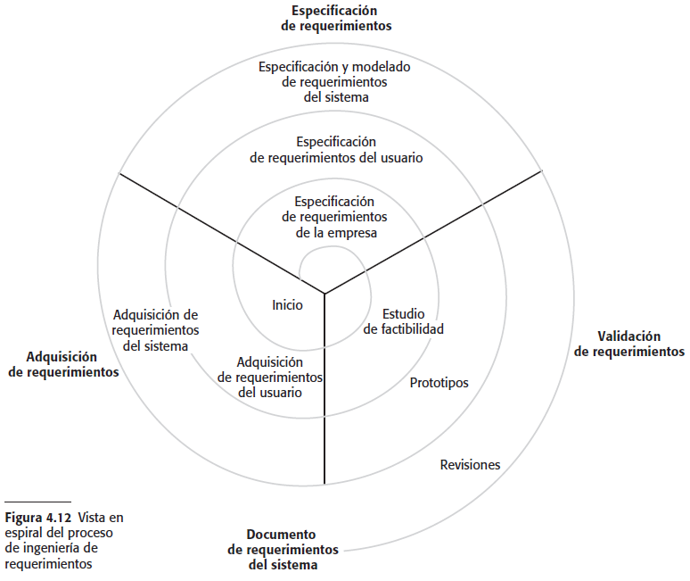
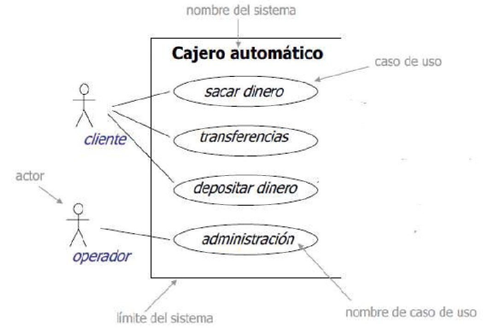
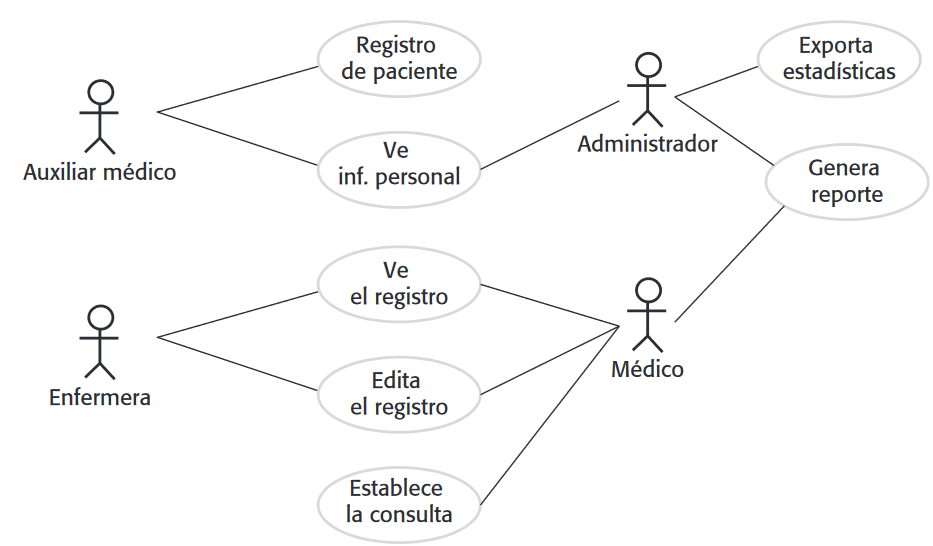
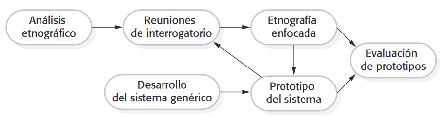
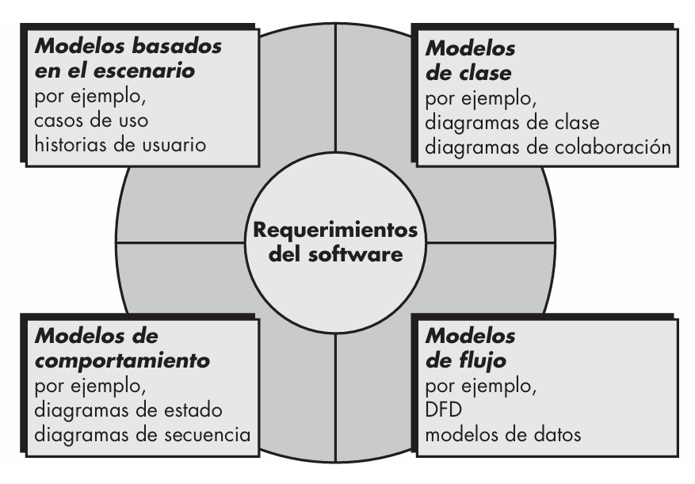
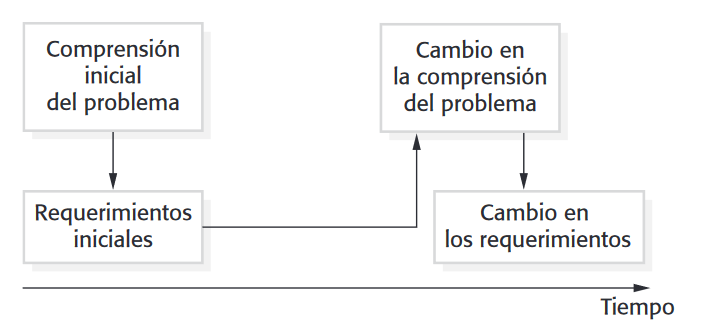
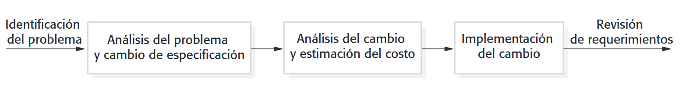

#### Ingeniería de Software

### Unidad VII

# Procesos Ingeniería de Requerimientos
Created by <i class="fab fa-telegram"></i>
[edme88]("https://t.me/edme88")

---
<!-- .slide: style="font-size: 0.60em" -->

## Temario

### Ingeniería de Requerimientos
* Estudio de viabilidad
* Procesos de ingeniería de requerimientos
* 1. Obtención de Requerimientos
* 2. Análisis de Requerimientos
* 3. Especificación de Requerimientos
* 4. Verificación de Requerimientos
* 5. Aceptación de Requerimientos

* Administración de requerimientos
* Problemas con el análisis de requerimientos
* Técnicas para elicitar
* Gestión de requerimientos
* Cambio en los requerimientos
* Evolución de los requerimientos
* Planificación de la gestión de requerimientos
* Gestión de cambio de los requerimientos

---

### Estudio de viabilidad

Un **estudio de viabilidad** analiza si un sistema propuesto puede desarrollarse y ponerse en funcionamiento de manera razonable, considerando aspectos técnicos, económicos, organizacionales y de calendario.

Su pregunta principal es: **¿Vale la pena y es posible desarrollar este sistema?**

----

### Estudio de viabilidad: Ejemplo
<!-- .slide: style="font-size: 0.90em" -->
Imaginemos que una universidad quiere desarrollar un sistema para gestionar exámenes.

Antes de comenzar a especificar en detalle cientos de requerimientos, podríamos preguntarnos:
- ¿Tenemos la tecnología necesaria?
- ¿La universidad dispone del presupuesto?
- ¿El sistema puede integrarse con los sistemas actuales?
- ¿Los usuarios están dispuestos a utilizarlo?
- ¿Podemos desarrollarlo en el tiempo disponible?
- ¿Los beneficios justifican los costos?

----

### Estudio de viabilidad

El estudio de viabilidad suele realizarse al comienzo del proceso, previo a la obtencion y análisis de requerimientos, porque permite decidir si el proyecto debería continuar.

---

### Estudio de viabilidad: ¿Qué analiza?

Normalmente se consideran varias dimensiones.

1. Viabilidad técnica
2. Viabilidad económica
3. Viabilidad organizacional
4. Viabilidad temporal
5. Viabilidad legal

----

### 1. Viabilidad técnica

¿Podemos construir el sistema con la tecnología y los recursos técnicos disponibles?

Se analiza, por ejemplo:
- Hardware disponible.
- Software y tecnologías necesarias.
- Infraestructura.
- Integración con sistemas existentes.
- Conocimientos técnicos del equipo.
- Complejidad tecnológica.
- Seguridad y rendimiento.

----

### 1. Viabilidad técnica: Ejemplo

Una empresa quiere desarrollar una aplicación que procese millones de transacciones por segundo.

Podríamos descubrir que:
> La tecnología disponible y la infraestructura actual no permiten alcanzar ese rendimiento.

El proyecto podría necesitar una arquitectura diferente o incluso no ser técnicamente viable.

----

### 2. Viabilidad económica

¿Los beneficios esperados justifican los costos del proyecto?

Se consideran:

**Costos**

- Desarrollo
- Hardware
- Licencias
- Infraestructura
- Capacitación
- Mantenimiento
- Personal

**Beneficios**

- Reducción de costos
- Automatización
- Mayor productividad
- Reducción de errores
- Nuevos servicios
- Mejora de la atención al usuario

----

### 2. Viabilidad económica: Ejemplo:

> Desarrollar el sistema cuesta $20 millones, 
> pero se estima que permitirá ahorrar $5 millones por año.

Entonces puede analizarse si la inversión resulta conveniente.

----

### 3. Viabilidad organizacional
<!-- .slide: style="font-size: 0.90em" -->
¿El sistema puede incorporarse realmente a la organización?

No alcanza con que técnicamente sea posible.

Hay que analizar cuestiones como:
- ¿Los usuarios aceptarán el sistema?
- ¿Cambiarán los procesos de trabajo?
- ¿La organización está preparada para ese cambio?
- ¿Existe personal capacitado?
- ¿El sistema es compatible con las políticas de la organización?
- ¿La dirección apoya el proyecto?

----

### 3. Viabilidad organizacional: Ejemplo

Podemos desarrollar un sistema técnicamente excelente, pero si los empleados se niegan a utilizarlo, el proyecto puede fracasar.

----

### 4. Viabilidad temporal

¿Podemos desarrollar el sistema dentro del tiempo disponible?

Se analiza:
- Tiempo estimado de desarrollo.
- Recursos disponibles.
- Cantidad de personas.
- Complejidad.
- Fechas límite.
- Dependencias con otros proyectos.

----

### 4. Viabilidad temporal: Ejemplo

> Una empresa necesita el sistema funcionando en tres meses, 
> pero las estimaciones indican que se necesitan nueve meses.

El proyecto podría no ser viable en esas condiciones.

----

### 5. Viabilidad legal

También puede analizarse si el sistema cumple con:
- Legislación vigente.
+ Protección de datos.
- Propiedad intelectual.
- Contratos.
- Normativas específicas del sector.

----

### 5. Viabilidad legal: Ejemplo

> Un sistema que maneja información personal debe considerar las
> obligaciones legales relacionadas con la protección de esos datos.

---

### Estudio de viabilidad: Resultado

El estudio de viabilidad normalmente termina con un informe de viabilidad.

No necesariamente contiene todos los requerimientos del sistema.

----

### Estudio de viabilidad: Resultado
Su objetivo es proporcionar información suficiente para tomar una decisión:
- **Continuar:** El proyecto es viable y se recomienda continuar con la Ingeniería de Requerimientos.
- **Modificar:** El proyecto puede ser viable, pero es necesario modificar el alcance, presupuesto, tecnología o calendario.
- **No continuar:** El proyecto no resulta viable bajo las condiciones actuales.

---

### Procesos de ingeniería de requerimientos
Los procesos utilizados para IR varían ampliamente
dependiendo del dominio de la aplicación, las personas
involucradas, la organización y el desarrollo de los requisitos.

Este proceso comprende 5 actividades:

---

### 1. Obtención de Requerimientos

Los analistas de requerimientos deberán trabajar junto al cliente
para descubrir el problema que el sistema debe resolver. 

Previo a esto se debe definir quienes serán los involucrados en la definición de los requerimientos y 
quien autorizará y revisará los documentos que se obtengan.

----

### 1. Obtención de Requerimientos
<!-- .slide: style="font-size: 0.90em" -->
En la **kick off** o reunión de arranque se debe especificar:
1. Objetivo del sistema, y fechas tentativas del inicio y fin del proyecto
2. Presentación del Equipo de Trabajo
3. Presentación o definición de stakeholders (involucrados en la definición de los requerimientos y líder funcional, que es quien hace
la autorización de los documentos en nombre de todo el equipo del cliente)
4. Fechas tentativas de reuniones con el cliente (esto se usa cuando
es una consultoría la que presta el servicio al cliente)

----

### 1. Obtención de Requerimientos
Posteriormente se preparan las entrevistas. Para las mismas se recomenda:
1. Obtener información sobre el dominio del problema y el sistema actual.
2. Preparar y realizar las sesiones de elicitación/negociación
3. Identificar/revisar los requisitos funcionales
4. Identificar/revisar los requisitos no funcionales
5. Clasificar requerimientos

----

### 1.1. Obtener información del dominio del problema y el sistema actual
<!-- .slide: style="font-size: 0.75em" -->
Se debe conocer el contexto organizacional y operacional, la situación actual. 

Si ya se conoce el dominio del problema este paso no es tan necesario.

Si NO se conoce el dominio de problema, puedes leer su página de internet, documentos internos, folletos, sistemas previos, etc. 
Enfrentarse a un desarrollo sin conocer las características principales ni el vocabulario propio del cliente suele provocar falta de
entendimiento de sus necesidades y que la confianza inicial se vea afectada.

El modelo de CMMI (Capability Maturity Model Integration) recomienda tener un repositorio de información donde se coloque toda la documentación
que se vaya obteniendo del proyecto y que se emplee una nomenclatura que te permita revisar las versiones de los documentos
a simple vista.

----

#### 1.2. Preparar y realizar las sesiones de elicitación/negociación

<!-- .slide: style="font-size: 0.75em" -->

- Confirmación de los usuarios participantes
- Definir fechas tentativas para las reuniones de definición de requerimientos. 
- Llevar los materiales necesarios: hojas para dibujar, marcadores, pizarra, presentaciones
con información útil, cuestionarios, etc.
- Preguntar al cliente si se puede grabar la sesión. 
- Definir el objetivo de la entrevista, que información deseas obtener, personas involucradas.
- Escuchar con atención al cliente sin interrumpir. 
- Parafrasear o utilizar metáforas.
- Tomar nota
- Tratar de dar sugerencias de valor a los requerimientos del cliente. 
- Trata de identificar los riesgos, puntos de negociación, posibles conflictos que vayan a derivar en ambigüedades en los
requerimientos y tomar nota de todos aquellos requisitos No funcionales que te defina el cliente con sus comentarios.

----

#### 1.2. Preparar y realizar las sesiones de elicitación/negociación
- Al final de la sesión realiza un resumen de los puntos vistos. 
- Transcribe cada requerimiento, acuerdo o pendiente en la minuta mencionada. Cada pendiente debe tener un
responsable y una fecha de entrega/solución.
- Envía la minuta al cliente
- Realiza seguimiento de los pendientes hasta que sean cerrados.

----

#### 1.3. Identificar/revisar los requisitos funcionales
Identificar los actores que interactuarán con el sistema, es decir, aquellas personas u otros sistemas que serán los
orígenes o destinos de la información que consumirá o producirá el sistema a desarrollar y que forman su entorno.

Identificar los casos de uso (requerimiento funcional) asociados a los actores para obtener un listado de requerimientos 
que se va a desarrollar.

Re-analizar los requerimientos ambiguos para hablarlos con el cliente y lleguar a una definición clara de los mismos.

----

#### 1.4. Identificar/revisar los requisitos no funcionales
Revisar lo que definimos como un requisito no funcional y la toma de nota de lo que
comentó el cliente referente a como quiere que funcione el sistema.

Que tipo de comunicación tiene, si quiere que el sistema se desarrolle en alguna plataforma especifica, alguna restricción de
sistema operativo, de ambiente, rapidez, seguridad, usabilidad, modificaciones sencillas, reutilización de código, etc.

----

#### 1.5. Clasificar requerimientos
Una vez que los requerimientos son consistentes, se da un orden de **prioridades**, para que las necesidades de alta
prioridad pueden ser encaradas primero, lo que permite definirlas y reexaminarlas para analizar posibles cambios de requerimientos.

Esto permite una disminución de los costos y ahorro de tiempo en procesamiento.

Las prioridades se basan en las necesidades del cliente, en el objetivo principal del sistema. Se debe tener en cuenta el costo y la
dependencia entre requerimientos.

---

### 2. Análisis de Requerimientos
Implica refinar, analizar, y examinar los requerimientos obtenidos para asegurar que todos los clientes involucrados entienden lo
que pidieron, y para encontrar errores, omisiones y otras deficiencias.

En esta etapa se leen los requerimientos, se conceptúan, se investigan, se intercambian ideas con el resto del equipo, se resaltan los problemas,
se buscan alternativas y soluciones, y luego se van fijando reuniones con el cliente para discutir los requerimientos.

----

### 2. Análisis de Requerimientos

---

### 3. Especificación de Requerimientos
<!-- .slide: style="font-size: 0.90em" -->
En esta fase se documentan los requerimientos acordados con el cliente, en un nivel apropiado de detalle. 

Se incluye: 
- Descripción completa de las necesidades y funcionalidades del sistema que será desarrollado
- El alcance del sistema y la forma como hará sus funciones
- Requerimientos funcionales y no funcionales.

Es un "pasar en limpio" el análisis realizado previamente aplicando técnicas y/o estándares de documentación.

----

### 3. Especificación de Requerimientos

---

### 4. Verificación de Requerimientos
La validación es la etapa final de la IR. Su objetivo es que los analistas
se aseguren que los requerimientos especificados son los que realmente quiere el cliente, que estén **completos** y sean **consistentes**.

Además de cumplir con todas las características que distinguen un buen requerimiento, la revisión ayuda a asegurarse que no se haya
omitido ningún requerimiento.

----

### 4. Verificación de Requerimientos
Se recomienda seleccionar varios revisores de diferentes disciplinas puede ser un analista, arquitecto, o
incluso un ingeniero de SW que tenga conocimiento de los estándares de documentación de la organización. 

Se puede preparar un checklist para la revisión de los requerimientos.

Lo que se debe hacer es realizar revisiones al documento, aplicarles pruebas de escritorio, etc. 

----

### 4. Verificación de Requerimientos
<!-- .slide: style="font-size: 0.70em" -->
Ejemplo de puntos a revisar en los documentos obtenidos:
- ¿Están incluidas todas las funcionalidades requeridas por el cliente? (completa).
- ¿Existen conflictos en los requerimientos? (consistencia)
- ¿Tiene alguno de los requerimientos más de una interpretación? (no ambigua)
- ¿Esta cada requerimiento claramente representado? (entendible)
- ¿Puede ser los requerimientos implementados con la tecnología y presupuesto disponible? (factible)
- ¿Está la especificación escrita en un lenguaje apropiado? (clara)
- ¿Existe facilidad para hacer cambios en los requerimientos? (modificable)
- ¿Está claramente definido el origen de cada requerimiento? (rastreable)
- ¿Pueden ser los Requerimientos ser sometidos a pruebas cuantitativas? (verificable) 

----

### 4.1. Técnicas de validación de requerimientos
* Criticas de requerimientos
  * Análisis manual sistemático de los requerimientos.
* Prototipado
  * Utilizando un modelo ejecutable del sistema para comprobar requerimientos.
* Generación de test
  * El desarrollo de las pruebas de requerimientos para comprobar la capacidad de prueba.

---

### 4.1.1 Criticas de los requerimientos
* Las revisiones periódicas deben ser sostenidas mientras
la definición de requerimientos se formula.
* Tanto el cliente como el personal del proyecto deben
participar en las revisiones.
* Las revisiones pueden ser formales (con documentos
completos) o informales. Buenas comunicaciones entre
los desarrolladores, clientes y usuarios pueden resolver
problemas en una etapa temprana.

---

### 5. Aceptación de Requerimientos
<!-- .slide: style="font-size: 0.85em" -->
Este es un proceso los analistas involucrados se reúnen con el cliente y comienzan a dar una revisión formal al documento. 
Comienzan a leer y explicar cada requerimiento, incluso se pueden
apoyar en prototipos en papel para que quede más claro el funcionamiento.

El objetivo es que todos estén en el mismo entendido de lo que se realizará para cada requerimiento. 
Si todos están de acuerdo se hace la aceptación/aprobación de la especificación de requerimientos, se realiza un compromiso formal de
que lo contenga la Especificación será lo que se construya y se pide al cliente una aprobación formal vía correo electrónico o una firma sobre el
documento físico.

---

### Administración de requerimientos 
Se realiza durante todo el proyecto. Esto implica llevar un buen control de los cambios, asegurarte de hacerle
ver al cliente el impacto en costo y/o el tiempo de entrega del proyecto, y gestionar como estos cambios afectan los entregables
desarrollados.

Es importante asegurarse que esto no genere retrasos en la entrega. Y llevar una clara versión en los documentos y en el código
 
---

### Problemas con el análisis de requerimientos
* Los interesados no saben lo que realmente quieren.
* Las partes interesadas expresan requisitos en sus propios términos.
* Las diferentes partes interesadas pueden tener requisitos contradictorios.
* Factores organizativos y políticos pueden influir en los requisitos del sistema.
* Los requisitos cambian durante el proceso de análisis.
* Nuevos actores pueden surgir y el entorno empresarial puede cambiar.

---

---
### Partes interesadas en el sistema para MHC-PMS
* Los pacientes cuya información se registra en el sistema.
* Los médicos que se encargan de evaluar y tratar a los pacientes.
* Las enfermeras que coordinan las consultas con los
médicos y administran algunos tratamientos.
* Recepcionistas médicos que administran las citas de los
pacientes.
* El personal de TI que son responsables de la instalación y mantenimiento del sistema.

----

### Partes interesadas en el sistema para MHC-PMS
* Un gerente de la ética médica que debe asegurar que el
sistema cumple con las normas éticas vigentes para la
atención al paciente.
* Los gerentes de salud que obtienen información de
gestión del sistema.
* Personal de registros médicos que son responsables de
asegurar que la información del sistema se pueden
mantener y preservados, y que los procedimientos de
mantenimiento de registros han sido ejecutadas
correctamente.

---

### Técnicas para elicitar
- Entrevistas
- Encuestas o Cuestionarios
- Mesas de Trabajo
- Escenarios
- Casos de Uso
- Estudios Etnográficos
- Observación
- Análisis de Documentación
- Prototipos
- Tormenta de Ideas

<!--https://repository.icesi.edu.co/server/api/core/bitstreams/5f9b8cec-d4e0-7785-e053-2cc003c84dc5/content-->
<!--https://repository.unad.edu.co/reproductor-ova/10596_35614/tcnicas_para_elicitar.html-->
<!--https://suriweb.com.ar/wp/wp-content/uploads/2019/03/Dise%C3%B1o-de-un-Documento-para-la-Elicitaci%C3%B3n-y-Especificaci%C3%B3n-de-Requerimientos.pdf-->

---

Algunas técnicas son más efectivas en algunas etapas de análisis de requerimientos que en otras:

<table>
  <thead>
    <tr>
      <th>Herramientas</th>
      <th>Extracción</th>
      <th>Análisis</th>
      <th>Especificación</th>
      <th>Validación</th>
    </tr>
  </thead>
  <tbody>
    <tr><td>Entrevistas y cuestionarios</td><td>X</td><td></td><td></td><td></td></tr>
    <tr><td>Sistemas Existentes</td><td>X</td><td>X</td><td></td><td></td></tr>
    <tr><td>Grabaciones de Video y Audio</td><td>X</td><td>X</td><td></td><td></td></tr>
    <tr><td>Lluvia de Ideas</td><td>X</td><td></td><td></td><td></td></tr>
    <tr><td>Arqueología de documentos</td><td>X</td><td></td><td></td><td></td></tr>
    <tr><td>Observación</td><td>X</td><td></td><td></td><td></td></tr>
    <tr><td>Prototipo no funcional</td><td></td><td></td><td>X</td><td></td></tr>
    <tr><td>Prototipo Funcional</td><td>X</td><td></td><td>X</td><td>X</td></tr>
    <tr><td>Análisis DOFA</td><td></td><td>X</td><td></td><td></td></tr>
    <tr><td>Cadena de Valor</td><td></td><td>X</td><td></td><td></td></tr>
    <tr><td>Modelo Conceptual</td><td></td><td>X</td><td></td><td></td></tr>
    <tr><td>Diagrama de Pescado</td><td></td><td>X</td><td></td><td></td></tr>
    <tr><td>Glosario</td><td>X</td><td></td><td>X</td><td>X</td></tr>
    <tr><td>Diagrama de actividad</td><td></td><td></td><td>X</td><td></td></tr>
    <tr><td>Casos de Uso</td><td>X</td><td></td><td>X</td><td></td></tr>
    <tr><td>Casa de Calidad o QFD</td><td></td><td></td><td></td><td>X</td></tr>
    <tr><td>Lista de Verificación</td><td></td><td></td><td></td><td>X</td></tr>
  </tbody>
</table>

---

### Entrevistas
* Las entrevistas formales o informales con las partes interesadas son
parte de la mayoría de los procesos de la IR.
* Tipos de entrevistas
  * Entrevistas cerradas a base de lista de preguntas predeterminada
  * Entrevistas abiertas donde varios temas se exploran con las  partes interesadas.

----

### Preguntas Abiertas
<!-- .slide: style="font-size: 0.85em" -->
Explorar en profundidad, obtener detalles, descubrir perspectivas no anticipadas y fomentar una descripción amplia del proceso o necesidad. 

- ¿Cómo describiría el flujo de trabajo actual para la gestión de pedidos?
- ¿Cuáles son los principales desafíos que enfrenta su equipo al procesar solicitudes?
- ¿Qué aspecto de la herramienta actual le genera más frustración o qué esperaría mejorar? 
- ¿Podría describir un escenario en el que el sistema actual no cumplió sus expectativas? 
- ¿Cómo se imagina el proceso ideal para gestionar este requerimiento?

----

### Preguntas Cerradas

Confirmar información, verificar detalles, obtener respuestas concisas y facilitar un análisis cuantitativo. 
<!-- .slide: style="font-size: 0.85em" -->
- ¿El proceso de pedidos implica la revisión manual de cada artículo? (Sí/No) 
- ¿La herramienta actual genera informes automáticos para los gastos? (Sí/No) 
- ¿Cuál es la principal categoría de error que detecta en el sistema actual? (Opción múltiple: Inexactitud de datos, Fallos de conexión, Otros) 
- Por favor, califique en una escala del 1 al 5, donde 1 es 'Muy insatisfecho' y 5 es 'Muy satisfecho', su experiencia con el informe de rendimiento actual.

----

### Entrevistas efectivas
* Tener la mente abierta, evitar las ideas preconcebidas
acerca de los requerimientos y estar dispuestos a
escuchar a las partes interesadas.
* Preguntar al entrevistado y obtener discusiones usando
una pregunta clave, una propuesta de requerimientos, o
si trabajan juntos en un sistema prototipo.

----

### Entrevistas en la práctica
<!-- .slide: style="font-size: 0.90em" -->
* Normalmente, una mezcla de la entrevista cerrada y abierta.
* Las entrevistas son buenas para conseguir una
comprensión global de lo que los actores hacen y cómo
podrían interactuar con el sistema.
* Las entrevistas no son buenas para la comprensión de los requerimientos de dominio
  * Los técnicos pueden no entender la terminología de dominio específico;
  * Algunos dominios del conocimiento pueden ser tan familiares
que la gente encuentra difícil dar detalles o piensan que no es
necesario hacerlo.

----

### Ejercicio: Entrevista
Piense al menos 3 preguntas cerradas y 3 preguntas abiertas sobre los requerimientos del sistema.

---

### Mesas de Trabajo (Workshops)

- Esta técnica es efectiva cuando se requiere obtener información rápidamente de varias personas al tiempo.
- Se deben realizar con una agenda previa, identificando los participantes.
- Se puede utilizar un material común sobre el cual enfocar la atención y conversar, por ejemplo una presentación con un desglose del proceso que se está estudiando o un flujograma.
- En las mesas de trabajó se podrá hacer uso de otras técnicas como por ejemplo las entrevistas y cuestionarios.

---
### Escenarios
Los escenarios son ejemplos reales de cómo se puede utilizar un sistema.
* Estos deberían incluir
  * Una descripción de la situación de partida;
  * Una descripción del flujo normal de los acontecimientos;
  * Una descripción de lo que puede salir mal;
  * Información sobre otras actividades concurrentes;
  * Una descripción de la situación cuando el escenario termina.

----

### Escenario para la recolección de información medica del sistema para MHC-PMS
<!-- .slide: style="font-size: 0.70em" -->
**SUPOSICIÓN INICIAL:** El paciente fue atendido por una recepcionista
médica que ha creado un registro en el sistema y se recoge información
personal del paciente (nombre, dirección, edad, etc.) Una enfermera ha
iniciado sesión en el sistema y está recopilando antecedentes clínicos.

**NORMAL:** La enfermera busca al paciente por su apellido Si hay más de un
paciente con el mismo apellido, el nombre y la fecha de nacimiento se
utilizaran para identificar al paciente.
La enfermera ingresa en la opción de menú para añadir antecedentes
clínicos.

La enfermera sigue una serie de indicaciones del sistema para introducir
información sobre las consultas en otros centros de salud mental (entrada
de texto libre), condiciones médicas existentes (enfermera selecciona
condiciones en el menú), medicamentos que se toman actualmente
(seleccionado en el menú), alergias (libre texto), y la vida familiar
(formulario).

----

### Escenario para la recolección de información medica del sistema para MHC-PMS
<!-- .slide: style="font-size: 0.60em" -->

**QUÉ PUEDE SALIR MAL:**
* El historial del paciente no existe o no se puede encontrar: La
enfermera debe crear un nuevo registro con la información personal.
* Las Condiciones del paciente o la medicación no existen entre las
opciones predefinidas: La enfermera debe elegir la opción de "otro" y
escriba el texto libre que describe la condición / medicación.
Paciente no puede / no quiere proporcionar información sobre su
historial médico: La enfermera debe introducir texto libre indicando la
incapacidad / falta de voluntad del paciente para proporcionar
información. El sistema debe imprimir un formulario indicando que la
falta de información puede significar que el tratamiento no sea efectivo.
Esto debe ser firmado y entregado al paciente.

**OTRAS ACTIVIDADES:**
* Registro podrá ser consultado , pero no editado por
el resto del personal mientras se introduce información.

**ESTADO DEL SISTEMA A COMPLETAR:**
* El registro del paciente se agrega
en la base de datos de historia clínica. Se agrega un registro en el
registro del sistema que muestra el inicio y fin de la sesión y la
enfermera involucrada.

----

### Ejercicio: Escenario
Piensa en 3 escenarios de uso, cada uno desde el punto de vista de un usuario/rol diferente para el sistema.

---
### Casos de uso
* Casos de uso son una técnica basado de escenario en UML que
permiten identificar a los actores en una interacción y que describen
la interacción misma.
* Un conjunto de casos de uso debe describir todas las posibles
interacciones con el sistema.
* Modelo gráfico de alto nivel complementado con una descripción
más detallada de cuadro.
* Los diagramas de secuencia se pueden utilizar para agregar el
detalle a los casos de uso, mostrando la secuencia de procesamiento
de eventos en el sistema.

----

### Elementos de un diagrama de casos de uso

----

### Casos de uso para MHC-PMS

----

### Ejercicio: Casos de uso

Elabore el diagrama de casos de uso del sistema.

---
### Etnografía
* La etnografía es una técnica de observación que se usa para
entender los procesos operacionales y ayudar a derivar
requerimientos de apoyo para dichos procesos.
* Es necesario observar y analizar cómo las personas trabajan
realmente.
* Pueden ser observados los factores sociales y organizacionales de importancia.
* Los estudios etnográficos han demostrado que el trabajo suele
ser más rico y complejo de lo que sugieren los modelos de
sistemas simples.

----

### Ámbito de aplicación de la etnografía
* Los requerimientos que se derivan de la forma en que las
personas trabajan realmente en vez de la forma en la cual las
definiciones del proceso indican que debería trabajar.
* Los requerimientos que se derivan de la cooperación y el
conocimiento de las actividades de otras personas.
* Los estudios etnográficos pueden revelar detalles críticos de
procesos, que con frecuencia se pierden con otras técnicas de
adquisición de requerimientos.

----

### Etnografía y prototipos para el análisis de los requerimientos

----

### Ejercicio: Etnografía

- ¿Cómo aplicaría la etnografía en el proyecto?
- ¿Qué personas observaría?
- ¿En qué procesos se enfocaría?

---

### Análisis de documentación

- Consiste en obtener la información sobre los requerimientos a partir de documentos que ya están elaborados.
- Es útil cuando los expertos no están disponibles para ser entrevistados o ya no forman parte de la empresa.
- Ejemplos de documentación: Planes de negocio, actas de constitución de proyecto, reglas de negocio, contratos, definiciones de alcance, correos electrónicos, documentos de entrenamiento, entre otros.

---

### Tormenta de ideas

- Es una sesión de trabajo estructurada orientada para obtener la mayor cantidad de ideas posibles.
- Se recomienda limitar el tiempo, utilizar ayudas visuales y designar un facilitador.
- Se deben tener reglas, por ejemplo los criterios para evaluar ideas y asignarles un puntaje, no permitir las críticas a las ideas y limitar el tiempo de discusión.
- En una primera fase, se deben identificar la mayor cantidad de ideas, para luego evaluarlas. - Todas las ideas deben ser consideradas y deben limitarse que una idea se le ahogue o critique antes de tener tiempo de desarrollarla.

---

#### Puntos de vista para describir el modelo de requerimientos

---
### Gestión de requerimientos
La gestión de requerimientos es el proceso que permite
realizar el seguimiento de los cambios en los
requerimientos durante el proceso de ingeniería de
requerimientos y de desarrollo del sistema.
* Es necesario hacer un seguimiento de los
requerimientos individuales y sus vínculos con
requerimientos dependientes para evaluar el impacto de
los cambios.
* Es necesario establecer un proceso formal para las
propuestas de cambio y su vinculacion con los
requisitos del sistema.

---
### Cambio en los requerimientos
<!-- .slide: style="font-size: 0.80em" -->
* El entorno empresarial del sistema siempre cambia
después de la instalación:

Nuevo hardware, interconeccion con otros sistemas, las prioridades de
negocio pueden cambiar (con los consiguientes cambios en el apoyo al
sistema es necesario), nueva legislación y los reglamentos etc.

* Las personas que pagan por un sistema y los
usuarios de dicho sistema rara vez son las mismas
personas.

Los clientes del sistema imponen requerimientos debido a las
limitaciones organizativas y presupuestarias. Estos pueden estar en
conflicto con los requisitos de los usuarios finales y, después de la
entrega, las nuevas características pueden tener que ser añadidas
para el soporte al usuario si el sistema quiere cumplir sus objetivos.

----

### Cambio en los requerimientos
* Los grandes sistemas suelen tener una diversa
comunidad de usuario, con muchos usuarios que tienen
diferentes necesidades y prioridades que pueden ser
conflictivas o contradictorias.
  * Los requerimientos finales del sistema son inevitablemente un
compromiso entre ellos y, con la experiencia, a menudo se
descubre que el saldo de la ayuda dada a los diferentes usuarios
tiene que ser cambiado.

---
### Evolución de los requerimientos

---
### Planificación de la gestión de requerimientos
<!-- .slide: style="font-size: 0.75em" -->
* Establece el nivel de detalle de la gestión de requerimientos que se requiere.
* Decisiones de gestión requerimientos:
  * **La identificación de requerimientos:** Cada requerimiento debe ser
identificada de modo que pueda ser una referencia cruzada con otros requerimientos.
  * **Proceso de gestión de cambios:** Este es el conjunto de actividades
que evalúan el impacto y el costo de los cambios.
  * **Políticas de trazabilidad:** Estas políticas definen las relaciones entre
cada requisito y entre los requerimientos y el diseño del sistema que se
debe registrar.
  * **Herramientas de apoyo:** herramientas que se pueden utilizar que van
desde sistemas de gestión de requerimientos especializados para
hojas de cálculo y hasta sistemas de bases de datos simples

---
### Gestión de cambio de los requerimientos
<!-- .slide: style="font-size: 0.70em" -->
* Decidir si un cambio de requerimientos debe ser aceptado
  * **Análisis del problema y especificación del cambio**
    * Durante esta etapa, el problema o la propuesta de cambio se analiza para comprobar que sea válida. Este análisis 
se realimenta al solicitante al que pidió el cambio quién puede responder con requerimientos más específicos cambiar la
propuesta, o si decide retirar la solicitud.
  * **Análisis del cambio y cálculo de costos**
    * El efecto del cambio propuesto se evaluó a través de la información de trazabilidad y el conocimiento general de 
los requerimientos del sistema. Una vez completado este de análisis, se toma la decisión de si se debe o no proceder con 
el cambio de requerimientos.
  * **Implementación del cambio**
    * El documento de requerimientos y, en su caso, el diseño e implementación del sistema, se modifican. Lo ideal sería 
que el documento debe ser organizado de tal manera que los cambios se pueden implementar fácilmente.

----

### Gestión de cambio de los requerimientos

---
## ¿Dudas, Preguntas, Comentarios?

