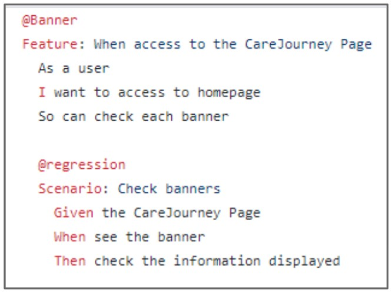
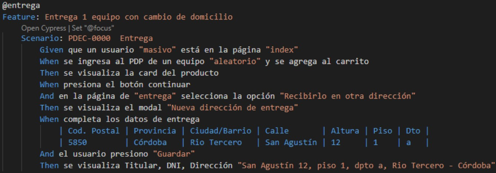
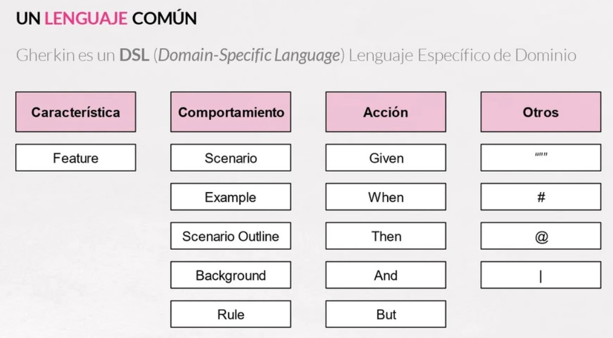

#### Ingeniería de Software
# Automatización de Casos de Pruebas 2
Created by <i class="fab fa-telegram"></i>
[edme88]("https://t.me/edme88")

---
<!-- .slide: style="font-size: 0.60em" -->

## Temario

### Automatización de Casos de Pruebas
* BDD
* Gherkin

*

---

### BDD
Significa **Desarrollo Dirigido por Comportamiento**, y es una evolución del TDD (Desarrollo Dirigido por Pruebas).

Consiste en describir el comportamiento antes de escribir el código fuente.

Las pruebas verifican que el comportamiento del código es correcto desde el punto de vista del negocio.

----

----

----

### BDD: Ventajas
Emplea lenguaje ubicuo, **Gherkin**, lenguaje semiformal entendido por desarrolladores y personal NO técnico.

Combina aspectos técnicos y de negocio: los requisitos de negocio forman parte del proceso de desarrollo.

---
### Gherkin
Es un lenguaje fácil de leer, entender y escribir; con él vamos a describir las funcionalidades definiendo el 
comportamiento del software, sin entrar en su implementación.

La **documentación** forma parte de los tests.

----

### Gherkin
<!-- .slide: style="font-size: 0.80em" -->
Necesitamos conocer **5** palabras:
* **Feature** Indica el nombre de la funcionalidad que vamos a probar. Debe ser un título claro y explícito.
* **Scenario** Describe cada escenario que vamos a probar.
* **Given** Provee contecto para el escenario en que se va a ejecutar el test, prerequisitos. Incluye los pasos necesarios
para poner al sistema en el estado que se desea probar.
* **When** La interacción del usuario que acciona la funcionalidad que deseamos testear.
* **Then** Especifica el resultado esperado en el test. Observamos los cambios en el sistema y vemos si son los deseados.

----

### Gherkin

---
### Cucumber
Es una herramienta para implementar metodologías como el Behaviour Driven Development BDD, que permite ejecutar 
descripciones funcionales en texto plano.

Las descipciones funcionales se escriben en Gherkin.

----

### Cucumber
Es una gran herramienta para mantener en un solo lugar:
* **Living Documentation:** Es una forma de definir las características de forma tal que puedan ser entendidas por los 
equipos comerciales y técnicos.
* Los **tests automatizados**
* **Especificaciones Ejecutables:** Porque cada paso en el escenario está vinculado a un fragmento de código que realiza
esa acción.

----

### Cucumber
Los **objetivos** principales que se deben seguir:
* Los escenarios deben ser pensados como documentación.
* Los escenarios deben permitir la colaboración con gente de negocio (PO, BA)
* Los escenarios deben permitir la evolución del producto.

---

### Ejercicio: Cypress+Cucumber
1. Ingresa a git https://github.com/edme88/cypressCucumberPIL/tree/main
2. Clona el repositorio
3. Ejecutar el comando **npx cypress open**
4. Ejecuta algún test

----

### Cucumber
Los proyectos con cucumber tienen principalmente 3 archivos:
* **nombreTests.feature**: Describen en Gherkin el comportamiento, empleando las palabras Givem, When, Then, etc.
* **nombreStep.js** Emplando Js se programa que acciones de código se deben realizar en cada paso.
* **nombrePage.js** Se colocan los locadores dentro de métodos que permitan obtenerlos y manipularlos con mayor facilidad.

---

### Gherkin - BRIEF
Los siguientes principios permiten alcanzar estas metas:
* Lenguaje Comercial (Business language)
* Datos reales (Real data)
* Revelación de intención (Intention revealing)
* Esencial
* Enfocado (Focused)
* Breve (brief)

----

#### BRIEF: Lenguaje Comercial
* Las palabras usadas deben venir del dominio comercial. No debe haber ambiguedades.
* Un error común es emplear palabras que tienen diferente significado en diferentes contextos.

----

#### BRIEF: Datos Reales
* Los ejemplos deben usar datos reales y contretos, para ayudar a entender el contexto.

----

#### BRIEF: Revelación de intención
* En el escenario debe quedar claro cuál es la intención, que se está tratando de lograr.

----

#### BRIEF: Esencial
* Cualquier paso que no contribuya a alcanzar el propósito principal debe elimianrse. Si son importantes, deben cubrirse 
por otros esenarios que ilustren otras reglas.
* Un error común es incluir demasiados detalles.

----

#### BRIEF: Enfocado
* Un escenario debería centrarse en una sola regla.

----

#### BRIEF: Breve
* Los escenarios no deberían tener más de 5 líneas, haciendo que sen fáciles de leer y entender.

---
## ¿Dudas, Preguntas, Comentarios?

