##### Ingeniería de Software
# UML: Casos de Uso
Created by <i class="fab fa-telegram"></i>
[edme88]("https://t.me/edme88")

---
### Diagrama de Casos de Uso y requisitos funcionales

Los **casos de uso** están estrechamente relacionados con los **requisitos funcionales** porque permiten representar las funcionalidades del sistema desde la perspectiva de quienes interactúan con él.

Un requisito funcional describe algo que el sistema debe hacer.

Un caso de uso describe cómo el sistema proporciona una funcionalidad que resulta valiosa para un actor externo.

----

### Diagrama de Casos de Uso y requisitos funcionales
- El requisito funcional expresa qué debe hacer el sistema.
- El caso de uso permite modelar esa funcionalidad desde la perspectiva de un actor.
- El diagrama de casos de uso proporciona una visión general y gráfica de esas funcionalidades.
- La descripción textual permite especificar con mayor detalle cómo se desarrolla la interacción.

---

### Caso de uso
<!-- .slide: style="font-size: 0.85em" -->
Un **caso de uso** especifica un conjunto de secuencias de acciones, incluyendo sus posibles variantes, que el sistema puede ejecutar y que producen un resultado observable de valor para un actor particular.

Un caso de uso:
- especifica un comportamiento deseado del sistema
- representa una funcionalidad que el sistema debe proporcionar
- describe qué hace el sistema, no cómo está implementado
- representa una interacción entre el sistema y uno o más actores
- puede incluir diferentes caminos o variantes
- puede contemplar situaciones excepcionales

----

### Caso de uso
Cada caso de uso representa una tarea o meta concreta que implica interacción con el sistema.

Los casos de uso pueden representarse de dos maneras complementarias:
- **Representación gráfica:** mediante un diagrama de casos de uso.
- **Representación textual:** mediante una descripción detallada del caso de uso.

---

### Diagrama de casos de uso
El diagrama de casos de uso es un diagrama de comportamiento de UML.

Permite representar visualmente:
- los actores externos que interactúan con el sistema
- las funcionalidades que ofrece el sistema
- las relaciones entre actores y casos de uso
- determinadas relaciones entre casos de uso

Su objetivo principal es proporcionar una visión general de las funcionalidades del sistema desde el punto de vista externo.

----

### Diagrama de casos de uso
<!--https://diagramasuml.com/casos-de-uso/-->
Los diagramas de casos de uso permiten:
- representar los requisitos funcionales
- identificar los actores que interactúan con el sistema
- relacionar actores y funcionalidades
- delimitar qué pertenece al sistema y qué queda fuera de él
- facilitar la comunicación entre usuarios, clientes, analistas y desarrolladores
- servir como punto de partida para el desarrollo y para otros modelos del sistema

----

### Uso de datos de transferencia de caso
Un caso de uso en el MHC-PMS:
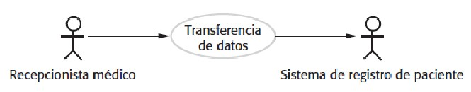

----

### Los casos de uso en el MHC-PMS que implica el papel 'Médico Recepcionista'
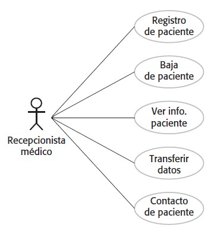

---
### Elementos de un diagrama de casos de uso

Un diagrama de casos de uso está compuesto principalmente por:
1. Actores
2. Casos de uso
3. Límite del sistema
4. Relaciones

----

### Elementos de un diagrama de casos de uso
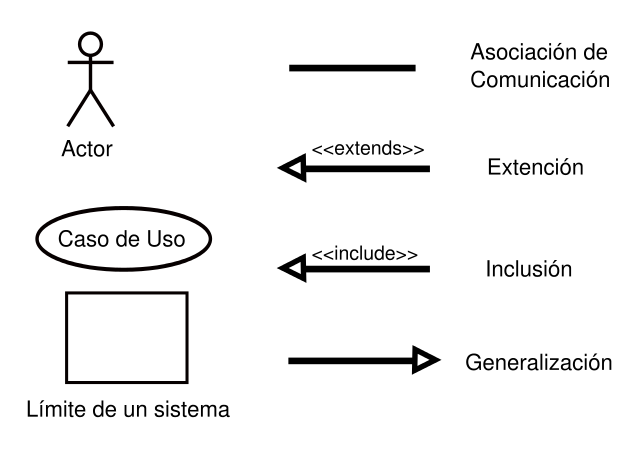

---

### 1. Actores

Un actor es un rol que adopta una entidad externa al sistema para interactuar con él.

Un actor puede ser:
- una persona o tipo de usuario
- otro sistema
- un dispositivo o componente externo
- otro elemento que interactúe con el sistema

Lo importante es que el actor es **externo** al sistema que estamos modelando.

----

### 1. Actores
Un actor representa un **rol**, no necesariamente una persona concreta.

Por ejemplo, una misma persona podría desempeñar diferentes roles y, por lo tanto, participar como diferentes actores en determinados contextos.

----

### 1. Actores: Ejemplo
Un sistema para una clínica veterinaria podría tener como actores:
- Cliente
- Auxiliar
- Veterinario
- Sistema externo de identificación de animales

---

### 2. Casos de uso

Un **caso de uso** representa una funcionalidad del sistema que proporciona un resultado observable para un actor.

En un diagrama UML se representa habitualmente mediante un óvalo.

----

### 2. Casos de uso: Ejemplos
Algunos ejemplos podrían ser:
- Crear cuenta
- Registrar mascota
- Registrar consulta
- Consultar historial
- Realizar pago
- Consultar estado de internación

----

### 2. Casos de uso
Un caso de uso no debería describir detalles internos de implementación.

Por ejemplo:
- **Correcto:** Registrar una observación de fauna

- **Incorrecto:** Insertar registro en la tabla Observaciones

El primero expresa una funcionalidad desde la perspectiva del usuario. El segundo describe una decisión de implementación.

---

### 3. Límite del sistema

El **límite del sistema** permite diferenciar qué elementos forman parte del sistema que estamos modelando y cuáles son externos.

Se representa mediante un rectángulo que engloba los casos de uso.

----

### 3. Límite del sistema
Al definir el límite resulta necesario preguntarse:
- ¿Qué sistema estamos construyendo?
- ¿Qué funcionalidades debe proporcionar?
- ¿Quién o qué utilizará el sistema?
- ¿Qué elementos son externos al sistema?

El límite no representa necesariamente una frontera física. Representa el alcance del sistema que se está modelando.

---
### 4.Relaciones

Las relaciones permiten conectar:
- actores con casos de uso
- casos de uso con otros casos de uso
- actores con otros actores, en determinados casos mediante generalización

La relación más básica es la interacción entre un actor y un caso de uso.

Cuando un actor se encuentra conectado a un caso de uso, significa que ese actor participa en dicha funcionalidad.

---

### Relaciones entre casos de uso
<!-- .slide: style="font-size: 0.90em" -->
Además de las **asociaciones** entre actores y casos de uso, UML permite establecer relaciones entre casos de uso.

Las principales relaciones que estudiaremos son:

* `<<include>>:` Indica que un caso de uso incorpora obligatoriamente el comportamiento de otro caso de uso.
* `<<extend>>:` Permite incorporar un comportamiento adicional a un caso de uso existente bajo determinadas condiciones.

También puede utilizarse la generalización, tanto entre actores como entre casos de uso.

----

### Relaciones: Include
* Evita repetir especificaciones innecesariamente
* Incluye el comportamiento de un caso de uso en el flujo de otro caso de uso.

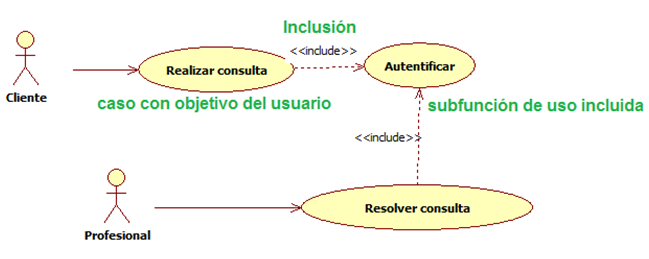

----

### Relaciones: Extend
* Inserta un nuevo comportamiento en un caso de uso existente
* El punto de extensión no forma parte del flujo principal

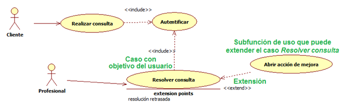

---

### Modelado avanzado de casos de uso
<!-- .slide: style="font-size: 0.90em" -->
Además de las relaciones básicas, UML permite utilizar mecanismos de generalización.

En el modelado avanzado podemos encontrar:
- generalización de actores
- generalización de casos de uso
- `<<include>>`
- `<<extend>>`

Estas herramientas permiten expresar situaciones más complejas, pero deben utilizarse cuando realmente aportan claridad al modelo.

---

### Generalización de actores

La **generalización de actores** permite representar relaciones entre roles cuando existen características comunes.

Un actor **especializado** puede **heredar** las interacciones definidas para un actor más general.

----

### Generalización de casos de uso
<!-- .slide: style="font-size: 0.90em" -->
La **generalización de casos** de uso permite representar una relación entre un caso de uso general y otros casos de uso más específicos.

Los casos especializados pueden:
- heredar características
- agregar características
- redefinir determinadas características

La generalización debe utilizarse cuando existe realmente una relación de especialización. No es simplemente una forma alternativa de descomponer un caso de uso.

----

### CU Avanzado: Generalización del actor
Se emplea cuando existen muchas similitudes entre actores.

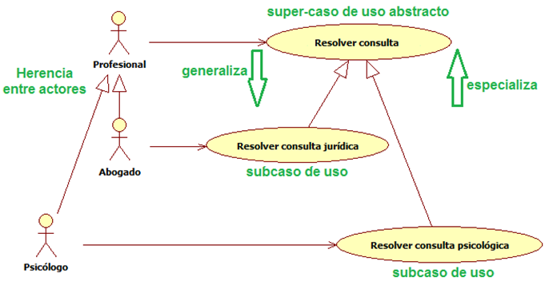

---

### El diagrama no cuenta toda la historia
<!-- .slide: style="font-size: 0.90em" -->
Un diagrama de casos de uso proporciona una visión general, pero no necesariamente contiene todos los detalles necesarios para especificar una funcionalidad.

Por eso, cada caso de uso importante puede complementarse con una descripción textual.

El diagrama responde principalmente: **¿Qué funcionalidades ofrece el sistema y quién participa en ellas?**

La descripción textual permite profundizar: **¿Cómo se desarrolla la interacción entre el actor y el sistema?**

Esto permite pasar de una representación gráfica de alto nivel a una especificación más detallada.

---

### Descripción textual de un caso de uso

La descripción de un caso de uso especifica las acciones necesarias para alcanzar el objetivo y contempla sus posibles variantes y excepciones.

Puede utilizarse como guía para
- analizar los requisitos
- validar el comportamiento esperado
- comunicarse con los usuarios
- orientar el desarrollo
- derivar otros modelos del sistema

----

### Descripción de requisitos
<!-- .slide: style="font-size: 0.65em" -->
Una plantilla puede incluir:
- **Identificador:**	Código único del caso de uso
- **Nombre:**	Nombre descriptivo
- **Versión:**	Versión de la especificación
- **Autor:**	Responsable de la especificación
- **Objetivos:** asociados	Objetivos que satisface
- **Requisitos:** asociados	Requisitos relacionados
- **Descripción:**	Resumen de la funcionalidad
- **Actores:**	Actores participantes
- **Precondiciones:**	Condiciones que deben cumplirse antes
- **Secuencia normal:**	Flujo principal de interacción
- **Alternativas:**	Variantes del flujo principal
- **Excepciones:**	Situaciones excepcionales o de error
- **Postcondiciones:**	Estado esperado al finalizar
- **Importancia:**	Relevancia para el sistema
- **Urgencia:**	Prioridad temporal
- **Comentarios:**	Información adicional

----

<!-- .slide: style="font-size: 0.40em" -->

<table>
<thead>
<tr>
<th style="text-align:left">RF-01</th>
<th style="text-align:left">Acceso Aplicación</th>
</tr>
</thead>
<tbody>
<tr>
<td style="text-align:left">Versión</td>
<td style="text-align:left">Versión 1.0</td>
</tr>
<tr>
<td style="text-align:left">Autores</td>
<td style="text-align:left">Agustina Aliciardi</td>
</tr>
<tr>
<td style="text-align:left">Objetivos Asociados</td>
<td style="text-align:left">OBJ-01: Acceso Controlado a la Aplicación Software</td>
</tr>
<tr>
<td style="text-align:left">Requisitos asociados</td>
<td style="text-align:left">RI-01: Información de los Usuarios.</td>
</tr>
<tr>
<td style="text-align:left">Descripción</td>
<td style="text-align:left">El sistema deberá comportarse como se describe en el siguiente caso de uso cuando un usuario decida acceder a la aplicación.</td>
</tr>
<tr>
<td style="text-align:left">Precondición</td>
<td style="text-align:left">El usuario tiene que disponer de un nombre de usuario y una contraseña para poder acceder y deberá tener el acceso habilitado.</td>
</tr>
<tr>
<td style="text-align:left">Secuencia normal</td>
<td style="text-align:left">1. El usuario solicita al sistema entrar en la aplicación.</td>
</tr>
<tr>
<td style="text-align:left"></td>
<td style="text-align:left">2. El sistema solicita al usuario que introduzca el nombre de usuario y su contraseña.</td>
</tr>
<tr>
<td style="text-align:left"></td>
<td style="text-align:left">3. El usuario introduce su nombre y su contraseña.</td>
</tr>
<tr>
<td style="text-align:left"></td>
<td style="text-align:left">4. El sistema comprueba los datos introducidos.</td>
</tr>
<tr>
<td style="text-align:left"></td>
<td style="text-align:left">5. Si los datos son correctos el sistema muestra la página de inicio de la aplicación.</td>
</tr>
<tr>
<td style="text-align:left">Excepciones</td>
<td style="text-align:left">5. Si el nombre de usuario no es correcto, el sistema muestra un mensaje. Ir al paso 2.</td>
</tr>
<tr>
<td style="text-align:left"></td>
<td style="text-align:left">5. Si la contraseña no es correcta, el sistema muestra un mensaje. Ir al paso 2.</td>
</tr>
<tr>
<td style="text-align:left"></td>
<td style="text-align:left">5. Si el sistema no tiene el acceso habilitado a la aplicación, se muestra un mensaje. Ir al paso 2.</td>
</tr>
<tr>
<td style="text-align:left">Postcondición</td>
<td style="text-align:left">Si el nombre de usuario y la contraseña son correctos accede a la pantalla de inicio de la aplicación</td>
</tr>
<tr>
<td style="text-align:left">Importancia</td>
<td style="text-align:left">Vital</td>
</tr>
<tr>
<td style="text-align:left">Urgencia</td>
<td style="text-align:left">Inmediatamente</td>
</tr>
<tr>
<td style="text-align:left">Comentarios</td>
<td style="text-align:left">Ninguno</td>
</tr>
</tbody>
</table>

---

### Especificación de requisitos

No todos los requisitos tienen por qué representarse mediante casos de uso.

Por ejemplo, un requisito no funcional puede describir características del entorno de ejecución.

----

<table border="1" cellpadding="6" cellspacing="0">
  <caption>RNF-01 – Entorno de Explotación</caption>
  <tbody>
    <tr>
      <th scope="row">Versión</th>
      <td>Versión 1.0</td>
    </tr>
    <tr>
      <th scope="row">Autores</th>
      <td>Juan Perez</td>
    </tr>
    <tr>
      <th scope="row">Objetivos asociados</th>
      <td>OBJ-05: Funcionamiento óptimo por usuario estándar</td>
    </tr>
    <tr>
      <th scope="row">Requisitos asociados</th>
      <td></td>
    </tr>
    <tr>
      <th scope="row">Descripción</th>
      <td>El sistema deberá funcionar sin ningún tipo de limitación en equipos con: Pention IV a 2,4 GHz, con 1GB de RAm y al menos 6 GB de disco duro.</td>
    </tr>
    <tr>
      <th scope="row">Importancia</th>
      <td>Vital</td>
    </tr>
    <tr>
      <th scope="row">Urgencia</th>
      <td>Inmediata</td>
    </tr>
    <tr>
      <th scope="row">Estabilidad</th>
      <td>Alta</td>
    </tr>
    <tr>
      <th scope="row">Comentario</th>
      <td>Ninguno</td>
    </tr>
  </tbody>
</table>

---

### Ejemplo: clínica veterinaria
<!-- .slide: style="font-size: 0.55em" -->
El sistema debe permitir gestionar la información relacionada con clientes, mascotas, consultas, internaciones y pagos.

Se identifican, entre otros, los siguientes requisitos:

- Almacenar los datos de contacto de los clientes.
- Almacenar la información de las mascotas.
- Un cliente puede tener más de una mascota.
- Una mascota pertenece a un único cliente.
- Es posible cambiar el propietario de una mascota.
- Los auxiliares gestionan los datos de clientes y mascotas.
- Al registrar un nuevo animal, el sistema debe consultar el registro externo correspondiente cuando sea obligatorio identificarlo.
- Registrar información de las consultas: tiempo, profesional, animal, importe, resolución y recetas.
- Permitir que el cliente consulte el estado de una mascota internada.
- Permitir al cliente realizar pagos mediante la aplicación.
- Aplicar un recargo cuando el pago se realiza después del plazo establecido.
- Permitir consultar el histórico de consultas de las mascotas.

Algunos elementos externos, como el gestor de contenidos o la gestión física de determinadas cámaras, pueden quedar fuera del sistema que estamos modelando.

----

### Diagrama de casos de uso del actor Auxiliar
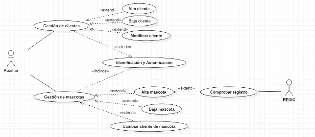

----

### Diagrama de casos de uso del actor Cliente
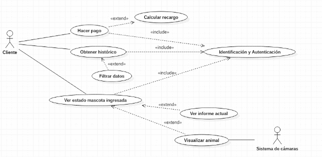

----

### Diagrama de casos de uso del actor Veterinario
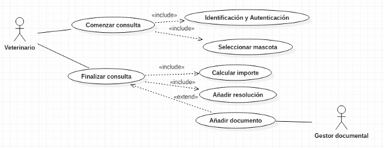

---

### De los requisitos al diagrama de casos de uso
<!-- .slide: style="font-size: 0.80em" -->
El modelado puede plantearse como un proceso:
1. Identificar los actores: ¿Quién o qué interactúa con el sistema?
2. Identificar las metas o funcionalidades: ¿Qué necesita lograr cada actor mediante el sistema?
3. Identificar los casos de uso: Cada funcionalidad relevante se expresa como un caso de uso.
4. Establecer las relaciones: 
 - qué actores participan en cada caso de uso
 - si existen relaciones `<<include>>`
 - si existen relaciones `<<extend>>`
 - si existen generalizaciones
5. Detallar los casos de uso

Finalmente, los casos de uso que requieran mayor precisión se especifican mediante una descripción textual.

---

### Buenas prácticas
<!-- .slide: style="font-size: 0.90em" -->
Al elaborar diagramas de casos de uso conviene:
- centrarse en el qué y no en el cómo
- utilizar nombres claros y orientados a objetivos
- mantener los casos de uso suficientemente simples
- evitar convertir cada paso interno del sistema en un caso de uso
- evitar una descomposición excesivamente funcional
- utilizar las relaciones avanzadas solamente cuando aporten claridad
- recordar que el diagrama es una visión general y puede necesitar especificaciones textuales complementarias

----

### Advertencia
<!-- .slide: style="font-size: 0.90em" -->
Un caso de uso no debería convertirse en una descripción de la implementación.

Por ejemplo, no sería conveniente crear casos de uso como:
- Validar campo de texto
- Ejecutar consulta SQL
- Crear objeto Usuario
- Insertar registro en la base de datos

si esas acciones son simplemente detalles internos necesarios para realizar una funcionalidad de mayor nivel.

---
### Detalle de CU
<!-- .slide: style="font-size: 0.60em" -->

Generalmente el diagrama de casos de uso por si solo no es suficiente, y es necesario detallar cada **caso de uso** con
una planilla como la siguiente:
<!--
| **Proyecto:** Nombre del Proyecto                      | **Versión:** 0.1             |
|:-------------------------------------------------------|:-----------------------------|
| **Caso de Uso:** Nombre del caso de uso                | **Fecha de Versión:** fecha  |
| **Estado:** en elaboración/en revisión/listo/deprecado |                              |
-->
<table>
<thead>
<tr>
<th style="text-align:left"><strong>Proyecto:</strong> Nombre del Proyecto</th>
<th style="text-align:left"><strong>Versión:</strong> 0.1</th>
</tr>
</thead>
<tbody>
<tr>
<td style="text-align:left"><strong>Caso de Uso:</strong> Nombre del caso de uso</td>
<td style="text-align:left"><strong>Fecha de Versión:</strong> fecha</td>
</tr>
<tr>
<td style="text-align:left"><strong>Estado:</strong> en elaboración/en revisión/listo/deprecado</td>
<td style="text-align:left"></td>
</tr>
</tbody>
</table>

<!--
| N° | Campo                           | Descripción del Campo                                   |
|:---|:--------------------------------|:--------------------------------------------------------|
| 1  | Nombre del Caso de Uso          |                                                         |
| 2  | Actor                           |                                                         |
| 3  | Breve Descripción               |                                                         |
| 4  | Precondiciones                  |                                                         |
| 5  | Flujo de Eventos                | paso a paso de lo que se debe realizar en las pantallas |
| 6  | Postcondiciones                 |                                                         |
| 7  | Consideraciones y Observaciones |                                                         |
| 8  | Frecuencia de Uso               |                                                         |
-->
<table>
<thead>
<tr>
<th style="text-align:left">N°</th>
<th style="text-align:left">Campo</th>
<th style="text-align:left">Descripción del Campo</th>
</tr>
</thead>
<tbody>
<tr>
<td style="text-align:left">1</td>
<td style="text-align:left">Nombre del Caso de Uso</td>
<td style="text-align:left"></td>
</tr>
<tr>
<td style="text-align:left">2</td>
<td style="text-align:left">Actor</td>
<td style="text-align:left"></td>
</tr>
<tr>
<td style="text-align:left">3</td>
<td style="text-align:left">Breve Descripción</td>
<td style="text-align:left"></td>
</tr>
<tr>
<td style="text-align:left">4</td>
<td style="text-align:left">Precondiciones</td>
<td style="text-align:left"></td>
</tr>
<tr>
<td style="text-align:left">5</td>
<td style="text-align:left">Flujo de Eventos</td>
<td style="text-align:left">paso a paso de lo que se debe realizar en las pantallas</td>
</tr>
<tr>
<td style="text-align:left">6</td>
<td style="text-align:left">Postcondiciones</td>
<td style="text-align:left"></td>
</tr>
<tr>
<td style="text-align:left">7</td>
<td style="text-align:left">Consideraciones y Observaciones</td>
<td style="text-align:left"></td>
</tr>
<tr>
<td style="text-align:left">8</td>
<td style="text-align:left">Frecuencia de Uso</td>
</tr>
</tbody>
</table>

----

### Detalle de CU
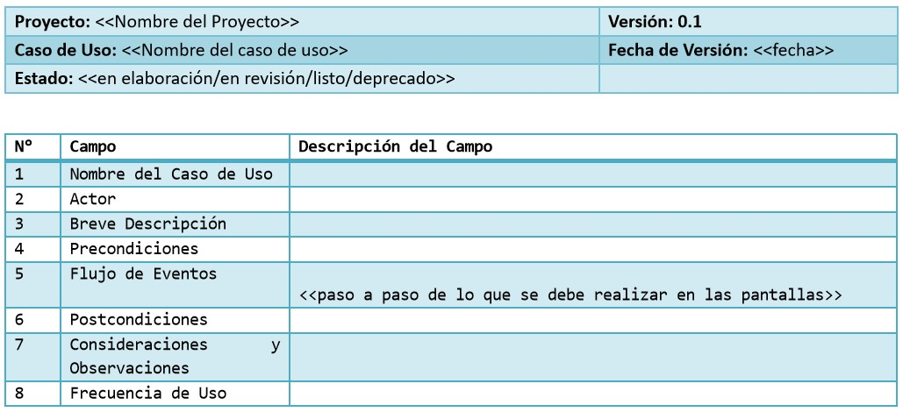

---

### Caso de uso: diagrama y descripción textual

Es importante distinguir los dos niveles:
- Diagrama: Proporciona una visión gráfica y general - ¿Qué funcionalidades existen y quién participa?
- Descripción textual: Proporciona una especificación detallada - ¿Qué ocurre durante la interacción?

Por lo tanto, no son dos modelos independientes que compiten entre sí.

Son dos representaciones complementarias del mismo modelo de casos de uso.

---

### [PlantUML](https://plantuml.com/es/sequence-diagram)

PlantUML es una herramienta que permite crear distintos tipos de diagramas mediante un lenguaje textual sencillo.

En lugar de dibujar manualmente cada elemento del diagrama, se escribe una descripción y la herramienta genera la representación gráfica.

----

### PlantUML
Esto resulta especialmente útil para:
- crear diagramas rápidamente
- modificar diagramas
- mantener los diagramas junto con el código del proyecto
- versionar las representaciones
- generar diferentes tipos de diagramas mediante texto

En entornos como **Visual Studio Code** puede utilizarse mediante una extensión.

----

### PlantUML y versionado
<!-- .slide: style="font-size: 0.90em" -->
Una ventaja importante de utilizar una representación textual es que el diagrama puede almacenarse como un archivo de texto y gestionarse mediante sistemas de control de versiones.

Por ejemplo:
```
proyecto/
├── src/
├── docs/
│   ├── casos-uso.puml
│   ├── clases.puml
│   └── secuencia.puml
└── README.md
```

De esta manera, el modelo puede evolucionar junto con el proyecto.

---

### Configuración de PlantUML en Visual Studio Code
1. Abrir **Visual Studio Code**
2. Ir a la sección de **Extensiones** o Pluggins
3. Buscar e instalar **PlantUML**
4. Ingresar a **File** > **Preferences** > **Settings**
5. Arriba a la derecha presionar **Open Settings (JSON)
6. Agregar 2 configuraciones
```json
"plantuml.render": "PlantUMLServer",
"plantuml.server": "http://www.plantuml.com/plantuml"
```

----

### Primer diagrama con PlantUML
1. Crear un nuevo archivo y colocar la extensión **puml**
2. En el archivo, escribir:
```json
@startuml ejemplo-diagrama
@enduml
```
3. Hacer click botón derecho, y seleccionar **Preview Current Diagram**

Otra opción es emplear el [servidor online](https://www.plantuml.com/plantuml)

----

### Plant UML - Casos de Uso
Se recomienda revisar la siguiente documentación:
- https://plantuml.com/es/use-case-diagram

----

### Plant UML - Casos de Uso
```json
@startuml ejemplo-diagrama
left to right direction
actor :Usuario deslogueado: as UD
rectangle "APP Avistaje de Fauna" {
  usecase "Crear cuenta" as UC1
  usecase "Visualizar fotos" as UC2
}
UD --> UC1
UD --> UC2
@endumls
```

----

### Plant UML - Casos de Uso
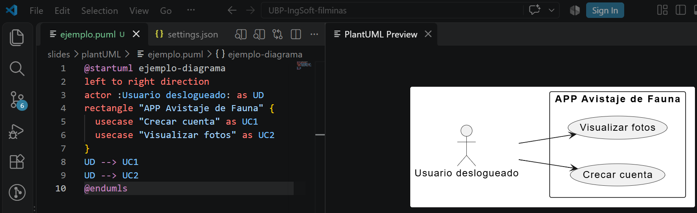

---
## ¿Dudas, Preguntas, Comentarios?

