#### Ingeniería de Software
# UML: Diagrama de Clases
Created by <i class="fab fa-telegram"></i>
[edme88]("https://t.me/edme88")

---

### Diagrama de clases
El diagrama de clases es un diagrama de **estructura** de UML.

Permite representar la estructura estática de un sistema, mostrando:
- las clases que forman parte del sistema
- sus atributos
- sus operaciones
- las relaciones entre las clases

Se centra en qué elementos componen el sistema y cómo se relacionan, no en la secuencia temporal de las acciones.

---

### ¿Qué representa una clase?
<!-- .slide: style="font-size: 0.90em" -->
Una **clase** es una abstracción que define las características y comportamientos que comparten un conjunto de objetos.

Por ejemplo, en un sistema de una clínica veterinaria podríamos tener:
- Persona
- Mascota
- Veterinario
- Consulta
- Receta

Una clase describe qué información tienen sus objetos y qué operaciones pueden realizar.

----

### Ejemplo: clase de consulta
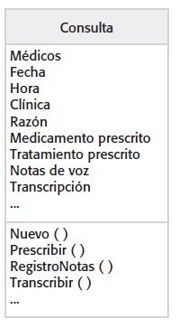

---

### Clase y objeto
- **Clase:** Es la definición o plantilla de un tipo de objeto.
- **Objeto:** Es una instancia concreta de una clase.

Por ejemplo:
- Clase: Mascota
- Objetos: "Luna", "Toby", "Milo"

Los tres objetos pertenecen a la clase Mascota, pero representan entidades concretas diferentes.

---

### ¿Qué información contiene una clase?

Una clase UML puede representarse mediante un rectángulo dividido en compartimentos.

Una representación habitual contiene:
1. Nombre de la clase
2. Atributos
3. Operaciones

----

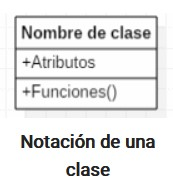 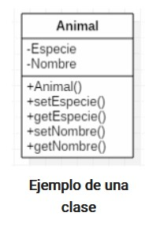

---
### 1. Nombre de la clase
<!-- .slide: style="font-size: 0.95em" -->
El primer compartimento contiene el nombre de la clase.

Por convención, los nombres de las clases suelen expresarse mediante sustantivos y comenzar con mayúscula:
- Persona
- Mascota
- Consulta
- Producto
- Cuenta

El nombre debería representar claramente el concepto que se está modelando.

---
### 2. Atributos
<!-- .slide: style="font-size: 0.90em" --> 
Los atributos representan información o características que poseen los objetos de una clase.

Por ejemplo, en la clase *Mascota** tenemos los atributos:
- nombre
- fechaNacimiento
- especie
- raza

En UML también podemos indicar el tipo:
- nombre: String
- fechaNacimiento: Date

Los atributos permiten describir el estado de los objetos.

---
### 3. Operaciones

Las operaciones representan comportamientos o servicios que una clase puede proporcionar.

Por ejemplo, en la clase *Mascota** tenemos los atributos:
- nombre: String
- especie: String

Y tenemos las operaciones:
- calcularEdad(): int
- actualizarDatos(): void

----

### 3. Operaciones
Una operación puede incluir:
- nombre
- parámetros
- tipo de retorno

Por ejemplo:

**registrarConsulta(fecha: Date): void**

---

### Visibilidad

UML permite indicar la visibilidad de atributos y operaciones.

Los símbolos más utilizados son:

<table>
  <thead>
    <tr>
      <th>Símbolo</th>
      <th>Visibilidad</th>
      <th>Significado</th>
    </tr>
  </thead>
  <tbody>
    <tr>
      <td><code>+</code></td>
      <td>Pública</td>
      <td>Accesible desde fuera de la clase</td>
    </tr>
    <tr>
      <td><code>-</code></td>
      <td>Privada</td>
      <td>Accesible únicamente desde la propia clase</td>
    </tr>
    <tr>
      <td><code>#</code></td>
      <td>Protegida</td>
      <td>Accesible desde la clase y sus subclases</td>
    </tr>
    <tr>
      <td><code>~</code></td>
      <td>Paquete</td>
      <td>Accesible dentro del mismo paquete</td>
    </tr>
  </tbody>
</table>

----

### Visibilidad

- Nombre: **Persona**

**Atributos**
- dni: String
- nombre: String

**Operaciones**
+ obtenerNombre(): String
+ cambiarNombre(nombre: String): void

La visibilidad está relacionada con el principio de encapsulamiento de la programación orientada a objetos.

---

### De los requisitos a las clases

El diagrama de clases no debería construirse simplemente inventando clases.

Las clases deben surgir del **análisis del problema** y de los **requisitos**.

Podemos preguntarnos:
- ¿Qué conceptos importantes del dominio aparecen en los requisitos?

----

### De los requisitos a las clases: Ejemplo
En un sistema de avistaje de fauna podrían aparecer conceptos como:
- Observación
- Especie
- Animal
- Lugar
- Usuario
- Fotografía

Estos conceptos pueden constituir candidatos a clases.

---

### Clases de análisis

Durante el análisis se busca identificar las principales abstracciones del dominio del problema.

Una clase de análisis:
- representa un concepto relevante del dominio
- se relaciona con conceptos del mundo real
- ayuda a comprender y estructurar el problema
- evita introducir prematuramente decisiones de implementación

---

### Clases de análisis: ejemplo
<!-- .slide: style="font-size: 0.75em" --> 
- Usuario
- Observación
- Especie
- Lugar
- Fotografía

son conceptos del dominio.

En cambio, clases como:
- ServicioHTTP
- ControladorBD
- GestorDeConexiones

corresponden normalmente a decisiones del dominio de la solución y no deberían aparecer en un modelo conceptual inicial del problema.

**Dominio del problema ≠ dominio de la solución**

---

### ¿Cómo encontrar clases?

No existe un algoritmo único que permita encontrar automáticamente las clases correctas.

Sin embargo, existen técnicas que ayudan a identificarlas.

Una de ellas es el **análisis nombre/verbo**.

---

### Análisis nombre/verbo

Se analiza el texto de los requisitos buscando:

1. **Sustantivos o frases nominales:** Pueden surgir clases y atributos
2. **Verbos o frases verbales:** Pueden surgit operaciones, responsabilidades y relaciones

----

### Análisis nombre/verbo
Por ejemplo: "El usuario registra una observación de una especie en un lugar."

Podríamos identificar inicialmente:
- **Posibles clases:** Usuario, Observación, Especie, Lugar
- **Posibles responsabilidades o acciones:** registrar 

Pero esto es solamente un punto de partida.

No todo sustantivo debe convertirse automáticamente en una clase.

---

### Responsabilidades de una clase

Una clase no debería existir solamente para almacenar datos.

También debe tener responsabilidades coherentes con el concepto que representa.

Una buena clase:
- tiene una finalidad clara
- representa un concepto concreto del dominio
- tiene responsabilidades relacionadas entre sí
- evita asumir responsabilidades que corresponden a otras clases

----

### Responsabilidades de una clase
- **Alta cohesión:** Las responsabilidades de una clase están fuertemente relacionadas entre sí.
- **Bajo acoplamiento:** Las clases dependen lo menos posible unas de otras.

Como regla general, buscamos alta cohesión y bajo acoplamiento.

---

### CRC: Clase, Responsabilidades y Colaboradores

La técnica permite analizar:
- qué **clase** estamos considerando
- qué **responsabilidades** tiene
- con qué otras clases necesita **colaborar**

Puede realizarse mediante tarjetas o notas y utilizarse como complemento del análisis nombre/verbo.

El proceso puede comenzar con una tormenta de ideas y continuar con una revisión de las clases y sus responsabilidades.

---

### Relaciones entre clases

Una vez identificadas las clases, debemos analizar cómo se relacionan.

Una **relación** representa una conexión significativa entre elementos del modelo.

----

### Relaciones entre clases
En un diagrama de clases podemos encontrar diferentes tipos de relaciones.

Las más importantes para este nivel son:
1. Asociación
2. Agregación
3. Composición
4. Generalización / herencia
5. Dependencia

No todas tienen la misma importancia ni deben utilizarse siempre.

---

### Relación: 1. Asociación

La **asociación** representa una relación estructural entre clases.

Se representa con una simple línea continua que une las clases que están incluidas en la asociación.

Ejemplo: Una mascota pertenece a una persona

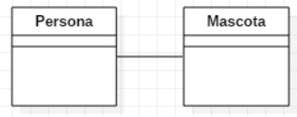

La asociación permite expresar que existen objetos de una clase relacionados con objetos de otra clase.

----

### Nombre de una asociación

Una **asociación** puede tener un **nombre** que ayude a comprender su significado.

Generalmente se utiliza una expresión verbal.

Por ejemplo:

Persona ─── posee ─── Mascota

Empresa ─── emplea ─── Persona

El nombre debería aportar información útil.

Si la relación resulta evidente y el nombre no agrega claridad, puede omitirse.

----

### Asociación: Roles

Una **asociación** también puede indicar los **roles** que desempeñan las clases participantes.

Por ejemplo:

Empresa ───────── Persona

 empleador          empleado

Los roles ayudan a interpretar qué representa cada extremo de la relación.

----

### Asociación: Multiplicidad

La **multiplicidad** indica cuántas instancias de una clase pueden participar en una asociación.

Algunos valores frecuentes son:

<table>
  <thead>
    <tr>
      <th>Multiplicidad</th>
      <th>Significado</th>
    </tr>
  </thead>
  <tbody>
    <tr>
      <td><code>1</code></td>
      <td>Exactamente uno</td>
    </tr>
    <tr>
      <td><code>0..1</code></td>
      <td>Cero o uno</td>
    </tr>
    <tr>
      <td><code>*</code></td>
      <td>Cero o muchos</td>
    </tr>
    <tr>
      <td><code>1..*</code></td>
      <td>Uno o muchos</td>
    </tr>
    <tr>
      <td><code>0..5</code></td>
      <td>Entre cero y cinco</td>
    </tr>
  </tbody>
</table>

La multiplicidad debe analizarse en ambos extremos de la relación.

----

### Asociación: Multiplicidad

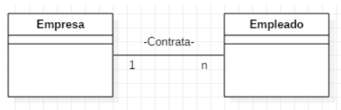

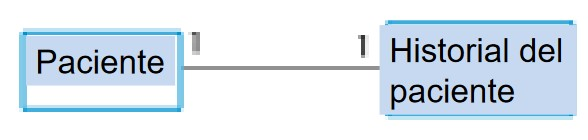

----

### Clases y asociaciones en el MHC-PMS
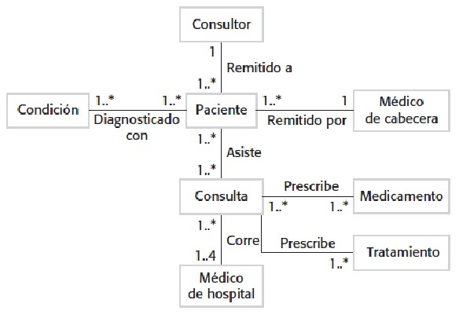

----

### Navegabilidad

La **navegabilidad** indica que, desde una instancia de una clase, es posible acceder a instancias de otra clase.

Puede representarse mediante una flecha.

Por ejemplo:

Pedido ───────→ Cliente

puede expresar que un objeto Pedido mantiene una referencia hacia un Cliente.

----

### Navegabilidad

La navegabilidad puede ser útil para representar cómo se estructura el acceso entre objetos.

Sin embargo, en modelos de análisis conviene no agregar flechas simplemente por costumbre.

Si un detalle no ayuda a comprender el modelo, puede omitirse.

---

### Relación: 2. Agregación
La **agregación** representa una relación de tipo **todo-parte** en la que las partes pueden existir independientemente del todo.

Se representa mediante un **rombo blanco** en el extremo correspondiente al todo.

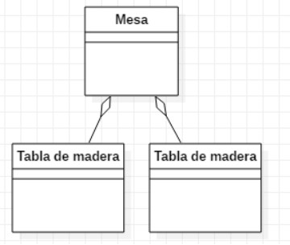

----

### Relación: 2. Agregación
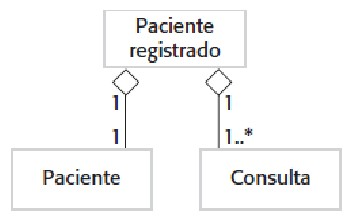

---

### Relación: 3. Composición
<!-- .slide: style="font-size: 0.90em" --> 
La **composición** es una relación **todo-parte** más fuerte.

Se representa mediante un **rombo relleno**.

En una composición existe una dependencia fuerte entre el ciclo de vida del todo y sus partes.

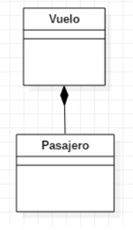

---

### Relación: 4. Generalización

La generalización representa una relación entre un elemento más general y otro más específico.

Es la relación que habitualmente asociamos con: **es un**

----

### Relación: 4. Herencia

En programación orientada a objetos, una jerarquía de generalización se implementa habitualmente mediante herencia.

Una subclase hereda características de su superclase y puede:
- utilizar los atributos y operaciones heredados
- agregar nuevas características
- redefinir determinadas operaciones

----

### Relación: 4. Generalización/Herencia - Ejemplo
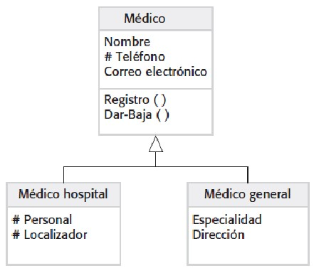

---

### Generalización como herramienta de abstracción

La generalización permite colocar características comunes en una clase más general.

Esto reduce la duplicación y permite construir una jerarquía de conceptos.

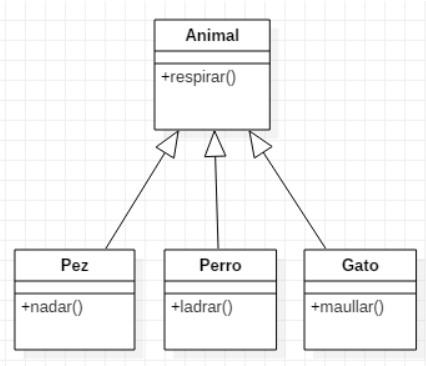

---
### Diagrama de clases para la clínica veterinaria

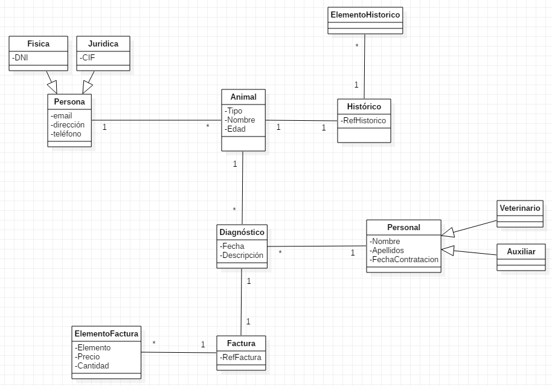

----

### Agregar características a las subclases

Las subclases pueden incorporar características específicas.

La jerarquía debe representar una especialización real.

Una pregunta útil es: **¿Un objeto de la subclase realmente puede considerarse un objeto de la superclase?**

Si la respuesta es no, probablemente la herencia no sea apropiada.

----

### Generalización y principio de sustitución

La relación de generalización implica que una instancia de una clase especializada puede utilizarse allí donde se espera una instancia de la clase general, respetando el comportamiento esperado.

Se relaciona con el principio de sustitución de Liskov.

"La herencia debe representar una verdadera relación de especialización, no simplemente reutilización de código."

---

### Clases abstractas

Una **clase abstracta** representa una abstracción que no se instancia directamente.

Puede utilizarse cuando queremos definir características comunes para varias subclases.

Una operación también puede declararse abstracta cuando su implementación se deja para las subclases.

---

### Polimorfismo

El polimorfismo permite que una misma operación pueda tener comportamientos diferentes según el objeto que la implemente.

La operación dibujar() representa la misma responsabilidad conceptual, pero puede comportarse de manera diferente en cada subclase.

Polimorfismo = una misma interfaz conceptual, diferentes comportamientos.

---

### Clases y asociaciones: ejemplo completo
<!-- .slide: style="font-size: 0.80em" -->
Los diagramas de clases permiten combinar todos estos elementos.

En un diagrama completo podemos encontrar:
- clases
- atributos
- operaciones
- asociaciones
- multiplicidades
- roles
- generalizaciones
- agregaciones
- composiciones

No es necesario utilizar todos estos elementos en todos los diagramas.

---

### Diagrama de clases y análisis
<!-- .slide: style="font-size: 0.90em" -->
El diagrama de clases puede utilizarse durante el análisis para comprender y estructurar el dominio del problema.

Durante esta etapa:
- se analizan y refinan los requisitos
- se identifican conceptos relevantes
- se construyen modelos del sistema
- se dejan muchas decisiones de implementación para etapas posteriores

El límite entre análisis y diseño no siempre es completamente rígido.

----

### Diagrama de clases y análisis
- **Modelo del dominio / análisis** -> ¿Qué conceptos existen en el problema?
- **Diseño** -> ¿Cómo vamos a construir la solución?

---

### Clases de análisis

Las clases de análisis representan abstracciones del dominio del problema.

Deberían:
- mapearse con conceptos del negocio
- ayudar a clarificar el dominio
- evitar detalles innecesarios de implementación
- tener responsabilidades claramente definidas

Una clase de análisis puede posteriormente dar lugar a una o más clases de diseño.

----

### Anatomía de una clase de análisis

Una clase de análisis debería contener solamente el nivel de detalle necesario para comprender el dominio.

Puede incluir:
- nombre
- atributos relevantes
- operaciones principales
- relaciones con otras clases

----

### Anatomía de una clase de análisis
Se evitan detalles como:
- estructuras internas
- mecanismos específicos de persistencia
- bibliotecas
- protocolos
- tecnologías concretas

En análisis interesa la intención de la clase; en diseño se incorporan progresivamente decisiones sobre su implementación.

---

### ¿Qué hace una buena clase?

- tiene un nombre claro
- representa un concepto específico
- pertenece al dominio del problema
- tiene responsabilidades bien definidas
- mantiene alta cohesión
- evita depender innecesariamente de otras clases

----

### Clase de análisis: Conviene evitar

- Clases omnipotentes: Una única clase que concentra prácticamente toda la lógica del sistema.
- Clases excesivamente pequeñas: Muchas clases con responsabilidades insignificantes pueden hacer que el modelo sea innecesariamente complejo.
- Jerarquías demasiado profundas: Una cadena extensa de herencia puede dificultar la comprensión y mantenimiento del sistema.

---

### Estereotipos de análisis

En algunos enfoques de análisis, especialmente asociados a RUP (Rational Unified Process), se utilizan tres estereotipos:

- `<<boundary>>`: Clase mediadora entre el sistema y su entorno
- `<<control>>`: Una clase que encapsula comportamiento especifico de caso de uso
- `<<entity>>`: Una clase que se utiliza para modelar información persistente sobre algo

Estos estereotipos ayudan a clasificar las responsabilidades de las clases.

----

### Clases Boundary
* Estas clases existen en el límite del sistema
* Se comunican con los actores externos
* Existen 3 tipos de clases Boundary
  * Clases de interfaz de usuario (Actor persona)
  * Clases de interfaz de sistema (Actor sistema)
  * Clases de interfaz de dispositivo (Actor dispositivo)

----

### Clases Control
* Son clases controladoras
* Se encargan de la coordinación del comportamiento del sistema
* Útil cuando el comportamiento no se puede repartir simplemente entre los otros estereotipos.

----

### Clases entidad
* Modelan información sobre algo
* Tienen comportamiento sencillo y acotado
* Se limitan a obtener y establecer valores
* Ejemplos clase Dirección, clase Persona
* Proporcionan y aceptan información de clases límite.
* A menudo son persistentes, íntimamente relacionadas con el modelo de datos.

---

### Dependencias
<!-- .slide: style="font-size: 0.80em" -->
Una **dependencia** representa una relación en la que un elemento utiliza o depende de otro.

Una modificación en el elemento proveedor puede afectar al elemento cliente.

Por ejemplo, una clase puede depender de otra si utiliza una instancia de ella como parámetro de una operación.

Las dependencias son diferentes de las asociaciones.
- **Asociación:** Representa una relación estructural relativamente estable entre clases.
- **Dependencia:** Representa una relación de utilización en la que un elemento necesita a otro para realizar determinada tarea.

---

### Paquetes

Un paquete es un elemento de agrupación de UML.

Permite organizar elementos del modelo en grupos relacionados.

Por ejemplo:
```
Modelo
├── Usuarios
├── Observaciones
├── Especies
└── Lugares
```

----

### Paquetes
Los paquetes ayudan a:
- organizar modelos grandes
- separar conceptos relacionados
- controlar la complejidad
- establecer dependencias entre grupos de elementos

En modelos pequeños probablemente no sean necesarios. Su utilidad aumenta a medida que crece la complejidad del sistema.

---

### Pasos para construir un diagrama de clases
<!-- .slide: style="font-size: 0.90em" -->
1. Leer los requisitos: Identificar los conceptos y reglas importantes del dominio.
2. Identificar clases candidatas: Buscar sustantivos y conceptos relevantes.
3. Identificar atributos: ¿Qué información necesitamos conocer sobre cada concepto?
4. Identificar responsabilidades: ¿Qué debe hacer esta clase?
5. Identificar asociaciones: ¿Qué clases necesitan estar relacionadas?
6. Determinar multiplicidades: ¿Cuántas instancias pueden participar en cada relación?

----

### Pasos para construir un diagrama de clases
<!-- .slide: style="font-size: 0.90em" -->
7. Analizar generalizaciones: ¿Existe una verdadera relación "es un"?
8. Evaluar agregación/composición: ¿Existe realmente una relación todo-parte?
9. Revisar el modelo: 
- ¿Las clases representan conceptos del dominio?
- ¿Las responsabilidades están bien distribuidas?
- ¿Hay clases innecesarias?
- ¿Hay una clase que concentra demasiado?
- ¿Las relaciones tienen sentido?
- ¿Las multiplicidades representan las reglas del negocio?

---

### Errores frecuentes
1. Convertir cada sustantivo en una clase: No todo sustantivo representa necesariamente un concepto que deba convertirse en clase.
2. Confundir atributo con clase: La decisión depende del dominio y de las responsabilidades.
3. Confundir "tiene" con composición: No toda relación de pertenencia implica composición.
4. Utilizar herencia solamente para reutilizar código: La herencia debería representar una verdadera relación de especialización.

----

### Errores frecuentes
5. Introducir detalles de implementación demasiado pronto: El modelo de análisis no debería llenarse de controladores, servicios, tablas o tecnologías si todavía estamos intentando comprender el dominio.
6. Colocar todo en una única clase: Esto genera clases con demasiadas responsabilidades y alto acoplamiento.

---

### PlantUML

Una clase se puede definir utilizando:
```
@startuml

class Persona

@enduml
```

PlantUML generará una representación gráfica de la clase

----

### Clase con atributos y operaciones

Podemos agregar atributos y operaciones:
```
@startuml

class Persona {
    - dni: String
    - nombre: String

    + obtenerNombre(): String
    + cambiarNombre(nombre: String): void
}

@enduml
```

----

### Varias clases

Podemos declarar varias clases:
```
@startuml

class Persona {
    - dni: String
    - nombre: String
}

class Mascota {
    - nombre: String
    - especie: String
}

@enduml
```

Hasta este punto las clases existen en el modelo, pero todavía no están relacionadas.

----

### Asociación en PlantUML

```
@startuml

class Persona {
    - dni: String
    - nombre: String
}

class Mascota {
    - nombre: String
    - especie: String
}

Persona "1" -- "0..*" Mascota : posee

@enduml
```

----

### Herencia en PlantUML

La generalización puede representarse mediante:
```
@startuml

class Animal {
    - nombre: String
    - edad: int

    + comer(): void
}

class Perro {
    - raza: String

    + ladrar(): void
}

class Gato {
    + maullar(): void
}

Animal <|-- Perro
Animal <|-- Gato

@enduml
```
PlantUML genera automáticamente la flecha de generalización correspondiente.

----

### Agregación en PlantUML

```
@startuml

class Mesa
class Tabla

Mesa o-- Tabla

@enduml
```
El símbolo o-- representa la relación de agregación.

----

### Composición en PlantUML
```
@startuml

class Pedido
class LineaPedido

Pedido *-- LineaPedido

@enduml
```
El símbolo *-- representa la composición.

----

### Dependencias en PlantUML
```
@startuml

class Controlador
class Servicio

Controlador ..> Servicio

@enduml
```
La línea discontinua permite distinguir la dependencia de una asociación estructural.

----

### Clases abstractas en PlantUML
```
@startuml

abstract class Figura {
    + dibujar(): void
}

class Circulo
class Rectangulo

Figura <|-- Circulo
Figura <|-- Rectangulo

@enduml
```
También podemos utilizar operaciones abstractas cuando corresponda.

----

### Estereotipos en PlantUML
```
@startuml

class Pantalla <<boundary>>
class RegistrarObservacion <<control>>
class Observacion <<entity>>

@enduml
```
Esto permite mostrar los estereotipos utilizados durante el análisis.

---

### Ejemplo completo: sistema de avistaje de fauna

Podemos aplicar lo aprendido a nuestro sistema.

Supongamos inicialmente estas clases:

Usuario
Observacion
Especie
Lugar
Fotografia

----

### Ejemplo completo: sistema de avistaje de fauna
<!-- .slide: style="font-size: 0.90em" -->
Una primera versión de PlantUML podría ser:
```
@startuml

class Usuario {
    - nombre: String
    - email: String
}

class Observacion {
    - fecha: Date
    - cantidadIndividuos: int
}

class Especie {
    - nombreComun: String
    - nombreCientifico: String
}

class Lugar {
    - nombre: String
    - latitud: double
    - longitud: double
}

class Fotografia {
    - archivo: String
}

Usuario "1" -- "0..*" Observacion : registra
Observacion "*" -- "1" Especie : corresponde a
Observacion "*" -- "1" Lugar : ocurre en
Observacion "1" -- "0..*" Fotografia : contiene

@enduml
```
Este ejemplo permite observar cómo el modelo conceptual se transforma en una representación textual.

----

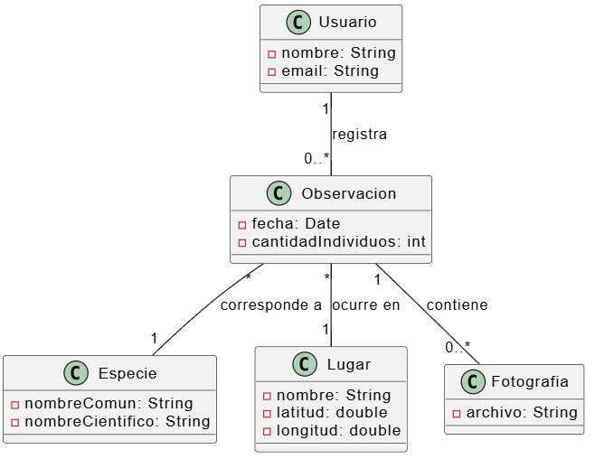

---
## ¿Dudas, Preguntas, Comentarios?

