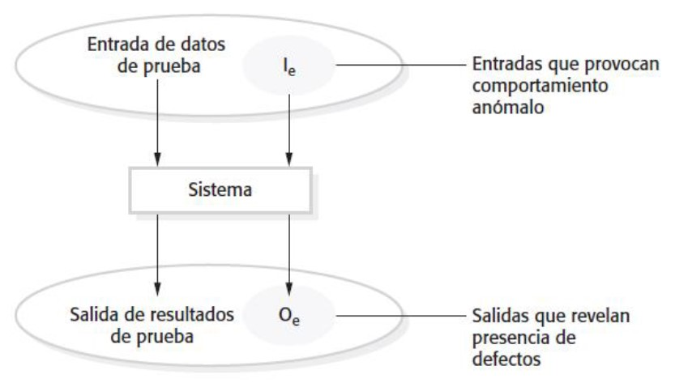
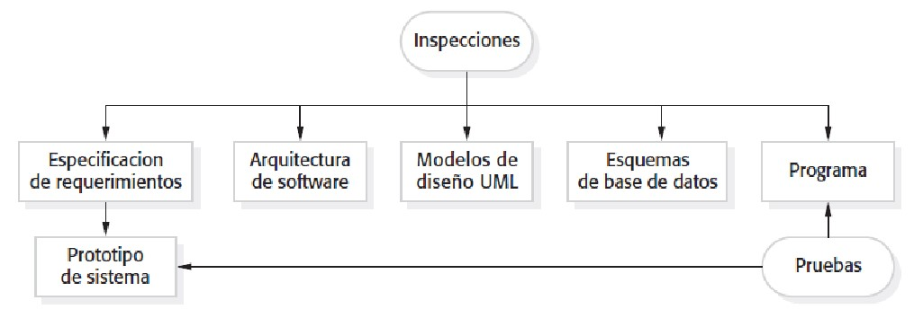
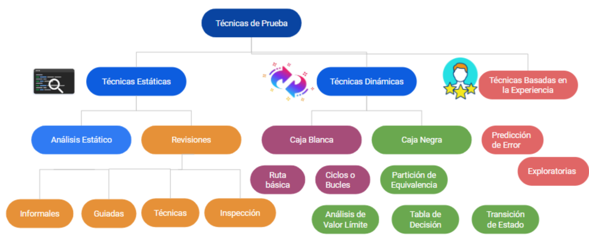
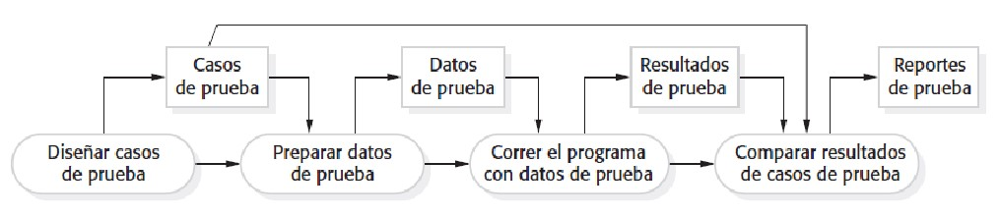
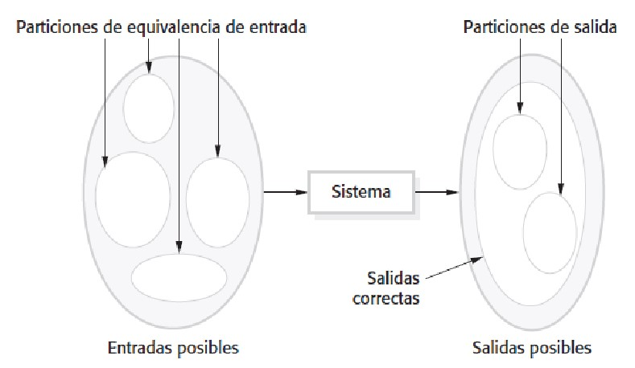
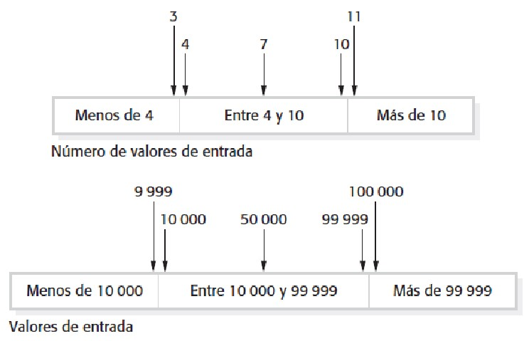
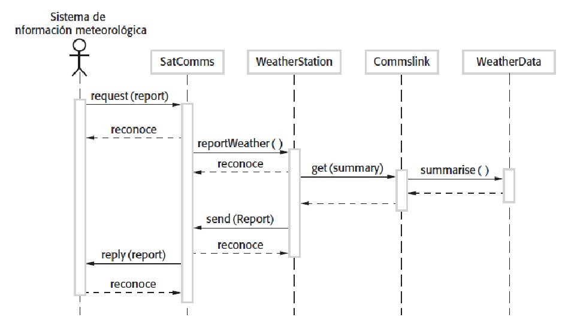
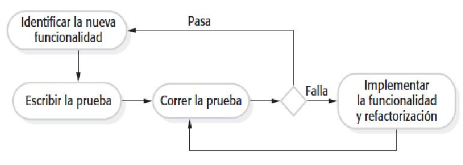
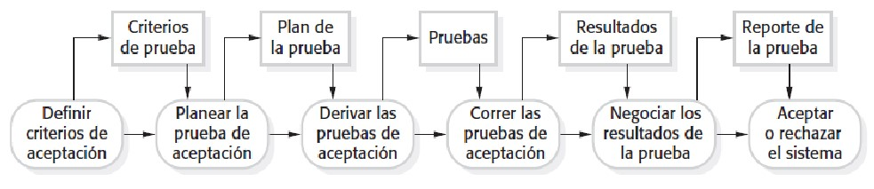

#### Ingeniería de Software
# Pruebas de Software
Created by <i class="fab fa-telegram"></i>
[edme88]("https://t.me/edme88")

---
<!-- .slide: style="font-size: 0.60em" -->

## Temario

### Pruebas de Software
* Definición
* Metas
* Validación
* Modelo de Entrada-Salida
* Verificación vs. Validación
* Inspecciones y Pruebas
* Ventajas de Inspecciones
* Etapas de Prueba

* Pruebas de Desarrollo
* Pruebas Unitarias
* Pruebas de Clases
* Pruebas automatizadas
* Pruebas de Interface
* Pruebas del Sistema
* Pruebas de Componentes
* Pruebas de Casos de Uso
* Políticas de Pruebas
* Pruebas de Regresión

---
### ¿Por qué probar software?
* El 80% del costo del ciclo de vida del software puede provenir de defectos no detectados tempranamente.  
* Un bug crítico puede costar millones o incluso poner en riesgo vidas humanas.  
* Las pruebas no son solo “buscar errores”, sino **aumentar la confianza** en el sistema.  
* Las pruebas efectivas son parte de la **ingeniería de calidad**, no solo una tarea final.

---
### Pruebas de Software
* La prueba intenta demostrar que un programa hace lo que se debe hacer y descubre los defectos del
programa antes de su puesta en uso.
* Al probar el software, se ejecuta un programa que utiliza los datos artificiales.
* Se comprueban errores, anomalías y los atributos no funcionales del sistema.
* Las pruebas son parte de un proceso de verificación y validación más general, que incluye también
técnicas de validación estáticas.

---
### Pruebas de Software
**Puede revelar la presencia de errores, no sus ausencias.**

---
### Metas de la prueba de software
<!-- .slide: style="font-size: 0.70em" -->
* Demostrar al desarrollador y al cliente que el software cumpla con sus requisitos.
  * Para el software personalizado, esto significa que debe haber por lo menos una prueba por cada requisito en el
  documento de requisitos.
  * Para los productos de software genérico, significa que debe haber pruebas para todas las funciones del sistema, 
  además de combinaciones de estas características, que se incorporarán en la versión del producto.
* Descubrir las situaciones en las que el comportamiento del software es incorrecta,
  indeseable o no se ajusta a su especificación.
  * Pruebas de defectos se ocupa de erradicar el comportamiento del sistema no deseado, tales como fallos
  del sistema, las interacciones no deseadas con otros sistemas, cálculos incorrectos y corrupción de datos.

---
### Validación y pruebas de defectos
<!-- .slide: style="font-size: 0.90em" -->
* El primer objetivo conduce a las **pruebas de validación**
  * Se espera que el sistema realice correctamente el uso de un determinado conjunto de casos de prueba que reflejen el 
  uso esperado del sistema.
* El segundo objetivo conduce a **pruebas de defectos**.
  * Los casos de prueba están diseñados para exponer los defectos.
  * Los casos de prueba en pruebas de defectos pueden ser deliberadamente confusos y no tienen por qué reflejar cómo se
utiliza normalmente el sistema.

---
### Modelo entrada-salida de prueba del programa

---
### Verificación vs validación
Las **pruebas** se consideran parte de un proceso más amplio de verificación y validación.
* **Verificación:** ¿construimos bien el producto?
  * El software cumple con los requerimientos funcionales y no funcionales establecidos
* **Validación:** ¿construimos el producto correcto?
  * El software debe hacer lo que el usuario realmente necesita.

---
### V & V
Objetivo final: establecer confianza de que el sistema de software es “adecuado”.

Depende de:
- **Propósito del software:** Cuanto más crítico sea el software más importante debe ser su confiabilidad.
- **Expectativas del usuario:** Conforme el software se completa, se espera sea más confiable.
- **Entorno de mercado:** Considerar los productos competitivos, el precio, la calidad, etc.

---
### Inspecciones y pruebas
* Inspecciones de software:
  * Verificación **estática**
* Pruebas de software
  * Verificación **dinámica**

---
### Verificacion & validacion estática
Implica inspecciones y revisiones (realizadas SIN ejecución), análisis y comprobación de: 
- Requerimientos del sistema
- Modelos de diseño
- Código fuente del programa
- Pruebas propuestas

----

### Inspecciones y Pruebas

----

### Inspecciones y pruebas
* Las inspecciones y las pruebas son complementarias.
* Ambas deben ser utilizadas durante el proceso de V & V.
* Las inspecciones pueden comprobar la conformidad con una especificación pero no la
conformidad con los requisitos reales del cliente.
* Las inspecciones no pueden comprobar las características no funcionales tales como
rendimiento, usabilidad, etc.

----

### Inspecciones de software
* Se enfocan en el código fuente de un sistema con el objetivo de descubrir anomalías y defectos.
* No requieren la ejecución de un sistema así que puede ser utilizado antes de la implementación.
* Se pueden aplicar a cualquier representación del sistema (requisitos, diseño, datos de
configuración, datos de prueba, etc.)
* Han demostrado ser una técnica efectiva para descubrir errores de programa.

---
### Ventajas de las inspecciones
<!-- .slide: style="font-size: 0.90em" -->
* Durante las pruebas, los errores pueden enmascarar (ocultar) otros errores. La inspección es un proceso
estático, no hay interacciones entre los errores.
* Versiones incompletas de un sistema pueden ser inspeccionadas fácilmente. En las pruebas es
necesario desarrollar casos de prueba especificos para las partes desarrolladas.
* La inspección permite refactorizar mejorando la calidad del programa (mejora el cumplimiento de las
normas, la portabilidad y facilidad de mantenimiento).

----

#### VSC: Plugins
- **ESlint:** Es una herramienta de análisis estático de código enfocada en encontrar y corregir problemas en el código 
JavaScript y en otros lenguajes basados en este, como TypeScript. Se utiliza para mantener un código más limpio, 
consistente y libre de errores.
- **SonarLint:** Ayuda a los desarrolladores a encontrar y solucionar errores en tiempo real mientras escriben código.

----

### Las inpescciones NO sustituyen las pruebas de software. Son diferentes los errores a nivel dinámico que estático.

---

### Técnicas de Prueba
Las pruebas pueden clasificarse según **cómo se evalúa el software**:

1. **Técnicas estáticas:** sin ejecutar el código.  
2. **Técnicas dinámicas:** con ejecución del sistema.  
3. **Técnicas basadas en la experiencia:** apoyadas en conocimiento o intuición del tester.

---

---
### Casos de Pruebas
Son especificaciones de las entradas a las pruebas y la salida esperada del sistema (los resultado de la prueba), 
además de información sobre lo que se pone a prueba.

---
### Etapas de prueba
- **Pruebas de desarrollo**, donde el sistema se prueba durante el desarrollo para descubrir los errores y defectos.
- **Pruebas de Versión**, donde un equipo de pruebas separado, testea una versión completa del sistema antes de que sea 
puesto en operación.
- **Pruebas de usuario**, donde los usuarios potenciales de un sistema, prueban el sistema en su propio entorno.

---
### Modelo del proceso de prueba de software

----

El proceso de prueba requiere una combinación de pruebas manuales y automatizadas.

---
### Pruebas de desarrollo
<!-- .slide: style="font-size: 0.80em" -->
Actividades de pruebas del equipo de desarrollo. Niveles de granulación:
1. **Prueba de la unidad**, donde se ponen a prueba las funciones o clases de objetos. Debe centrarse en
probar la funcionalidad de los objetos o métodos.
2. **Pruebas de componentes**, donde se integran varias unidades individuales para crear
componentes compuestos. Deben centrarse en las interfaces de componentes de prueba.
3. **Pruebas del sistema**, donde algunos o todos los componentes de un sistema están integrados y el
sistema se pone a prueba en su conjunto. Deben centrarse en las interacciones de los componentes

Todas son **pruebas de defecto**, cuya meta es descubrir bugs en el software.

---
### Pirámide de Testing

---

### Pirámide de Testing
<!-- .slide: style="font-size: 0.85em" -->
* Representa la **proporción ideal** de pruebas en los diferentes niveles.  
* Propone **muchas pruebas unitarias**, algunas pruebas de integración y pocas pruebas E2E.  
* Las pruebas de menor nivel son **más rápidas, baratas y fáciles de automatizar**.  
* Las pruebas de interfaz o sistema son **más lentas y frágiles**, pero necesarias para validar el flujo completo.  

---

### Distribución típica
| Nivel | Propósito | Ejemplo | Volumen esperado |
|-------|------------|----------|------------------|
| 🧩 **Unitarias** | Validar funciones o métodos | JUnit, Jest | 🔼 Alta |
| 🔗 **Integración / Componentes** | Validar interacción entre módulos | Postman, Playwright API | ⬆ Media |
| 💻 **UI / End-to-End** | Validar comportamiento completo del sistema | Selenium, Cypress | ⬇ Baja |

---
### 1. Pruebas de unidad
* Proceso de probar métodos o clases de objetos individualmente de forma aislada.
* Las unidades pueden ser:
  * Las funciones individuales o métodos dentro de un objeto
  * Las clases de objetos con varios atributos y métodos
  * Componentes compuestos con interfaces definidas usados para acceder a su funcionalidad.

---

### Métricas de calidad de prueba
* **Cobertura de código:** porcentaje de líneas, ramas o funciones ejecutadas.  
* **Tasa de defectos:** defectos encontrados / líneas de código.  
* **MTTF (Mean Time To Failure):** tiempo promedio hasta que ocurre un fallo.  
* **Tasa de éxito de ejecución de pruebas.**  
* **Defect leakage:** porcentaje de errores no detectados en pruebas previas.

---

### Pruebas clases
Cobertura de la prueba completa de una clase implica:
* Probar todas las operaciones asociadas con un objeto.
* La modificación/utilización de todos los atributos de los objetos.
* Poner el objeto en todos los estados posibles.
* La herencia hace más difícil la prueba.

---

### Pruebas automatizadas
* Siempre que sea posible, las pruebas de unidad debe ser automatizadas de forma que se ejecuten y
comprueben las pruebas sin necesidad de intervención manual.
* En la unidad de pruebas automatizadas, se hace uso de un marco de automatización de pruebas (tales
como JUnit, Jest o React Testing Library) para escribir y ejecutar las pruebas del programa.
* Marcos de pruebas unitarias permiten clases de prueba genéricos que se extienden a crear casos de prueba específicos.

---

### Herramientas populares de prueba
* **Unitarias:** JUnit, PyTest, Jest, NUnit.  
* **De integración y API:** Postman, RestAssured, Playwright API testing.  
* **UI/End-to-End:** Selenium, Playwright, Cypress.  
* **Performance:** JMeter, K6, Gatling.  
* **Cobertura y calidad:** SonarQube, Codecov.  
* **CI/CD:** GitHub Actions, Jenkins, GitLab CI.

---
### Partes del conjunto automatizado de pruebas
1. **Configuración**, donde se inicializa el sistema con el caso de prueba, es decir, entradas y salidas esperadas.
2. **Llamada**, cuando se llama al objeto o método para probar.
3. **Declaración**, donde se compara el resultado de la llamada con el resultado esperado. Si es verdadera, la
  prueba ha tenido éxito, si es falso ha fracasado.

---
### Efectividad de prueba de unidad
<!-- .slide: style="font-size: 0.90em" -->
* Los casos de prueba deben demostrar que, cuando se usa como se esperaba, el componente que se está
  probando hace lo que se supone que debe hacer.
* Si hay defectos en el componente, éstos deben ser revelados por los casos de prueba.
* Dos tipos de casos de prueba de unidad:
  * El primero debe reflejar el funcionamiento normal de un programa y demostrar que el componente funciona como se esperaba.
  * El segundo debe basarse en la experiencia de donde surgen los problemas comunes.
  * Se debe utilizar entradas anormales para comprobar que el componente no falle.

---

### Pruebas de Caja Negra
<!-- .slide: style="font-size: 0.85em" -->
* También llamadas **pruebas funcionales**.  
* Evalúan el sistema **desde el punto de vista del usuario** sin conocer la estructura interna del código.  
* Se basan en los **requerimientos y especificaciones funcionales**.  
* Buscan responder: *“¿Hace el sistema lo que debería hacer?”*
* Técnicas comunes:
  * Partición de equivalencia  
  * Análisis de valores límite  
  * Tablas de decisión  
  * Casos de uso y escenarios

---

### Pruebas de Caja Blanca
<!-- .slide: style="font-size: 0.85em" -->
* También llamadas **pruebas estructurales**.  
* El objetivo es validar la **lógica interna y los caminos del código**.  
* Requieren conocimiento del código fuente.  
* Buscan responder:  
  > “¿Está correctamente construido el sistema?”
* Tipos de cobertura:
  * Cobertura de sentencias  
  * Cobertura de decisiones o ramas  
  * Cobertura de condiciones  
  * Cobertura de caminos lógicos

---

### Comparativa
| Criterio | Caja Negra | Caja Blanca |
|-----------|-------------|--------------|
| Enfoque | Funcional (externo) | Estructural (interno) |
| Conocimiento del código | No requerido | Requerido |
| Base del diseño de prueba | Requerimientos | Código fuente |
| Objetivo | Validar comportamiento | Verificar implementación |
| Técnicas comunes | Partición de equivalencia, escenarios | Cobertura de código, caminos |
| Automatización típica | UI, API, E2E | Unitarias |

---

### Enfoque combinado (Caja Gris)
* Mezcla ambos enfoques: conocimiento parcial de la estructura interna.  
* Útil en pruebas de integración o de API, donde se conoce la arquitectura pero no toda la lógica interna.  
* Permite diseñar pruebas más **efectivas y realistas**.

---
### Estrategias de prueba
* **Prueba de partición**, donde se identifica grupos de entradas que tienen características comunes
  y deben ser procesadas de la misma manera.
* **Pruebas basadas en lineamientos**, en el que se utiliza la experiencia previa de los tipos de
  errores que los programadores suelen hacer cuando se desarrolla los componentes.

---
### Pruebas de partición
* Resultados de los datos de entrada y de salida a menudo caen en diferentes clases en las que
  todos los miembros de una clase están relacionados.
* Cada una de estas clases es una partición de equivalencia o de dominio en el que el
  programa se comporta de una manera equivalente para cada miembro de la clase.
* Los casos de prueba deben ser elegidos en cada partición.

---
### Partición de equivalencia

---
### Particiones de equivalencia

---
### Lineamientos para las pruebas (Ejemplo secuencias)
* Secuencias que tienen un solo valor.
* Usar secuencias de diferentes tamaños en diferentes pruebas. 
* Acceder al primero, al del medio y al último elementos de la secuencia. 
* Secuencias de longitud cero.

---
### Pautas generales de prueba
* Elegir entradas que obligan al sistema a generar todos los mensajes de error.
* Elegir entradas que causen el desbordamiento de buffers de entrada 
* Repetir la misma entrada o serie de entradas en numerosas ocasiones 
* Forzar la generación de salidas inválidas 
* Forzar que los resultados de los cálculos sean demasiado grandes o demasiado pequeños.

---
### 2. Prueba de componentes
Los componentes están constituídos por varios objetos que interactúan.
* El acceso a la funcionalidad de estos objetos es a través de la interfaz de componente definido.
* La prueba de componentes compuestos debe centrarse en la interfaz del componente.

Asumiendo que las pruebas unitarias en los objetos individuales dentro del componente se han completado.

---
### Prueba de interface
**Objetivo: detectar fallas debido a errores de interfaz o suposiciones inválidas sobre interfaces.**

---
### Prueba de interface: Tipos de interface
<!-- .slide: style="font-size: 0.90em" -->
1. **Interfaces de parámetro:** los datos, o referencias de función, pasan de un componente a otro (métodos en un objeto).
2. **Interfaces de memoria compartida:** un bloque de memoria se comparte entre componentes. (sistemas embebidos, sensores
crean datos que se recuperan y son procesados por otros componentes).
3. **Interfaces de procedimiento:** un componente encapsula un conjunto de procedimientos que pueden ser llamados por otros
componentes (componentes reutilizables)
4. **Interfaces que pasan mensajes:** al enviar un mensaje, un componente solicita un servicio de otro componente (sistemas
cliente-servidor)

---
### Errores de interface
<!-- .slide: style="font-size: 0.90em" -->
* **Uso incorrecto de la interface:** un componente llama a otro con errores en el uso de su interface.
Ej: Interfaces de parámetro, error de tipo, orden o número de parámetros.
* **Mala interpretación de la interface:** un componente malinterpreta la especificación de la interface del
componente Ej: método de búsqueda binaria enviando como parámetro un arreglo desordenado.
* **Errores de temporización:** en sistemas de tiempo real que usan una memoria compartida. El productor de datos y el
consumidor de datos operan a diferentes niveles de rapidez.

---
### Lineamientos para pruebas de interfaz
* Diseñar pruebas para que los parámetros de un procedimiento llamado se encuentren en los
extremos de sus rangos.
* Probar los parámetros de tipo puntero con punteros nulos.
* Diseñar pruebas que hagan que el componente falle.
* Utilice las pruebas de estrés en los sistemas de paso de mensajes.
* En los sistemas de memoria compartida, variar el orden en que se activan los componentes.

---
### 3. Pruebas del sistema
<!-- .slide: style="font-size: 0.90em" -->
* Las pruebas del sistema durante el desarrollo consiste en la integración de componentes para
crear una versión del sistema y las pruebas del sistema integrado.
* El enfoque en las pruebas del sistema es la prueba de las interacciones entre los componentes.
* Comprobar si los componentes son compatibles, interactúan correctamente y
transfieren los datos correctos en el momento adecuado a través de sus interfaces.
* Las pruebas del sistema prueban el comportamiento emergente de un sistema.

---
### Pruebas del sistema y de componentes
<!-- .slide: style="font-size: 0.90em" -->
* Durante las pruebas del sistema, se prueba el sistema completo. Incluyendo:
  * Componentes reutilizables que han sido desarrollados por separado e integrados con
  componentes desarrollados recientemente.
  * Componentes desarrollados por diferentes miembros del equipo o sub-equipos
* Las pruebas del sistema son colectivas más que un proceso individual.
* En general las realiza un equipo de pruebas independiente sin participación de diseñadores y programadores.

---

### Clasificación de pruebas (otras dimensiones)
* **Según el objetivo:** funcionales, no funcionales.  
* **Según el conocimiento interno:** caja negra, caja blanca, caja gris.  
* **Según el entorno:** manuales, automatizadas, híbridas.  
* **Según el tipo de dato:** pruebas positivas, negativas, límite.

---
### Pruebas de casos de uso
* Los casos de uso desarrollados para identificar las interacciones del sistema se pueden utilizar
como base para las pruebas del sistema.
* Cada caso de uso general implica varios componentes del sistema, la prueba del caso de
uso que obliga a que estas interacciones ocurran.
* Los diagramas de secuencia asociados con el caso de uso señalan los componentes y las
interacciones que se están probando.

---
### Recolección de datos

---
### Políticas de prueba
Las pruebas exhaustivas del sistema son imposibles. Se establece una política de pruebas
para definir la cobertura.

---
### Políticas de prueba
En general se debe probar:
* Todas las funciones del sistema que se acceden a través de menús.
* Las combinaciones de funciones a las que se accede a través del mismo menú.
* Todas las funciones para las cuales haya entrada del usuario.

---

### Pruebas basadas en riesgo
* No todo puede probarse. Se priorizan las áreas con mayor **impacto o probabilidad de fallo.**  
* Riesgo = Probabilidad × Impacto  
* Ejemplo: un módulo de pagos tiene prioridad sobre uno de reportes.  
* Ayuda a optimizar esfuerzo y cobertura.

---
### TDD: Desarrollo Dirigido por pruebas
<!-- .slide: style="font-size: 0.90em" -->
* Son las siglas de Test Driven Development
* Es un enfoque en que se entrelazan el desarrollo del código y el de las pruebas.
* Las pruebas se escriben antes que el código y el 'passing' de las pruebas es el motor
fundamental del desarrollo.
* Se desarrolla código junto con una prueba para ese incremento. No se pasa al siguiente
incremento hasta que el código pasa su prueba.
* TDD es usado en XP. Sin embargo, también se puede utilizar en los procesos de desarrollo
dirigido por plan

---
### Desarrollo basado en pruebas

---
### Pasos en el proceso de TDD
<!-- .slide: style="font-size: 0.90em" -->
1. Identificar el incremento de la funcionalidad que se requiere. (pequeño y aplicable en unas pocas líneas de código.)
2. Escribir la prueba para esta funcionalidad (prueba automatizada).
3. Ejecutar la prueba, junto con todas las demás pruebas que se han implementado. No se ha
implementado la funcionalidad de modo que la nueva prueba fallará.
4. Implementar la funcionalidad y vuelver a ejecutar la prueba.
5. Una vez que todas las pruebas se ejecutan correctamente, se pasa a la aplicación de la siguiente funcionalidad.

---
### Beneficios de TDD
<!-- .slide: style="font-size: 0.90em" -->
* **Cobertura de código:** Cada segmento de código que se escribe tiene por
lo menos una prueba asociada por lo que todo el código escrito tiene por lo menos una prueba.
* **Pruebas de regresión:** Un conjunto de pruebas de regresión se desarrolla
progresivamente a medida que se desarrolla un programa.
* **Depuración simplificada:** Cuando falla una prueba, es obvio dónde está el
problema. El código recién escrito tiene que ser revisado y modificado.
* **Documentación del sistema:** Las pruebas en sí son una forma de documentación
que describe lo que el código debería estar haciendo.

---

### La Pirámide y el Desarrollo Moderno
* En **TDD**, la base de la pirámide (unitarias) crece naturalmente.  
* En **CI/CD**, se ejecutan pruebas automáticas de todos los niveles en pipelines.  
* En equipos ágiles, se busca mantener la pirámide equilibrada — evitando el “cono de helado” (demasiadas pruebas UI lentas).

---

### Estrategias modernas de prueba
* **BDD (Behavior Driven Development):** usa un lenguaje natural (Given-When-Then).  
* **ATDD (Acceptance Test Driven Development):** involucra directamente al cliente.  
* **Shift-left testing:** probar lo antes posible en el ciclo.  
* **Continuous Testing:** ejecutar pruebas automáticamente en cada commit o build.

---
### Pruebas de regresión
* Las pruebas de regresión prueban el sistema para comprobar que los cambios no han "roto" el código
de trabajo con anterioridad.
* En un proceso de prueba manual, las pruebas de regresión son caras, pero, la prueba automatizada, es
simple y directa. Todas las pruebas se vuelven a ejecutar cada vez que se realice un cambio en el programa.
* Las pruebas deben ejecutarse con 'éxito' antes y después del cambio que se ha comprometido.

---
### Pruebas de versión
<!-- .slide: style="font-size: 0.90em" -->
Proceso de probar una versión particular de un sistema que está diseñado para su uso fuera del equipo de desarrollo.
* El objetivo es convencer al usuario que el sistema es lo suficientemente bueno para su uso.
* Tienen que demostrar que el sistema ofrece la funcionalidad especificada, el rendimiento y la
fiabilidad, y que no falla durante su uso normal.
* Son por lo general un proceso de prueba de caja negra donde las pruebas sólo se derivan de la
especificación del sistema.

---
### Pruebas de versión y pruebas de sistema
Diferencias importantes:
* Un equipo separado que no haya estado involucrado en el desarrollo del sistema, debe ser
responsable de las pruebas de versión.
* Las **pruebas del sistema** por el equipo de desarrollo debe centrarse en el descubrimiento de
errores en el sistema (pruebas de defectos).
* El objetivo de las **pruebas de versión** es para comprobar que el sistema cumpla con sus
requisitos y es lo suficientemente bueno para el uso externo (pruebas de validación).

---
### Pruebas basadas en requerimientos
Implican el examen de cada requerimiento y el desarrollo de una prueba o pruebas para ello.

Los requerimientos deben escribirse de forma que pueda diseñarse una prueba para dicho requerimiento.

Son pruebas de validación.

---
### Requisitos MHC-PMS:
* Si un paciente se sabe que es alérgico a algún medicamento en particular, entonces la
prescripción de medicamentos que dará lugar a un mensaje de aviso que se entregará al usuario del sistema.
* Si un prescriptor elige ignorar una advertencia de alergia, deberán proveer una razón por la que esto ha sido ignorado.

----

### Pruebas de requerimientos MHC-PMS
<!-- .slide: style="font-size: 0.80em" -->
* Elegir uno o más paciente/s con alergia a un fármaco: 
  * Prescribir medicamentos para los cuales no es alérgico, comprobar que el mensaje de advertencia no se emite. 
  * Prescribir el medicamento para el cual es alérgico, comprobar que la advertencia se emite.
* Elegir uno o más paciente/s con alergias a dos o más drogas:
  * Prescribir ambos fármacos por separado, comprobar que se emitió la advertencia para cada uno. 
  * Prescribir ambos fármacos al mismo tiempo comprobar que las dos advertencias se emiten correctamente. 
* Prescribir un medicamento que emite una advertencia e ignorarla. Comprobar que el sistema requiere que el
usuario proporcione una explicación de por qué rechazada la advertencia.

---
### Pruebas de escenario
* Son un enfoque a las pruebas de versión donde se crean escenarios típicos de uso y se les utiliza en el desarrollo de 
casos de prueba para el sistema.
* Un escenario es una historia que describe una forma en que puede usarse el sistema.
* Los escenarios deben ser realistas, y lo usuarios reales del sistema tienen que relacionarse con ellos.

----

### Prueba de escenario MHC-PMS
<!-- .slide: style="font-size: 0.80em" -->
Kate es enfermera con especialidad en atención a la salud mental. Una de sus
responsabilidades es visitar a domicilio a los pacientes, para comprobar la
efectividad de su tratamiento y que no sufran de efectos colaterales del fármaco.
En un día de visitas domésticas, Kate ingresa al MHC-PMS y lo usa para
imprimir su agenda de visitas domiciliarias para ese día, junto con información
resumida sobre los pacientes por visitar. Solicita que los registros para dichos
pacientes se descarguen a su laptop. Se le pide la palabra clave para cifrar los
registros en la laptop.
Uno de los pacientes a quienes visita es Jim, quien es tratado con medicamentos
antidepresivos. Jim siente que el medicamento le ayuda, pero considera que el
efecto colateral es que se mantiene despierto durante la noche.

---
### Prueba de escenario MHC-PMS
<!-- .slide: style="font-size: 0.80em" -->
Kate observa el registro de Jim y se le pide la palabra clave para descifrar el
registro. Comprueba el medicamento prescrito y consulta sus efectos colaterales.
El insomnio es un efecto colateral conocido, así que anota el problema en el
registro de Jim y sugiere que visite la clínica para que cambien el medicamento.
Él está de acuerdo, así que Kate ingresa un recordatorio para llamarlo en
cuanto ella regrese a la clínica, para concertarle una cita con un médico.
Termina la consulta y el sistema vuelve a cifrar el registro de Jim.
Más tarde, al terminar sus consultas, Kate regresa a la clínica y sube los
registros de los pacientes visitados a la base de datos. El sistema genera para
Kate una lista de aquellos pacientes con quienes debe comunicarse, para
obtener información de seguimiento y concertar citas en la clínica.

---
### Pruebas para el escenario
* Autenticación al ingresar al sistema. 
* Descarga y carga registros de paciente específicos desde una laptop. 
* Agenda de visitas a domicilio. 
* Cifrado y descifrado de registros de pacientes en un dispositivo móvil. 
* Recuperación y modificación de registros. 
* Vinculación con la base de datos de medicamentos que mantenga información acerca de efectos colaterales. 
* Sistema para recordatorio de llamadas.

---
### Pruebas de rendimiento
<!-- .slide: style="font-size: 0.90em" -->
* Prueba las propiedades emergentes de un sistema, como el rendimiento y la fiabilidad.
* Las pruebas deben diseñarse para procesar una carga pretendida.
* Las pruebas deben reflejar el perfil de uso del sistema.
* Las pruebas de rendimiento por lo general implican la planificación de una serie de
pruebas en las que la carga se incrementa de forma constante hasta que el rendimiento del sistema se vuelve inaceptable.
* Las **pruebas de estrés** son una forma de pruebas de rendimiento en el que el sistema
está sobrecargado deliberadamente para probar su comportamiento.

---
### Pruebas de usuario
* Las pruebas de usuario o cliente es una etapa en el proceso de pruebas en el que los usuarios
o los clientes proporcionan información y asesoramiento sobre las pruebas del sistema.
* La prueba de usuario es esencial, incluso cuando el sistema completo y pruebas de
liberación se han llevado a cabo.

---
### Pruebas de usuario
El entorno de trabajo del usuario tiene un efecto importante en la fiabilidad,
rendimiento, facilidad de uso y robustez de un sistema.
No puede ser replicado en un entorno de prueba.

---
### Tipos de prueba de usuario
1. **Pruebas Alfa:** Los usuarios del software trabajan con el equipo de desarrollo para poner a prueba el
software en el sitio del desarrollador.
2. **Pruebas Beta:** Una versión del software está disponible para los usuarios que les permite experimentar y
plantear a los desarrolladores los problemas que descubren.
3. **Pruebas de Aceptación:** Los clientes prueban un sistema para decidir si está listo para ser aceptado y utilizado 
en el entorno del cliente.

---
### Etapas en el proceso de las pruebas de aceptación
1. **Definir los criterios de aceptación:** Definirse entre el cliente y el desarrollador
2. **Planificar las pruebas de aceptación:** Se define cobertura requerida, calendario de pruebas, riesgos, recursos, tiempo, presupuesto.
3. **Derivar las pruebas de aceptación:** Se diseñan las pruebas funcionales como no funcionales.
4. **Ejecutar las pruebas de aceptación**
5. **Negociar resultados de las pruebas:** Es poco probable que pasen todas las pruebas.
6. **Rechazar/aceptar el sistema**

---
### Etapas en el proceso de las pruebas de aceptación

---
### Los métodos ágiles y pruebas de aceptación
* En los métodos ágiles, el usuario/cliente es parte del equipo de desarrollo y es responsable de la toma de
decisiones sobre la aceptabilidad del sistema.
* Las pruebas son definidas por el usuario/cliente y se integran con otras pruebas las que se ejecutan 
automáticamente cuando se realizan cambios.
* El principal problema radica en si el usuario incorporado es "típico" y puede representar los
intereses de todos los actores del sistema.

---

### QA en entornos ágiles y DevOps
* Las pruebas se integran en el ciclo continuo de desarrollo.  
* El QA participa desde la planificación de historias de usuario.  
* Se automatizan pruebas unitarias, de integración y regresión en pipelines.  
* Se usan entornos de prueba efímeros y datos simulados.  
* Cultura de “calidad compartida”: todos los roles son responsables de la calidad.

---
## ¿Dudas, Preguntas, Comentarios?
