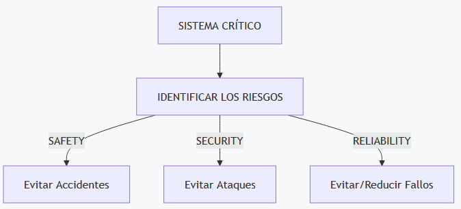

#### Ingeniería de Software

### Unidad IX

# ESPECIFICACIÓN DE SISTEMAS CRÍTICOS
Created by <i class="fab fa-telegram"></i>
[edme88]("https://t.me/edme88")

---
<!-- .slide: style="font-size: 0.60em" -->

## Temario

### Modelado de Sistemas
* Modelos de Sistemas
* Perspectivas del Sistema
* Tipos de Diagramas UML
* Uso de modelos gráficos
* Modelos de Contexto
* Límites del sistema
* Perspectiva del proceso
* Modelos de Interacción
* Modelado de Casos de Uso

* Diagramas de Secuencia
* Modelos Estructurales
* Diagramas de Clases
* Generalización
* Agregación
* Modelos de Comportamiento
* Modelado Impulsado por Datos
* Modelado Impulsado por Eventos
* Modelos de Máquina de Estado
* Ingeniería Dirigida por Modelos

---

### ESPECIFICACIÓN DE SISTEMAS CRÍTICOS

La **especificación de sistemas críticos** es el proceso de definir y documentar los requerimientos de un sistema cuya falla puede producir consecuencias graves para las personas, el medio ambiente, la organización o la información.

En estos sistemas no es suficiente especificar solamente **qué debe hacer el sistema**. También es necesario especificar **cómo debe comportarse ante fallos, situaciones peligrosas, ataques y condiciones inesperadas**.

----

### ESPECIFICACIÓN DE SISTEMAS CRÍTICOS
Además de los requerimientos funcionales, adquieren importancia los requerimientos relacionados con:
- Riesgos
- Seguridad (safety)
- Protección (security)
- Fiabilidad (reliability)

---

### Especificación dirigida por riesgos

En un sistema convencional podemos comenzar preguntándonos:
> ¿Qué funciones debe realizar el sistema?

En un sistema crítico debemos agregar otra pregunta:
> ¿Qué puede salir mal y qué consecuencias tendría?

---

### Especificación dirigida por riesgos
La especificación dirigida por riesgos (risk-driven specification) consiste en identificar los posibles riesgos, evaluar sus consecuencias y utilizar ese análisis para definir los requerimientos del sistema.

---
### Riesgo
<!-- .slide: style="font-size: 0.80em" -->
Un **riesgo** es la posibilidad de que ocurra una situación no deseada que produzca consecuencias negativas.

Por ejemplo, en un sistema de control ferroviario:
> Riesgo: el sistema autoriza a dos trenes a 
> utilizar simultáneamente un mismo tramo de vía.

Las consecuencias podrían ser extremadamente graves.

Por lo tanto, se puede establecer un requerimiento como:
> El sistema no deberá permitir que dos trenes reciban 
> simultáneamente autorización para ocupar un mismo tramo de vía.

---
### Proceso de especificación dirigida por riesgos

1. Identificar riesgos
2. Analizar riesgos
3. Evaluar consecuencias
4. Determinar medidas de reducción del riesgo
5. Definir requerimientos
6. Verificar que los requerimientos reduzcan los riesgos

---
### Riesgo: Ejemplo

Supongamos un sistema que controla una máquina industrial.
<table>
<thead>
<tr>
<th>Riesgo</th>
<th>Consecuencia</th>
<th>Medida</th>
<th>Requerimiento</th>
</tr>
</thead>
<tbody>
<tr>
<td>Sensor defectuoso</td>
<td>La máquina continúa funcionando en una condición peligrosa</td>
<td>Detectar valores inválidos</td>
<td>El sistema deberá detectar valores de sensores fuera de rango</td>
</tr>
<tr>
<td>Pérdida de comunicación</td>
<td>El controlador no recibe información</td>
<td>Llevar el sistema a estado seguro</td>
<td>Ante la pérdida de comunicación, el sistema deberá detener el proceso</td>
</tr>
<tr>
<td>Acceso no autorizado</td>
<td>Modificación de parámetros</td>
<td>Autenticación</td>
<td>Solo usuarios autorizados podrán modificar parámetros</td>
</tr>
</tbody>
</table>

---

## Los riesgos ayudan a determinar qué requerimientos críticos debe tener el sistema.

---
### Especificación de la seguridad (Safety)

La **especificación de la seguridad** define los requerimientos destinados a evitar que el sistema provoque daños, accidentes o situaciones peligrosas.

Aquí **safety** no significa proteger el sistema contra hackers. Se refiere principalmente a la seguridad frente a accidentes y fallos.

----

### Safety: ejemplo
<!-- .slide: style="font-size: 0.90em" -->
Un sistema de control de una máquina debe detenerla automáticamente si detecta una condición peligrosa.

Los requerimientos de **safety** pueden especificar:
- Qué situaciones se consideran peligrosas.
- Cómo debe detectar el sistema una condición peligrosa.
- Qué debe hacer el sistema ante una falla.
- Qué componentes deben tener redundancia.
- Cuándo debe detenerse el sistema.
- Cómo debe pasar a un estado seguro.
- Qué alarmas debe generar.
- Qué acciones deben requerir confirmación.

----

### Safety: ejemplo
<!-- .slide: style="font-size: 0.80em" -->
Sistema de control de un ascensor:
> Si se detecta una velocidad superior al límite establecido, 
> el sistema deberá activar el mecanismo de seguridad correspondiente.

Otro ejemplo:
> Si el sistema no puede determinar correctamente la posición del ascensor, 
> deberá impedir el movimiento hasta recuperar información válida.

En estos casos, se está definiendo qué comportamiento debe tener el sistema para evitar una situación peligrosa.

---

### Especificación de la protección (Security)
<!-- .slide: style="font-size: 0.90em" -->
La **especificación de la protección** define los requerimientos destinados a proteger el sistema y su información frente a accesos, modificaciones o acciones no autorizadas.

Mientras que **safety** se preocupa principalmente por:
> ¿Puede el sistema provocar un accidente?

**Security** se preocupa por:
> ¿Puede una persona o sistema no autorizado comprometerlo?

----

### Security
<!-- .slide: style="font-size: 0.90em" -->
1. **Confidencialidad:** La información solamente debe estar disponible para usuarios autorizados.
> Un estudiante no podrá consultar las calificaciones de otros estudiantes.

2. **Integridad:** La información no debe ser modificada de manera no autorizada.
> Solamente los usuarios con permisos de administrador podrán modificar las calificaciones.

----

### Security
<!-- .slide: style="font-size: 0.70em" -->
3. **Disponibilidad:** Los servicios deben permanecer disponibles para los usuarios autorizados.
> El sistema deberá continuar prestando servicio ante determinados tipos de fallos o ataques.

4. **Autenticación:** El sistema debe comprobar quién es el usuario.
> El usuario deberá autenticarse antes de acceder al sistema.

5. **Autorización:** El sistema debe determinar qué puede hacer cada usuario.
> Un docente podrá modificar las calificaciones de sus propios cursos, pero no las de otros docentes.

---

### Especificación de la fiabilidad (Reliability)

La **especificación de la fiabilidad** define los requerimientos relacionados con la capacidad del sistema para funcionar correctamente y sin fallos durante un período determinado y bajo condiciones específicas.

En un sistema crítico es necesario establecer qué nivel de fiabilidad se espera.

---
### Reliability: Ejemplo:

El sistema deberá funcionar continuamente durante una operación de 12 horas sin producir fallos que interrumpan el servicio.

O:

La probabilidad de fallo durante una determinada operación no deberá superar el límite establecido.

---
### ¿Cómo se puede especificar la fiabilidad?
<!-- .slide: style="font-size: 0.80em" -->
La fiabilidad puede expresarse mediante diferentes tipos de requisitos:

- **Frecuencia máxima de fallos:** El sistema no deberá presentar más de X fallos durante un determinado período.
- **Tiempo medio entre fallos:** MTBF — Mean Time Between Failures. Representa el tiempo promedio entre fallos.
Ejemplo: MTBF ≥ 10.000 horas.
Esto significa que se espera un promedio de al menos 10.000 horas entre fallos, bajo las condiciones especificadas.
- **Tiempo de recuperación:** Aunque está más directamente relacionado con la disponibilidad, también puede formar parte de los requisitos de recuperación:
Después de un fallo, el sistema deberá recuperar el servicio en menos de 30 segundos.

---
### Relación entre riesgos, safety, security y reliability

Permiten identificar los requerimientos críticos.

---

### Ejemplo
<!-- .slide: style="font-size: 0.80em" -->
Consideremos un sistema de control de una central eléctrica.
- **Riesgo 1:** Una persona no autorizada modifica un parámetro de funcionamiento.
  - **Security:** Se requieren autenticación, autorización, control de acceso y registro de operaciones.

- **Riesgo 2:** Un sensor entrega información incorrecta.
  - **Reliability + Safety:** El sistema debe detectar la información incorrecta y adoptar un comportamiento seguro.

- **Riesgo 3:** El controlador deja de funcionar.
  - **Reliability + Availability + Safety:** Puede ser necesario utilizar redundancia, mecanismos de recuperación y un estado seguro.

---

### Requisitos verificables

En sistemas críticos no es suficiente escribir: **"El sistema debe ser muy seguro."** 
o: **"El sistema debe ser altamente confiable."**

Son afirmaciones demasiado ambiguas.

Es preferible definir requisitos **medibles** y **verificables**.

----

### Requisitos verificables: Ejemplo

| ❌ Incorrecto | ✅ Correcto |
|---------------|--------------|
| El sistema debe recuperarse rápidamente ante una falla. | El sistema deberá recuperar el servicio en un máximo de 10 segundos después de una falla del servidor principal. |
| El sistema debe ser seguro. | Después de 5 intentos consecutivos de autenticación fallidos, la cuenta deberá bloquearse durante el período establecido. |

Esto permite posteriormente verificar mediante pruebas o análisis si el requisito se cumple.

----

### Riesgo, Proteccion, Seguridad y Fiabilidad

<table>
<thead>
<tr>
<th>Concepto</th>
<th>Pregunta principal</th>
<th>Ejemplo</th>
</tr>
</thead>
<tbody>
<tr>
<td><strong>Riesgo</strong></td>
<td>¿Qué puede salir mal?</td>
<td>Un sensor proporciona información incorrecta</td>
</tr>
<tr>
<td><strong>Safety</strong></td>
<td>¿Cómo evitamos que una falla produzca un accidente?</td>
<td>Detener el sistema ante una condición peligrosa</td>
</tr>
<tr>
<td><strong>Security</strong></td>
<td>¿Cómo evitamos acciones no autorizadas?</td>
<td>Autenticación y control de acceso</td>
</tr>
<tr>
<td><strong>Reliability</strong></td>
<td>¿Cómo conseguimos que funcione correctamente sin fallar?</td>
<td>Reducir la frecuencia de fallos</td>
</tr>
</tbody>
</table>

---
## ¿Dudas, Preguntas, Comentarios?

