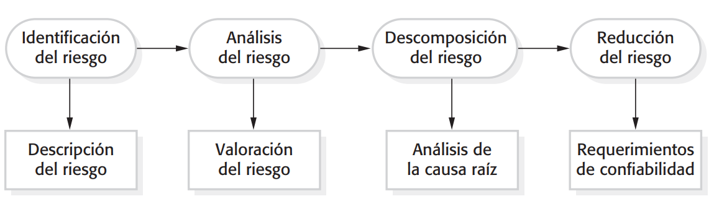
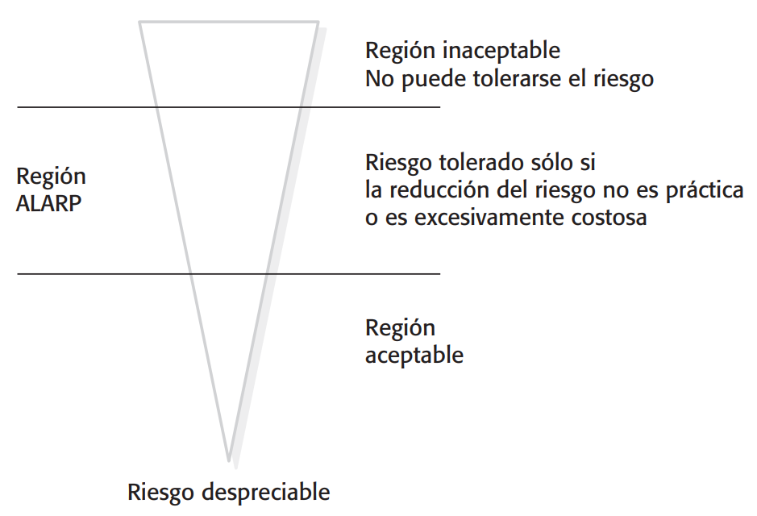
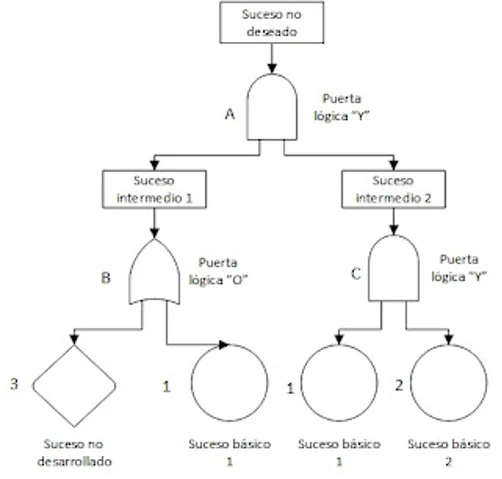
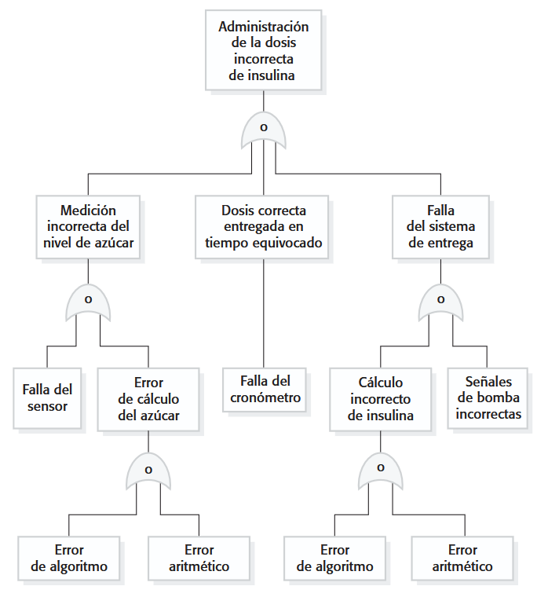
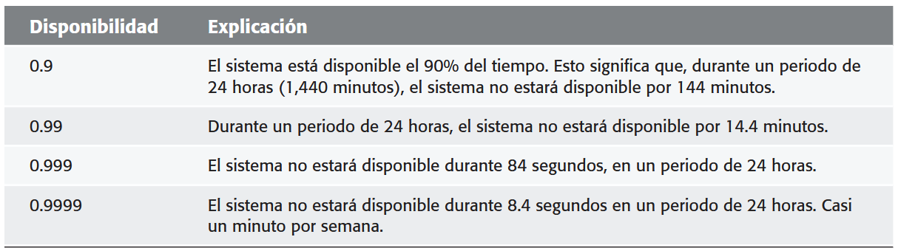
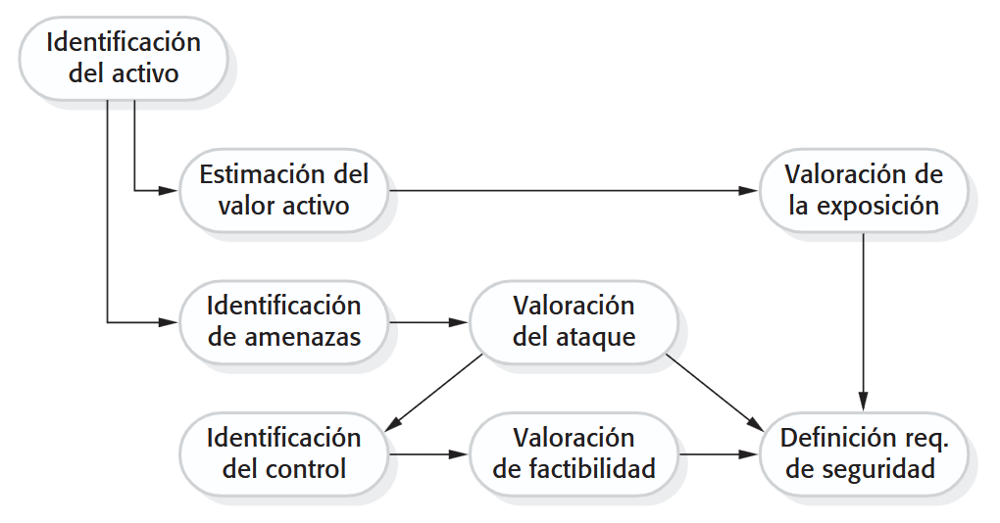
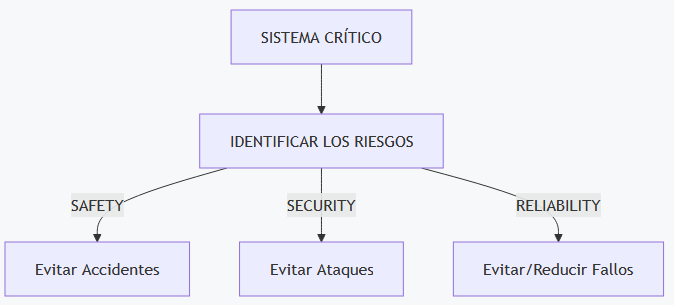

#### Ingeniería de Software

### Unidad IX

# ESPECIFICACIÓN DE SISTEMAS CRÍTICOS
Created by <i class="fab fa-telegram"></i>
[edme88]("https://t.me/edme88")

---
<!-- .slide: style="font-size: 0.60em" -->

## Temario

### Modelado de Sistemas
* Especificación de sistemas críticos
* Especificación dirigida por riesgos
* Riesgo
* Proceso de Especificación
* Especificación de la seguridad
* Especificación de la proteccion
* Especificación de la fiabilidad

* ¿Cómo se puede especificar la fiabilidad?
* Relación entre riesgos, safety, security y reliability
* Requisitos verificables

---

### ESPECIFICACIÓN DE SISTEMAS CRÍTICOS

La **especificación de sistemas críticos** es el proceso de definir y documentar los requerimientos de un sistema cuya falla puede producir consecuencias graves para las personas, el medio ambiente, la organización o la información.

En estos sistemas no es suficiente especificar solamente **qué debe hacer el sistema**. También es necesario especificar **cómo debe comportarse ante fallos, situaciones peligrosas, ataques y condiciones inesperadas**.

----

### ESPECIFICACIÓN DE SISTEMAS CRÍTICOS
Además de los requerimientos funcionales, adquieren importancia los requerimientos relacionados con:
- Riesgos
- Seguridad (safety)
- Protección (security)
- Fiabilidad (reliability)

---

### Especificación dirigida por riesgos

En un sistema convencional podemos comenzar preguntándonos:
> ¿Qué funciones debe realizar el sistema?

En un sistema crítico debemos agregar otra pregunta:
> ¿Qué puede salir mal y qué consecuencias tendría?

---

### Especificación dirigida por riesgos
Un enfoque dirigido por riesgos para la especificación de requerimientos toma en cuenta:
- Los eventos peligrosos que pudieran ocurrir
- La probabilidad de que realmente sucedan
- La posibilidad de que el daño derivará de tal evento
- El grado del daño causado.

---
### Riesgo
<!-- .slide: style="font-size: 0.80em" -->
Un **riesgo** es la posibilidad de que ocurra una situación no deseada que produzca consecuencias negativas.

Por ejemplo, en un sistema de control ferroviario:
> Riesgo: el sistema autoriza a dos trenes a 
> utilizar simultáneamente un mismo tramo de vía.

Las consecuencias podrían ser extremadamente graves.

Por lo tanto, se puede establecer un requerimiento como:
> El sistema no deberá permitir que dos trenes reciban 
> simultáneamente autorización para ocupar un mismo tramo de vía.

---

### Riesgo: Ejemplo

<!-- .slide: style="font-size: 0.60em" -->

Supongamos un sistema que controla una máquina industrial.
<table>
<thead>
<tr>
<th>Riesgo</th>
<th>Consecuencia</th>
<th>Medida</th>
<th>Requerimiento</th>
</tr>
</thead>
<tbody>
<tr>
<td>Sensor defectuoso</td>
<td>La máquina continúa funcionando en una condición peligrosa</td>
<td>Detectar valores inválidos</td>
<td>El sistema deberá detectar valores de sensores fuera de rango</td>
</tr>
<tr>
<td>Pérdida de comunicación</td>
<td>El controlador no recibe información</td>
<td>Llevar el sistema a estado seguro</td>
<td>Ante la pérdida de comunicación, el sistema deberá detener el proceso</td>
</tr>
<tr>
<td>Acceso no autorizado</td>
<td>Modificación de parámetros</td>
<td>Autenticación</td>
<td>Solo usuarios autorizados podrán modificar parámetros</td>
</tr>
</tbody>
</table>

---

## Los riesgos ayudan a determinar qué requerimientos críticos debe tener el sistema.

---

### Especificación dirigida por riesgos
Este enfoque se emplea en sistemas de protección y en sistemas críticos de seguridad.

Las etapas del proceso de especificación dirigida por riesgos son:
1. Identificación del riesgo
2. Análisis y clasificación del riesgo
3. Descomposición del riesgo
4. Reducción del riesgo

----

### Especificación dirigida por riesgos
1. **Identificación del riesgo:** Se identifican los riesgos potenciales al sistema. Éstos dependen del entorno en que se usa el sistema. Pueden surgir riesgos de interacciones entre el sistema y las condiciones extrañas de su entorno operacional.
2. **Análisis y clasificación del riesgo:** Cada riesgo se considera por separado. Aquéllos potencialmente serios y no improbables se seleccionan para un mayor análisis. En esta etapa, los riesgos pueden eliminarse si son muy improbables o porque no se pueden detectar con el software.

----

### Especificación dirigida por riesgos
<!-- .slide: style="font-size: 0.90em" -->
3. **Descomposición del riesgo:** Cada riesgo se analiza para descubrir las causas raíz potenciales de dicho riesgo. Dichas causas son las razones por las que es posible que falle un sistema. Pueden ser errores de software, hardware o vulnerabilidades inherentes que son consecuencia de decisiones de diseño del sistema. 
4. **Reducción del riesgo:** Se hacen proposiciones de formas para reducir o eliminar los riesgos identificados. Ello contribuye con los requerimientos de confiabilidad del sistema que definen las defensas contra el riesgo y cómo se manejará éste.

----

### Especificación dirigida por riesgos

---
### Especificación de la protección
<!-- .slide: style="font-size: 0.70em" -->
En los sistemas críticos de protección, las fallas llegan a afectar el entorno del sistema y a causar lesiones o muerte a los individuos en este ambiente. 

La preocupación principal de la **especificación de protección** es identificar los requerimientos que reducirán la probabilidad de que ocurran tales fallas de sistema. 

Los requerimientos de protección son requerimientos de **seguridad** y no se interesan por la operación normal del sistema. Podrían especificar que el sistema debe desactivarse de modo que se conserve la protección. Por lo tanto, al derivar requerimientos de protección, se necesita **encontrar un equilibrio aceptable entre seguridad y funcionalidad para evitar la sobreprotección**. 

No hay razón para construir un sistema altamente seguro si no resulta efectivo en cuanto a costo. 

----

### Especificación de la protección
<!-- .slide: style="font-size: 0.80em" -->
En este contexto, un **riesgo** es la probabilidad de que el sistema entre en un estado peligroso, y los eventos que conducen a dichos peligros. 

Las actividades en el proceso son:
1. **Identificación del riesgo:** Se deben considerar todos los tipos de riesgos: físicos, eléctricos, biológicos, de radiación, de falla de servicio, etc, y sus combinaciones.
2. **Análisis de riesgo:** Los riesgos deben priorizarse y valorarse acorde al nivel de peligro y la probabilidad de ocurrencia. 

Existen 3 categorías de valoración: riesgos intolerables, riesgos tan bajos como sea razonablemente práctico (ALARP), es decir, tienen consecuencias serias pero son muy improbables y riesgos aceptables. La división de cada sección no es técnica, sino que depende de factores sociales y políticos.

----

### El triángulo del riesgo

----

### Especificación de la protección
<!-- .slide: style="font-size: 0.80em" -->
3. **Descomposición del riesgo:** Para hacer un análisis de **árbol de fallas**, se comienza con los peligros identificados. 

Para cada peligro se puede trabajar en retroceso para descubrir las posibles causas de dicho peligro. 

Se coloca el peligro en la raíz del árbol y se identifican los estados del sistema que podrían conducir a tal peligro. 

Para cada uno de dichos estados, es posible identificar entonces más estados de sistema que conduzcan hacia ellos. De esta manera se va descendiendo hasta que se llega a las causas raíz del riesgo. 

Los peligros que sólo pueden surgir a partir de una combinación de causas raíz son, por lo general, menos probables de conducir a un accidente, que aquellos peligros con una sola causa raíz.

----

### Representación Gráfica del Árbol de Fallos

----

----

### Especificación de la protección
4. **Reducción del riesgo:** Las estrategias a utilizar son:
- Evitar el peligro
- Detectar y eliminar el peligro
- Limitar el daño

<!-- CONTINUAR DESDE https://docs.google.com/document/d/1ApAfE0J5OFQHl53xwKUlJI6RAhv1y1tNMV_iakp9UrQ/edit?tab=t.0 -->

----

### Safety: ejemplo
<!-- .slide: style="font-size: 0.90em" -->
Un sistema de control de una máquina debe detenerla automáticamente si detecta una condición peligrosa.

Los requerimientos de **safety** pueden especificar:
- Qué situaciones se consideran peligrosas.
- Cómo debe detectar el sistema una condición peligrosa.
- Qué debe hacer el sistema ante una falla.
- Qué componentes deben tener redundancia.
- Cuándo debe detenerse el sistema.
- Cómo debe pasar a un estado seguro.
- Qué alarmas debe generar.
- Qué acciones deben requerir confirmación.

----

### Safety: ejemplo
<!-- .slide: style="font-size: 0.80em" -->
Sistema de control de un ascensor:
> Si se detecta una velocidad superior al límite establecido, 
> el sistema deberá activar el mecanismo de seguridad correspondiente.

Otro ejemplo:
> Si el sistema no puede determinar correctamente la posición del ascensor, 
> deberá impedir el movimiento hasta recuperar información válida.

En estos casos, se está definiendo qué comportamiento debe tener el sistema para evitar una situación peligrosa.

---

### Especificación de la fiabilidad (Reliability)

La **especificación de la fiabilidad** define los requerimientos relacionados con la capacidad del sistema para funcionar correctamente y sin fallos durante un período determinado y bajo condiciones específicas.

En un sistema crítico es necesario establecer qué nivel de fiabilidad se espera.

----

### Especificación de la fiabilidad
La fiabilidad global de un sistema depende de:
- La fiabilidad del hardware
- La fiabilidad del software
- La fiabilidad de los operadores del sistema

La fiabilidad es un atributo **mensurable**. Por ejemplo, un requerimiento de fiabilidad sería que las fallas de sistema que requiera un reinicio (reboot) no deben ocurrir más de una vez por semana.

----

### Requerimientos de fiabilidad
Los requerimientos de fiabilidad son de dos tipos: 
- **Requerimientos no funcionales**, que definen el número de fallas aceptables durante el uso normal del sistema, o el tiempo en que el sistema no está disponible para su uso. Se trata de requerimientos de fiabilidad cuantitativos. 
- **Requerimientos funcionales**, que definen las funciones del sistema y el software que evitan, detectan o toleran fallas del software y, de ese modo, aseguran que esto no conduzca a fallas de sistema.

----

### Fiabilidad: Requerimientos no funcionales
<!-- .slide: style="font-size: 0.88 em" -->
Para evitar la sobreespecificación de la fiabilidad del sistema:
1. Especifique los requerimientos de disponibilidad y fiabilidad para diferentes tipos
de fallas. Debe haber una probabilidad de ocurrencia más baja para fallas graves que
para fallas menores.
2. Especifique por separado los requerimientos de disponibilidad y fiabilidad para diferentes servicios. Las fallas que afectan los servicios más críticos tienen que especificarse como menos probables que aquellas sólo con efectos locales. 
3. Decida si realmente necesita fiabilidad en un sistema de software o si las metas de
confiabilidad globales del sistema se logran en otras formas.

----

### Fiabilidad: Requerimientos funcionales
<!-- .slide: style="font-size: 0.88em" -->
Existen tres tipos de requerimientos de fiabilidad funcional para un sistema:
1. **Requerimientos de comprobación** Identifican las comprobaciones de las entradas al sistema, para garantizar que las entradas incorrectas o fuera
de rango se detecten antes de que las procese el sistema.
2. **Requerimientos de recuperación** para ayudar al sistema a recuperarse luego de que ocurre una falla. Se conservan copias del sistema y sus
datos, y se especifica la forma en que se restauran.
3. **Requerimientos de redundancia**, aseguran que la falla en un solo componente no conduzca a una pérdida completa del servicio.

----

### Especificación de fiabilidad
El proceso de especificación de fiabilidad puede basarse en el proceso general de especificación dirigido por riesgo: 
1. **Identificación del riesgo:** Se examinan los tipos de fallas de sistema que originarían pérdidas económicas de cierto tipo. Los posibles tipos de fallas se agrupan en: Pérdida de servicio, Entrega incorrecta de servicio y Corrupción de Sistema y de datos.

----

### Especificación de fiabilidad
<!-- .slide: style="font-size: 0.90em" -->
2. **Análisis del riesgo:** Implica la estimación de los costos y las consecuencias de diferentes tipos de fallas de software y selecciona para un análisis ulterior las fallas de graves consecuencias.
3. **Descomposición de riesgo:** Se realiza un análisis de la causa raíz de las probables fallas de sistema, que suelen depender de decisiones de diseño del mismo. 
4. **Reducción del riesgo:** Deben generarse especificaciones cuantitativas de fiabilidad que establezcan las probabilidades aceptables de los diferentes tipos de fallas. Hay que tomar en cuenta los costos de las fallas y la probabilidad de que ocurra. 

----

### ¿Cómo se puede especificar la fiabilidad?
<!-- .slide: style="font-size: 0.80em" -->
La fiabilidad puede expresarse mediante diferentes tipos de requisitos:

- **Frecuencia máxima de fallos:** El sistema no deberá presentar más de X fallos durante un determinado período.
- **Tiempo medio entre fallos:** MTBF — Mean Time Between Failures. Representa el tiempo promedio entre fallos.
Ejemplo: MTBF ≥ 10.000 horas.
Esto significa que se espera un promedio de al menos 10.000 horas entre fallos, bajo las condiciones especificadas.
- **Tiempo de recuperación:** Aunque está más directamente relacionado con la disponibilidad, también puede formar parte de los requisitos de recuperación:
Después de un fallo, el sistema deberá recuperar el servicio en menos de 30 segundos.

----

### Métricas de fiabilidad
<!-- .slide: style="font-size: 0.80em" -->
1. **Probabilidad de falla a pedido** (POFOD, Probability Of Failure
On Demand). Define la probabilidad de que la demanda por un
servicio de un sistema derive en una falla del sistema. Ejemplo, POFOD = 0.001, es decir, puede fallar una de cada 1,000 transacciones
2. **Tasa de ocurrencia de fallas** (ROCOF, Rate Of Occurrence Of Failures) Esta métrica establece el número probable de fallas de sistema que se observan
en relación con cierto tiempo (por ejemplo, una hora), o el número de ejecuciones del
sistema. En el ejemplo anterior, la ROCOF es 1/1,000. El recíproco de la ROCOF es
el tiempo medio para la falla (MTTF, Main Time To Failure), es el promedio de unidades de
tiempo entre las fallas observadas de sistema. Por lo tanto, una ROCOF de dos fallas
por hora significa que el tiempo medio de la falla es de 30 minutos.

----

### Métricas de fiabilidad
<!-- .slide: style="font-size: 0.80em" -->
3. **Disponibilidad (AVAIL)** Refleja la capacidad de
entregar servicios cuando se le solicitan. AVAIL es la probabilidad de que un sistema esté en operación cuando se haga una demanda por servicio. Una disponibilidad de 0.9999 significa que, en promedio, el sistema estará disponible
el 99.99% del tiempo de operación.

---
### Reliability: Ejemplos

El sistema deberá funcionar continuamente durante una operación de 12 horas sin producir fallos que interrumpan el servicio.

O:

La probabilidad de fallo durante una determinada operación no deberá superar el límite establecido.

---

### Especificación de la seguridad  
<!-- .slide: style="font-size: 0.90em" -->
La **especificación de la protección** define los requerimientos destinados a proteger el sistema y su información frente a accesos, modificaciones o acciones no autorizadas.

Mientras que **safety** se preocupa principalmente por:
> ¿Puede el sistema provocar un accidente?

**Security** se preocupa por:
> ¿Puede una persona o sistema no autorizado comprometerlo?

----

### Security
<!-- .slide: style="font-size: 0.90em" -->
1. **Confidencialidad:** La información solamente debe estar disponible para usuarios autorizados.
> Un estudiante no podrá consultar las calificaciones de otros estudiantes.

2. **Integridad:** La información no debe ser modificada de manera no autorizada.
> Solamente los usuarios con permisos de administrador podrán modificar las calificaciones.

----

### Security
<!-- .slide: style="font-size: 0.70em" -->
3. **Disponibilidad:** Los servicios deben permanecer disponibles para los usuarios autorizados.
> El sistema deberá continuar prestando servicio ante determinados tipos de fallos o ataques.

4. **Autenticación:** El sistema debe comprobar quién es el usuario.
> El usuario deberá autenticarse antes de acceder al sistema.

5. **Autorización:** El sistema debe determinar qué puede hacer cada usuario.
> Un docente podrá modificar las calificaciones de sus propios cursos, pero no las de otros docentes.

---

###  Requerimientos de seguridad
<!-- .slide: style="font-size: 0.80em" -->
Firesmith identificó 10 tipos de requerimientos de seguridad que pueden incluirse en una especificación de sistema:
1. Los requerimientos de identificación **especifican** si un sistema debe o no debe identificar a sus usuarios antes de interactuar con ellos.
2. Los requerimientos de **autenticación** explican cómo se identifica a los usuarios.
3. Los requerimientos de **autorización** detallan los privilegios y permisos de acceso de los usuarios identificados.
4. Los requerimientos de **inmunidad** definen cómo un sistema debe protegerse a sí mismo contra virus, gusanos y amenazas similares.
5. Los requerimientos de integridad describen cómo puede evitarse la corrupción de datos.

----

###  Requerimientos de seguridad
<!-- .slide: style="font-size: 0.80em" -->
6. Los requerimientos de **detección de intrusiones** puntualizan qué mecanismos deben
usarse para detectar ataques al sistema.
7. Los requerimientos de **no repudio** especifican que una parte en una transacción no
puede negar su involucramiento en dicha transacción.
8. Los requerimientos de **privacidad** se refieren a cómo se mantiene la privacidad de
los datos.
9. Los requerimientos de **auditoría** de seguridad plantean cómo puede auditarse y verificarse el uso del sistema.
10. Los requerimientos de seguridad de **mantenimiento** del sistema especifican cómo
una aplicación puede evitar cambios autorizados a partir de la inhabilitación accidental de sus mecanismos de seguridad.

---

#### Identificación de  requerimientos de seguridad del sistema
Existen tres etapas:
1. **Análisis preliminar del riesgo** En esta etapa todavía no se toman decisiones sobre
los requerimientos detallados del sistema, el diseño del sistema o la tecnología
de implementación. La meta de este proceso de valoración es derivar requerimientos de seguridad para el sistema en su conjunto.

----

#### Identificación de  requerimientos de seguridad del sistema
2. **Análisis del riesgo del ciclo de vida** Esta valoración de riesgo tiene lugar durante
el ciclo de vida de desarrollo del sistema, después de tomarse elecciones de diseño.
Los requerimientos adicionales de seguridad toman en cuenta las tecnologías usadas
en la construcción del sistema, así como las decisiones de diseño e implementación
del sistema.
3. **Análisis del riesgo operativo** Esta valoración de riesgo considera los riesgos al
sistema operativo impuestos por ataques maliciosos de los usuarios, con o sin conocimiento interno del sistema.

----

#### Identificación de  requerimientos de seguridad del sistema

---

### proceso de especificación de Seguridad
1. **Identificación del activo**, identifican los elementos/datos del sistema que podrían
requerir protección. 
2. **Estimación del valor del activo**, donde se realiza el análisis de riesgos.
3. **Valoración de la exposición**, valorar las pérdidas potenciales asociadas con cada activo: pérdidas directas (robo de
información), costos de recuperación y la posible pérdida de reputación (análisis
de riesgos).
4. **Identificación de amenazas**, que afectan a los activos del sistema (análisis de riesgos).

----

### proceso de especificación de Seguridad
<!-- .slide: style="font-size: 0.78em" -->
5. **Valoración del ataque**, en la que cada amenaza se descompone en ataques que pueden hacerse al sistema y las posibles formas en que dichos ataques podrían ocurrir.
Es posible usar árboles de ataque.
6. **Identificación del control**, y donde pueden instalarse
para proteger un activo. Los controles son mecanismos técnicos, como la encriptación, que sirven para proteger los activos (reducción del riesgo).
7. **Valoración de factibilidad** técnica y los costos
de los controles. No vale la pena tener controles muy caros para proteger
los activos que no tienen gran valor (reducción del riesgo).
8. **Definición de requerimientos de seguridad**, en la que se usa el conocimiento de las
valoraciones de exposición, amenazas y control, para derivar requerimientos de seguridad del sistema. Éstos pueden ser requerimientos para la infraestructura del
sistema o el sistema de aplicación.

---

### Relación entre riesgos, safety, security y reliability

Permiten identificar los requerimientos críticos.

---

### Ejemplo
<!-- .slide: style="font-size: 0.80em" -->
Consideremos un sistema de control de una central eléctrica.
- **Riesgo 1:** Una persona no autorizada modifica un parámetro de funcionamiento.
  - **Security:** Se requieren autenticación, autorización, control de acceso y registro de operaciones.

- **Riesgo 2:** Un sensor entrega información incorrecta.
  - **Reliability + Safety:** El sistema debe detectar la información incorrecta y adoptar un comportamiento seguro.

- **Riesgo 3:** El controlador deja de funcionar.
  - **Reliability + Availability + Safety:** Puede ser necesario utilizar redundancia, mecanismos de recuperación y un estado seguro.

---

### Requisitos verificables

En sistemas críticos no es suficiente escribir: **"El sistema debe ser muy seguro."** 
o: **"El sistema debe ser altamente confiable."**

Son afirmaciones demasiado ambiguas.

Es preferible definir requisitos **medibles** y **verificables**.

----

### Requisitos verificables: Ejemplo

| ❌ Incorrecto | ✅ Correcto |
|---------------|--------------|
| El sistema debe recuperarse rápidamente ante una falla. | El sistema deberá recuperar el servicio en un máximo de 10 segundos después de una falla del servidor principal. |
| El sistema debe ser seguro. | Después de 5 intentos consecutivos de autenticación fallidos, la cuenta deberá bloquearse durante el período establecido. |

Esto permite posteriormente verificar mediante pruebas o análisis si el requisito se cumple.

----

### Riesgo, Proteccion, Seguridad y Fiabilidad

<table>
<thead>
<tr>
<th>Concepto</th>
<th>Pregunta principal</th>
<th>Ejemplo</th>
</tr>
</thead>
<tbody>
<tr>
<td><strong>Riesgo</strong></td>
<td>¿Qué puede salir mal?</td>
<td>Un sensor proporciona información incorrecta</td>
</tr>
<tr>
<td><strong>Safety</strong></td>
<td>¿Cómo evitamos que una falla produzca un accidente?</td>
<td>Detener el sistema ante una condición peligrosa</td>
</tr>
<tr>
<td><strong>Security</strong></td>
<td>¿Cómo evitamos acciones no autorizadas?</td>
<td>Autenticación y control de acceso</td>
</tr>
<tr>
<td><strong>Reliability</strong></td>
<td>¿Cómo conseguimos que funcione correctamente sin fallar?</td>
<td>Reducir la frecuencia de fallos</td>
</tr>
</tbody>
</table>

---

### Ejercicio: Analisis de Sistema Critico
Cada grupo reciba un sistema crítico diferente:

1. 🚦 Control de semáforos.
2. ✈️ Sistema de control de tráfico aéreo.
3. 🏥 Sistema de administración de dosis de medicamentos.
4. 🚆 Sistema de señalización ferroviaria.
5. ⚡ Sistema de control de una red eléctrica.
6. 🚗 Sistema de conducción asistida.

----

### 1. Identificar qué hace crítico al sistema

Primero deberían responder:
- ¿Por qué este sistema puede considerarse un sistema crítico?
- ¿Qué consecuencias tendría una falla?
- ¿Qué propiedades deberían ser especialmente importantes?

----

### 2. Identificar riesgos

Distinguir diferentes escenarios de comportamiento. Para cada uno relevar: Riesgo, Causa, Consecuencia, Probabilidad, Impacto

Ejemplo:

<table>
<thead>
<tr>
<th>Riesgo</th>
<th>Causa</th>
<th>Consecuencia</th>
<th>Probabilidad</th>
<th>Impacto</th>
</tr>
</thead>
<tbody>
<tr>
<td>Sensor defectuoso</td>
<td>Falla del sensor</td>
<td>Tiempos incorrectos</td>
<td>Media</td>
<td>Alto</td>
</tr>
<tr>
<td>Acceso no autorizado</td>
<td>Credenciales comprometidas</td>
<td>Manipulación</td>
<td>Baja</td>
<td>Crítico</td>
</tr>
</tbody>
</table>

----

### 3. Especificación dirigida por riesgos

Cada riesgo prioritario tienen que transformar el problema en requisitos verificables.

Por ejemplo:
- Riesgo: pérdida de comunicación con un semáforo.

Requisito:
- Ante la pérdida de comunicación con un semáforo, el sistema deberá detectarla en un máximo de 2 segundos y activar el modo seguro correspondiente.

Indicar cómo se podría verificar ese requisito.

----

### 4. Clasificar los requisitos

- Seguridad (safety): Busca evitar que el sistema provoque daños.
- Protección (security): Busca proteger el sistema frente a accesos o acciones no autorizadas.
- Fiabilidad (reliability): Busca que el sistema mantenga su funcionamiento correctamente durante el tiempo esperado.

----

### 5. Proceso de especificación

<table>
<thead>
<tr>
<th>ID</th>
<th>Requisito</th>
<th>Riesgo</th>
<th>Tipo</th>
<th>Prioridad</th>
</tr>
</thead>
<tbody>
<tr>
<td>RF-01</td>
<td>Detectar pérdida de comunicación en ≤ 2 s</td>
<td>R-03</td>
<td>Fiabilidad</td>
<td>Alta</td>
</tr>
<tr>
<td>RS-02</td>
<td>Impedir señales incompatibles</td>
<td>R-01</td>
<td>Seguridad</td>
<td>Crítica</td>
</tr>
<tr>
<td>RP-03</td>
<td>Autenticar operadores</td>
<td>R-05</td>
<td>Protección</td>
<td>Alta</td>
</tr>
</tbody>
</table>

---
## ¿Dudas, Preguntas, Comentarios?

