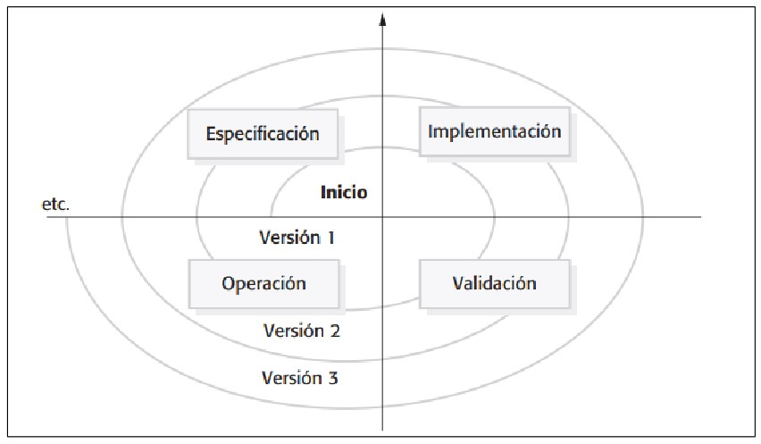
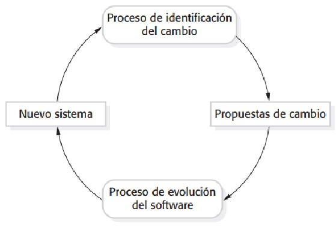
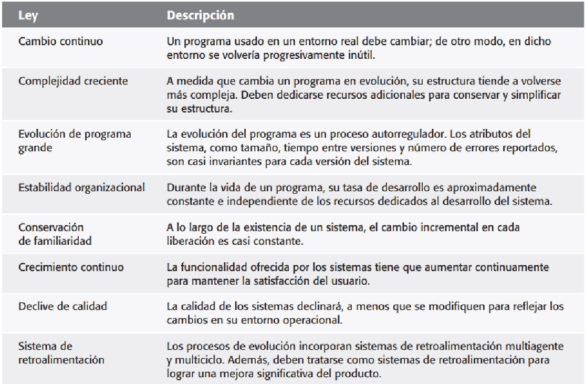
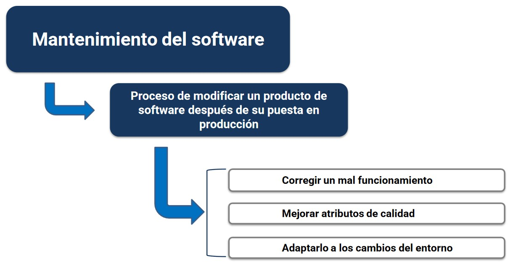
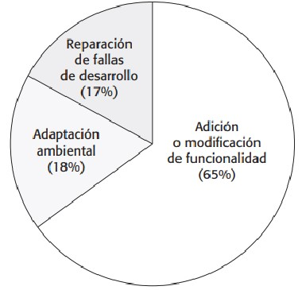
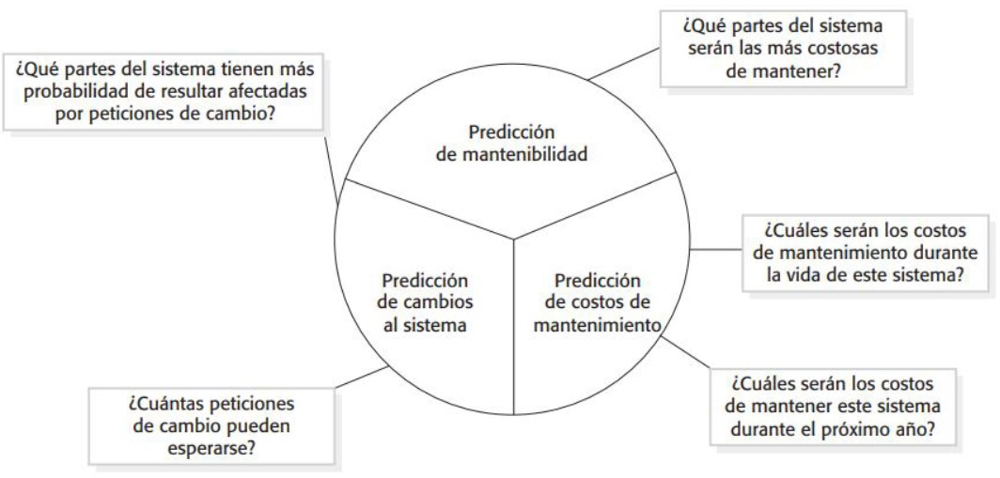
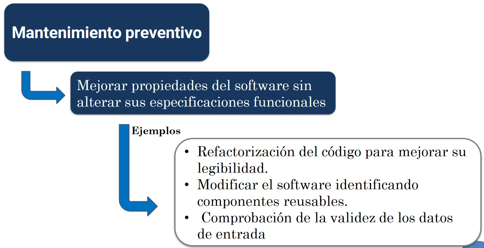
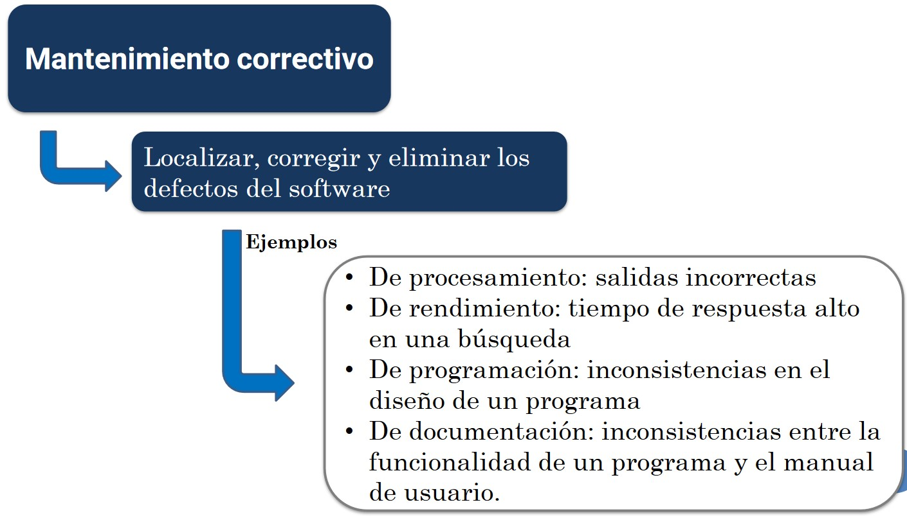
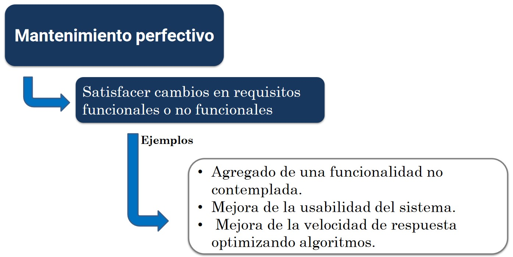
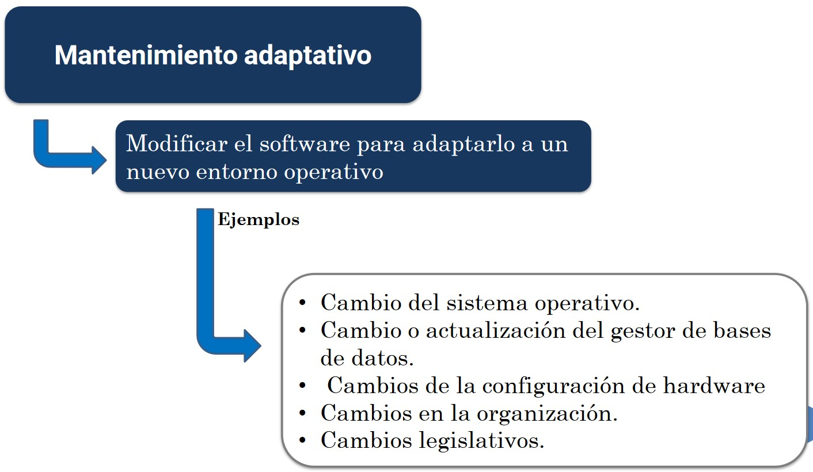

#### Ingeniería de Software
# Evolución y Mantenimiento de Software
Created by <i class="fab fa-telegram"></i>
[edme88]("https://t.me/edme88")

---
<!-- .slide: style="font-size: 0.60em" -->

## Temario

### Evolución y Mantenimiento de Software
* Definición
* Proceso de Evolución
* Implementación del cambio
* Leyes de Lehman
* Mantenimiento del Software
* Costos de Mantenimiento
* Predicción del mantenimiento

* Tipos de mantenimiento
* Mantenimiento preventivo
* Mantenimiento correctivo
* Mantenimiento perfectivo
* Mantenimiento adaptativo

---
### Evolución y/o Mantenimiento
* El desarrollo del software no se detiene cuando un sistema se entrega, continúa a lo largo de toda su vida. 
* Después de distribuir un sistema, inevitablemente debe modificarse con la finalidad de mantenerlo útil.
  * Cambios empresariales 
  * Cambios en las necesidades del usuario 
  * Corrección de errores 
  * Adaptarlo a cambios de software o hardware 
  * Mejora de rendimiento

---
### Evolución o Mantenimiento
* **Evolución del software:** una sola organización es responsable tanto del desarrollo inicial del software
como de su evolución posterior.
* **Mantenimiento del software:** el desarrollo inicial del software y su evolución posterior es realizado por
organizaciones diferentes.

---
**El proceso de desarrollo de software se debe considerar
como un proceso en espiral a lo largo de la vida del sistema.**

---
### Proceso de evolución del software
Las propuestas de cambio son el motor para la evolución de un sistema.

Provienen de:
* Requerimientos no implementados
* Nuevos requerimientos
* Reportes de errores
* Ideas para la mejora del software

---
**Los procesos de identificación de cambios y evolución del sistema son cíclicos y
continúan a lo largo de la vida de un sistema.**

---
### Proceso de evolución del software

---
### Implementación del cambio (ideal)

---
### Implementación del cambio (reparación de emergencial)

---
### Leyes de Lehman
1. **Cambio Continuo:** Los sistemas deben ser continuamente adaptados o se convierten progresivamente en menos 
satisfactorios.
2. **Complejidad incremental:** Cuando un sistema evoluciona se incrementa su complejidad a menos que se trabaje para 
mantenerla o reducirla.
3. **Evolución prolongada del programa o Autorregulación:** El proceso de evolución de un sistema es autorregulado con 
una distribución de las medidas del producto y del proceso cercana a la normal.

----

### Leyes de Lehman
4. **Conservación de la estabilidad organizacional:** La velocidad (y efectividad) de desarrollo de un sistema en 
evolución permanece invariante durante su ciclo de vida.
5. **Conservación de la familiaridad:** Cuando un sistema evoluciona, todos aquellos que están asociados a él deben 
mantener un conocimiento de su contenido y comportamiento para tratar de conseguir una evolución satisfactoria.

----

### Leyes de Lehman
6. **Crecimiento continuo:** Las funcionalidades del sistema tienen que crecer constantemente para mantener la 
satisfacción del usuario a lo largo de su ciclo de vida.
7. **Reducción de la calidad:** La calidad de los sistemas comienza a disminuir a menos que se mantengan de forma 
rigurosa y se adapten a los cambios en su entorno de funcionamiento.

----

### Leyes de Lehman
8. **Realimentación del sistema:** El proceso de evolución del sistema es consecuencia de un proceso de retroalimentación 
a diferentes niveles.

---
### Leyes de Lehman

---
### Mantenimiento del software
Es el proceso general de cambiar un sistema después de que éste se entregó.

El término usualmente se aplica a software personalizado, en el que grupos de desarrollo
separados intervienen antes y después de la entrega.

---

---
### Los costos del Mantenimiento de software
El mantenimiento del software toma una proporción más alta del presupuesto de TI que el nuevo desarrollo
Dos tercios del presupuesto corresponden a mantenimiento y un tercio a desarrollo

---
La mayor parte del presupuesto de mantenimiento se destina a la
implementación de nuevos requerimientos

---
### Los costos del Mantenimiento de software
Resulta más costoso agregar funcionalidad después de que un sistema
está en operación, que implementar la misma funcionalidad durante el
desarrollo.

---
### Los costos del Mantenimiento de software
* **Estabilidad del equipo:** Después la entrega, en general el equipo de desarrollo se separa.
* **Calidad de desarrollo deficiente:** se ahorra esfuerzo durante el desarrollo aunque el software sea más difícil de 
cambiar en el futuro.
* **Habilidades del personal:** El personal de mantenimiento con frecuencia es relativamente inexperto.
* **Antigüedad y estructura del programa:** Conforme se realizan cambios al programa, su estructura tiende a degradarse.

---
### Predicción del Mantenimiento de software
Predecir qué cambios pueden proponerse al sistema y qué partes serán las más difíciles de mantener.

Estimar los costos del mantenimiento durante cierto lapso de tiempo.

---
### Predicción del Mantenimiento de software

---
### Predicción del Mantenimiento de software
<!-- .slide: style="font-size: 0.80em" -->
Se debe valorar:
* **El número y la complejidad de las interfaces del sistema:** 
Cuanto más grande es el número de interfaces es más probable que se requieran cambios al agregar nuevos requerimientos.
* **El número de requerimientos de sistema inherentemente inestables:**
Los requerimientos que reflejan políticas y procedimientos de la organización son más inestables que los que
se basan en características de un dominio estable.
* **Los procesos empresariales donde se usa el sistema:**
A medida que evolucionan los procesos empresariales se generan necesidades de cambio. Cuantos más procesos use un 
sistema, habrá más demandas de cambio.

---

---

---

---

---

---
### Actividades del Mantenimiento de software
Las actividades de mantenimiento se agrupan en tres categorías funcionales:
* **Comprensión del software y de los cambios a realizar (Comprender):** 
Es necesario el conocimiento a fondo de la funcionalidad, objetivos, estructura interna y requisitos del software. 
Alrededor del 50% de tiempo de mantenimiento se dedica a esta actividad.

---
### Actividades del Mantenimiento de software
* **Modificación del software (Corregir):** 
Crear y modificar las estructuras de datos, la lógica de procesos, las interfaces y la documentación. Los
programadores deben evitar los efectos laterales provocados por sus cambios. Esta actividad representa 1/4 del tiempo 
total de mantenimiento.
* **Realización de pruebas (Comprobar):** 
Realizar pruebas selectivas que nos aseguren la corección del software.

---

---
## ¿Dudas, Preguntas, Comentarios?
